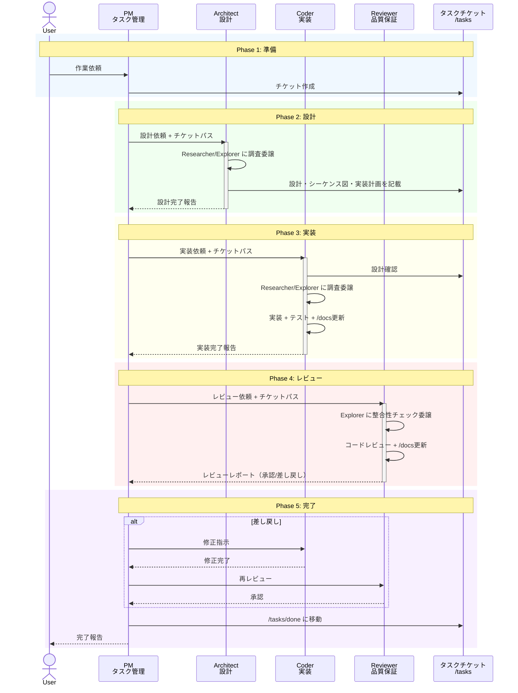
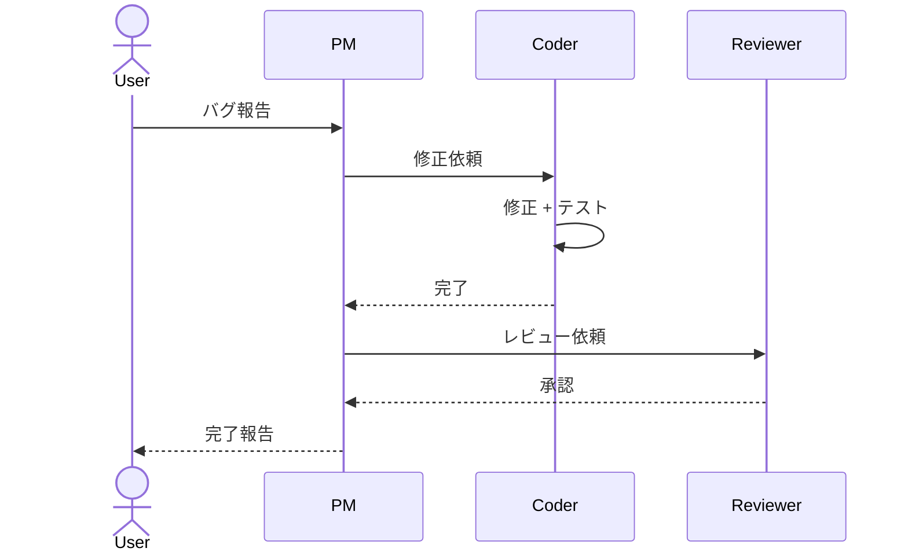
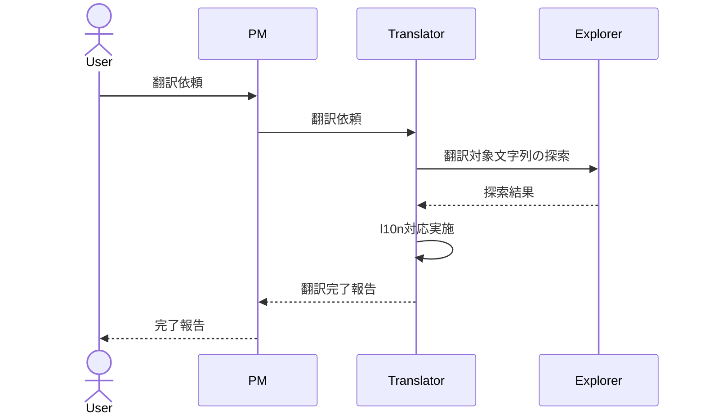
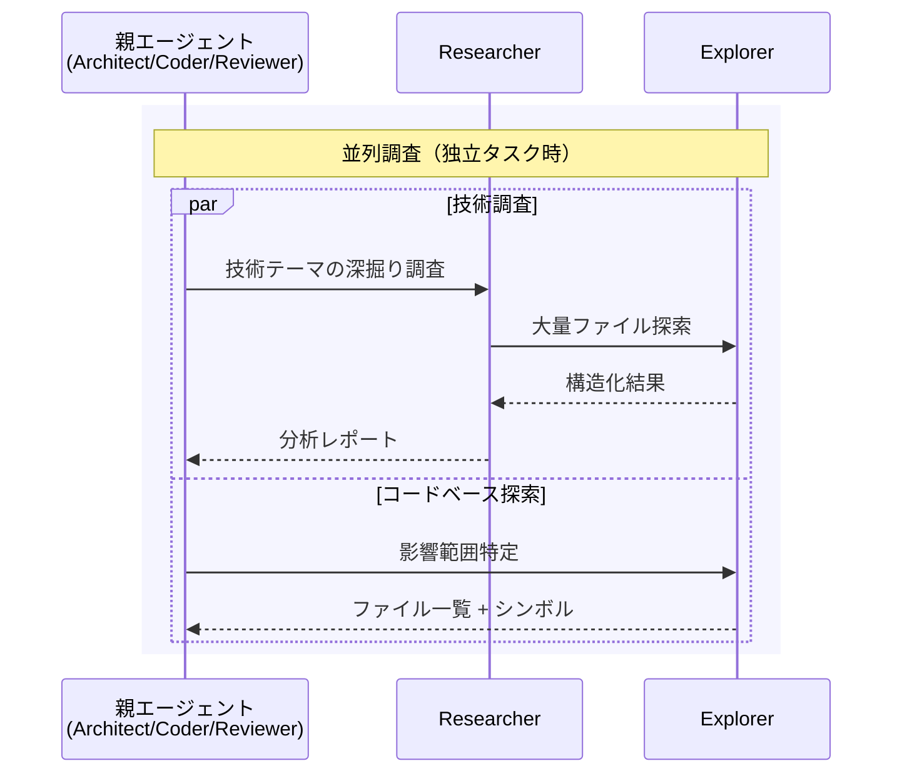
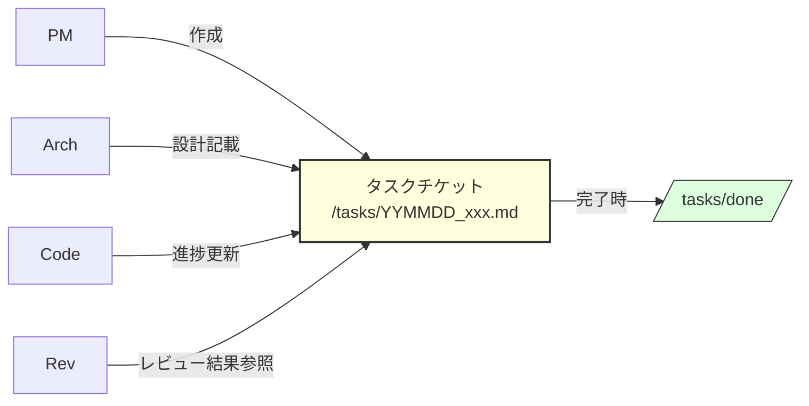
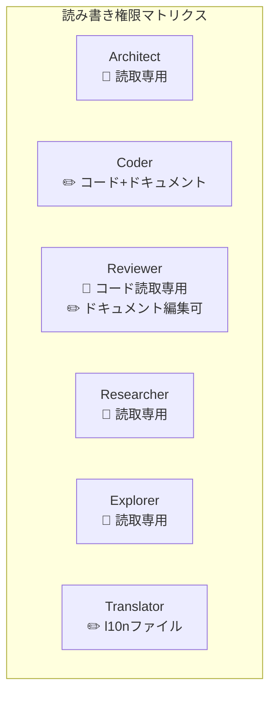
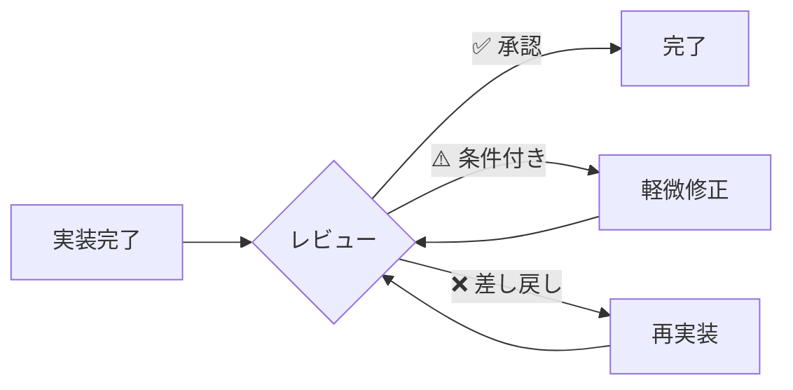
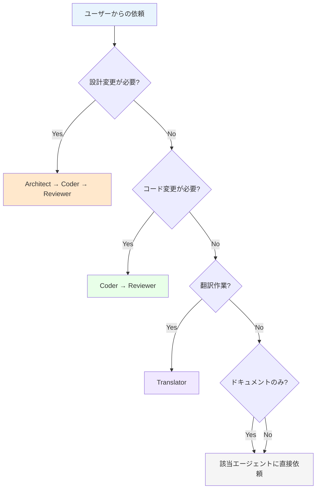

# エージェントオーケストレーション設計書

> mdaitプロジェクトにおけるAIエージェント連携ワークフローの全体設計

## 1. アーキテクチャ概要

7つのエージェントが **階層型委譲モデル** で協調動作する。タスクチケット(`/tasks`)を唯一の共有状態として、各エージェントが自律的に担当領域の作業を遂行する。

### エージェント階層

```
ユーザー / copilot-instructions.md
    │
    ▼
┌─────────┐
│   PM    │ ← オーケストレータ（唯一のユーザー窓口）
└────┬────┘
     │ runSubAgent
     ├──────────────┬──────────────┬──────────────┐
     ▼              ▼              ▼              ▼
┌──────────┐ ┌──────────┐ ┌──────────┐ ┌──────────────┐
│Architect │ │  Coder   │ │ Reviewer │ │  Translator  │
└────┬─────┘ └────┬─────┘ └────┬─────┘ └──────┬───────┘
     │ runSubAgent │            │               │
     ├─────┬───┐   ├─────┬───┐  │               │
     ▼     ▼   │   ▼     ▼   │  ▼               ▼
 Researcher Explorer Researcher Explorer  Explorer  Explorer
     │
     ▼
  Explorer
```

| 層 | エージェント | 性質 |
|----|------------|------|
| 指揮層 | **PM** | ユーザー要求をタスク分解し、適切なエージェントに委譲 |
| 専門層 | **Architect**, **Coder**, **Reviewer**, **Translator** | 各専門領域で自律的に作業を遂行 |
| 基盤層 | **Researcher**, **Explorer** | コンテキスト収集・分析のユーティリティ |

## 2. メインワークフロー

### 2.1 全体フロー（新機能開発）



### 2.2 バグ修正フロー（設計スキップ）



### 2.3 翻訳フロー



### 2.4 サブエージェント委譲フロー



## 3. エージェント詳細

### 3.1 PM（プロジェクトマネージャー）

| 項目 | 内容 |
|------|------|
| **責務** | タスク分解、エージェント割当、進捗管理、完了報告 |
| **委譲先** | Architect, Coder, Reviewer, Translator |
| **成果物** | タスクチケット、完了報告 |
| **判断基準** | 新機能→Architect経由、バグ修正→Coder直接、翻訳→Translator直接 |

### 3.2 Architect（設計者）

| 項目 | 内容 |
|------|------|
| **責務** | システム設計、アーキテクチャ決定、技術的意思決定 |
| **委譲先** | Researcher, Explorer |
| **成果物** | タスクチケット上の設計、`/docs` 設計書更新 |
| **制約** | コード編集・コマンド実行禁止 |

### 3.3 Coder（実装者）

| 項目 | 内容 |
|------|------|
| **責務** | コード実装、テスト作成・実行、設計書同期 |
| **委譲先** | Researcher, Explorer |
| **成果物** | 動作するコード、テスト結果、`/docs` 更新 |
| **制約** | アーキテクチャ判断禁止、指示範囲外の実装禁止 |

### 3.4 Reviewer（品質保証）

| 項目 | 内容 |
|------|------|
| **責務** | コードレビュー、設計整合性検証、設計書同期 |
| **委譲先** | Explorer |
| **成果物** | レビューレポート（`.md`）、`/docs` 更新 |
| **制約** | コード編集禁止（設計書編集は許可） |

### 3.5 Translator（翻訳者）

| 項目 | 内容 |
|------|------|
| **責務** | l10n対応、翻訳ファイル更新、翻訳漏れ検出 |
| **委譲先** | Explorer |
| **成果物** | `l10n/`, `package.nls.*.json` 更新 |

### 3.6 Researcher（調査員）

| 項目 | 内容 |
|------|------|
| **責務** | 技術調査、設計オプション評価、シーケンス図作成、テストシナリオ設計 |
| **委譲先** | Explorer |
| **成果物** | 構造化された調査レポート |
| **制約** | コード編集・コマンド実行禁止 |

### 3.7 Explorer（探索員）

| 項目 | 内容 |
|------|------|
| **責務** | コードベース高速探索、情報収集、影響範囲特定 |
| **委譲先** | なし（リーフノード） |
| **成果物** | ファイル一覧、シンボル情報、構造化結果 |
| **制約** | 編集禁止、ユーザーへの質問禁止 |

## 4. 共有状態と引き継ぎ

### タスクチケットが唯一の真実の源



### 引き継ぎプロトコル

| 遷移 | 引き継ぎ内容 |
|------|------------|
| **PM → Architect** | タスク概要、関連設計（`/docs`）、制約事項 |
| **Architect → Coder** | 変更対象ファイル、新規クラス/関数の責務、テスト観点 |
| **Coder → Reviewer** | チケットパス、レビュー観点 |
| **Reviewer → Coder**（差し戻し時） | 修正必須の指摘、修正方針、再レビュー確認ポイント |
| **Researcher → 親** | 設計オプション+トレードオフ、推奨案、影響ファイル |
| **Explorer → 親** | ファイル一覧+シンボル、発見内容、次のアクション |

## 5. 設計原則

### 5.1 コンテキスト効率化

各エージェントは **最小限のコンテキストで最大の成果** を出すよう設計されている。

- **委譲の判断基準**: 1000トークン超のコンテキストが必要なら委譲を検討
- **並列実行**: 独立タスクは `multi_tool_use.parallel` で同時委譲
- **Explorer の活用**: 大量ファイル探索は必ずExplorerに委譲し、親のコンテキストを温存

### 5.2 責務分離の徹底



- **設計する者は実装しない**: Architectはコードを書かない
- **実装する者は設計しない**: Coderはアーキテクチャ判断をしない
- **レビューする者はコードを直さない**: Reviewerはドキュメントのみ編集可
- **調査する者は判断しない**: Researcher/Explorerは情報提供のみ

### 5.3 品質ゲート



すべてのコード変更は **必ずReviewerを通過** する。差し戻しループは品質が満たされるまで継続する。

## 6. ルーティング判断フロー

PMがユーザーの依頼を受けた際の判断フローチャート:



## 7. 改善履歴

| 日付 | 改善内容 | 対象 |
|------|---------|------|
| 2026-02-07 | PM に `agents` メタデータ追加（委譲先の明示化） | `mdait.pm.agent.md` |
| 2026-02-07 | Reviewer に Explorer 委譲を追加（大規模変更の整合性チェック強化） | `mdait.reviewer.agent.md` |
| 2026-02-07 | Translator に Explorer 委譲を追加（翻訳対象の網羅的探索） | `mdait.translator.agent.md` |
| 2026-02-07 | 本設計書の作成 | `agents-workflow.md` |
