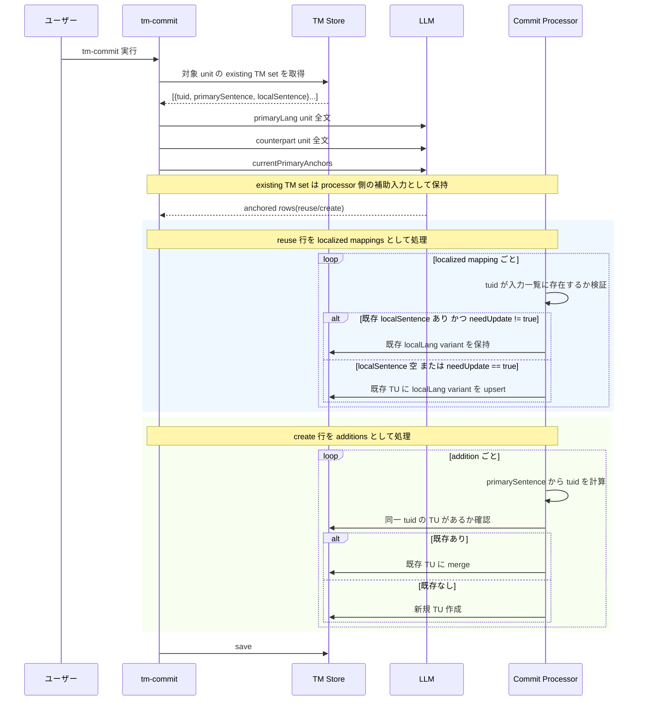

# mdait TM 概念設計メモ（改訂版）

実装エージェント向けガードレール
対象: 保存側 / 参照側 / 改訂 sync・tm-optimize・tm-commit

## 1. この文書の役割

- これは詳細設計書ではない
- 実装の自由度は残す
- ただし、今回の議論で固まった思想と境界条件は固定する
- 専門エージェントは詳細設計を行ってよい
- ただし、その詳細設計は本メモの原則を破ってはならない
- 互換性は考慮しない
- 命名、責務分離、モデル再編は遠慮なく行う
- 中途半端な移行レイヤは不要

---

## 2. 本設計で解決したいこと

TM は単なる辞書ではない。
翻訳履歴を、改訂に耐えながら、翻訳前の参考例として使える形で保持したい。

今回の本質は次の3点である。

- 正本として壊れにくい TM を持つこと
- 翻訳前に「今回に似た過去訳」を引けること
- v1 から v2 への改訂時に、古い文と新しい文を自然に入れ替えられること

この3つを同時に満たすため、保存側と参照側を分離する。

---

## 3. 最重要結論

### 3.1 基準は `en` ではなく `primaryLang`

本質は「その TM における primary language」である。

この `primaryLang` は用語集専用の概念ではない。
TM 正本判定を含む複数機能で共有される基盤概念として扱う。

- `terms` 配下の局所設定として閉じ込めない
- 翻訳ジョブごとの sourceLang と同一視しない
- 将来ほかの機能が参照しても意味が崩れない配置にする

- 1 TU = 1 primary sentence
- `tuid = hash(norm(primary_sentence))`
- TMにとって `srclang = primaryLang`

### 3.2 保存と参照は別物
保存側で必要なのは厳密性である。
参照側で必要なのは類似例 retrieval である。

この2つを同じ発想で実装してはならない。

### 3.3 sentence segmentation の意味は1つではない
`tm-commit` における segmentation は正本生成のための segmentation である。
Trans 前の segmentation は retrieval seed 生成のための近似 segmentation である。

両者は同じものではない。

---

## 4. 旧設計で問題だった点

### 4.1 source 側 hash を主キー化していた
これは多段翻訳で壊れやすい。

- `ja -> en` の source
- `en -> zh-Hans` の source

は異なる。
source 基準で TU を管理すると、同じ概念の TU が割れやすい。

### 4.2 exact lookup 寄りすぎた
文を split し、その hash で lookup する設計は、
翻訳支援としては弱い。

欲しいのは:

- 完全一致
- 少し違うが参考になる文
- 同じ定型の過去訳

であって、exact hash hit だけではない。

### 4.3 unit 改訂時の意味づけが弱かった
changed unit をどう扱うかが曖昧だと、
旧文の除去と新文の追加が混線する。

今回の設計ではここを明確にする。

---

## 5. 基本原則

### 原則1
TM の正本は primary sentence 単位で保持する。

### 原則2
TU の一意性は primary sentence の normalized text によって与える。

### 原則3
新規 TU を作れるのは primary sentence を確定できたときだけである。

### 原則4
`sync` は sentence を知らない。
sentence を扱うのは `tm-commit` のみである。

### 原則5
Trans 前参照の目的は exact lookup ではなく translation example retrieval である。

### 原則6
TM は翻訳資産として保持し、自動削除は行わない。

- `sync` は unit 同期のみ担当する
- `tm-optimize` は `x-wt` を再計算する
- `tm-commit` は新しい sentence 集合を upsert する

### 原則7
changed unit は sentence 集合に変化があった可能性を示すだけであり、
その unit 配下の TU を一括削除・一括再作成する根拠ではない。

---

## 6. 保存側の概念設計

## 6.1 保存単位
保存単位は TU である。

意味は次の通り。

- 1 TU = 1 primary sentence
- 1 TU は、その primary sentence に対応する各言語の sentence を保持する

### 6.2 TU の識別子
TU の識別子は次で与える。

- `tuid = hash(norm(primary_sentence))`

ここでいう hash は保存・更新・cleanup のための一意識別子である。
参照側の retrieval 戦略をこれに縛ってはならない。

### 6.3 各言語データ
各言語の `tuv` は同じ構造を持つ。

- `seg`
- `x-unit-path`
- `x-unit-hash`

primary だけが特殊な構造を持つことは避ける。
primary であることは TMX 全体の `srclang=primaryLang` で表す。

### 6.4 必須条件
各 TU は primary の `tuv` を必ず持つ。

禁止事項:

- primary `tuv` を持たない TU を有効扱いする
- `seg` が空の `tuv` を有効扱いする

### 6.5 upsert の原則
`tm-commit` は primary sentence を軸に TU を upsert する。

- 同一 `tuid` があれば既存 TU 更新
- なければ新規 TU 作成
- `x-unit-path` / `x-unit-hash` は各 `tuv` ごとに保持する
- primary `tuv` の metadata は `primaryLangUnit` だけが更新する
- non-primary `tuv` の metadata は対応する non-primary unit だけが更新する

禁止事項:

- non-primary 側だけを根拠に新規 TU 作成
- sourceLang の違いによって主キー方針を変えること
- pair の source 側だからという理由で primary metadata を更新すること

---

## 7. `tm-commit` の責務

`tm-commit` は唯一 sentence segmentation を行う処理である。

ただし `tm-commit` は単なる splitter ではない。
承認済みの anchor-aware 契約を前提に、`primaryLangUnit` / `counterpartUnit` と既存 TM set を受け取り、既存 `tuid` への local 展開と新規 addition を概念的に分離したうえで、TM に登録する primary sentence を最終決定する責務を持つ。

### 7.1 用語

- `primaryLangUnit`
	- 今回の commit で truth source となる primary 言語の unit
- `counterpartUnit`
    - 今回追加または更新する non-primary 言語の unit
- `existing TM set`
    - 同一 `primaryLangUnit` に属する既存 TU 群を、`tuid` / `primarySentence` / `localSentence` の集合として取り出したもの
    - `localSentence` が未登録の場合は空でよい
- `localized mapping`
    - `existing TM set` 内の `tuid` を参照し、その TU に対応する `localSentence` を返す結果
    - 既存 `localSentence` がある場合は原則保持し、更新が必要な場合のみ `needUpdate=true` を明示する
    - これは承認済みの anchor-aware 契約における `anchorAction = reuse` 行の後段意味づけである
- `addition`
    - `existing TM set` では表せない新しい `primarySentence` / `localSentence` の追加候補
    - これは承認済みの anchor-aware 契約における `anchorAction = create` 行の後段意味づけである

pair 相対の `source` / `target` は trans pair の説明には使ってよいが、保存側設計の正準語彙にはしない。

### 7.2 入力として扱うもの
- 翻訳済み unit
- unit metadata
- `primaryLangUnit`
- `counterpartUnit`
- `existing TM set`
- anchored rows とその後段分類結果
- primaryLang

### 7.3 行うこと
- sentence segmentation
- existing TM set lookup
- localized mappings / additions の解決
- localized mappings の検証
- additions に対する primary sentence 決定
- `tuid` 計算
- TU upsert
- 各言語 `tuv` upsert

### 7.4 ここで保証すること
- primary sentence が同じなら同じ TU に集約される
- primary sentence が変われば別 TU になる
- 既存 TU への local 展開と、新規 TU 追加は後段フローでも分離される
- 既存 `localSentence` は原則保持され、更新は `needUpdate=true` の明示時だけ行われる
- 既存 `localSentence` がある `tuid` を LLM が返さなかった場合は no-op として既存値を保持する
- 既存 `localSentence` が空の `tuid` を LLM が返さなかった場合は未解決として扱い、更新も追加もしない
- `needUpdate=true` なしで既存値と異なる `localSentence` が返った場合は不正出力として無視できる
- localized mapping 側だけで新規 TU を作らない
- `ja -> en -> zh-hans` のような multi-hop commit でも既存 `tuid` への local 展開を再利用できる
- 各 `tuv` の `x-unit-path` / `x-unit-hash` がその言語の実体を指す

### 7.5 行わないこと
- obsolete な旧 TU の削除判定
- changed unit の意味づけ
- retrieval 用 ranking や candidate generation

### 7.6 prompt 契約

保存側の authoritative prompt は、承認済みの `tm.alignWithPrimaryAnchors` を維持する。
今回追加する `existing TM set` と `localizedMappings` / `additions` は、その anchor-aware 契約を置き換える新契約ではなく、入力と後段解釈を補強する説明である。

- `tm.splitSentences` のような pairwise split 契約の拡張では、既存 TM 再利用と新規追加の責務分離が弱い
- `tm.alignWithPrimaryAnchors` が返す `anchorAction = reuse/create` を、それぞれ `localized mappings` / `additions` として後段処理で明確に分ける
- `existing TM set` は `currentPrimaryAnchors` に既存 `localSentence` を添えた拡張ビューとして扱ってよい

`tm-commit` は「新しい正本を書き込む責務」に集中し、
重み再計算は `tm-optimize` に分離する。

---

## 8. `sync` の責務

`sync` は sentence を扱わない。
扱うのは unit レベルの状態だけである。

### 行うこと
- current units の収集
- unit hash の比較
- unchanged / changed / added / removed の判定
- need:translate / need:revise 判定
- TM の削除・最適化は行わない

### 行わないこと
- sentence segmentation
- sentence hash 集合比較
- TU の新規作成
- changed unit 内 sentence の確定

### 重要な意味づけ
`sync` が判断できるのは
「unit が変わったかどうか」までである。

`sync` は
「どの sentence が消え、どの sentence が残り、どの sentence が新しいか」
を直接は知らない。

---

## 9. tm-optimize の責務

`tm-optimize` は TU を削除せず、`x-wt` を冪等に再計算する処理である。

### tm-optimize の基本思想
- TM は現行原稿キャッシュではなく翻訳資産
- obsolete 判定による自動削除は行わない
- retrieval 補正用に TU 単位の `x-wt` だけを保持する

### 重み計算
- `corpusPresence`: 現行 primary sentence と完全一致なら 1.0 / 不一致は 0.0
- `retrievalUsefulness`: 現行 query 群で top5 順位点を加算して 0..1 正規化
- `x-wt = clamp(0.7 * corpusPresence + 0.3 * retrievalUsefulness)`

---

## 10. 改訂時の反映戦略

## 10.1 v1 から v2 への考え方
改訂時の本質は、
unit を更新することではなく、
primary sentence 集合を新しい状態へ寄せることである。

### 10.2 何が起きるか
v1 に A, B があり、
v2 で A は残り、B は変わり、C が追加されたとする。

理想状態は次である。

- A は同じ `tuid` として存続
- B(old) は obsolete として最終的に除去
- B(new) は新しい `tuid` として追加
- C は新しい `tuid` として追加

### 10.3 つまり改訂反映とは何か
改訂反映は「更新」というより、概念的には次である。

- 残る primary sentence は残す
- 消えた primary sentence は削除する
- 変わった primary sentence は新しい TU へ置き換わる
- 新しい primary sentence は新規追加する

### 10.4 判定軸
この置換の判定軸は primary sentence である。
unit-hash ではない。

---

## 11. 改訂時の時系列

### フェーズA: `sync`
- unit レベルの変化を認識する
- changed / removed / added を判定する
- 再翻訳に必要な current 状態を準備する

### フェーズB: tm-optimize（明示実行）
- 現行 primary 原稿群を query 化する
- 各 TU の `x-wt` を冪等再計算する

### フェーズC: v2 翻訳後 `tm-commit`
- 新しい primary sentence 群を確定する
- それぞれを `tuid` で upsert する
- 各言語の `tuv` を最新状態へ更新する

### 分離の意味
- `tm-optimize` は重み再計算の責務
- `tm-commit` は new を登録・更新する責務

これらを混ぜない。

---

## 12. changed unit の扱い

changed unit は危険な概念である。
雑に扱うと sentence 単位の資産を失う。

### changed unit が意味するもの
- その unit 配下の sentence 集合に変化があった可能性が高い

### changed unit が意味しないもの
- 旧 TU は全部不要
- 新 TU を全部作り直すべき
- 文の対応関係が unit レベルで一括で決まる

### 必須ガードレール
changed unit の中には次が混在し得る。

- 完全に残る sentence
- 消える sentence
- 少し変わる sentence
- 新しく増える sentence

したがって changed unit を丸ごと obsolete 扱いしてはならない。

---

## 13. 参照側の概念設計

## 13.1 参照側の目的
参照側の目的は、翻訳前に LLM へ渡す参考例を集めることである。

返したいのは「ヒットした hash」ではなく、
「今回の入力に似ていて、翻訳の参考になる過去例」である。

### 13.2 exact と fuzzy
参照側は exact を含んでよい。
ただし exact のみで閉じてはならない。

欲しいものは:

- 完全一致
- 表現差はあるが非常に近い例
- 同じ定型文の別バリエーション
- 文脈上参考になる例

### 13.3 retrieval の二段階
参照は必ず二段階で考える。

- candidate generation
- ranking

候補収集だけでも、単純 hash lookup だけでも不十分である。

---

## 14. 参照側に求める性質

### 14.1 primary key に依存しない入口
`tuid` は保存側の主キーである。
参照側は sourceLang 起点で候補を集める。

例:

- `ja -> en` なら ja 入力から候補生成
- `en -> zh-Hans` なら en 入力から候補生成

### 14.2 retrieval 用表現を持ってよい
参照側は、主キーとは別に retrieval 用の表現・索引・特徴量を持ってよい。

ただしこれは詳細設計で選べばよい。
概念設計として固定すべきなのは次だけである。

- 主キーとは別責務であること
- exact のみに閉じないこと
- 類似例検索を可能にすること

### 14.3 ranking を必須にする
候補を並べるだけではなく、
今回の翻訳に有用なものを優先順位付けすること。

評価軸の具体値は詳細設計に委ねるが、
少なくとも「上位例を選ぶ責務」は必要である。

初期実装では過度に複雑にしない。
将来拡張可能な構造を前提に、まずは軽量な規則ベースで始める。

最低限の候補として想定する軸:

- normalized text の完全一致
- 文字列類似度
- 長さの近さ

この3つで十分に初期導入可能と考える。
新しさ、安定性、ドメイン一致、意味類似などは後続拡張でよい。

### 14.4 初期 retrieval の責務分担
初期実装でも retrieval は二段階を崩さない。

- candidate generation は exact 候補と近似一致候補を広めに拾う
- ranking は軽量ルールで上位を選ぶ

候補収集を狭くしすぎず、順位付けを過剰に重くしない。
これを初期設計のバランスとする。

---

## 15. `Intl.Segmenter` の位置づけ

## 15.1 使ってよい
`Intl.Segmenter` は使ってよい。

### 15.2 ただし意味を限定する
これは正本 sentence を決めるための真実装置ではない。
retrieval seed を作るための近似的な補助である。

### 15.3 禁止事項
- `Intl.Segmenter` の split 結果を TM の真の sentence と見なすこと
- split して hash して終わる exact lookup を参照の中心に置くこと

### 15.4 補足
近似 split は retrieval の入口としては有用である。
ただし retrieval 全体をそれだけに依存させない。

---

## 16. 命名方針

## 16.1 保存側
保存側は repository / unit / record / commit の語で責務を表す。

例:
- `TmxStore` より `TranslationUnitRepository`
- `TmEntry` より `TranslationUnitRecord`
- `sentenceHash` より `primarySentenceId` または `tuid`

### 16.2 参照側
参照側は lookup より retrieval / example / candidate / ranking の語を使う。

例:
- `lookupTmReferences` より `retrieveTranslationExamples`
- `TmMatch` より `RetrievedTranslationExample`
- `tm-reference-formatter` より `translation-example-formatter`

### 16.3 split 系
splitter というより seed 生成の責務が明確になる命名を優先する。

例:
- `SentenceSplitter` より `RetrievalSeedSegmenter`
- `ExampleSeedBuilder`

### 16.4 commit 系
source 中心ではなく primary-centered な名前にする。

例:
- `TmCommitProcessor` より `TranslationMemoryCommitService`
- `registerPairs` より `upsertAlignedTranslationUnits`

---

## 17. 保存側と参照側の境界

### 保存側が持つべき責務
- TU 正本管理
- primary 基準の一意性
- 各言語 `tuv`
- unit metadata
- load / save
- cleanup に必要な情報

### 参照側が持つべき責務
- retrieval 用表現
- seed 生成
- candidate generation
- ranking
- prompt 用整形

### 禁止事項
- repository に retrieval ロジックを肥大化させる
- retrieval service が主キー規則を勝手に決める
- 正本と検索用表現を同一視する

---

## 18. 実装エージェントへの強い禁止事項

- `primaryLang` を無視して `en` 固定設計にすること
- source 文 hash を TU 主キーに残すこと
- non-primary だけで新規 TU を作ること
- `sync` に sentence segmentation を持ち込むこと
- unit-hash だけで削除すること
- changed unit を一括削除・一括再作成の根拠にすること
- exact lookup だけで参照機能を作ること
- `Intl.Segmenter` を truth-maker として扱うこと
- 保存と参照を同じモデルで無理に済ませること

---

## 19. 実装エージェントが必ず満たすべきこと

- `primaryLang` を中心に TU 一意性を定義すること
- `tuid = hash(norm(primary_sentence))` を保存の基準にすること
- `tm-commit` だけが sentence segmentation を行うこと
- `sync` は unit レベル責務に留めること
- cleanup は「候補抽出 + 実文照合」の二段階で行うこと
- 参照側を translation example retrieval として再設計すること
- 参照側に candidate generation と ranking を持たせること
- 改訂時に旧 sentence 除去と新 sentence 追加を責務分離すること

---

## 20. 最終的に目指す状態

この再設計のゴールは、TM を次の二層として成立させることである。

### 正本層
- primary sentence 基準で厳密
- 多段翻訳でも TU が分裂しにくい
- 改訂後も obsolete な旧文を自然に整理できる

### 参照層
- 翻訳前に「今回に似た過去訳」を引ける
- 完全一致がなくても useful example を返せる
- LLM へ渡す参考例として実用的

この二層が分離されて初めて、

- `tm-commit` は厳密
- `sync` は安全
- Trans 前参照は実用的

という全体像が成立する。

---

## 21. 一文で要約

**TM は `primaryLang` の sentence を正本として厳密に保存し、`sync` は同期責務に限定し、`tm-optimize` で `x-wt` を冪等再計算し、`tm-commit` は承認済みの anchor-aware 契約を前提に `existing TM set` を参照しつつ `localized mappings` と `additions` を後段で分離して新 sentence 集合へ寄せる。翻訳前参照は exact lookup ではなく、source language 起点の類似翻訳例 retrieval として再設計する。**

