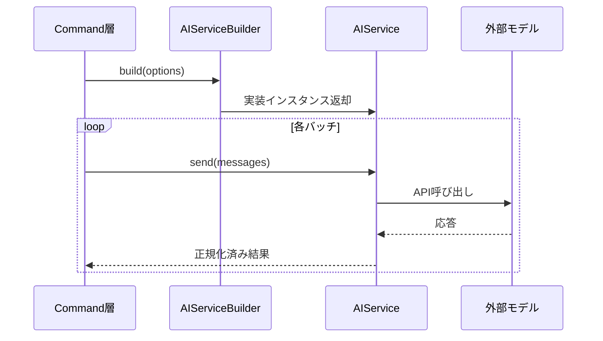

# API層設計

## 役割

- 外部AIサービスとの通信を抽象化し、コマンド層からは統一された`AIService`インターフェースとして見えるようにする。
- 設定されたプロバイダーに応じて適切なクライアントを構築し、エラー時のフォールバックを制御する。

## 主要コンポーネント

- **AIService**: `send(messages, options)`などのメソッドを定義した共通インターフェース。
- **AIServiceBuilder**: [config.md](config.md)の設定を参照し、`default`/`ollama`/`vscode-lm`などの実装を選択。開発用モックもここで生成する。
- **StatsLogger**: 呼び出し回数やトークン使用量を収集し、今後の最適化に備える。

## 呼び出しシーケンス

## 考慮事項

- すべての実装はレート制限とキャンセルに対応し、必要に応じてリトライ戦略を注入できる構造にする。
- 入出力データはユニット単位で正規化し、APIドライバごとの差異（例: ストリーミング、バッチサイズ）をビルダー側で吸収する。
- 将来的なメトリクス出力のため、StatsLoggerは非同期でも処理をブロックしない。
