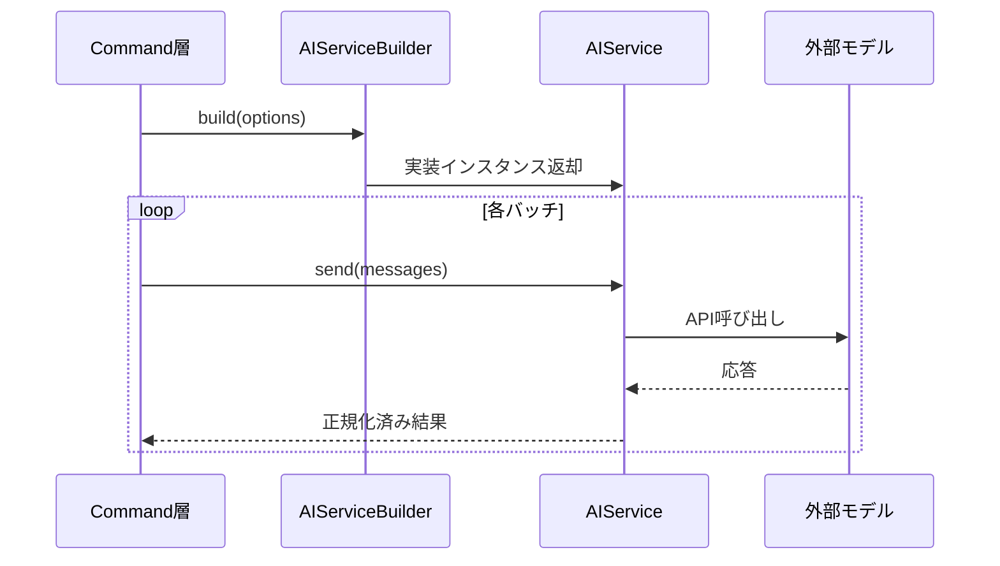

# API層設計

## 役割

- 外部AIサービスとの通信を抽象化し、コマンド層からは統一された`AIService`インターフェースとして見えるようにする。
- 設定されたプロバイダーに応じて適切なクライアントを構築し、エラー時のフォールバックを制御する。

## 主要コンポーネント

- **AIService**: `sendMessage(systemPrompt, messages, cancellationToken)`メソッドを定義した共通インターフェース。`Promise<string>`を返す。
- **AIServiceBuilder**: [config.md](config.md)の設定を参照し、`default`/`ollama`/`vscode-lm`/`openai`などの実装を選択。開発用モックもここで生成する。
- **StatsLogger**: 呼び出し回数やトークン使用量を収集し、今後の最適化に備える。

## プロバイダー実装

### DefaultAIProvider
開発・テスト用のモック実装。固定応答またはエコーバックを返します。

### VSCodeLanguageModelProvider
VS Code組み込みの言語モデル機能を使用。GitHub CopilotやVS Code標準のLMと統合されます。内部でストリーミング応答をバッファリングし、完全な応答を返します。

### OllamaProvider
ローカル実行のOllamaサーバーと通信。`ollama-js`パッケージを使用して応答を受け取ります。

**設定例:**
```json
{
  "ai": {
    "provider": "ollama",
    "ollama": {
      "endpoint": "http://localhost:11434",
      "model": "llama2"
    }
  }
}
```

### OpenAIProvider
OpenAI公式APIを使用。`openai`パッケージを使用して応答を受け取ります。
**Responses API**を採用し、将来のツール連携や機能拡張に対応しています。

**設定例:**
```json
{
  "ai": {
    "provider": "openai",
    "model": "gpt-5-mini",
    "openai": {
      "apiKey": "${env:OPENAI_API_KEY}",
      "baseURL": "https://api.openai.com/v1",
      "maxTokens": 2048,
      "timeoutSec": 120
    }
  }
}
```

**主要パラメータ:**
- `maxTokens`: 最大出力トークン数（デフォルト: 2048）
- `timeoutSec`: リクエストタイムアウト秒数（デフォルト: 120）
- `temperature`: 0.7固定（コード内設定）
- `store`: false固定（プライバシー重視、コード内設定）

**セキュリティ:**
- APIキーは`${env:VARIABLE_NAME}`形式で環境変数から読み込み
- 設定ファイルには平文で記載しない
- `store: false`でプロンプト・応答をOpenAIサーバーに保存しない（ハードコーディング）

## 呼び出しシーケンス



## 考慮事項

- すべての実装はレート制限とキャンセルに対応し、必要に応じてリトライ戦略を注入できる構造にする。
- 入出力データはユニット単位で正規化し、APIドライバごとの差異（例: バッチサイズ）をビルダー側で吸収する。
- 将来的なメトリクス出力のため、StatsLoggerは非同期でも処理をブロックしない。
