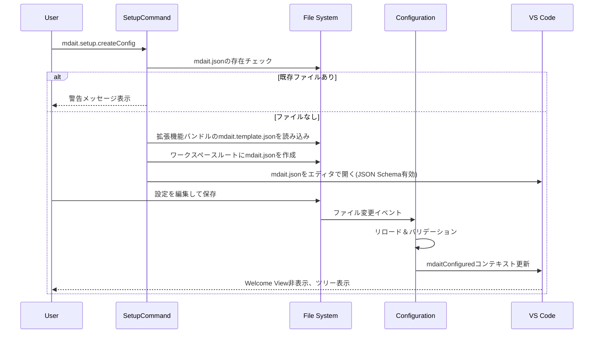

# setup（初期設定）コマンド設計

## 概要

setup（初期設定）コマンドは、mdait拡張機能の初回セットアップを支援します。拡張機能にバンドルされた設定ファイルテンプレートをワークスペースにコピーし、ユーザーが編集できる状態にします。

---

## setup.createConfig（設定ファイル作成）

### 機能概要

- 拡張機能にバンドルされた`mdait.template.json`をワークスペースルートに`mdait.json`としてコピー
- ファイル作成後、VS Codeエディタで開いてユーザーに編集を促す

### 主要コンポーネント

- [src/commands/setup/setup-command.ts](../src/commands/setup/setup-command.ts): `createConfigCommand()` - テンプレートファイルのコピーとエディタで開く処理を実行

### シーケンス図

### 考慮事項

- ワークスペースが開いていない場合はエラーメッセージを表示
- 既存ファイルの上書きを防ぐため、確認ダイアログを表示
- テンプレートファイルが見つからない場合は、拡張機能の再インストールを促す
- 設定ファイル作成後、自動的に`mdaitConfigured`コンテキスト変数を更新してUIを有効化
