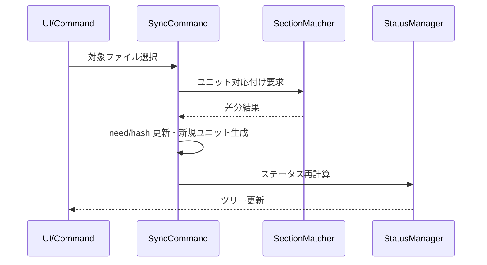

# sync（ユニット同期）コマンド設計

## 概要

sync（ユニット同期）コマンドは、ソースとターゲットのMarkdownファイル間でmdaitUnitの対応関係を確立し、差分検出とステータス更新を行います。変更されたソースユニットに対応するターゲットユニットに`need:translate`フラグを自動付与し、翻訳ワークフローを開始します。

---

## 機能詳細

### コア機能

- Markdown間のユニット対応付けを確立し、`hash`・`from`・`need`を再計算
- 差分検出後は`need:translate`付与や未使用ターゲットユニットの削除/保留を制御
- [core.md](core.md)のSectionMatcherとStatus管理を活用し、冪等な再実行を保証
- 同期完了後はソース/ターゲット両ファイルのステータスを`StatusManager.refreshFileStatus`で再計算し、ツリー表示を即時追従させる

### 主要コンポーネント

- [src/commands/sync/sync-command.ts](../src/commands/sync/sync-command.ts): `syncCommand()`, `syncMarkdownFile()` - ファイル対応付けと差分適用
  - [syncNew_CoreProc()](../src/commands/sync/sync-command.ts#L120): 新規ターゲットファイル作成時の同期処理中核ロジック
  - [sync_CoreProc()](../src/commands/sync/sync-command.ts#L188): 既存ターゲットファイル同期処理中核ロジック
- [src/commands/sync/section-matcher.ts](../src/commands/sync/section-matcher.ts): `SectionMatcher.matchSections()` - ユニット間の対応関係を検出
- [src/commands/sync/diff-detector.ts](../src/commands/sync/diff-detector.ts): `DiffDetector.detect()` - 差分検出

### シーケンス図

### 処理フロー

1. **ファイル探索**: 設定に基づいてソースファイルを列挙
2. **ターゲットパス生成**: 各ソースファイルに対応するターゲットパスを計算
3. **ユニット対応付け**: `SectionMatcher`を使用してソースとターゲットのユニットをマッチング
4. **差分検出**: 追加・更新・削除されたユニットを特定
5. **ハッシュ更新**: ユニット内容の変更を検出し、ハッシュを再計算
6. **needフラグ付与**: 翻訳が必要なユニットに`need:translate`を設定
7. **FrontMatter同期**: 設定されたキーのハッシュを計算し、`mdait.front`マーカーを更新
8. **ファイル保存**: 更新されたマーカー情報を含むMarkdownファイルを保存
9. **ステータス更新**: `StatusManager`にファイルステータスの再計算を依頼

### 考慮事項

- **冪等性**: 同じファイルに対して複数回実行しても結果が一貫
- **並列処理**: 複数ファイルを並列処理してパフォーマンスを最適化
- **エラーハンドリング**: 個別ファイルのエラーは他のファイル処理を妨げない
- **双方向翻訳**: ソースとターゲットの両方が変更された場合は`need:solve-conflict`フラグを設定
- **初回作成**: ターゲットファイルが存在しない場合は自動作成
- **スナップショット管理**: 全ユニットのコンテンツを`.mdait/snapshot`に保存し、原文変更時のdiff生成に活用
- **revise形式**: 原文変更時は`need:revise@{oldhash}`形式でoldhashを埋め込み、trans時にdiff生成
- **GC処理**: sync完了後、使用中のhash以外のスナップショットを削除（ファイルサイズ5MB超過時）
- **FrontMatter翻訳**: `trans.frontmatter.keys`で指定されたキーのハッシュを計算し、`mdait.front`マーカーで翻訳状態を管理
- **FrontMatter-onlyファイル**: 本文ユニットがなくfrontmatterのみのファイルも、keys設定があれば処理対象
