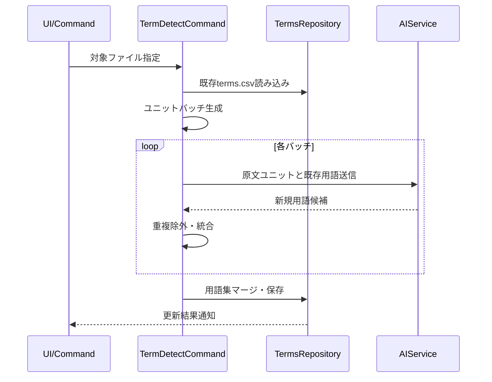
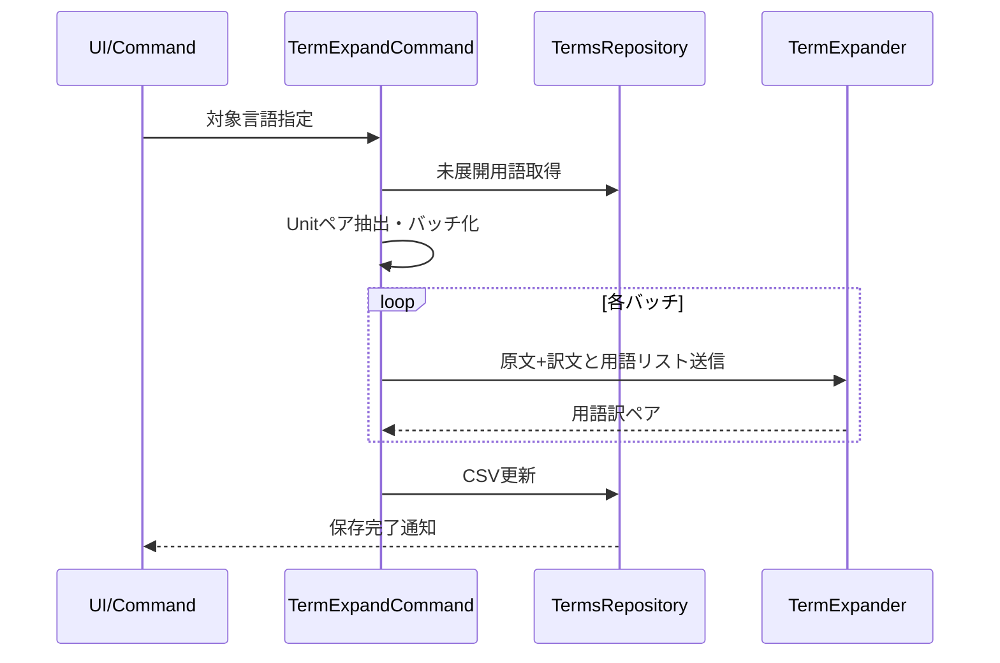

# term（用語集）コマンド設計

## 概要

term（用語集）コマンドは、翻訳品質向上のための用語管理機能を提供します。AIを使用して原文から重要用語を検出し、既存の翻訳から用語訳を抽出して用語集を構築・管理します。

---

## 機能詳細

### term.detect（用語検出）

#### 機能概要
- 原文ユニットをバッチ化し、AIで用語候補を抽出
- 既存用語集とマージして保存
- ディレクトリ/ファイル単位での検出をサポート

#### コマンド
- `mdait.term.detect.directory`: ソースディレクトリ配下の全ファイルを対象に用語検出
- `mdait.term.detect.file`: 単一ソースファイルを対象に用語検出

#### 主要コンポーネント
- [src/commands/term/command-detect.ts](../src/commands/term/command-detect.ts): `detectTermCommand()` - 用語検出のエントリーポイント
- [src/commands/term/term-detector.ts](../src/commands/term/term-detector.ts): `TermDetector.detect()` - AI APIを使用した用語抽出処理
- [src/commands/term/status-tree-term-handler.ts](../src/commands/term/status-tree-term-handler.ts): ステータスツリーからの用語検出アクションハンドラ

#### シーケンス図

#### 処理フロー
1. **初期化**: AI初回利用チェック、用語集リポジトリの読み込み
2. **バッチ分割**: ユニットを文字数閾値（8000文字）でバッチに分割
3. **バッチ処理**:
   - 既存用語をコンテキストとしてAIに送信
   - AI APIで新規用語候補を抽出
   - 重複チェックと統合
4. **用語集保存**: 検出された用語を用語集にマージして保存

---

### term.expand（用語展開）

#### 機能概要
- 既存の翻訳から用語訳を抽出し`terms.csv`へ反映
- 原文/訳文ペアから用語訳を推定して展開
- ディレクトリ/ファイル単位での展開をサポート

#### コマンド
- `mdait.term.expand.directory`: ターゲットディレクトリ配下のファイルに対応するソースのみを対象に展開
- `mdait.term.expand.file`: 単一ターゲットファイルに対応するソースのみを対象に展開

#### 主要コンポーネント
- [src/commands/term/command-expand.ts](../src/commands/term/command-expand.ts): `expandTermCommand()` - 用語展開のエントリーポイント
- [src/commands/term/term-expander.ts](../src/commands/term/term-expander.ts): `TermExpander.expand()` - 原文/訳文ペアから用語訳を推定
- [src/commands/term/status-tree-term-handler.ts](../src/commands/term/status-tree-term-handler.ts): ステータスツリーからの用語展開アクションハンドラ

#### シーケンス図

#### 処理フロー
1. **初期化**: AI初回利用チェック、用語集リポジトリの読み込み
2. **未展開用語抽出**: 対象言語の訳語が存在しない用語を特定
3. **ファイルフィルタリング**: 用語を含むファイルのみを対象に絞り込み
4. **コンテキスト収集**:
   - ソースとターゲットのユニットペアを抽出
   - 各ペアに含まれる未展開用語を紐付け
5. **バッチ処理**:
   - 原文+訳文と用語リストをAIに送信
   - 用語訳ペアを抽出
6. **用語集保存**: 展開された用語を用語集にマージして保存

---

## 共通仕様

### 並列実行制御
- ディレクトリ処理時はファイルを順次処理（trans翻訳と同様の理由）
- バッチサイズはAI APIの入力トークン制限に応じて調整（デフォルト8000文字）

### キャンセル管理
- VSCode標準の`withProgress`パターンで実装
- 通知バーの×ボタンから即座にキャンセル可能
- バッチ単位でキャンセルチェックを実行

### エラーハンドリング
- バッチ処理エラーは警告ログとして記録し、次のバッチに進む
- 用語集保存エラーはユーザーに通知

---

## 考慮事項

- **バッチサイズ**: AI APIのトークン制限を考慮して適切なサイズを設定
- **重複除外**: 既存用語との重複を効率的にチェック
- **段階的処理**: バッチごとに進捗を報告し、ユーザーに進行状況を可視化
- **キャッシュ管理**: 用語集の変更時刻を追跡し、不要な再読み込みを回避
- **用語品質**: AIによる用語検出・展開の品質を担保するためのプロンプト設計

