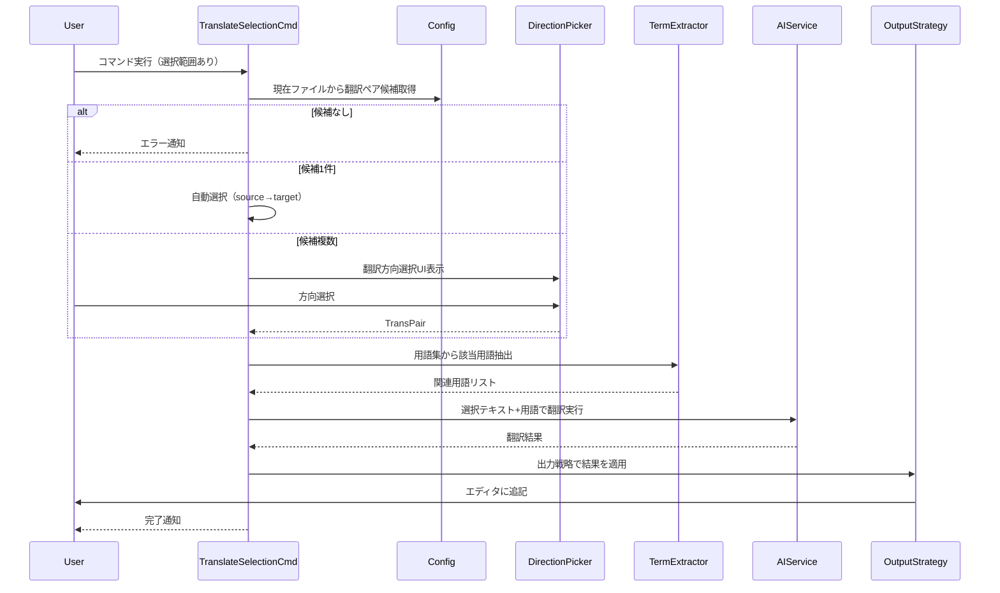

# command_trans-selection（オンデマンド翻訳）

このドキュメントは、`trans-selection`（オンデマンド翻訳）コマンドの詳細設計をまとめたものです。

---

## 概要

- エディタの選択範囲をmdait管理外で一時的に翻訳する軽量機能。
- マーカーレス・履歴管理なしで、mdaitのステータスには影響しない。

## 翻訳方向の自動推定

- 現在のファイルパスから該当する`transPair`を特定し、常に`source→target`方向で翻訳する。
- ファイルがどのディレクトリにあっても翻訳方向は`transPair`定義に従う。

## 用語集連携

- 既存の`TranslationTermExtractor`を活用し、選択テキストに含まれる用語を抽出してAIプロンプトに含める。
- `trans`コマンド相当の用語注入により、オンデマンド翻訳でも品質を維持する。

## 出力戦略パターン

- `OutputStrategy`で出力先を抽象化する設計。
- Phase 1は選択範囲の下に1行空白を開けて追記する戦略を実装する。
- 将来的にクリップボードコピー、新規タブ表示、サイドバイサイド比較などを追加できる。

## 主要コンポーネント

- `src/commands/trans-selection/trans-selection-command.ts`: コマンドエントリーポイント
- `src/commands/trans-selection/direction-picker.ts`: 翻訳方向選択UI
- `src/commands/trans-selection/output-strategy.ts`: 出力戦略インターフェース
- `src/commands/trans-selection/strategies/append-below-strategy.ts`: 選択範囲の下に追記する戦略

## 実行フロー（シーケンス）

## 候補抽出ロジック

- ファイルパスが`transPair`の`sourceDir`または`targetDir`に含まれる場合、その`transPair`を候補として追加。
- 候補0件 → エラー通知（mdait管理外ディレクトリ）。
- 候補1件 → 自動選択して翻訳実行。
- 候補複数 → QuickPickで選択UI表示（例：「ja → en」「en → de」）。

## 出力形態

- Phase 1（実装）: 選択範囲の下に1行空白を開けて翻訳結果を追記。
- Phase 2（将来拡張）: クリップボードコピー、新規タブ表示、サイドバイサイド比較など。

---

## 注意点

- すべてのコマンドはVSCode標準の`withProgress`パターンで`CancellationToken`対応と冪等性を優先する。
- 設定は`config`シングルトンから取得し、`trans`コマンドと挙動を揃える。
