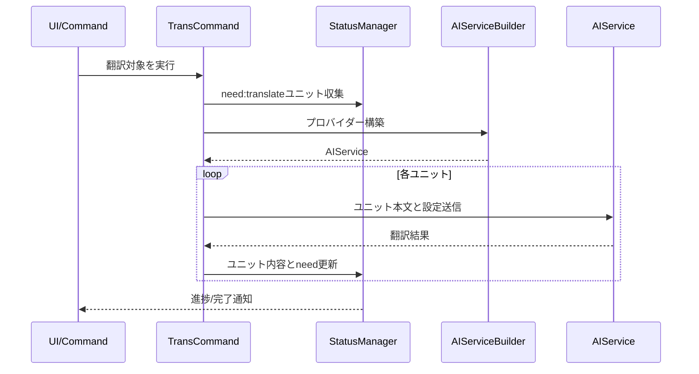

# trans（翻訳）コマンド設計

## 概要

trans（翻訳）コマンドは、`need:translate`フラグが付与されたユニットを特定し、設定されたAIプロバイダーを使用してバッチ翻訳を実行します。翻訳完了後はハッシュ更新とneedフラグ除去を自動実行し、翻訳品質チェックも行います。

---

## 機能詳細

### コア機能

- `need:translate`ユニットを絞り込み、設定されたプロバイダーで一括翻訳
- 翻訳完了後はユニット本文と`hash`を更新し、`need`フラグを除去
- キャンセルやリトライに備え、進捗をUIへ逐次通知

### 高度な機能

#### 用語集連携
- `terms.csv`が存在する場合、翻訳対象ユニットに出現する用語を抽出してAIプロンプトに含め、用語統一を図る
- キャッシュはmtime比較で管理し、効率的な用語読み込みを実現
- 翻訳後の用語提案（termSuggestions）のcontext言語はprimaryLangを優先（primaryLangがsourceLang/targetLangに含まれる場合はその値、含まれなければsourceLang）

#### 前回訳文参照
- 原文改訂時（`from`フィールドで旧ソースハッシュを追跡可能）、前回の訳文を翻訳プロンプトに含めて参照させる
- 変更不要な箇所は既訳を尊重し、変更が必要な箇所のみを変更

#### 原文変更diff参照（改訂パッチ翻訳）
- `need:revise@{oldhash}`形式の場合、スナップショットからoldhashのコンテンツを取得
- 旧コンテンツと現在のソースコンテンツからunified diff形式で差分を生成
- **改訂翻訳時は全文再生成ではなく、前回訳文に対するパッチのみをLLMに返させる**
  - LLM出力は「前回訳文へのunified diff（または差分パッチ）」とし、変更箇所だけを置換
  - 差分適用に失敗した場合はフォールバックとして従来の全文翻訳に切り替える
- 参照: [core.md](core.md)のSnapshot管理、Diff生成

#### 翻訳品質チェック
- markdown-itでパースした構造（見出し、リスト、コードブロック、引用、テーブル、リンク、画像）を原文と訳文で比較
- 構造の不一致を検出し、確認推奨箇所を特定
- 問題がある場合は`need:review`ステータスを設定し、Hoverツールチップに詳細な理由を表示
- 各要素の数の差異を具体的に報告（例: 「見出しレベル2の数が不一致: 原文3個 vs 訳文2個」）

#### 並列実行制御
- **ディレクトリ翻訳**: ファイルを順次処理(キャンセル即応性とレート制限対策を重視)
- **ファイル翻訳**: ユニットを順次処理(AI APIレート制限対策)
- 現状は順次実行を採用し、キャンセル操作への即応性とAI APIのレート制限回避を優先
- 将来的な拡張: 設定可能な並列数制限(セマフォ方式)の導入を検討(例: `mdait.trans.concurrency`で同時翻訳数を指定)

#### キャンセル管理
- VSCode標準の`withProgress`パターンで実装
- 通知バーの×ボタンから即座にキャンセル可能
- 進捗表示はファイル翻訳="X/Y units"、ディレクトリ翻訳="X/Y files"形式

### 主要コンポーネント

- [src/commands/trans/trans-command.ts](../src/commands/trans/trans-command.ts): `transCommand()`, `transUnitCommand()` - 翻訳対象の選択と翻訳実行
  - [transFile_CoreProc()](../src/commands/trans/trans-command.ts#L88): ファイル単位の翻訳処理中核ロジック
  - [transUnit_CoreProc()](../src/commands/trans/trans-command.ts#L457): ユニット単位の翻訳処理中核ロジック
- [src/commands/trans/term-extractor.ts](../src/commands/trans/term-extractor.ts): `TranslationTermExtractor.extract()` - 用語集から該当用語を抽出
- [src/commands/trans/translation-checker.ts](../src/commands/trans/translation-checker.ts): `TranslationChecker.checkTranslationQuality()` - 翻訳品質チェック
- [src/commands/trans/translator.ts](../src/commands/trans/translator.ts): `Translator` - 翻訳サービスインターフェース
- [src/commands/trans/translator-builder.ts](../src/commands/trans/translator-builder.ts): `TranslatorBuilder` - 翻訳サービスの構築

### シーケンス図

### 処理フロー

1. **初期化**: AI初回利用チェック、進捗表示の開始
2. **翻訳ペア取得**: ターゲットファイルから対応するソース言語・ターゲット言語を特定
3. **翻訳サービス構築**: 設定に基づいてAIプロバイダーを初期化
4. **ユニット読み込み**: Markdownファイルをパースし、`need:translate`ユニットを抽出
5. **各ユニット処理**:
   - 用語集から関連用語を抽出
   - 前回訳文を取得（改訂時）
   - 翻訳コンテキスト構築（周辺ユニット）
	 - ソースコンテンツ取得（from属性がある場合）
	 - **改訂時はパッチ翻訳を優先**（差分がある場合）
		 - 前回訳文に対する差分パッチをAIから取得
		 - パッチ適用に成功した場合のみ更新（失敗時は全文翻訳にフォールバック）
	 - AI翻訳実行（全文翻訳 or フォールバック時）
   - 翻訳品質チェック
   - ハッシュ更新とneedフラグ除去
   - 翻訳サマリ保存
6. **ファイル保存**: 更新されたユニットをファイルに反映
7. **ステータス更新**: `StatusManager`にファイルステータスの再計算を依頼

### 考慮事項

- **キャンセル対応**: ユニット単位でキャンセルチェックを実行
- **エラーハンドリング**: ユニット翻訳エラーは`Status.Error`として記録し、処理を継続
- **進捗通知**: ユーザーに現在の進捗状況を明確に表示
- **レート制限**: AI APIのレート制限を考慮して順次処理を採用
- **翻訳品質**: 自動チェックにより確認推奨箇所を特定
