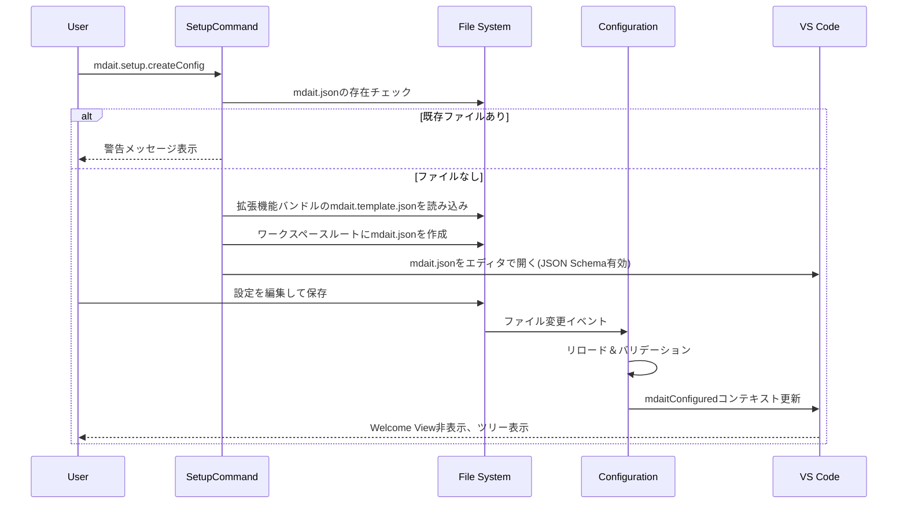
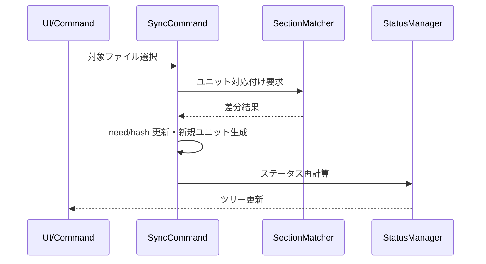
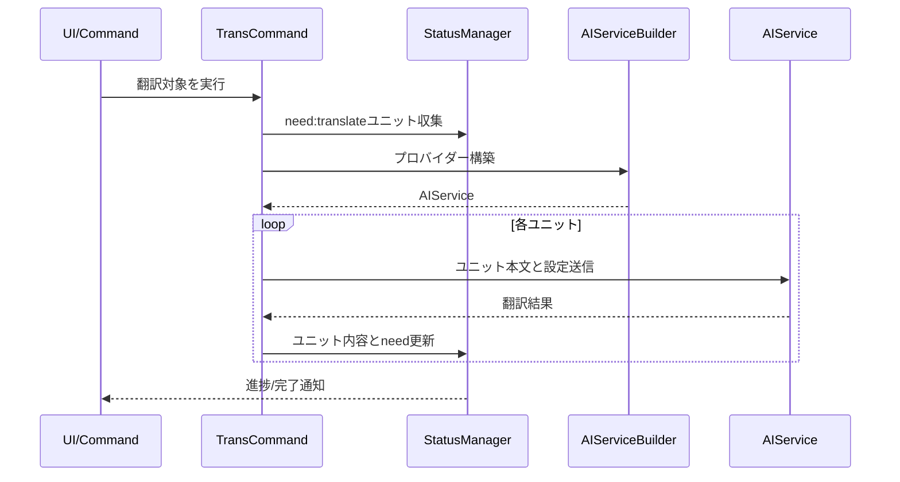
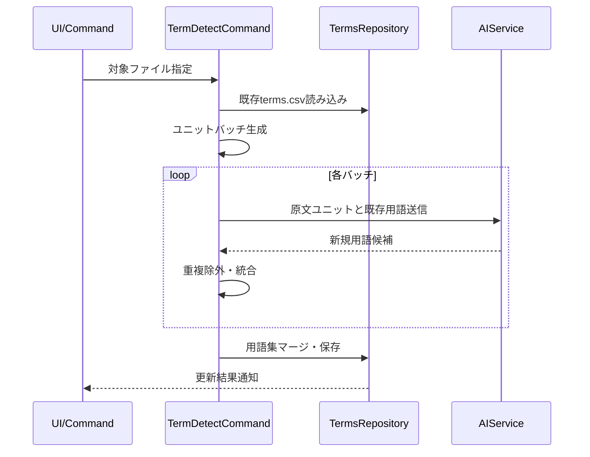
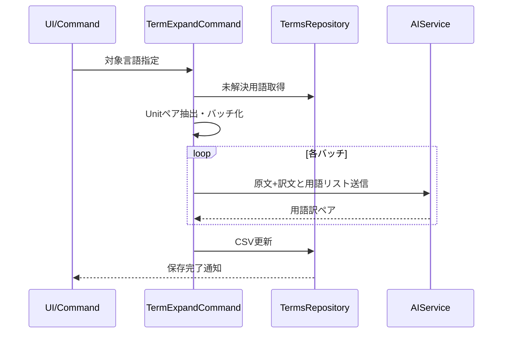

# コマンド層設計

## 役割

- ユーザー起点の操作をmdaitのワークフローに変換し、Core層の機能を組み合わせて実行する。
- 設定値やUIの入力に応じて必要なデータを収集し、処理結果をステータス更新やファイル書き込みとして反映する。

## オンボーディングコマンド

### setup.createConfig（設定ファイル作成）

- 拡張機能にバンドルされた`mdait.template.json`をワークスペースルートに`mdait.json`としてコピー
- テンプレートファイルは拡張機能のルートに配置され、`ExtensionContext.extensionPath`を通じてアクセス
- ファイル作成後、VS Codeエディタで開いてユーザーに編集を促す
- JSON Schemaによる補完と検証が自動的に機能
- 保存時に`Configuration`が自動リロードし、`mdaitConfigured`コンテキスト変数を更新
- 既に`mdait.json`が存在する場合は警告メッセージを表示して上書きを防止
- テンプレートファイルが見つからない場合はエラーメッセージを表示（拡張機能の再インストールを促す）

**シーケンス:**

## コマンド別要点

### sync（ユニット同期）

- Markdown間のユニット対応付けを確立し、`hash`・`from`・`need`を再計算。
- 差分検出後は`need:translate`付与や未使用ターゲットユニットの削除/保留を制御。
- [core.md](core.md)のSectionMatcherとStatus管理を活用し、冪等な再実行を保証。
- 同期完了後はソース/ターゲット両ファイルのステータスを`StatusManager.refreshFileStatus`で再計算し、ツリー表示を即時追従させる。

**シーケンス:**

### trans(AI翻訳)

- `need:translate`ユニットを絞り込み、設定されたプロバイダーで一括翻訳。
- 翻訳完了後はユニット本文と`hash`を更新し、`need`フラグを除去。
- キャンセルやリトライに備え、進捗をUIへ逐次通知する。
- **用語集連携**: `terms.csv`が存在する場合、翻訳対象ユニットに出現する用語を抽出してAIプロンプトに含め、用語統一を図る(キャッシュはmtime比較で管理)。
- **前回訳文参照**: 原文改訂時（`from`フィールドで旧ソースハッシュを追跡可能）、前回の訳文を翻訳プロンプトに含めて参照させる。変更不要な箇所は既訳を尊重し、変更が必要な箇所のみを変更。
- **翻訳品質チェック**: 翻訳後に原文と訳文を比較し、確認推奨箇所（数値の不一致、構造の差異など）を検出。問題がある場合は`need:review`ステータスを設定し、Hoverツールチップに理由を表示。
- **並列実行制御**:
  - ディレクトリ翻訳: ファイルを順次処理(キャンセル即応性とレート制限対策を重視)
  - ファイル翻訳: ユニットを順次処理(AI APIレート制限対策)
  - 現状は順次実行を採用し、キャンセル操作への即応性とAI APIのレート制限回避を優先
  - 将来的な拡張: 設定可能な並列数制限(セマフォ方式)の導入を検討(例: `mdait.trans.concurrency`で同時翻訳数を指定)
- **キャンセル管理**: VSCode標準の`withProgress`パターンで実装。通知バーの×ボタンから即座にキャンセル可能。進捗表示はファイル翻訳="X/Y units"、ディレクトリ翻訳="X/Y files"形式。

**シーケンス:**

### term（用語集）

- `mdait.term.detect`: 原文ユニットをバッチ化し、AIで用語候補を抽出。既存用語集とマージして保存。
- `mdait.term.expand`: 原文用語ユニットを抽出し、原文/訳文ペアから用語訳を推定。未解決語はAI翻訳で補完し`terms.csv`へ反映。
- **並列実行制御**: ディレクトリ処理時はファイルを順次処理（trans翻訳と同様の理由）。バッチサイズはAI APIの入力トークン制限に応じて調整。

**term.detectシーケンス:**

**term.expandシーケンス:**

## 考慮事項

- すべてのコマンドはVSCode標準の`withProgress`パターンで`CancellationToken`対応と冪等性確保を優先する。
- 設定は[config.md](config.md)で定義されたシングルトン経由で最新値を取得する。
- 翻訳や用語抽出など外部呼び出しは[api.md](api.md)のビルダーで動的にプロバイダー切り替えを行う。

## 参照

- 実装コード: `src/commands/` 以下
- UI連携: [ui.md](ui.md)
- テスト観点: [test.md](test.md)