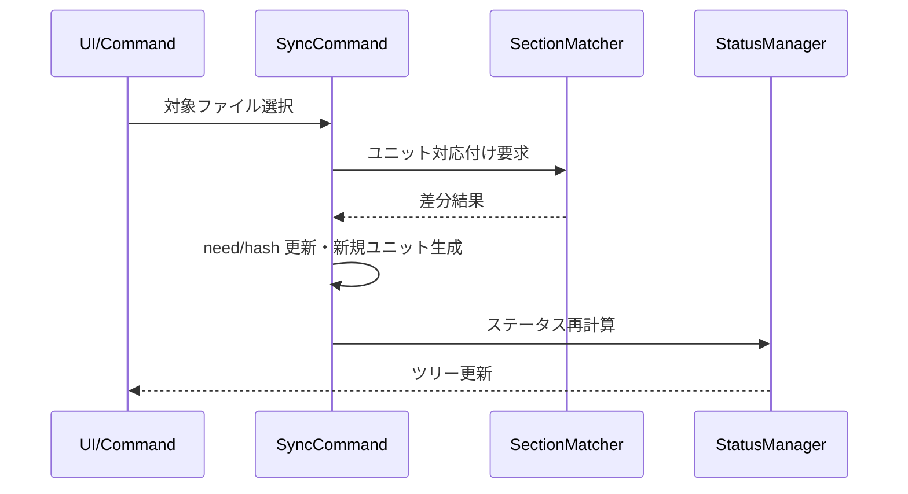
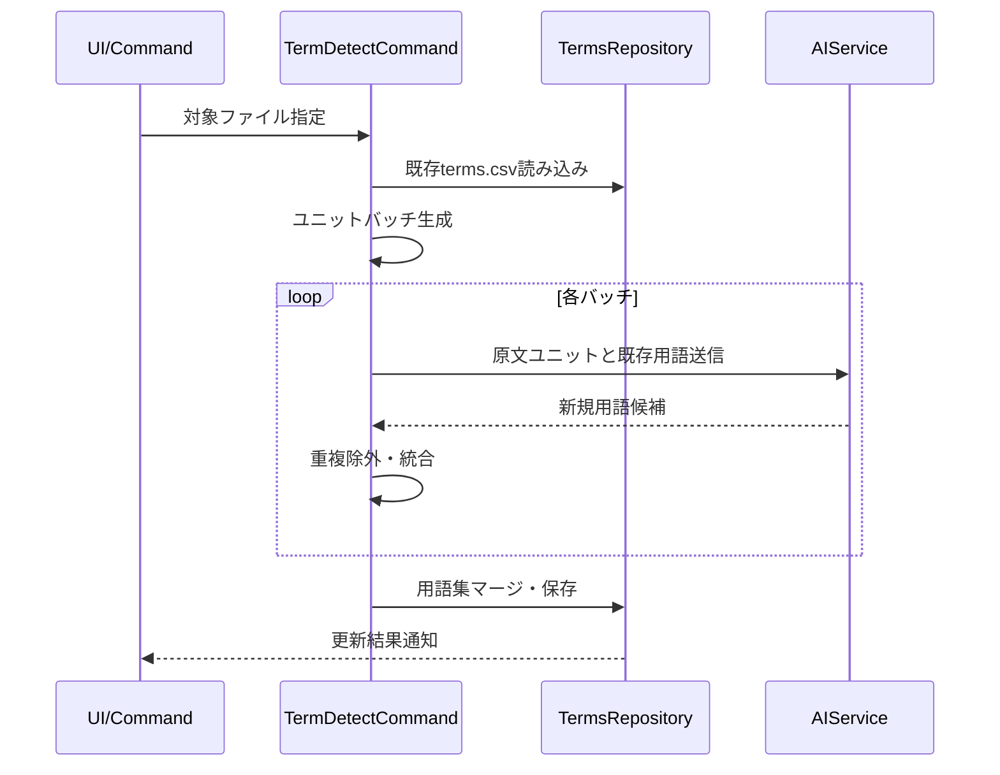
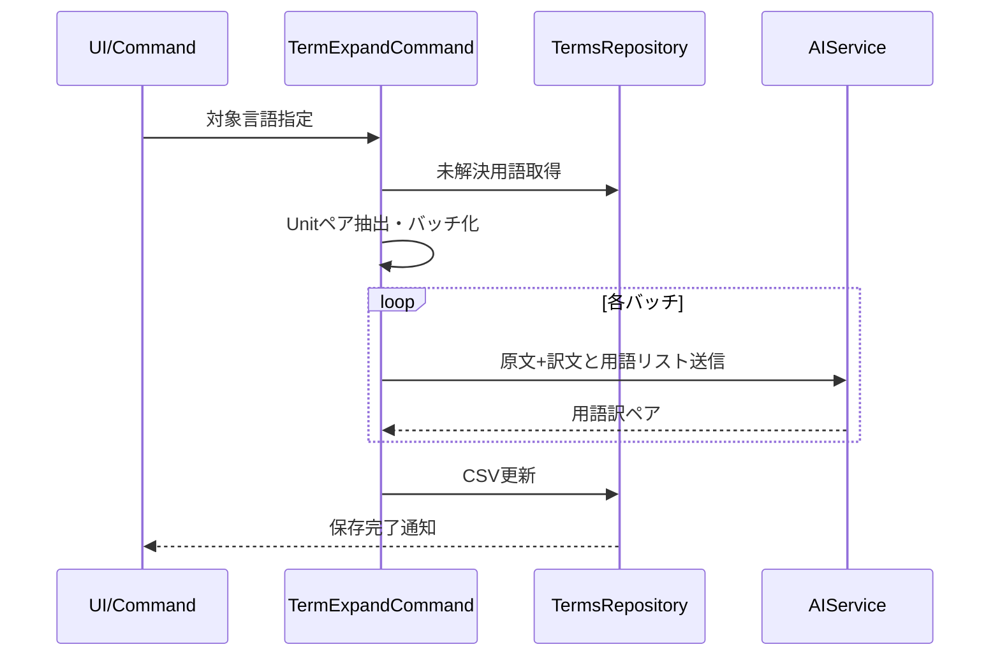

# コマンド層設計

## 役割

- ユーザー起点の操作をmdaitのワークフローに変換し、Core層の機能を組み合わせて実行する。
- 設定値やUIの入力に応じて必要なデータを収集し、処理結果をステータス更新やファイル書き込みとして反映する。

## コマンド別要点

### sync（ユニット同期）
- Markdown間のユニット対応付けを確立し、`hash`・`from`・`need`を再計算。
- 差分検出後は`need:translate`付与や未使用ターゲットユニットの削除/保留を制御。
- [core.md](core.md)のSectionMatcherとStatus管理を活用し、冪等な再実行を保証。

### trans（AI翻訳）
- `need:translate`ユニットを絞り込み、設定されたプロバイダーで一括翻訳。
- 翻訳完了後はユニット本文と`hash`を更新し、`need`フラグを除去。
- キャンセルやリトライに備え、進捗をUIへ逐次通知する。

### term（用語集）
- `mdait.term.detect`: 原文ユニットをバッチ化し、AIで用語候補を抽出。既存用語集とマージして保存。
- `mdait.term.expand`: 原文用語ユニットを抽出し、原文/訳文ペアから用語訳を推定。未解決語はAI翻訳で補完し`terms.csv`へ反映。

## 主要シーケンス

### syncコマンド

### transコマンド

### term.detectコマンド

### term.expandコマンド

## 考慮事項

- すべてのコマンドは`CancellationToken`対応と冪等性確保を優先する。
- 設定は[config.md](config.md)で定義されたシングルトン経由で最新値を取得する。
- 翻訳や用語抽出など外部呼び出しは[api.md](api.md)のビルダーで動的にプロバイダー切り替えを行う。

## 参照

- 実装コード: `src/commands/` 以下
- UI連携: [ui.md](ui.md)
- テスト観点: [test.md](test.md)