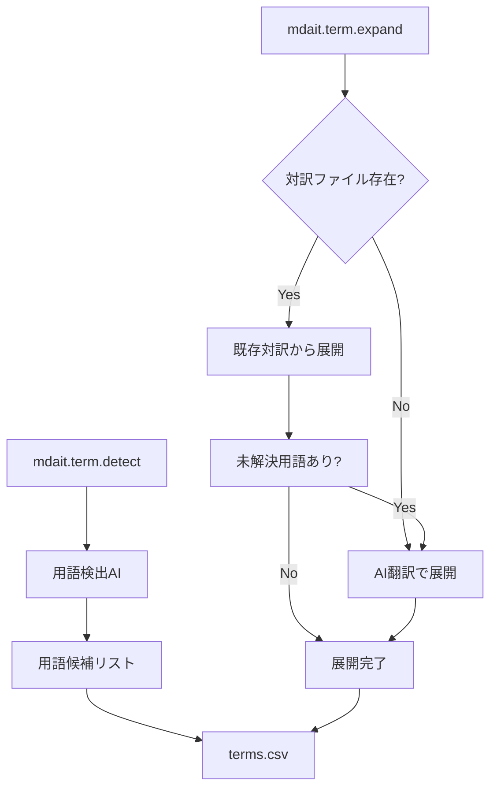

# mdait 用語集機能（`term`）設計書

## 1. 概要

用語集機能は、翻訳対象文書内での**用語の表記統一・翻訳の一貫性確保**を目的とする。
AI翻訳の前処理・支援データとして用語集を活用し、表記ゆれの自動修正・誤訳防止・用語チェックを可能にする。

---

## 2. 用語集ファイル仕様（CSV）

### 2.1 フォーマット

UTF-8（BOM あり/なしどちらも読込対応）。生成時は BOM ありで出力。ヘッダー行は必須。列の順序は任意。CSV のパース/生成は`csv-parse`を使用する。

**必須列**
- transPairs の sourceLang/targetLang に一致する言語コード列（例: `ja`, `en` など、複数ペアに対応可能）
- `context` 列

**任意列**
`variants_<lang>` 列（例: `variants_ja`, `variants_en`）。値内のカンマと衝突しないよう、当該列のセルは二重引用必須。

**例**

| ja    | variants_ja | en          |  variants_en | context  |
| ----- | ----------- | -------- | -------------------- | ------------- |
| 開発プロセス |  "開発 プロセス,開発のプロセス" | development process | "dev proc" |開発全般 |
| アカウント| "Account,アカウント情報" | account     |  "acc" |ユーザー識別情報 |

### 2.2 各列の意味

- `<sourceLang>`（例: `ja`）: 原文で使用すべき統一表記（正規形）
- `<targetLang>`（例: `en`）: 対応する訳語（正規形）
- `context`: 補足情報、用語の定義、翻訳方針など（必須）
- `variants_<lang>`: 指定言語で正規形に正すべき揺れ表現（任意、カンマ区切り。CSV 的に二重引用必須）

### 2.3 用語集の配置

用語集ファイルは`.mdait/terms.csv` として配置するのを標準とする。

---

## 3. `term` コマンド構成

### サブコマンド一覧

| コマンド         | 説明                      |
| ------------ | ----------------------- |
| `mdait.term.detect`   | 原文から重要用語を検出（AI使用）  |
| `mdait.term.expand` | 検出された用語を多言語に展開（既存対訳優先、AI翻訳フォールバック） |

### ステータスツリー連携・起動経路

代表的な起動経路は StatusTree 上のアイコン（trans コマンドと同等）。StatusItem の種類に応じて実行できるようにする。

- File: `detect`, `expand`
- Unit: `detect`, `expand`

進捗表示は trans コマンドと同様に Unit 単位で行う。

---

## 4. 各コマンドの詳細仕様

### 4.1 `mdait.term.detect` - 用語検出

#### 目的

原文から翻訳すべき重要用語（専門用語・固有名詞・略語など）をAIで検出する。

#### 処理フロー

1. 対象 Unit の原文を取得
2. AIで専門用語・固有名詞・重要語句を識別
3. context情報と共に用語候補リストを生成
4. 既存用語集との重複チェック
5. 新規用語のみを用語集に追加

### 4.2 `mdait.term.expand` - 用語多言語展開

#### 目的

検出された用語を対象言語に展開する。既存対訳を優先し、見つからない場合はAI翻訳でフォールバック。

#### 処理フロー

1. **Phase 1 (既存対訳からの展開)**:
   - 対応するターゲットファイルが存在する場合
   - 原文・訳文ペアから用語対応を抽出
   - 対応関係をAIで識別

2. **Phase 2 (AI翻訳フォールバック)**:
   - Phase 1で対応が見つからない用語
   - 用語レベルでのAI翻訳を実行
   - context情報を活用した高精度翻訳

3. **統合・保存**:
   - 既存用語集とマージ
   - 重複排除・競合無視
   - UTF-8 BOM付きで保存

---

## 5. 実装アーキテクチャ

### 5.1 モジュール構成

```
src/commands/term/
├── command-detect.ts          # mdait.term.detect コマンド
├── command-expand.ts          # mdait.term.expand コマンド
├── term-detector.ts           # 用語検出サービス
├── term-expander.ts           # 用語展開サービス
├── terms-repository.ts        # 用語集I/O・管理
└── term-entry.ts              # 用語エントリ型定義
```

### 5.2 処理フロー図



---

## 6. AI サービス統合

### 6.1 既存 AI インフラとの統合

- `AIService` インターフェースを活用
- `AIServiceBuilder` でプロバイダー選択
- モック実装で開発・テスト対応

### 6.2 用語特化プロンプト

- **detect**: 専門用語・固有名詞の識別に特化
- **expand**: 用語レベルの高精度翻訳に特化
- context情報を活用した品質向上

---

## 7. 今後の拡張予定

- 用語品質評価・レビュー機能
- 多言語同時展開（3言語以上）
- 用語使用頻度分析
- インタラクティブな用語確認UI

翻訳前に、原文中の表記ゆれを**統一語** に変換する。

#### 処理フロー

`ja` が source の例

1. `terms.csv` を読み込み。
2. `variants_ja` にある語をすべて `ja` に置換。
3. 変換後の文書を保存（差分も記録可能）。

現段階では後回し（仕様詳細は現状維持）。

---

## 5. transコマンド時のAI連携ポリシー

* 用語は文中にマークせず、AI には「このセクション（Unit）で使用すべき term リスト」として提供。
* 複数候補がある用語は、プロンプトに候補語と `context` を提示して選定。
