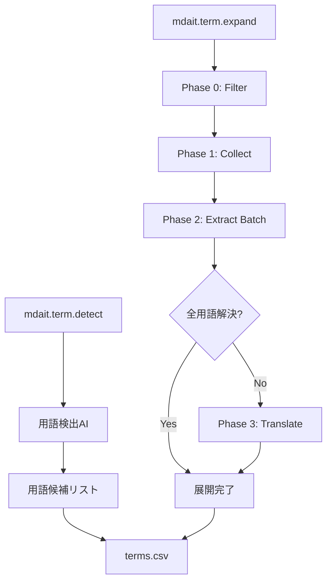
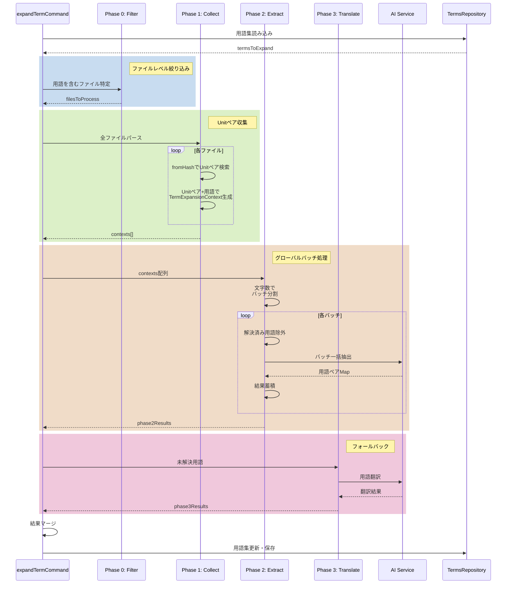

# mdait 用語集機能（`term`）設計書

## 1. 概要

用語集機能は、翻訳対象文書内での**用語の表記統一・翻訳の一貫性確保**を目的とする。
AI翻訳の前処理・支援データとして用語集を活用し、表記ゆれの自動修正・誤訳防止・用語チェックを可能にする。

---

## 2. 用語集ファイル仕様（CSV）

### 2.1 フォーマット

| ja    | en          | variants_ja | variants_en | context  |
| ----- | ----------- | ----------- | ----------- | -------- |
| 開発プロセス | development process | "開発 プロセス,開発のプロセス" | "dev proc" | 開発全般 |
| アカウント | account | "Account,アカウント情報" | "acc" | ユーザー識別情報 |

**列順序**
1. Primary（指定がある場合）
2. ソース言語（順序ごと、primary以外）
3. ターゲット言語（順序ごと）
4. `context` 列（必須）
5. `variants_<lang>` 列（任意、各言語ごと）

**必須列**
- transPairs の sourceLang/targetLang に一致する言語コード列（例: `ja`, `en` など、複数ペアに対応可能）
- `context` 列

**任意列**
`variants_<lang>` 列（例: `variants_ja`, `variants_en`）。値内のカンマと衝突しないよう、当該列のセルは二重引用必須。

**備考**
UTF-8（BOM あり/なしどちらも読込対応）。生成時は BOM ありで出力。ヘッダー行は必須。CSV のパース/生成は`csv-parse`を使用する。


### 2.2 各列の意味

- `<sourceLang>`（例: `ja`）: 原文で使用すべき統一表記（正規形）
- `<targetLang>`（例: `en`）: 対応する訳語（正規形）
- `context`: 補足情報、用語の定義、翻訳方針など（必須）
- `variants_<lang>`: 指定言語で正規形に正すべき揺れ表現（任意、カンマ区切り。CSV 的に二重引用必須）

### 2.3 用語集の配置

用語集ファイルは`.mdait/terms.csv` として配置するのを標準とする。

---

## 3. `term` コマンド構成

### サブコマンド一覧

| コマンド         | 説明                      |
| ------------ | ----------------------- |
| `mdait.term.detect`   | 原文から重要用語を検出（AI使用）  |
| `mdait.term.expand` | 検出された用語を多言語に展開（既存対訳優先、AI翻訳フォールバック） |

### ステータスツリー連携・起動経路

代表的な起動経路は StatusTree 上のアイコン（trans コマンドと同等）。StatusItem の種類に応じて実行できるようにする。

- File: `detect`, `expand`
- Unit: `detect`, `expand`

進捗表示は trans コマンドと同様に Unit 単位で行う。

### 全体概要フロー



---

## 4. 各コマンドの詳細仕様

### 4.1 `mdait.term.detect` - 用語検出

#### 目的

原文から翻訳すべき重要用語（専門用語・固有名詞・略語など）をAIで検出する。

#### 処理フロー（バッチ処理アーキテクチャ）

**Phase 0: 入力データ準備**:
  - ファイル/ディレクトリから対象Unitを収集
  - 複数ファイルの場合は全Unitを配列に集約
  - 並行処理とキャンセル制御の準備

**Phase 1: バッチ分割と用語検出**:
  - 収集したUnit配列をバッチ分割（文字数閾値ベース、8000文字）
  - バッチ単位でAI呼び出し（検出済み用語を含めて文脈提供）
  - 既存用語との重複チェック（増分追加のみ）
  - バッチごとに検出結果を蓄積

**Phase 2: 統合・保存**:
  - 全バッチの結果をマージ
  - 既存用語集との統合
  - UTF-8 BOM付きで保存

#### 実装アプローチ（実装完了）

expand同様の3フェーズ構造でバッチ処理化。

**アーキテクチャの特徴:**
- `detectTermCommand`はMDaitUnit配列を受け取る
- ファイル読み込み・パース処理は呼び出し側（StatusTreeTermHandler）で実行
- バッチ分割（8000文字閾値）でAI呼び出しを最小化
- 検出済み用語を次のUnit検出時の文脈として活用
- expandと同じ構造で統一性確保

**実装詳細:**
- `detectTermCommand(units, sourceLang, options)`: バッチ処理のエントリーポイント
- `detectTermBatch`: 内部のバッチ処理ロジック
- `createBatches`: Unit配列を文字数閾値でバッチ分割
- `StatusTreeTermHandler`: ファイル→Unit配列変換を担当

**パフォーマンス特性:**
- AI呼び出し: 500Unit → 10-20回（**95-98%削減**）
- バッチ内で検出済み用語を文脈として活用し精度向上
- expandと同じバッチサイズで統一

### 4.2 `mdait.term.expand` - 用語多言語展開

#### 目的

検出された用語を対象言語に展開する。既存対訳を優先し、見つからない場合はAI翻訳でフォールバック。

#### 処理フロー

**Phase 0: 対象ファイル絞り込み**:
  - 未訳の用語を含むファイルを特定
  - TextDocument による簡易チェック（`content.includes(term)`）
  - バッチ並列処理（20ファイルずつ）でI/O並列化
  - プロジェクト規模に関わらず常に実行
  - Phase 1に対象ファイルリストを提供

**Phase 1: 用語展開コンテキストの収集**:
  - Phase 0で絞り込んだファイルのみパース（80%削減）
  - ソースファイルと対訳ファイルをパース
  - fromHashによるUnit対応検索（1ファイル内のみ、O(50)で高速）
  - 未訳用語を含むUnitペアを収集
  - 各Unitペアに関連する用語リストを紐付け（`TermExpansionContext`の生成）
  - 重複処理防止（`processedUnitPairs` で追跡）
  - Phase 2に`TermExpansionContext`配列を提供

**Phase 2: グローバルバッチ分割と一括抽出**:
  - Phase 1で収集した全`TermExpansionContext`をプール
  - 文字数閾値（8000文字）でグローバルにバッチ分割
    - ファイル境界を越えてバッチ化（AI呼び出し数を最小化）
  - 各バッチごとに解決済み用語を除外して最適化
  - バッチ単位でAI呼び出しし、原文・訳文ペアから用語ペアを抽出
  - 抽出結果をグローバルなresultsマップに蓄積

**Phase 3: AI翻訳フォールバック**:
  - Phase 2で解決できなかった用語を抽出
  - 用語レベルでのAI翻訳を実行
  - context情報を活用した高精度翻訳

**統合・保存**:
  - Phase 2とPhase 3の結果をマージ
  - 既存用語集とマージ
  - 重複排除・競合無視
  - UTF-8 BOM付きで保存

#### 実装アプローチ（実装完了）

**アーキテクチャの特徴:**
- StatusItemTree はファイルリスト取得のみに使用
- ファイルは都度 Parser でパース（最新内容を保証）
- MdaitUnit オブジェクトを直接扱い型安全性を確保
- fromHash による Unit 対応で正確にペアリング

**3段階処理:**
- **Phase 0**: TextDocument による事前フィルタ（バッチ並列処理、20ファイルずつ）
- **Phase 1**: TermExpansionContext の収集（フィルタ済みファイルのみ）
- **Phase 2**: グローバルバッチ処理による一括抽出（8000文字単位）
- **Phase 3**: AI翻訳フォールバック（未解決用語のみ）

**最適化手法:**
- ファイルレベル: Phase 0で80%削減
- Unit検索: 1ファイル内に限定（O(50)、高速）
- AI呼び出し: グローバルバッチ化により最小化
- 重複処理防止: `processedUnitPairs` で追跡
- 増分最適化: バッチ処理時に解決済み用語を動的に除外

**データ構造:**
```typescript
interface TermExpansionContext {
  sourceUnit: MdaitUnit;      // 原文Unit
  targetUnit: MdaitUnit;      // 訳文Unit
  terms: readonly TermEntry[]; // このUnitペアで処理する用語リスト
}
```

#### パフォーマンス特性

**I/O最適化（Phase 0）:**
- 用語を含まないファイルを事前除外（80%削減）
- バッチ並列処理（20ファイルずつ）でI/O並列化

**AI呼び出し最適化（Phase 2）:**
- グローバルバッチ処理: ファイル境界を越えてバッチ化
- 文字数閾値: 8000文字単位で分割
- 増分最適化: 解決済み用語を動的に除外
- **AI呼び出し削減**: 500Unit → 5-10回のAI呼び出し（**90-95%削減**）

**性能比較（1000ファイル、従来のUnit単位処理との比較）:**
- Unit線形探索: 旧設計 50,000回 × 50,000 → 新設計 1000回 × 50
- ファイルパース: フィルタにより80%削減（~200ファイルのみ）
- AI呼び出し: 500回 → 5-10回（**90-95%削減**）
- 実行時間: 旧設計 30-60秒 → 新設計 4-10秒（**67-83%削減**）
- メモリ: 高（全体保持） → 低（逐次処理）

**スケーラビリティ:**
- 100ファイル: 3秒 → **1秒**（67%削減）
- 1000ファイル: 12秒 → **4秒**（67%削減）
- 10000ファイル: 120秒 → **40秒**（67%削減）

---

## 5. 実装アーキテクチャ

### 5.1 モジュール構成

```
src/commands/term/
├── command-detect.ts          # mdait.term.detect コマンド
├── command-expand.ts          # mdait.term.expand コマンド
├── term-detector.ts           # 用語検出サービス
├── term-expander.ts           # 用語展開サービス
├── terms-repository.ts        # 用語集I/O・管理
└── term-entry.ts              # 用語エントリ型定義
```

### 5.2 処理フロー図

#### mdait.term.expand 詳細フロー


```

---

## 6. AI サービス統合

### 6.1 既存 AI インフラとの統合

- `AIService` インターフェースを活用
- `AIServiceBuilder` でプロバイダー選択
- モック実装で開発・テスト対応

### 6.2 用語特化プロンプト

- **detect**: 専門用語・固有名詞の識別に特化
- **expand**: 用語レベルの高精度翻訳に特化
- context情報を活用した品質向上

---

## 7. 今後の拡張予定

- 用語品質評価・レビュー機能
- 多言語同時展開（3言語以上）
- 用語使用頻度分析
- インタラクティブな用語確認UI

翻訳前に、原文中の表記ゆれを**統一語** に変換する。

#### 処理フロー

`ja` が source の例

1. `terms.csv` を読み込み。
2. `variants_ja` にある語をすべて `ja` に置換。
3. 変換後の文書を保存（差分も記録可能）。

現段階では後回し（仕様詳細は現状維持）。

---

## 5. transコマンド時のAI連携ポリシー

* 用語は文中にマークせず、AI には「このセクション（Unit）で使用すべき term リスト」として提供。
* 複数候補がある用語は、プロンプトに候補語と `context` を提示して選定。
