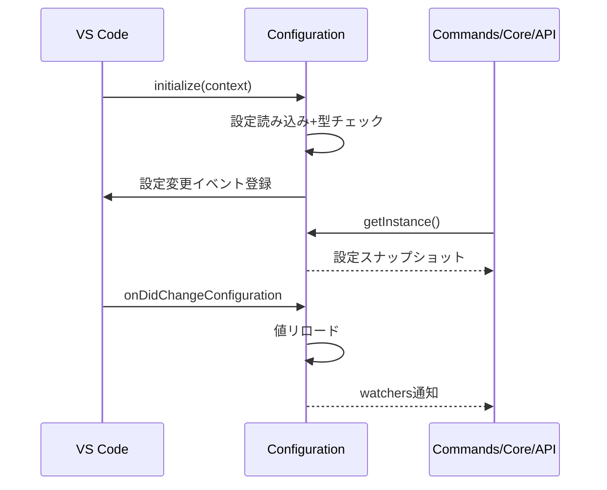

# 設定管理層設計

## Configurationクラスの骨子

- シングルトンとして`initialize()`でロード、`getInstance()`で提供。
- 実装: [src/config/configuration.ts](../src/config/configuration.ts)

## ロードシーケンス

## 考慮事項

- 設定値は不変オブジェクトとして呼び出し側に渡し、副作用を避ける。
- 単体テストでは`dispose()`でシングルトンを明示的に破棄し、設定の独立性を保つ。
- 非同期設定（プロバイダー資格情報など）が増える場合はPromiseベースのアクセサを追加する余地を残す。

## 関連

- コマンド挙動: [commands.md](commands.md)
- プロバイダー構築: [api.md](api.md)
- テスト設定: [test.md](test.md)