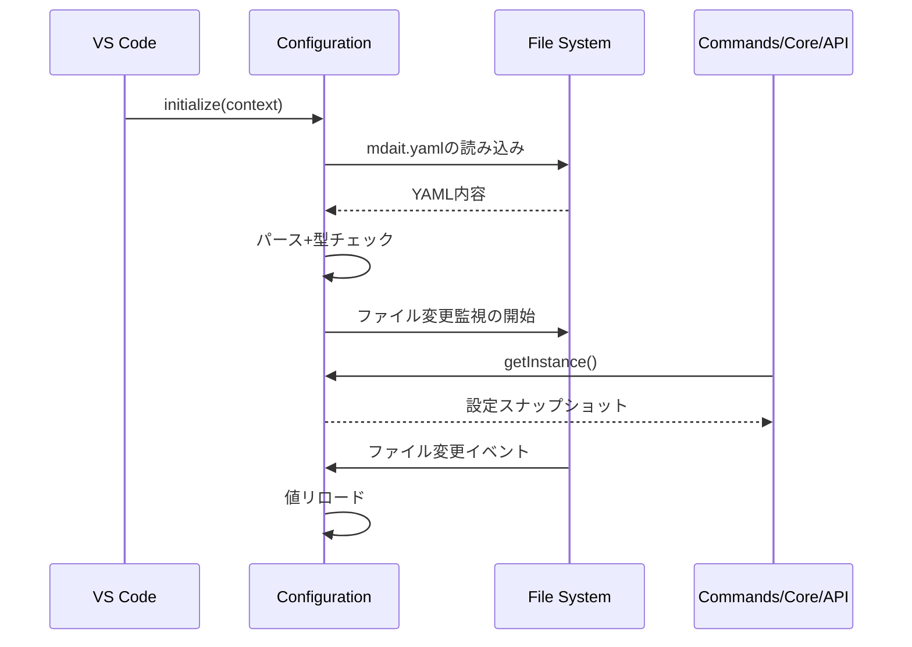

# 設定管理層設計

## Configurationクラスの骨子

- シングルトンとして`initialize()`でロード、`getInstance()`で提供。
- ワークスペースルートの`mdait.yaml`ファイルから設定を読み込む。
- 実装: [src/config/configuration.ts](../src/config/configuration.ts)

## ロードシーケンス



## mdait.yamlフォーマット

```yaml
# 翻訳ペア設定
transPairs:
  - sourceDir: docs/ja
    targetDir: docs/en
    sourceLang: ja
    targetLang: en

# 除外パターン
ignoredPatterns: "**/node_modules/**"

# Sync設定
sync:
  autoMarkerLevel: 2
  autoDelete: true

# AI設定
ai:
  provider: default
  model: gpt-4o
  ollama:
    endpoint: http://localhost:11434
    model: llama2
  debug:
    enableStatsLogging: false
    logPromptAndResponse: false

# 翻訳設定
trans:
  markdown:
    skipCodeBlocks: true

# 用語集設定
terms:
  filename: terms.csv
  primaryLang: en
```

## 考慮事項

- 設定値は不変オブジェクトとして呼び出し側に渡し、副作用を避ける。
- 単体テストでは`dispose()`でシングルトンを明示的に破棄し、設定の独立性を保つ。
- 非同期設定（プロバイダー資格情報など）が増える場合はPromiseベースのアクセサを追加する余地を残す。
- `mdait.yaml`が存在しない場合はエラーを返し、ユーザーに設定ファイルの作成を促す。

## 関連

- コマンド挙動: [commands.md](commands.md)
- プロバイダー構築: [api.md](api.md)
- テスト設定: [test.md](test.md)