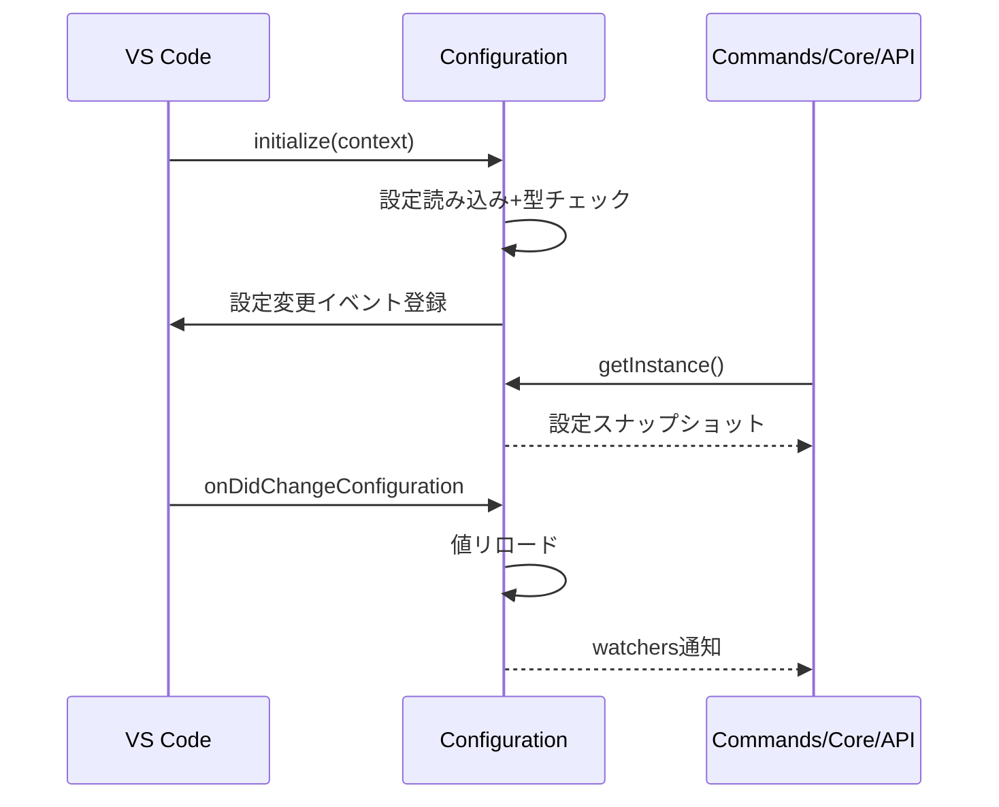

# 設定管理層設計

## 役割

- VS Code設定からmdaitの挙動を決定する値を収集し、各層へ一貫した形で提供する。
- 設定変更を監視して再ロードし、長時間動作でも最新値を保証する。

## Configurationクラスの骨子

- シングルトンとして`initialize()`でロード、`getInstance()`で提供。
- 管理する主なカテゴリ
	- `transPairs`: 翻訳対象ディレクトリと言語ペア
	- `sync`: 自動マーカー付与、不要ユニット削除などの挙動
	- `ai`/`trans`: 利用するプロバイダー、モデル、プロンプト調整
	- `ignoredPatterns`: 処理除外パス
- 実装: `src/config/configuration.ts`

## ロードシーケンス

## 考慮事項

- 設定値は不変オブジェクトとして呼び出し側に渡し、副作用を避ける。
- 単体テストでは`dispose()`でシングルトンを明示的に破棄し、設定の独立性を保つ。
- 非同期設定（プロバイダー資格情報など）が増える場合はPromiseベースのアクセサを追加する余地を残す。

## 関連

- コマンド挙動: [commands.md](commands.md)
- プロバイダー構築: [api.md](api.md)
- テスト設定: [test.md](test.md)