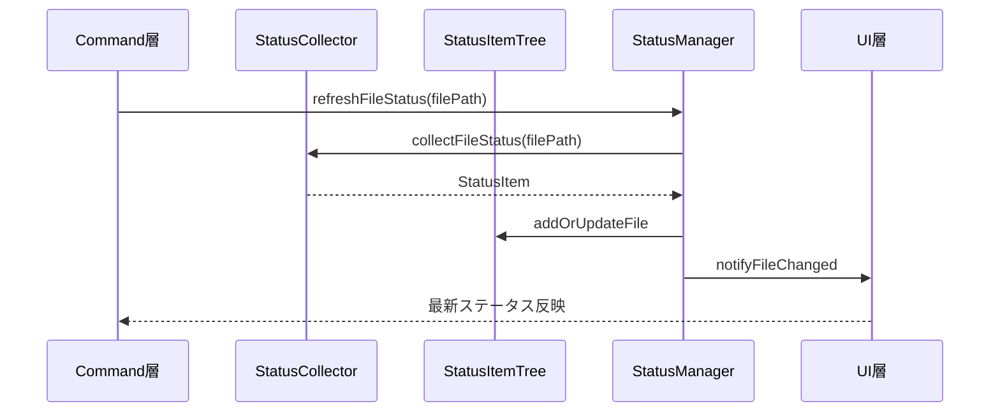
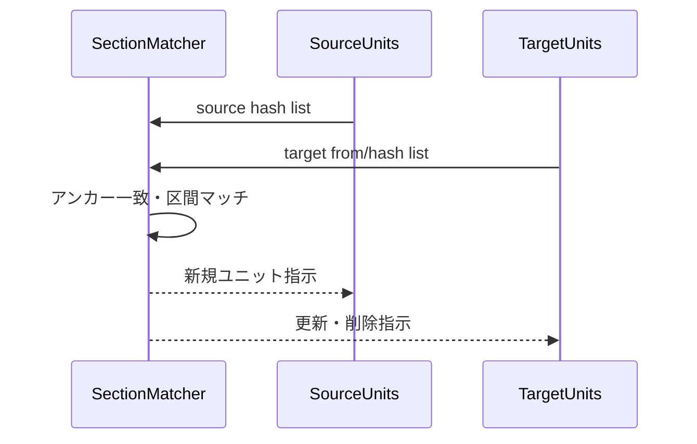

# コア機能層設計

## 役割

- Markdownをユニット化し、差分検出と翻訳ステータス管理の土台を提供する。
- ハッシュ計算・正規化・状態集計など、上位層から繰り返し利用される処理を一元化する。

## 主要概念

### mdaitUnit
- Markdown本文と`<!-- mdait hash from need -->`マーカーをペアで保持する翻訳単位。
- `hash`: CRC32ベースの短縮値、`from`: 翻訳元ユニット、`need`: ワークフロー指示（translate/review/...）。
- **ユニット境界**: 指定レベル以下の見出し、または見出しがない場所のmdaitMarkerが境界となる。
- **マーカーと見出しの関係**: マーカーの直後（空行なし）に見出しがある場合、その見出しがマーカーの示すユニットのタイトルである。
- **ハッシュ省略マーカー**: `<!-- mdait -->` のようにハッシュを省略したマーカーも境界として認識される。syncコマンド実行時に自動的にハッシュが計算される。
- 実装: `src/core/markdown/`

### Hash & Normalizer
- Markdownを標準化（改行・空白・コードフェンスなど）した上でCRC32を算出。
- Unit・ファイルの差分比較や追跡を支える。
- 実装: `src/core/hash/`

### Status管理
- `StatusItemTree`がディレクトリ/ファイル/ユニット階層をMap構造で保持しO(1)検索を実現。
- `StatusManager`がCollectorとUIの橋渡しとして全体構築・部分更新を担う。
- 実装: `src/core/status/`

### Snapshot管理
- ユニットコンテンツのスナップショットを`.mdait/snapshot`ファイルで管理。
- gzip圧縮+base64エンコードでコンパクトに保存。
- sync時に全ユニットのスナップショットを保存し、GCで不要なものを削除。
- 実装: `src/core/snapshot/`

### Diff生成
- `diff`パッケージを使用してunified diff形式で差分を生成。
- trans時に旧スナップショットと現在のコンテンツから動的にdiffを生成しLLMに提供。
- 実装: `src/core/diff/`

### FrontMatter翻訳
- frontmatter内の指定キー値を翻訳対象として扱う機能群。
- **mdait.frontマーカー**: frontmatter内に`mdait.front: "hash from:xxx need:translate"`形式でメタデータを保持。
- **階層構造**: `mdait`名前空間の下に配置（例: `mdait: { front: "...", sync: { level: 3 } }`）
- **ハッシュ計算**: 設定されたkeys順に値を連結してハッシュ化（キー名・順序は差分対象外）。
- **翻訳状態管理**: 本文ユニットと分離した専用フローでsync/transを実行。
- **ドット記法アクセス**: `FrontMatter`クラスで`"mdait.sync.level"`のようなドット記法による階層アクセスをサポート。
- 実装: `src/core/markdown/frontmatter-translation.ts`

## ステータス更新シーケンス

## ユニット同期ロジック

## 考慮事項

- すべてのコア処理は純粋関数を優先し、I/Oは呼び出し側で管理する。
- Mapベースのキャッシュはファイルパス+ハッシュをキーに衝突を避ける。
- 大規模ファイルでも安定動作するようテキスト正規化はストリーム処理を意識する。
