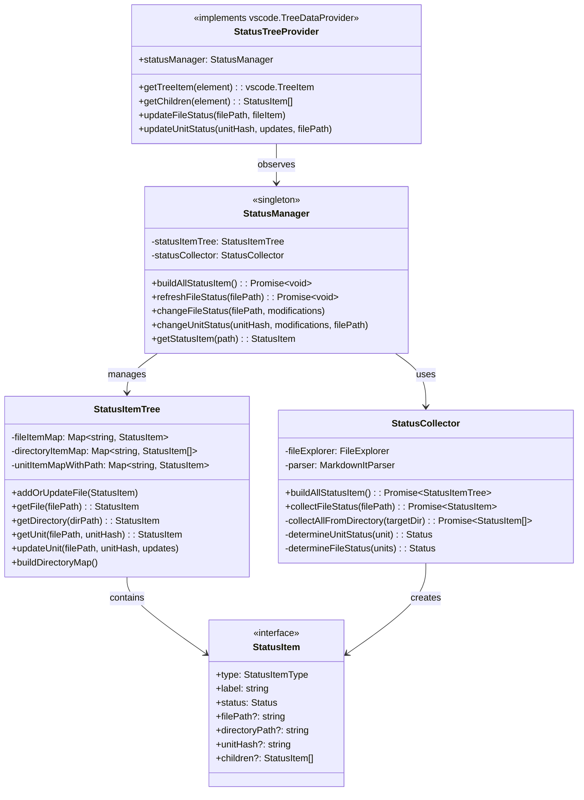

# Status Module 設計ドキュメント

## 概要

Status Moduleは、mdaitにおけるMarkdownファイルとそのユニット（翻訳単位）のステータス管理を担当するコアモジュールです。ファイル・ディレクトリ・ユニットの3層階層構造で翻訳進捗を管理し、効率的なステータス更新とUI表示を提供します。

## アーキテクチャ



## 主要クラス

### 1. StatusItem

翻訳管理の基本単位を表す。ディレクトリ・ファイル・ユニットを統一的に扱います。

**主要プロパティ:**
- `type: StatusItemType` - アイテムの種類（Directory, File, Unit）
- `status: Status` - 翻訳ステータス（Translated, NeedsTranslation, Error, Source, Unknown）
- `label: string` - 表示ラベル
- `filePath?: string` - ファイルパス（File/Unit用）
- `directoryPath?: string` - ディレクトリパス（Directory用）
- `unitHash?: string` - ユニットハッシュ（Unit用）
- `children?: StatusItem[]` - 子要素（階層構造）

**ステータス種別:**
- `Translated` - 翻訳完了
- `NeedsTranslation` - 翻訳が必要
- `Error` - エラー状態
- `Source` - ソース
- `Unknown` - 不明な状態

### 2. StatusItemTree (ファーストクラスコレクション)

StatusItemの効率的な階層管理を提供するコレクションクラス。3つのMapを使用して高速検索を実現。

**内部データ構造:**
- `fileItemMap: Map<string, StatusItem>` - ファイルパスをキーとするファイル管理
- `directoryItemMap: Map<string, StatusItem[]>` - ディレクトリパスをキーとするファイル一覧管理
- `unitItemMapWithPath: Map<string, StatusItem>` - "ファイルパス#ユニットハッシュ"をキーとするユニット管理

**主要API:**

#### ファイル操作
```typescript
addOrUpdateFile(fileItem: StatusItem): void
getFile(filePath: string): StatusItem | undefined
getAllFiles(): StatusItem[]
```

#### ディレクトリ操作
```typescript
getDirectory(dirPath: string): StatusItem | undefined
getFilesInDirectory(dirPath: string): StatusItem[]
getDirectoryChildren(directoryPath: string): StatusItem[]
buildDirectoryMap(): void
```

#### ユニット操作
```typescript
getUnit(filePath: string, unitHash: string): StatusItem | undefined
updateUnit(filePath: string, unitHash: string, updates: Partial<StatusItem>): StatusItem
findUnitByHash(unitHash: string, filePath: string): StatusItem | undefined
findUnitByFromHash(fromHash: string, filePath: string): StatusItem | undefined
getUntranslatedUnitsInFile(filePath: string): StatusItem[]
```

#### 検索・集計操作
```typescript
aggregateProgress(): {totalUnits: number, translatedUnits: number, errorUnits: number}
aggregateDirectoryProgress(dirPath: string): {totalUnits: number, translatedUnits: number, errorUnits: number}
```

**設計思想:**
- **効率性**: 3つのMapによる高速検索（O(1)）
- **一貫性**: ファイル追加時の自動ディレクトリマップ更新
- **階層管理**: ディレクトリ→ファイル→ユニットの3層構造

### 3. StatusManager (Singleton)

システム全体のステータス管理を担当するシングルトンクラス。StatusItemTreeとStatusCollectorを統合し、UI層との連携を提供。

**主要責務:**
- StatusItemTreeの生成・管理
- ファイル・ユニット単位での部分更新
- UI層（StatusTreeProvider）との連携
- エラーハンドリング

**主要API:**

#### 初期化・全体構築
```typescript
buildAllStatusItem(): Promise<void>  // 重い処理：全ファイルスキャン
```

#### 部分更新（推奨）
```typescript
refreshFileStatus(filePath: string): Promise<void>
changeFileStatus(filePath: string, modifications: Partial<StatusItem>): Promise<void>
changeUnitStatus(unitHash: string, modifications: Partial<StatusItem>, filePath: string): void
```

#### 検索・取得
```typescript
getStatusItem(path: string): StatusItem | undefined
```

#### ツリーアクセス
```typescript
getStatusItemTree(): StatusItemTree  // StatusItemTreeを直接取得し、そのメソッドを使用
```

**設計パターン:**
- **Singleton**: 全システムで単一インスタンス
- **Facade**: StatusItemTreeとStatusCollectorの統合インターフェース

### 4. StatusCollector

ファイルシステムからの実際のステータス情報収集を担当するクラス。

**主要責務:**
- Markdownファイルの解析
- ユニット単位での翻訳ステータス判定
- ディレクトリスキャンによる一括収集

**主要API:**

#### 一括収集（初期化用）
```typescript
buildAllStatusItem(): Promise<StatusItemTree>
```

#### 単一ファイル収集
```typescript
collectFileStatus(filePath: string): Promise<StatusItem>
```

**内部処理:**
1. `collectAllFromDirectory()` - ディレクトリ内の.mdファイルを再帰的に検索
2. `collectFileStatus()` - 個別ファイルのMarkdown解析とStatusItem生成
3. `determineUnitStatus()` - ユニット単位でのステータス判定
4. `determineFileStatus()` - ファイル全体のステータス判定

**ステータス判定ロジック:**

##### ユニットレベル
- `fromHash`なし → `Source`
- `need="translate"` → `NeedsTranslation`
- その他`need`フラグあり → `NeedsTranslation`
- 上記以外 → `Translated`

##### ファイルレベル
1. `NeedsTranslation`ユニットが1つでもある → `NeedsTranslation`
2. 全ユニットが`Source` → `Source`
3. 全ユニットが`Translated`または`Source` → `Translated`
4. その他 → `NeedsTranslation`

### 5. StatusTreeProvider (UI層)

VS CodeのTreeViewとの連携を担当するプロバイダークラス。

**主要責務:**
- VS Code TreeDataProviderの実装
- StatusManagerからのイベント受信
- ツリー表示の効率的な更新

**インターフェース実装:**
```typescript
interface IStatusTreeProvider {
    statusTreeChanged(): void
    updateFileStatus(filePath: string, fileStatusItem: StatusItem): void
    updateUnitStatus(unitHash: string, updates: Partial<StatusItem>, filePath: string): void
}
```

## データフロー

### 初期化フロー
```
1. StatusTreeProvider起動
2. StatusManager.buildAllStatusItem()
3. StatusCollector.buildAllStatusItem()
4. 各ディレクトリの.mdファイルをスキャン
5. StatusItemTree構築
6. UI更新通知
```

### ファイル更新フロー
```
1. ファイル変更検知
2. StatusManager.refreshFileStatus()
3. StatusCollector.collectFileStatus()
4. StatusItemTree.addOrUpdateFile()
5. UI部分更新
```

### ユニット更新フロー
```
1. 翻訳完了通知
2. StatusManager.changeUnitStatus()
3. StatusItemTree.updateUnit()
4. 親ファイル・ディレクトリステータス再計算
5. UI部分更新
```

## パフォーマンス考慮

### 高速化施策
1. **Map使用**: O(1)での検索・更新
2. **部分更新**: ファイル・ユニット単位での効率的更新
3. **遅延評価**: ディレクトリステータスの動的生成
4. **イベント駆動**: 必要な部分のみUI更新

### 重い処理の管理
- `buildAllStatusItem()`: 初回のみ実行、通常は部分更新を使用
- ディレクトリスキャン: 対象ディレクトリを限定
- UI更新: 変更があった要素のみ通知

## 拡張性

### 新しいステータス追加
`Status`enumと判定ロジック（`determineUnitStatus`, `determineFileStatus`）を拡張

### 新しい検索条件
`StatusItemTree`に新しい検索メソッドを追加

### 外部システム連携
`StatusManager`のインターフェースを通じて他のモジュールから利用可能
