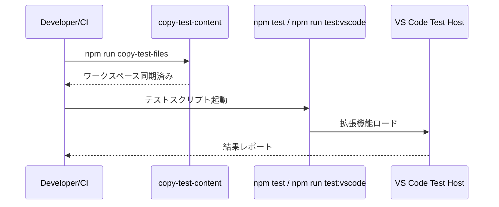

# テスト層設計

## 役割

- コアロジックの信頼性とVS Code統合の動作確認を両立させ、継続的なリリースを支える。
- サンプルコンテンツを使ったリグレッションチェックで翻訳差分を再現性高く検証する。

## テストカテゴリ

- **単体テスト (`src/test/`)**: `suite`/`test`のTDDスタイル。Coreの正規化やSectionMatcherなど副作用のない処理を対象。CIで常時実行。
- **GUI/統合テスト (`src/test-gui/`)**: VS Code Test Runnerを使用し、コマンドやステータスツリーのE2Eを検証。手動実行（`npm run test:vscode`）。
- **サンプルワークスペース**: `copy-test-files`スクリプトで`sample-content`から`workspace/content`へ同期し、テスト前の初期状態を保証。

## 実行シーケンス

## 観点とプラクティス

- テスト名は日本語で期待値を明示する。
- VS Code依存のテストは`this.timeout()`を調整し、環境差によるタイムアウトを防ぐ。
- 大規模入力の回帰は`sample-content`を更新してカバレッジを確保する。

## 参照

- スクリプト: `package.json`
- コマンド挙動: [commands.md](commands.md)
- UI検証: [ui.md](ui.md)