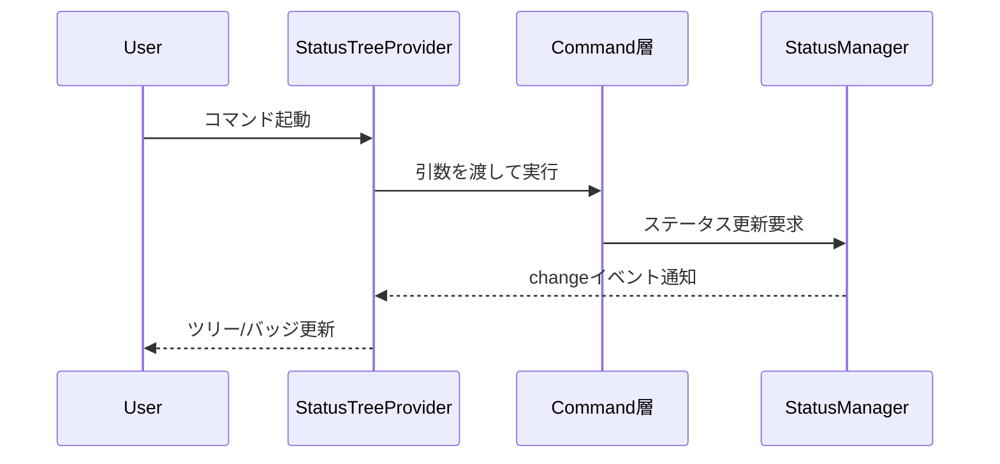

# UI層設計

## 役割

- VS Code上でmdaitの状態とアクションを可視化し、ユーザーにシームレスな操作体験を提供する。
- コマンドの呼び出しと進捗表示を担い、Core/Commands層からの通知を受け取りリアルタイムに反映する。

## 主要コンポーネント

- **StatusTreeProvider**: `StatusItemTree`をVS Code TreeViewに変換し、needフラグをアイコンとバッジで表現する。部分更新イベントに対応して最小限のDOM更新を行う。
- **Command Entry Points**: コマンドパレット、ツリービューのコンテキストメニュー、コード上のCodeLensからコマンド層を呼び出す。対象ファイルや言語を引数として構築する。
- **Progress Reporter**: sync/trans/term実行中の進行状況を表示し、`CancellationToken`でユーザーからの中断を処理する。

## 更新シーケンス

- ドキュメント保存時は`workspace.onDidSaveTextDocument`で対象ファイルを検知し、`StatusManager.refreshFileStatus`を呼び出して手動編集とツリー表示を同期させる。

## 視覚表現の原則

- needフラグ別に色とアイコンを固定し、どの画面でも同じ記号で意味が伝わるようにする。
- 進捗表示はファイル単位で「翻訳済み/要翻訳/エラー」の数値を表示し、折りたたみ表示でも情報が埋もれないよう簡潔にする。
- l10nシステム(`/l10n`配下)で文言を管理し、日本語/英語を等価に提供する。

## 関連

- 進捗判定: [core.md](core.md)
- コマンド挙動: [commands.md](commands.md)
- テスト観点: [test.md](test.md)（GUIテスト方針を含む）