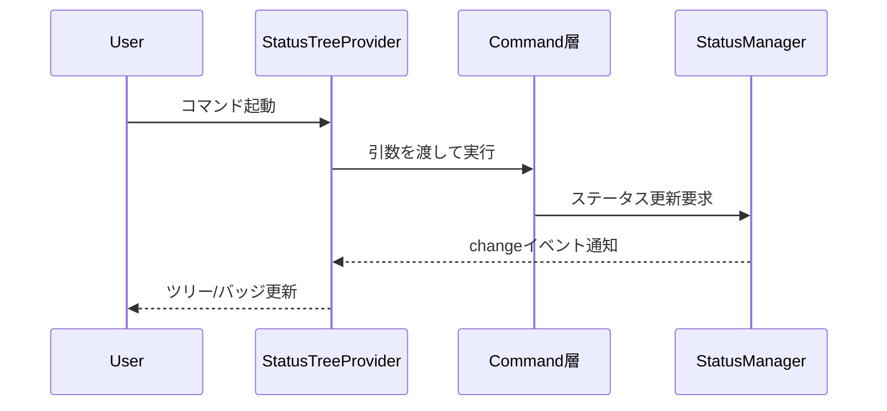
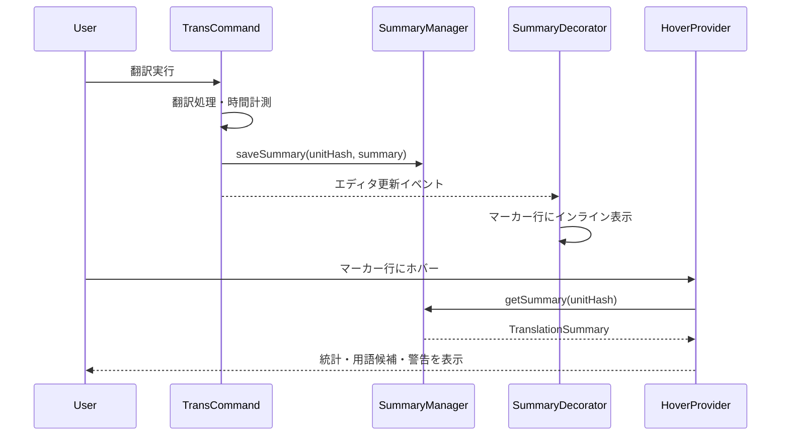

# UI層設計

## 役割

- VS Code上でmdaitの状態とアクションを可視化し、ユーザーにシームレスな操作体験を提供する。
- コマンドの呼び出しと進捗表示を担い、Core/Commands層からの通知を受け取りリアルタイムに反映する。

## 主要コンポーネント

- **StatusTreeProvider**: `StatusItemTree`をVS Code TreeViewに変換し、needフラグをアイコンとバッジで表現する。frontmatterを含む場合は先頭に表示し、ファイル翻訳の前にfrontmatter翻訳を実行可能にする。部分更新イベントに対応して最小限のDOM更新を行う。`Configuration.isConfigured()`がfalseの場合は空配列を返し、リソース消費を抑制する。
- **Welcome View**: `mdait.yaml`未設定時に表示される初期設定ガイド。`viewsWelcome`でギアアイコンCTAを表示し、`mdait.setup.createConfig`コマンドにリンク。`mdaitConfigured`コンテキスト変数で表示を制御。
- **Command Entry Points**: コマンドパレット、ツリービューのコンテキストメニュー、コード上のCodeLensからコマンド層を呼び出す。frontmatterはStatusTreeとCodeLensの両方から翻訳・ジャンプ・needクリア操作が可能。対象ファイルや言語を引数として構築する。
- **Progress Reporter**: sync/trans/term実行中の進行状況を表示し、`CancellationToken`でユーザーからの中断を処理する。
- **TranslationSummaryHoverProvider**: mdaitマーカー行およびfrontmatterマーカー行にホバーしたときに翻訳サマリ(処理時間・トークン数・用語候補・警告)を表示する。`SummaryManager`からハッシュをキーにサマリ情報を取得し、Markdown形式でリッチ表示。
- **SummaryDecorator**: 翻訳サマリの概要をマーカー行末尾にGitLens風のインライン表示で提供する。frontmatterマーカーも対象に含む。CodeLensと同じ色・フォントスタイルで統一し、詳細はHoverで確認可能。
- **SummaryManager**: 翻訳実行時に生成されたサマリデータ(`TranslationSummary`)をメモリ上でMap管理するシングルトン。永続化は不要で、VS Code再起動時にクリアされる。翻訳完了時に`trans-command`から呼び出され、Hover/Decorator表示時に参照される。
- **MdaitCodeLensProvider**: mdaitマーカー行およびfrontmatterマーカー行にCodeLensを表示し、翻訳・ジャンプ・need状態管理の直感的な操作を提供する。ターゲットファイルには「Source」ジャンプ、ソースファイルには「Target」ジャンプを表示し、双方向のナビゲーションを実現する。

## CodeLens機能

mdaitマーカー上に表示されるインラインアクションボタン。VS CodeのCodeLens機能を利用してテスト実行ボタンのような直感的なUIを提供する。

### 表示されるCodeLens

#### ターゲットファイル（訳文）のマーカー
- **$(symbol-reference) Source**: 原文ユニットへジャンプ（`from`属性がある場合）
- **✨[AI]翻訳**: AI翻訳を実行（`need:translate`がある場合）
- **$(check) 完了マーク**: needフラグを手動でクリア（`need`属性がある場合、種類に応じたラベル）

#### ソースファイル（原文）のマーカー
- **$(symbol-reference) Target**: 訳文ユニットへジャンプ（`from`属性がなく、対応する訳文が存在する場合）
- 複数の訳文言語がある場合、`transPairs`設定順で最初のターゲットへジャンプ

#### frontmatterマーカー
- **$(symbol-reference) Source**: 原文frontmatterへジャンプ（ターゲットファイルの場合）
- **✨[AI]翻訳**: frontmatter翻訳を実行（`need:translate`がある場合）
- **$(check) 完了マーク**: frontmatter needフラグをクリア

### ジャンプ時の動作
- 右側（Beside）に分割表示でジャンプ先を開く
- 左右のユニットをハイライト表示（find match風の背景色）
- 左側のスクロールに右側が追従する一方向スクロール同期
- カーソルがハイライト範囲外に移動、または右側を手動スクロールすると同期解除

### 実装の詳細
- **Provider**: `MdaitCodeLensProvider`がドキュメント内のマーカーを検出し、適切なCodeLensを生成
- **Command**: `codeLensJumpToSourceCommand`, `codeLensJumpToTargetCommand`, `codeLensTranslateCommand`, `codeLensClearNeedCommand`等がアクションを実行
- **パフォーマンス**: ソースファイル判定は`FileExplorer.isSourceFile()`でO(transPairs数)、ターゲット検索は`StatusItemTree.getTargetUnitByFromHash()`で優先検索→全体検索のフォールバック

## 更新シーケンス

### ステータス更新フロー

- ドキュメント保存時は`workspace.onDidSaveTextDocument`で対象ファイルを検知する。`sync.autoSyncOnSave`が`true`（デフォルト）で、mdaitマーカー（ユニットまたはフロントマター）が存在する場合のみ、`syncSingleFile`を呼び出して自動同期を実行する。まだ一度もsyncしていないファイル（マーカーが存在しないファイル）は自動同期の対象外とする。

### 翻訳サマリ表示フロー

- 翻訳完了後、`SummaryManager`にサマリを保存し、`SummaryDecorator`がマーカー行末尾に簡潔な統計を表示。詳細情報は`HoverProvider`でオンデマンド提供。

## 視覚表現の原則

- needフラグ別に色とアイコンを固定し、どの画面でも同じ記号で意味が伝わるようにする。
- 進捗表示はファイル単位で「翻訳済み/要翻訳/エラー」の数値を表示し、折りたたみ表示でも情報が埋もれないよう簡潔にする。
- l10nシステム(`/l10n`配下)で文言を管理し、日本語/英語を等価に提供する。

## コンテキスト変数

- **mdaitConfigured**: `Configuration.isConfigured()`の結果に基づき、設定完了状態を示す。`true`の場合はツールバーボタン（sync/filter/glossary）を表示し、`false`の場合はWelcome Viewを表示。
- activation時と設定変更(`Configuration.onConfigurationChanged`)時に更新され、UI全体の表示状態を制御。
