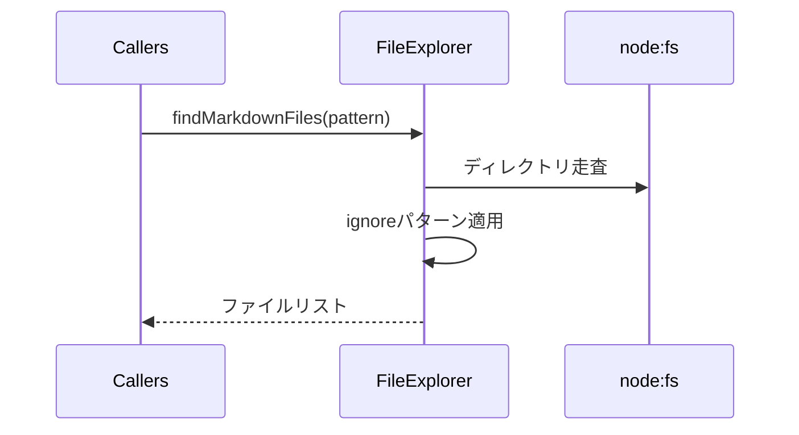

# ユーティリティ層設計

## 役割

- CoreやCommands層のロジックをシンプルに保つため、ファイル探索などの汎用処理を切り出す。
- Node.js標準モジュールとVS Code APIの差異を吸収し、共通インターフェースで提供する。

## FileExplorerの流れ

## 設計方針

- ドメイン知識を含めず、入力と出力を純粋関数に近い形で返す。
- PromiseベースでI/Oを扱い、テストではスタブ化しやすい構造にする。
- 大規模リポジトリでも負荷を抑えられるよう、フィルター対象の正規表現や深さ制限を引数で受け取れるようにする。

## 関連

- ファイル探索利用例: [commands.md](commands.md)
- 設定での除外パターン: [config.md](config.md)