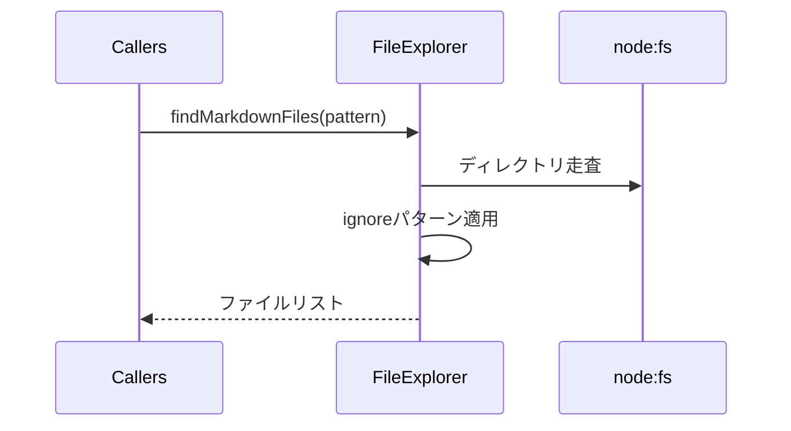

# ユーティリティ層設計

## 役割

- CoreやCommands層のロジックをシンプルに保つため、ファイル探索などの汎用処理を切り出す。
- Node.js標準モジュールとVS Code APIの差異を吸収し、共通インターフェースで提供する。

## FileExplorerの流れ


```mermaid
sequenceDiagram
	participant Caller as Callers
	participant FE as FileExplorer
	participant FS as node:fs

	Caller->>FE: findMarkdownFiles(pattern)
	FE->>FS: ディレクトリ走査
	FE->>FE: ignoreパターン適用
	FE-->>Caller: ファイルリスト
```

## Loggerの使用方針

### ログレベルの使い分け

- **DEBUG**: 開発・デバッグ時の詳細情報。正常系でも大量に出力される可能性がある情報（変化のないファイルの同期完了、コンテキスト構築詳細など）
- **INFO**: 正常系の重要なイベント。ユーザーに通知する必要はないが、動作確認や追跡に有用な情報（変化があったファイルの同期完了、ユニット翻訳開始・完了など）
- **WARN**: 異常系だがリカバリー可能な状況。リトライ発生、パッチ適用失敗からのフォールバックなど
- **ERROR**: リカバリー不可能なエラー。リトライ上限到達、処理失敗など

### ログフォーマット規約

```
[YYYY-MM-DD HH:mm:ss][LEVEL][scope] message | context(JSON)
```

- `scope`: コンポーネント名（`sync`, `trans`, `config` など）
- `message`: 人間が読みやすい簡潔なメッセージ
- `context`: 追加情報をJSON形式で記録（ファイル名、unitHash、エラー詳細など）

### 構造化ログのベストプラクティス

- **ファイル操作**: `file` または `filePath` でファイル名/パスを記録
- **ユニット処理**: `unitHash`, `title` でユニットを識別
- **差分情報**: `added`, `modified`, `deleted`, `unchanged` で変化を記録
- **リトライ情報**: `attempt`, `maxRetries`, `reason`, `retryable`, `unitHash` で再現性を確保
- **エラー情報**: `formatError(error)` を使用して `name`, `message`, `stack` を記録

### リトライログの構造化

リトライが発生した場合、以下の情報を記録する:
- `attempt`: 現在の試行回数（1-indexed）
- `maxRetries`: 最大リトライ回数
- `reason`: リトライ原因（エラーメッセージ）
- `retryable`: リトライ可能かどうか
- `unitHash`, `title`: 翻訳対象ユニットの識別情報

## 設計方針

- ドメイン知識を含めず、入力と出力を純粋関数に近い形で返す。
- PromiseベースでI/Oを扱い、テストではスタブ化しやすい構造にする。
- 大規模リポジトリでも負荷を抑えられるよう、フィルター対象の正規表現や深さ制限を引数で受け取れるようにする。

## 関連

- ファイル探索利用例: [commands.md](commands.md)
- 設定での除外パターン: [config.md](config.md)