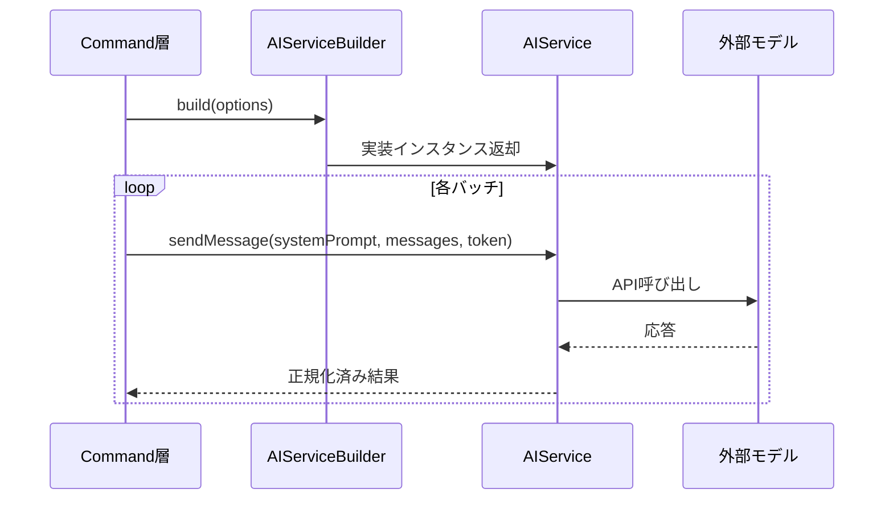

# API層設計

> **上位設計**: [architecture.md](architecture.md) P5「API層：外部世界との橋渡し」、[design.md](design.md)「階層構造」参照

## このドキュメントの責務

API層は、外部AIサービスとの通信を抽象化し、Commands層からは統一された`AIService`インターフェースとして見えるようにします。

**設計意図**: LLMプロバイダーの多様性を吸収します。OpenAI、Ollama、VS Code LM APIなど、異なるプロバイダーに対して統一されたインターフェースを提供し、Commands層はプロバイダーの違いを意識しません（[architecture.md](architecture.md) 「API層」参照）。

---

## AIService インターフェース

すべてのAIプロバイダーは以下のインターフェースを実装します：

```typescript
interface AIService {
  sendMessage(
    systemPrompt: string,
    messages: Message[],
    cancellationToken?: CancellationToken
  ): Promise<string>;
}
```

**特徴**:
- シンプルなメッセージベースAPI
- キャンセル対応（`CancellationToken`）
- 戻り値は常に`Promise<string>`（プロバイダーの違いを吸収）

---

## AIServiceBuilder

設定に基づいて適切なAIServiceの実装を構築します。

**構築フロー**:
1. `mdait.json`の`ai.provider`を確認
2. プロバイダーに応じた実装を選択
3. 設定値（エンドポイント、モデル名等）を注入
4. インスタンスを返却

**開発用モック**: `provider: "default"`で固定応答またはエコーバックを返すモック実装を生成できます。

---

## プロバイダー実装

### OpenAIProvider

**使用ライブラリ**: `openai`パッケージ  
**API**: OpenAI Responses API

#### 設定例
```json
{
  "ai": {
    "provider": "openai",
    "model": "gpt-4o-mini",
    "openai": {
      "apiKey": "${env:OPENAI_API_KEY}",
      "baseURL": "https://api.openai.com/v1",
      "maxTokens": 16384,
      "timeoutSec": 120
    }
  }
}
```

#### 主要パラメータ
- `maxTokens`: 最大出力トークン数（デフォルト: 2048）
- `timeoutSec`: リクエストタイムアウト秒数（デフォルト: 120）
- `temperature`: 0.7固定（コード内設定）
- **`store`: false固定（プライバシー重視、コード内ハードコーディング）**

#### セキュリティ
- APIキーは`${env:VARIABLE_NAME}`形式で環境変数から読み込み
- 設定ファイルには平文で記載しない
- **`store: false`でプロンプト・応答をOpenAIサーバーに保存しない**（[architecture.md](architecture.md) 哲学5参照）

**設計意図**: Responses APIを採用することで、将来のツール連携や機能拡張に対応しています。

---

### OllamaProvider

**使用ライブラリ**: `ollama-js`パッケージ  
**接続先**: ローカル実行のOllamaサーバー

#### 設定例
```json
{
  "ai": {
    "provider": "ollama",
    "ollama": {
      "endpoint": "http://localhost:11434",
      "model": "llama2"
    }
  }
}
```

**用途**: ネットワーク外部にデータを送信したくない場合や、オフライン環境での翻訳に適しています。

---

### VSCodeLanguageModelProvider

**使用API**: VS Code組み込みの言語モデル機能（`vscode.lm` API）

VS Code標準のLMと統合されます。GitHub Copilotのモデルを利用する場合もこのプロバイダーを選択します。

**特徴**:
- 内部でストリーミング応答をバッファリングし、完全な応答を返す
- VS Code環境に統合されたLMを利用するため、追加の認証設定が不要

---

### DefaultAIProvider

**用途**: 開発・テスト用のモック実装

固定応答またはエコーバックを返します。AIサービスのモック化により、実際のAPI呼び出しなしでコマンド層のテストが可能になります。

---

## 呼び出しシーケンス



**設計のポイント**:
- Builder パターンで構築ロジックを分離
- すべてのプロバイダーは同じインターフェースを実装
- Commands層はプロバイダーの種類を意識しない

---

## StatsLogger（将来の最適化用）

呼び出し回数やトークン使用量を収集し、今後の最適化に備えます。

**設計意図**: 非同期で処理し、ロギングが本処理をブロックしないようにします。

---

## 考慮事項

### レート制限とリトライ
- すべての実装はレート制限に対応
- 必要に応じてリトライ戦略を注入できる構造

### 入出力の正規化
- APIドライバごとの差異（バッチサイズ等）をBuilder側で吸収
- Commands層は常に同じインターフェースで扱える

### キャンセル対応
- すべてのプロバイダーは`CancellationToken`をサポート
- ユーザーからのキャンセル要求に即座に応答
