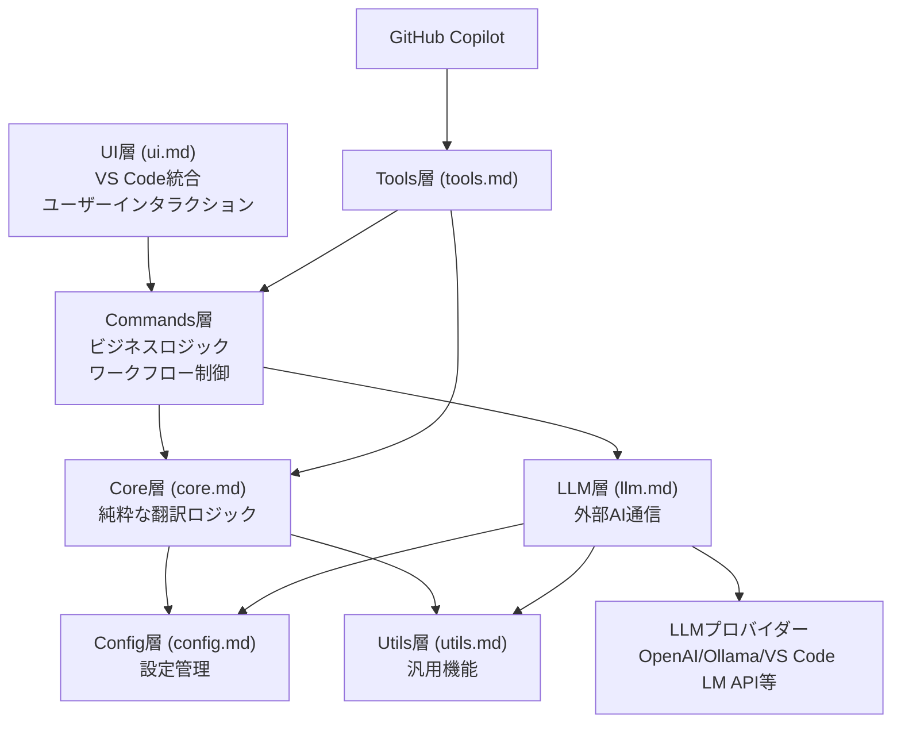
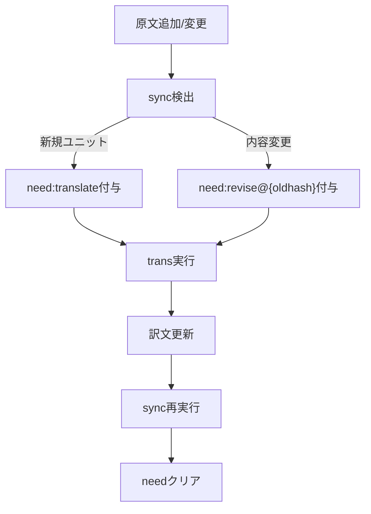

# mdait アーキテクチャ設計書

> mdait のアーキテクチャ全体像・設計哲学・コードマップを集約した基準ドキュメントである。新機能設計・トレードオフ判断時は必ずここを参照すること。

## mdaitの存在理由

翻訳は一度きりの行為ではない。現実の翻訳運用は、原文の継続的な更新・用語統一・複数言語間の同期という、動的で複雑なフローである。

従来ツールが解決していない課題：
- 変更箇所の把握・再翻訳範囲の特定が人間の目視に依存する
- 用語集を用意しても実際の翻訳への反映が保証されない
- 翻訳後の手修正が原文変更で無駄になる
- GitのdiffはMarkdown段落変更を構造的に追跡できない

mdaitは「**継続的な多言語文書管理**」を実現するために存在する。文書が生きている限り続く翻訳運用を、構造的に支えるツールである。

---

## ナビゲーション

### アーキテクチャ



| 層 | 説明 | ドキュメント |
|---|---|---|
| Core層 | `MarkdownItParser` でユニット分割、`Normalizer`/`HashCalculator` でハッシュ計算・正規化、`SectionMatcher` でソース/ターゲット対応検出、`StatusManager`/`StatusCollector` でステータス集約。mdaitUnit・ハッシュ・ステータス管理・UnitRegistry・Diff・FrontMatter翻訳を担当。VS Code APIに非依存な純粋TypeScript実装でテスト・移植が容易。 | [core.md](design/core.md) |
| Commands層 | Core層の純粋関数を組み合わせてユーザーワークフローを実現（sync・trans・term・setup・tm・translate-selection）。進捗表示・エラーハンドリング・キャンセル対応も責務。 | コマンド層参照 |
| LLM層 | `AIService` インターフェースでプロバイダーを抽象化。`AIServiceBuilder` が動的選択し、OpenAI/Ollama/VS Code LM APIの差異を吸収。AIServiceインターフェース・各プロバイダー実装を提供。 | [llm.md](design/llm.md) |
| UI層 | StatusTreeProvider・CodeLensProvider・HoverProvider・Welcome View でmdait内部状態をVS Code標準UIパターンで可視化。自動同期機能も統合。 | [ui.md](design/ui.md) |
| Tools層 | `mdait_getStatus` / `mdait_sync` / `mdait_translate` をLanguageModelTool APIとして提供。Commands層・Core層の薄いラッパーとしてGitHub Copilot Chat連携を実現。 | [tools.md](design/tools.md) |
| 設定管理 | mdait.json構造・Frontmatterオーバーライドで設定を一元管理。設定ファイルの読み込み・バリデーション・適用を統一して処理。 | [config.md](design/config.md) |

### コマンド層

| コマンド | 処理概要 | 詳細 |
|---------|---------|------|
| **sync** | ユニット対応確立・ハッシュ比較・needフラグ付与 | [command_sync.md](design/command_sync.md) |
| **trans** | needユニット翻訳・diff-aware revise（原文差分と前回訳文をLLMに提示し変更箇所のみ更新）・品質チェック | [command_trans.md](design/command_trans.md) |
| **term** | 用語検出（detect）・訳語展開（expand） | [command_term.md](design/command_term.md) |
| **tm** | 翻訳ユニットを primaryLang 基準の sentence TU として guarded upsert し、将来の参照用 TM を構築 | [command_tm.md](design/command_tm.md) |
| **setup** | mdait.template.jsonをワークスペースにコピー | [command_setup.md](design/command_setup.md) |
| **translate-selection** | マーカーレスのオンデマンド翻訳 | [command_trans-selection.md](design/command_trans-selection.md) |

### 横断的関心事

| 観点 | 内容 | ドキュメント |
|---|---|---|
| プロンプト | プロンプトID一覧・変数・カスタマイズ | [prompt.md](design/prompt.md) |
| ユーティリティ | FileExplorer・Logger使用方針 | [utils.md](design/utils.md) |
| テスト | テスト戦略・実行方法 | [test.md](design/test.md) |

### リポジトリ構成

```
src/
  extension.ts           # VS Code拡張機能のエントリーポイント
  commands/              # sync/trans/term/setup/trans-selection/tm
  core/                  # markdown/hash/status/unit-registry/diff/tm
  api/                   # 外部AIサービス通信
  tools/                 # LanguageModelTool API統合
  ui/                    # VS Code UI統合
  config/                # 設定ロード・バリデーション
  utils/                 # ファイル探索、ログ出力
  prompts/               # AIプロンプト定義
  test/                  # テスト
docs/                    # 設計ドキュメント
schemas/                 # JSON Schema定義
l10n/                    # 国際化リソース
```

---

## システム概要

mdait は Markdown の構造を活かし文書を「ユニット」（見出しで区切られた管理単位）に分割して、ハッシュベースの差分検出により変更箇所のみを再翻訳する VS Code 拡張機能である。

### スコープ

**解決する問題空間:**
- 翻訳運用の可視化（needフラグによるステータス把握）
- 用語の一貫性（用語集の翻訳への確実な反映）
- 文脈保持翻訳（前回訳文・周辺コンテキストを参照してLLM品質を最大化）

**対象外とする領域:**
- リアルタイムコラボレーション
- WYSIWYG編集
- Markdown以外のフォーマット（HTML/DOCX/PDF等）

### 設計原則

#### P1: ユニットベースの管理
Markdown文書を見出しレベルで「ユニット」に分割し、独立した管理単位とする。部分的な変更を部分的に再翻訳でき、翻訳進捗を細粒度で追跡できる。

#### P2: ステートレスな再計算と管理情報の自己完結
すべての状態（ハッシュ・need・from）は現在のファイル内容から再計算可能である。文書外への管理情報の分離はコピー・移動時に整合性を崩すため、HTMLコメントとして文書内に埋め込む（レンダリング時不可視）。どんな状態からでも `sync` で復帰でき、冪等性を保証する。

#### P3: ハッシュ差分駆動のワークフロー
変更されたユニットのみに `need:translate` が自動付与される。git履歴依存を避けCRC32ハッシュで決定的に変更を検出するため、どんなVCS環境・コミット粒度でも安定動作する。

#### P4: LLMをdiff-aware reviseの主戦力とする
原文変更時、LLMに差分と前回訳文を提示して変更箇所のみを更新させる。翻訳ドメインでは原文変更と訳文手修正の並走が通常のワークフローであり、これをconflictとして扱わず全て `revise` として吸収することで手修正を最大限保持する。

#### P5: 層の責務分離
Core層はVS Code APIに非依存で各層が明確な責務を持ち、下位層は上位層に依存しない。独立したテスト・交換が可能。

### P6: VS Code標準パターンへの準拠
TreeView・CodeLens（エディタ上のインラインアクション）・Hover・Progress等のVS Code標準UI要素を活用し、独自UIを最小限に抑える。他の拡張と一貫したUXを提供し、ユーザーの学習コストを低く保つ。

#### P7: TM は「使われることで価値が分かる」知識集合として設計する
TM の価値は「登録されているかどうか」ではなく「実際の翻訳入力に対してどれだけ有力な候補として再浮上するか」で測る。retrieval は trigram 転置インデックス（粗い絞り込み）+ Jaccard 類似度 + MMR（多様性確保）の 2 段階パイプラインとし、trans 時の参考訳提供と将来の TM メンテ評価の両方を同一エンジンで担う。exact match は補助にすぎず、中心思想にしない。

#### P8: normalize処理はモジュール内部に閉じ込める
テキスト正規化（`normalizeForTm` など）はそれを必要とするモジュール（`TmxStore`・`tm-ranker`）の内部実装として閉じ込める。呼び出し側は生テキストを渡すだけにし、どの正規化手順を適用するかを知る必要をなくす。これにより正規化ロジックの変更がモジュール境界を越えて影響しなくなり、呼び出し側での二重適用を構造的に防ぐ。

---

## mdaitUnitの構造

### マーカー形式

```markdown
<!-- mdait {hash} [from:{hash}] [need:{flag}] -->
```

- **hash**: ユニット内容のCRC32（8文字。内容の同一性を判定するチェックサム。空白等の表記揺れは事前に正規化して計算）
- **from**: 翻訳元ユニットのハッシュ（ターゲットファイルのマーカーにのみ付与。syncがソース/ターゲットの対応確認に使用）
- **need**: 必要なアクション

| `need` 値 | 付与条件 | `trans` の動作 |
|---|---|---|
| `translate` | 新規ユニット検出時 | LLMで初回翻訳を実行 |
| `revise@{oldhash}` | ハッシュ変更検出時 | 前回訳文と差分を提示してパッチ生成 |
| `review` | 手動編集の可能性がある場合 | 人間レビューを促す（自動処理なし） |
| `verify-deletion` | ソース削除時 | 対応ユニットの削除要否を人間が確認 |

### 配置ルール

- マーカー直後（空行なし）に見出しがある場合、その見出しがユニットのタイトル
- ユニット境界は「指定レベル以下の見出し」または「mdaitマーカー」で決定
- `<!-- mdait -->` 省略マーカーはsync時に自動計算される

### マーカー例（sync後のターゲットファイル抜粋）
```markdown
<!-- mdait a1b2c3d4 from:a1b2c3d4 need:translate -->
## はじめに
翻訳したいコンテンツ...
```

---

## データフローの全体像



**初回利用順序**: `setup` → 管理したい見出し（`##` 等）の直前に `<!-- mdait -->` を配置 → `sync` → `trans` → `sync` 再実行でneedクリア

1. 原文追加 → `sync` が新規ユニットを検出し `need:translate` を付与、`trans` が初回翻訳を実行
2. 原文変更 → `sync` がハッシュ変更を検出し `need:revise@{oldhash}` を付与、`trans` が差分でパッチを生成・適用
3. `sync` 再実行でハッシュ更新・needクリア（**すべてのコマンドは冪等**）

---

## 将来の拡張と制約

### 拡張可能にするもの

- **AIプロバイダー**: `AIService` 実装として追加
- **出力戦略**: 翻訳結果の出力先（クリップボード等）を `OutputStrategy` として拡張
- **用語集フォーマット**: CSV → JSON/YAML等への移行が可能
- **プロンプトカスタマイズ**: 全システムプロンプトを外部ファイルで上書き可能
- **横断的知識の蓄積**: TMのようなユニット横断データは `.mdait/` 配下で管理。テキストベースで純粋に保ち、短文・数値のみなど翻訳価値のない断片はフィルタリング

### 固定するもの

- **マーカーフォーマット**: `<!-- mdait hash from:xxx need:yyy -->` 形式（互換性のため固定）
- **ハッシュアルゴリズム**: CRC32（既存マーカーとの互換性のため不変）
- **Markdownパーサー**: markdown-it（プラグインで拡張）
- **ユニット境界**: 見出しレベルベースの分割原則

### 意図的な制約

- **並列実行**: 現在は順次実行（キャンセル即応性とAI APIレート制限を優先。将来的にセマフォ方式を検討）
- **マーカー最小主義**: マーカーに含める情報は最小限に抑える（可読性・将来拡張性のため）
- **ファイルパス管理の一元化**: `Configuration` クラスに集約し、コマンド層での直接パス構築を禁止

---

## 国際化・開発環境

VS Code標準l10nシステムで日本語・英語をサポートする。  
`/l10n/bundle.l10n.json`（英語）/ `/l10n/bundle.l10n.ja.json`（日本語）/ `package.nls.json` / `package.nls.ja.json`

### ビルド・実行

```bash
npm run compile      # TypeScriptコンパイル
npm run lint         # コード品質チェック
npm run test         # 単体テスト実行
npm run test:vscode  # VS Code統合テスト
npm run watch        # 開発時の自動ビルド
```

テスト環境: `src/test/sample-content/`（テスト用原稿）/ `src/test/workspace/`（作業ディレクトリ） — 詳細: [test.md](design/test.md)
