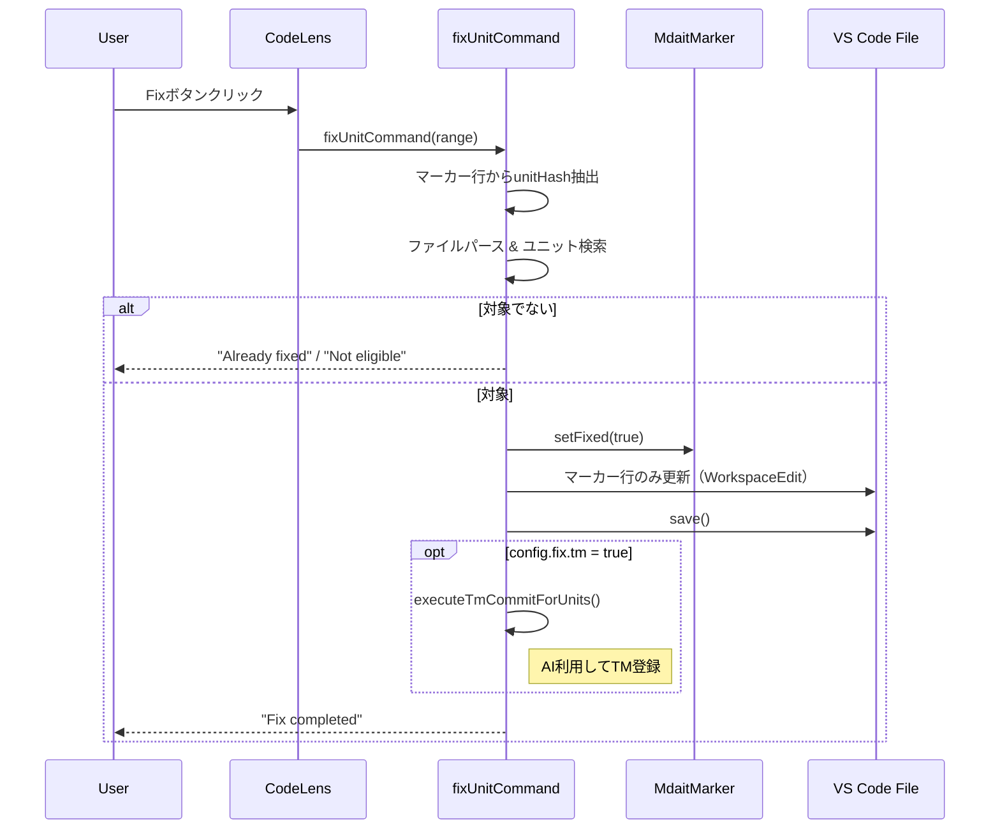
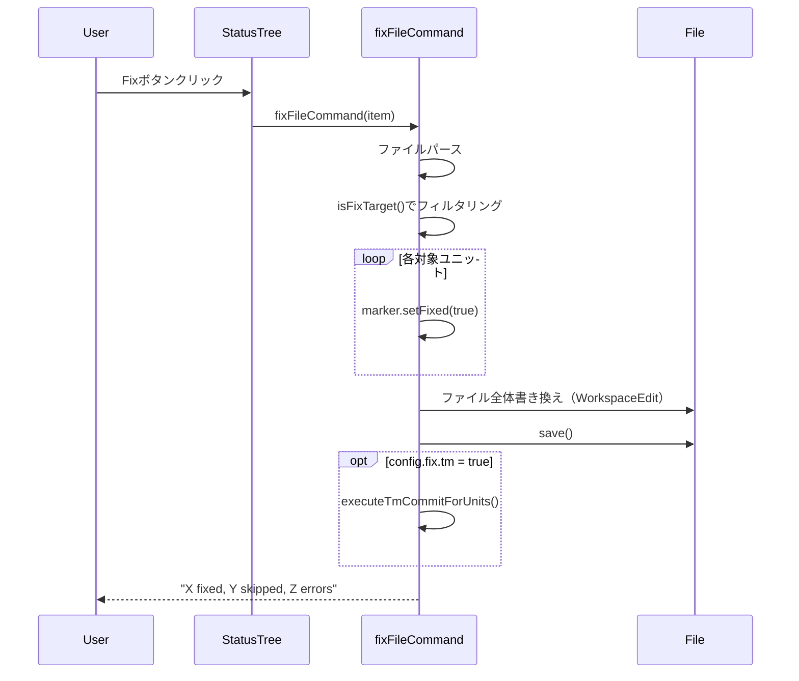

# fixコマンド設計

> **上位設計**: [commands.md](commands.md)、[architecture.md](architecture.md) P5「Commands層：ワークフローの指揮者」参照

## 概要

翻訳済みユニットを「確定（fix）」状態にマークするコマンド。マーカーに`fixed`フラグを付与し、オプションでTM登録も同時実行可能。

**主な用途:**
- 翻訳レビュー完了後の確定
- TM登録との組み合わせによる翻訳資産の蓄積
- 確定済みユニットのtm-commit対象からの除外

---

## 責務と目的

### 主責務
1. **マーカーへのfixedフラグ付与**: `<!-- mdait {hash} from:{hash} fixed -->` 形式に更新
2. **冪等性保証**: 既にfixedなユニットは変更なし（スキップ）
3. **オプション処理**: config.fix.tm=trueの場合、TM登録も同時実行

### tm-commitコマンドとの違い

| 項目 | fix | tm-commit |
|------|-----|-----------|
| **主目的** | ユニット確定 | TM登録 |
| **fixed付与** | ✅ 実行 | ❌ なし |
| **TM登録** | オプション（config.fix.tm） | 必須 |
| **fixed済み処理** | スキップ | スキップ |
| **実行タイミング** | レビュー完了後 | 翻訳完了後 |

**設計意図**: fixとtm-commitを分離することで、「確定」と「TM登録」という異なる責務を明確化。ユーザーは確定だけ行いたい場合とTM登録も同時に行いたい場合を設定で選択可能。

---

## コマンド体系

### 1. mdait.fix.unit
**実行元**: CodeLens（`$(check-all) Fix`ボタン）  
**対象**: 単一ユニット  
**実装**: `fixUnitCommand(range?: vscode.Range)`

### 2. mdait.fix.file
**実行元**: StatusTree（ファイルアイテムのinlineボタン）  
**対象**: ファイル内の全対象ユニット  
**実装**: `fixFileCommand(item?: StatusItem)`

### 3. mdait.fix.directory
**実行元**: StatusTree（ディレクトリアイテムのinlineボタン）  
**対象**: ディレクトリ内の全ファイルの全対象ユニット  
**実装**: `fixDirectoryCommand(item?: StatusItem)`

---

## 処理フロー

### fix対象の判定（isFixTarget）

```typescript
function isFixTarget(unit: MdaitUnit): boolean {
  if (!unit.marker?.from) return false;      // ターゲットファイルのユニット
  if (unit.marker.need) return false;        // 翻訳済み（needなし）
  if (unit.marker.isFixed()) return false;   // 未確定（fixedなし）
  return true;
}
```

### 単一ユニット確定（fixUnitCommand）



### ファイル一括確定（fixFileCommand）



---

## TM登録連携

### 設定（mdait.json）

```json
{
  "tm": {
    "enabled": true,
    "maxReferences": 5
  },
  "fix": {
    "tm": false  // デフォルトfalse: fix時にTM登録も行うか
  }
}
```

### TM登録実行条件

fix実行時に以下の条件がすべて真の場合、TM登録も自動実行：
1. `config.tm.enabled === true`
2. `config.fix.tm === true`
3. 対象ユニット数 > 0
4. **AI初回利用確認**: AIOnboarding.checkAndShowFirstUseDialog()が承認された場合

**AI利用確認のタイミング**: 各fixコマンド関数の冒頭（withProgress前）で実施。ユーザーがキャンセルした場合は処理全体を中断。

### 処理の流れ

fixコマンドは`tm-commit-command.ts`から`executeTmCommitForUnits`関数をインポートしてTM登録処理を実行：
1. `executeTmCommitForUnits()`を呼び出し
   - TmxStoreの初期化（`.mdait/translations.tmx`）
   - AIServiceBuilder + SentenceAligner構築
   - TmCommitProcessorによるユニット単位の文アライメント＋TM登録
   - store.save()による永続化

**実装上の改善（2025-02-10）**: tm-commit-command.tsの`executeTmCommitForUnits`および依存する`getSourceContent`関数を`export`に変更し、fix-command.tsから直接インポートすることで、コード重複を解消（DRY原則の遵守）。

---

## エラーハンドリング

### エラー種別と対応

| エラー種別 | 動作 | 通知レベル |
|-----------|------|-----------|
| ユニットが見つからない | 処理中断 | Error |
| 既にfixed済み | スキップ | Info |
| TM登録失敗 | fix成功、TM失敗を通知 | Warning |
| ファイル書き込み失敗 | 処理中断 | Error |
| キャンセル | 即座に中断 | Info（通知なし） |

### withProgressパターン

```typescript
await vscode.window.withProgress(
  {
    location: vscode.ProgressLocation.Notification,
    title: "Fix: {filename}",
    cancellable: true,
  },
  async (progress, token) => {
    progress.report({ message: "Initializing..." });
    
    // 処理中のキャンセルチェック
    if (token.isCancellationRequested) {
      return;
    }
    
    progress.report({ message: "X/Y units" });
    // ...処理
  }
);
```

---

## UI統合

### CodeLens統合

**表示条件（codelens-provider.ts）:**
```typescript
if (marker.from && !marker.need && !marker.isFixed()) {
  // $(check-all) Fix ボタン表示
}
```

**表示順序:**
1. `$(symbol-reference) Source` - ソースへジャンプ
2. `$(notebook) TM Commit` - TM登録
3. `$(check-all) Fix` - 確定（本コマンド）

### StatusTree統合

**ボタン配置（package.json）:**
- ファイルアイテム: inline@4
- ディレクトリアイテム: inline@4

**表示条件:**
```json
{
  "command": "mdait.fix.file",
  "when": "view == mdait.status && viewItem == mdaitFileTarget",
  "group": "inline@4"
}
```

---

## 冪等性保証

fixコマンドは何度実行しても安全で一貫した結果を返します（[architecture.md](architecture.md) 哲学4参照）。

**実現方法:**
1. `isFixTarget()`による事前判定: 既にfixedなユニットはスキップ
2. マーカー更新の決定性: ユニット内容が同じなら同じfixedフラグが設定される
3. TM登録の冪等性: sentenceHashによる重複防止（tmx-store.ts）

**検証:**
```typescript
// 1回目: 10ユニットをfix
fixFileCommand(item) // => "10 fixed, 0 skipped"

// 2回目: 同じファイルを再実行
fixFileCommand(item) // => "0 fixed, 10 skipped"

// 結果: ファイル内容は変更なし
```

---

## テスト観点

### 単体テスト（既存）
- [x] MdaitMarker.isFixed() / setFixed()
- [x] MdaitMarkerのfixedフラグパース・文字列化
- [x] 全属性（hash + from + need + fixed）の往復テスト

### 統合テスト（未実施）
- [ ] fixUnitCommandの実行確認
- [ ] CodeLens経由のfix実行
- [ ] config.fix.tm=trueでのTM登録連携
- [ ] キャンセル動作の確認

**テスト方針**: 既存の他コマンドも統合テストは手動確認のみ（Core層テスト中心）。fixも同様の方針を踏襲。

---

## 将来の拡張

### 検討中の機能

1. **terms連携**: config.fix.terms=trueで確定時に用語抽出
   ```json
   {
     "fix": {
       "tm": false,
       "terms": false  // 確定時に用語も自動抽出
     }
   }
   ```

2. **fix履歴管理**: いつ・誰が・なぜ確定したかを記録
   ```
   <!-- mdait {hash} from:{hash} fixed fixedAt:20250210T123456Z fixedBy:user -->
   ```

3. **StatusTreeでの視覚化**: 確定済みユニットのアイコン変更（$(check)等）

4. **fixレベルの段階的導入**: fixed1（初回レビュー）、fixed2（最終承認）等

---

## 参照

- **実装**: [src/commands/fix/fix-command.ts](../src/commands/fix/fix-command.ts)
- **Core層**: [src/core/markdown/mdait-marker.ts](../src/core/markdown/mdait-marker.ts)
- **UI統合**: [src/ui/codelens/codelens-provider.ts](../src/ui/codelens/codelens-provider.ts)
- **設定**: [config.md](config.md) - fix設定セクション
- **関連コマンド**: [command_tm-commit.md](command_tm-commit.md)
