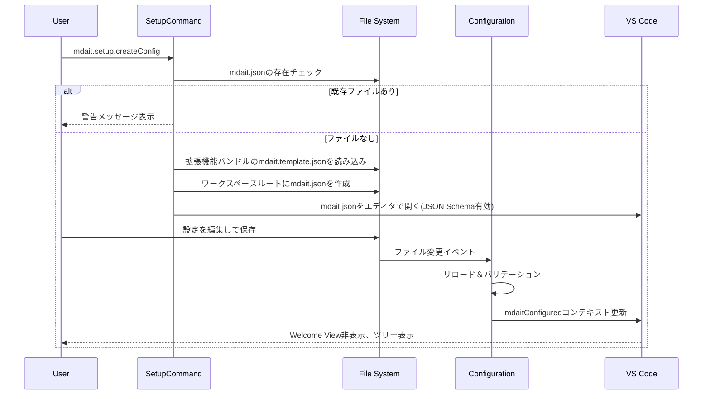

# setupコマンド設計

> **上位設計**: [commands.md](commands.md)、[config.md](config.md)「オンボーディングサポート」参照

## 役割

初回セットアップを支援し、ユーザーがmdaitをスムーズに使い始められるようにします。

---

## setup.createConfig - 設定ファイル作成

### 目的

拡張機能にバンドルされた`mdait.template.json`をワークスペースルートに`mdait.json`としてコピーし、ユーザーが編集できる状態にします。

### 処理フロー

### 主要コンポーネント

- [`src/commands/setup/setup-command.ts`](../src/commands/setup/setup-command.ts): `createConfigCommand()` - テンプレートファイルのコピーとエディタで開く処理

### 考慮事項

- **ワークスペース未オープン**: エラーメッセージを表示
- **既存ファイル保護**: 確認ダイアログで上書きを防止
- **テンプレート不在**: 拡張機能の再インストールを促す
- **自動UI更新**: 設定ファイル作成後、`mdaitConfigured`コンテキスト変数を自動更新してWelcome Viewを非表示に

**設計意図**: ユーザーが手動で設定ファイルを作成する負担を軽減し、テンプレートから開始することでスムーズなセットアップを実現します（[config.md](config.md) 「オンボーディングサポート」参照）。
