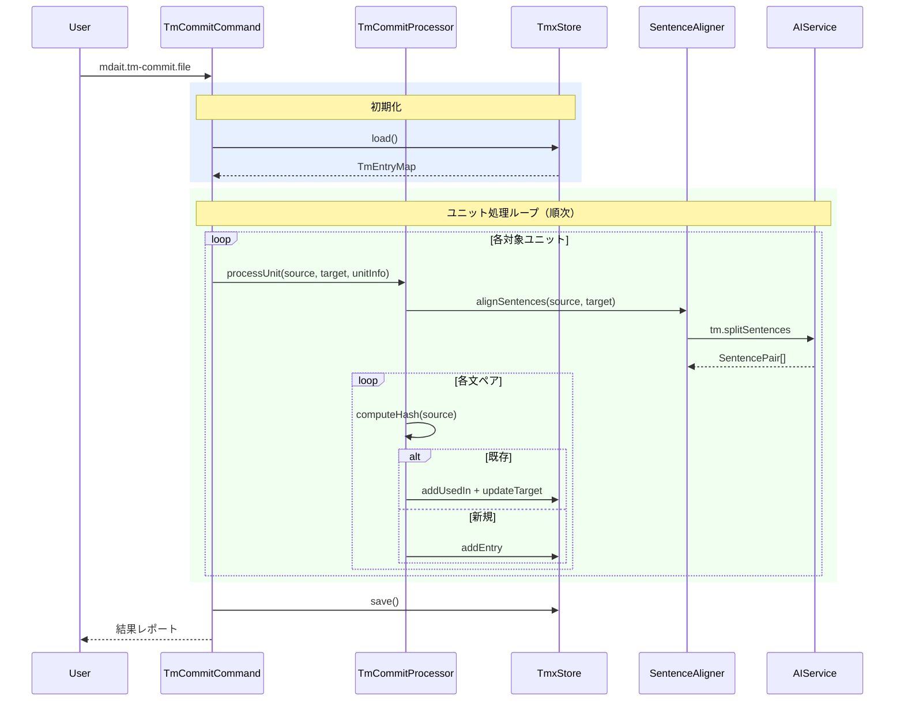

# tm-commitコマンド設計

> **上位設計**: [architecture.md](architecture.md) P5「層の責務分離」、[commands.md](commands.md)「共通設計方針」参照

## 役割

翻訳済みユニットの対訳を文単位に分割し、TMX形式の翻訳メモリ（TM）に登録する。TMに蓄積された過去の対訳は、trans実行時にLLMプロンプトへ参考情報として提供され、翻訳表現の一貫性を高める。

**設計意図**: tm-commitはユーザーの明示的操作でのみ実行される（プライバシー原則準拠）。バックグラウンドでの自動TM登録は行わない。

---

## 機能詳細

### コマンド体系

| コマンド | 粒度 | UI起点 |
|---|---|---|
| `mdait.tm-commit.unit` | ユニット単位 | CodeLens |
| `mdait.tm-commit.file` | ファイル単位 | StatusTree |
| `mdait.tm-commit.directory` | ディレクトリ単位 | StatusTree |

各コマンドの処理ロジックは同一。対象範囲のみが異なる。

### TM処理対象の判定

| 条件 | 判定 | 理由 |
|---|---|---|
| `from`属性あり + `need`なし | 処理対象 | 翻訳済み |
| `from`属性あり + `need:review` | 処理対象 | 翻訳済み（レビュー待ち） |
| `from`属性あり + `need:revise@*` | スキップ | 訳文が旧版 |
| `from`属性あり + `need:translate` | スキップ | 未翻訳 |
| `from`属性なし | スキップ | ソースファイルまたは未リンク |
| `fixed`フラグあり | スキップ | 登録済み最適化（将来機能） |

### 処理フロー

1. **初期化**: TmxStore.getInstance()でシングルトン取得（mtime判定で自動リロード）
2. **対象スキャン**: 指定範囲のターゲットユニットを収集
3. **ユニット処理**（順次、キャンセルチェック付き）:
   - 処理対象判定（上表参照）
   - ソースユニットの内容を取得（`from`ハッシュ経由）
   - SentenceAligner: LLMで対訳を文ペアに分割
   - 各文ペアについて:
     - sentenceHash = CRC32(normalize(source_sentence))
     - 既存ハッシュ → usedIn追加 + ターゲット訳文を最新で上書き
     - 新規ハッシュ → 新規TmEntryを作成
4. **永続化**: TmxStore.save()でTMXファイルに書き込み
5. **結果レポート**: 新規/既存/スキップの件数を通知

---

## 主要コンポーネント

### Core層

- **TmxStore** (`src/core/tm/tmx-store.ts`): TMXファイルのI/O、インメモリインデックス（Map<sentenceHash, TmEntry>）、CRUD操作
- **SentenceSplitter** (`src/core/tm/sentence-splitter.ts`): 正規表現ベースの文分割。trans検索時の高速分割に使用

### Commands層

- **TmCommitCommand** (`src/commands/tm-commit/tm-commit-command.ts`): コマンドエントリーポイント。withProgressパターンで進捗表示・キャンセル対応
- **TmCommitProcessor** (`src/commands/tm-commit/tm-commit-processor.ts`): ユニット処理のコアロジック。将来のfix --tmからも呼び出し可能
- **SentenceAligner** (`src/commands/tm-commit/sentence-aligner.ts`): LLMベースの文アライメント。PromptProviderでプロンプトを構築

---

## シーケンス図

### ファイル単位のtm-commit



---

## trans連携: TM参照

tm-commitで蓄積されたTMは、trans実行時に参照される。

### TM検索フロー（trans内）

1. TmxStoreをロード（キャッシュ再利用、mtime判定）
2. ソースユニットの内容をSentenceSplitter（正規表現）で文分割
3. 各文のsentenceHashを計算
4. TmxStore.lookupBatch()で一括検索
5. ヒットした参照を`tm.maxReferences`件まで選定
6. フォーマットしてTranslationContext.tmReferencesに設定

### プロンプト統合

`trans.translate` および `trans.revisePatch` に条件ブロックとして統合:

```
{{#tmReferences}}
## Translation Memory Reference

The following are past translations of similar sentences.
Use them as reference for consistency, but prioritize accuracy and context.

{{tmReferences}}
{{/tmReferences}}
```

**設計意図**: 過去の対訳が100%正しいとは限らないニュアンスを保つ。LLMには参考情報として提示し、文脈やニュアンスを優先させる。

---

## 文分割戦略

| 場面 | 方法 | 理由 |
|---|---|---|
| tm-commit（書き込み） | LLM (`tm.splitSentences`) | 高精度なアライメントが必要。一度だけ実行 |
| trans（検索） | 正規表現 (`SentenceSplitter`) | 毎回実行。即時性重視 |

**非対称性のトレードオフ**: 分割結果の差異でTM参照を取りこぼす可能性があるが、「誤った参照の提示」よりも安全。

### 正規表現分割ルール（SentenceSplitter）

1. コードブロック・インラインコードをプレースホルダーに置換
2. 言語別分割:
   - 日本語: `[。！？]` + 後続空白/末尾
   - 英語: `[.!?]\s+(?=[A-Z])`
3. 数値保護: 小数点（3.14）での分割を防止
4. リスト項目: 各項目を独立文として扱い
5. 空文字列除去、トリム

---

## TMXファイル構造

```xml
<?xml version="1.0" encoding="UTF-8"?>
<tmx version="1.4">
  <header
    creationtool="mdait"
    creationtoolversion="0.0.1"
    datatype="Markdown"
    segtype="sentence"
    o-tmf="mdait"
    srclang="*all*"
  />
  <body>
    <tu>
      <prop type="x-mdait-hash">a1b2c3d4</prop>
      <prop type="x-mdait-created-at">2026-02-08T12:00:00Z</prop>
      <prop type="x-mdait-used-in">docs/guide.md#abc12345</prop>
      <tuv xml:lang="en"><seg>Download the installer</seg></tuv>
      <tuv xml:lang="ja"><seg>インストーラーをダウンロード</seg></tuv>
    </tu>
  </body>
</tmx>
```

- **TMX 1.4準拠**: 外部CATツールとの互換性
- **`x-mdait-*` プロパティ**: mdait固有のメタデータ。TMX標準の拡張プロパティとして格納
- **多言語TUV**: 1つのTUに複数言語を格納可能

---

## 設定

`mdait.json` の `tm` セクション:

```json
{
  "tm": {
    "enabled": true,
    "maxReferences": 5
  }
}
```

| フィールド | 型 | デフォルト | 説明 |
|---|---|---|---|
| `enabled` | boolean | `true` | TM機能全体の有効/無効 |
| `maxReferences` | number | `5` | transプロンプトに含める最大TM参照数 |

---

## 考慮事項

- **冪等性**: tm-commitを複数回実行しても結果は同一。既存エントリーはusedIn追加のみ
- **プライバシー**: LLM通信（文分割）はtm-commit実行時のみ。trans時のTM検索はローカル完結
- **エラーハンドリング**: ユニット単位のLLMエラーは記録して続行。他ユニットの処理に影響しない
- **fixコマンドとの連携**: TmCommitProcessorを独立設計し、fix --tm実装時に委譲可能

---

## 参照

- 実装コード: `src/core/tm/`, `src/commands/tm-commit/`
- プロンプト設計: [prompt.md](prompt.md)
- 設定: [config.md](config.md)
- UI連携: [ui.md](ui.md)
- タスクチケット: [/tasks/260208_翻訳メモリ機能.md](/tasks/260208_翻訳メモリ機能.md)
