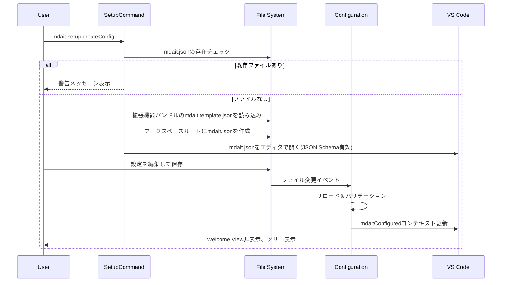

# コマンド層設計

> **上位設計**: [architecture.md](architecture.md) P5「Commands層：ワークフローの指揮者」、[design.md](design.md)「階層構造」、「主要コマンド」参照

## このドキュメントの責務

Commands層は、Core層の純粋関数を組み合わせて、実際のユーザーワークフローを実現します。進捗表示、エラーハンドリング、キャンセル対応もこの層の責務です（[architecture.md](architecture.md) P5参照）。

このドキュメントでは、各コマンドの概要と共通設計方針を示します。詳細な処理フローは各コマンドの設計書を参照してください。

---

## setup（初期設定）

### setup.createConfig（設定ファイル作成）

- 拡張機能にバンドルされた`mdait.template.json`をワークスペースルートに`mdait.json`としてコピー
- テンプレートファイルは拡張機能のルートに配置され、`ExtensionContext.extensionPath`を通じてアクセス
- ファイル作成後、VS Codeエディタで開いてユーザーに編集を促す
- JSON Schemaによる補完と検証が自動的に機能
- 保存時に`Configuration`が自動リロードし、`mdaitConfigured`コンテキスト変数を更新
- 既に`mdait.json`が存在する場合は警告メッセージを表示して上書きを防止
- テンプレートファイルが見つからない場合はエラーメッセージを表示（拡張機能の再インストールを促す）

**主要コンポーネント:**
- [src/commands/setup/setup-command.ts](../src/commands/setup/setup-command.ts): `createConfigCommand()` - テンプレートファイルのコピーとエディタで開く処理を実行

**シーケンス:**

---

## コマンド概要

### setup - 初期設定

`mdait.template.json`をワークスペースにコピーし、初期設定を支援します。

**詳細**: [command_setup.md](command_setup.md)

---

### sync - ユニット同期

ソースとターゲット間でユニット対応を確立し、差分を検出します。変更箇所に`need:translate`または`need:revise@{oldhash}`を付与します。

**主な処理**:
- ハッシュ比較による差分検出
- `SectionMatcher`によるユニット対応付け
- `.mdait/unit-registry`へのスナップショット保存

**詳細**: [command_sync.md](command_sync.md)

---

### trans - 翻訳実行

`need:translate`が付与されたユニットをAI翻訳します。

**主な処理**:
- 用語集から関連用語を抽出
- **改訂時は差分パッチ翻訳**: 旧コンテンツとの差分（unified diff）をLLMに提示し、前回訳文へのパッチのみを返させる
- 翻訳品質チェック（構造比較）
- AIレスポンス検証（JSON混入チェック）

**詳細**: [command_trans.md](command_trans.md)

---

### term - 用語管理

#### term.detect - 用語検出
原文から重要用語を検出します。対訳がある場合は両言語から同時抽出します。

#### term.expand - 用語展開
既訳から訳語を抽出し、用語集を展開します。

**詳細**: [command_term.md](command_term.md)

---

### translate-selection - オンデマンド翻訳

エディタ選択範囲を一時的に翻訳します。マーカーレスで、mdaitのステータスには影響しません。

**詳細**: [command_trans-selection.md](command_trans-selection.md)

---

## 共通設計方針

### 冪等性と決定性

すべてのコマンドは何度実行しても安全で一貫した結果を返します（[architecture.md](architecture.md) 哲学4参照）。

**実現方法**:
- マーカーの再計算は現在のコンテンツから導出（状態の累積ではない）
- ハッシュは正規化された内容から決定的に算出
- needフラグは現在の状態から再計算可能

### 並列実行制御

現状は順次実行を採用し、キャンセル即応性とAI APIレート制限回避を優先します。

**ディレクトリ処理**: ファイルを順次処理  
**ファイル内処理**: ユニットを順次処理

**将来的な拡張**: 設定可能な並列数制限（セマフォ方式）の導入を検討（例: `mdait.trans.concurrency`で同時翻訳数を指定）

**設計意図**: 無制限な並列実行は採用しません。これはユーザーのキャンセル操作への即応性とAI APIレート制限対策を優先した結果です（[architecture.md](architecture.md) 「意図的な制約」参照）。

### キャンセル管理

すべての長時間処理（AI翻訳、用語検出等）は`CancellationToken`による中断を全面サポートします。

**実装パターン**: VSCode標準の`withProgress`パターン  
**進捗表示**: ファイル翻訳="X/Y units"、ディレクトリ翻訳="X/Y files"形式  
**キャンセルポイント**: ユニット単位/バッチ単位でキャンセルチェック

**設計意図**: 長時間処理でもユーザーが状況を把握でき、必要に応じて即座にキャンセルできます（[architecture.md](architecture.md) 哲学4参照）。

---

## 参照

- 実装コード: `src/commands/` 以下
- UI連携: [ui.md](ui.md)
- テスト観点: [test.md](test.md)
- 設定: [config.md](config.md)
- AIサービス: [api.md](api.md)