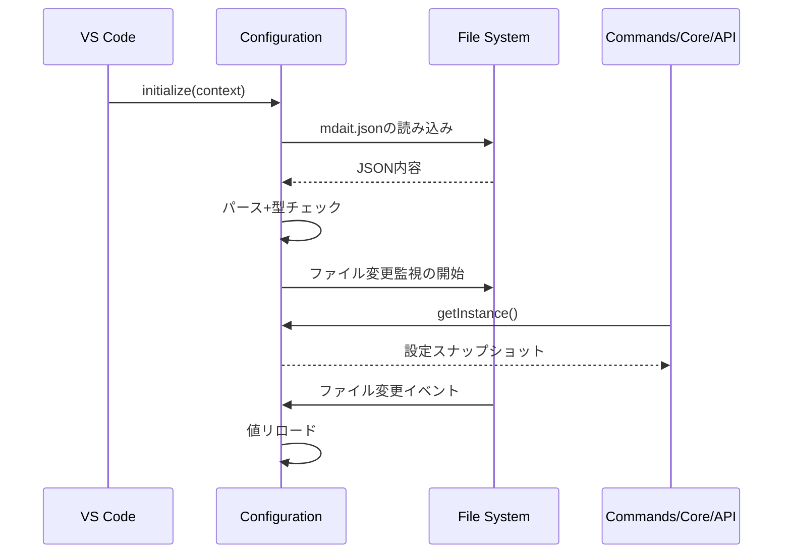

# 設定管理層設計

> **上位設計**: [architecture.md](architecture.md) P2「ハッシュによる変更追跡」、[design.md](design.md)「階層構造」参照

## このドキュメントの責務

Config層は、`mdait.json`の読み込み、バリデーション、ファイル変更監視を担当します。また、Frontmatterによるドキュメント単位の設定オーバーライドを定義します。

---

## Configurationクラス

### 基本設計

- **シングルトン**: `initialize()`でロード、`getInstance()`で提供
- **ソース**: ワークスペースルートの`mdait.json`
- **スキーマ**: `schemas/mdait-config.schema.json`による補完と検証

**実装**: [`src/config/configuration.ts`](../src/config/configuration.ts)

### オンボーディングサポート

初回セットアップを支援する仕組みを提供します：

1. `isConfigured()`メソッドで`mdait.json`の存在と妥当性をチェック
2. 初期セットアップ時は`mdait.setup.createConfig`コマンドで`mdait.template.json`から設定ファイルを生成
3. `mdaitConfigured`コンテキスト変数でUI表示を制御し、未設定時はWelcome Viewを表示
4. `package.json`の`jsonValidation`でJSON Schemaを関連付け、IDE上でIntelliSenseと検証が機能

**設計意図**: ユーザーが設定ファイルを手動で作成する負担を軽減し、テンプレートから開始することでスムーズなセットアップを実現します。

---

## ロードシーケンス



**設計意図**: ファイル変更監視により、ユーザーがmdait.jsonを編集中でも、保存時に即座に設定が反映されます。

---

## mdait.jsonフォーマット

[`schemas/mdait-config.schema.json`](../schemas/mdait-config.schema.json)で定義された形式に従います。

### 主要フィールド

```json
{
  "$schema": "./schemas/mdait-config.schema.json",
  "transPairs": [
    {
      "sourceDir": "docs/ja",
      "targetDir": "docs/en",
      "sourceLang": "ja",
      "targetLang": "en"
    }
  ],
  "ignoredPatterns": ["**/node_modules/**"],
  "sync": {
    "level": 2,
    "autoDelete": true,
    "autoSyncOnSave": true
  },
  "ai": {
    "provider": "openai",
    "model": "gpt-4o-mini",
    "openai": {
      "apiKey": "${env:OPENAI_API_KEY}",
      "baseURL": "https://api.openai.com/v1"
    }
  },
  "trans": {
    "markdown": {
      "skipCodeBlocks": true
    },
    "frontmatter": {
      "keys": ["title", "description"]
    },
    "contextSize": 1
  },
  "terms": {
    "filename": "terms.csv",
    "primaryLang": "en"
  }
}
```

### 重要な設定項目

#### transPairs（必須）
ソース・ターゲットのディレクトリペアと言語を定義します。複数ペアの定義により、多言語展開に対応します。

#### sync.level
ユニット境界として検知する見出しレベルを指定します。デフォルトは2（`##`）です。

#### sync.autoSyncOnSave
保存時に自動同期を行うかを制御します。デフォルトは`true`です。

**設計意図**: 自動同期により、原文編集直後に差分検出が行われ、翻訳が必要な箇所が即座に可視化されます。

#### trans.frontmatter.keys
翻訳対象とするfrontmatterのキーを指定します。指定されたキーのみが翻訳管理の対象となります。

---

### tm（翻訳メモリ）

翻訳メモリ機能に関する設定です。

```json
{
  "tm": {
    "enabled": true,
    "maxReferences": 5
  }
}
```

#### tm.enabled
TM機能の有効/無効を制御します。デフォルトは`true`です。

**動作**: `false`の場合、tm-commitコマンドとtrans実行時のTM参照の両方が無効化されます。

#### tm.maxReferences
trans実行時にプロンプトに含めるTM参照の最大数を指定します。デフォルトは`5`です。

**設計意図**: プロンプトの肥大化を防ぎつつ、一貫性に寄与する十分な参照を提供します。

---

### fix（ユニット確定）

ユニット確定機能に関する設定です。

```json
{
  "fix": {
    "tm": false
  }
}
```

#### fix.tm
fix実行時にTM登録も同時に行うかどうかを制御します。デフォルトは`false`です。

**動作**: `true`の場合、ユニット確定時に自動的にTM登録も実行されます。なお、TM登録にはtm機能自体が有効（`tm.enabled: true`）である必要があります。

**設計意図**: ユニット確定のワークフローを効率化し、確定済みユニットを自動的にTMに蓄積することで、将来の翻訳品質向上に貢献します。

---

## バリデーション

### validate()メソッド
設定ファイルロード後に以下をチェックします：
- 必須フィールド(`transPairs`)の有無
- ディレクトリパスの妥当性

### isConfigured()メソッド
設定ファイルの存在とtransPairsの有無を簡易チェックします。

**UIへの影響**:
- `isConfigured()`がfalseの場合、`StatusTreeProvider`が空配列を返しリソース消費を抑制
- `mdaitConfigured`コンテキスト変数を更新し、ツールバーボタンとWelcome Viewの表示を切り替え

---

## Frontmatter設定

Markdown文書の先頭にあるfrontmatterセクションで、YAML形式でメタデータを記述します。

### mdait名前空間

mdaitの内部設定は`mdait`名前空間の下に階層的に配置します。

```yaml
mdait:
  sync:
    level: 2
  front: abc123de from:def456gh need:translate
```

**設計意図**: 他のツールのfrontmatterと衝突を避けるため、mdait専用の名前空間を使用します。

---

### mdait.sync.level - ドキュメント単位のユニット粒度

**用途**: ユニット境界として検知する見出しレベルの指定

**設定形式**:
```yaml
mdait:
  sync:
    level: 3
```

**動作**:
- `mdait.json`の`sync.level`設定をドキュメント単位で上書き
- パース時に[`MarkdownItParser`](../src/core/markdown/parser.ts)がfrontmatterから読み込み、グローバル設定より優先
- 特定ドキュメントのみ異なる粒度でユニット分割したい場合に活用

**level設定の自動同期**:
- sync実行時、原文と訳文でlevel設定が異なる場合、**原文の設定を優先して訳文を自動修正**
- これによりユニット境界の粒度を揃え、マーカー対応付けの破綻を防止

**設計意図**: 大きなドキュメントでは粗い粒度（level 2）、詳細なドキュメントでは細かい粒度（level 3）など、ドキュメントの性質に応じて柔軟に調整できます。

---

### mdait.front - Frontmatterの翻訳状態管理

**用途**: Frontmatterの翻訳状態管理（本体の`<!-- mdait ... -->`マーカーに相当）

**設定形式**:
```yaml
mdait:
  front: "abc123de from:def456gh need:translate"
```

**動作**:
- Frontmatter全体のハッシュ値、翻訳元ハッシュ、必要アクションを追跡
- 本体のMarkdown内のmarkerとは異なり、frontmatter独自のメタデータとして使用
- syncコマンド実行時にハッシュが更新され、transコマンドで翻訳対象判定に利用

**設計意図**: frontmatterは構造的にHTMLコメントを挿入できないため、専用フィールドで状態を管理します。本文ユニットと分離した専用フローで処理することで、frontmatter翻訳を柔軟に制御できます。

**詳細**: [core.md](core.md) FrontMatter翻訳セクション参照
