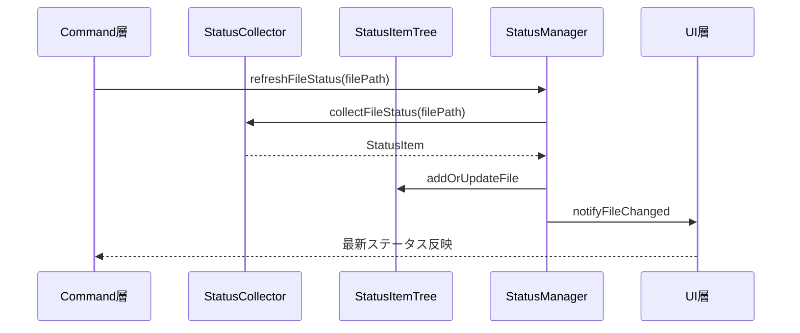
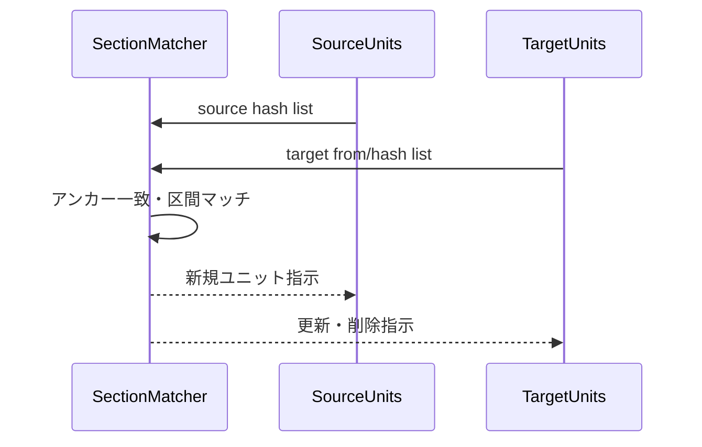

# コア機能層設計

> **上位設計**: [architecture.md](architecture.md) P5「層の責務分離」、[design.md](design.md)「階層構造」参照

## このドキュメントの責務

Core層は、**翻訳ドメインの純粋なロジック**を提供します。VS Code APIに依存せず、入力（Markdownテキスト、設定）から出力（ユニット、ハッシュ、ステータス）を決定的に計算します。

- Markdownをユニット化する
- ハッシュで変更を追跡する
- ステータスを集約する
- ユニット内容をスナップショット管理する

**設計意図**: Core層を純粋関数に近づけることで、ロジックの単体テストが容易になり、Commands層は「いつ、どのファイルに対して処理を行うか」という制御に集中できます。

---

## mdaitUnit

### 構造

mdaitUnitは以下の要素で構成されます：

- **content**: ユニット本文（Markdownテキスト）
- **marker**: `<!-- mdait {hash} [from:{hash}] [need:{flag}] -->`
- **range**: ドキュメント内の開始・終了位置

### ユニット境界の決定

ユニット境界は以下で決定されます：

1. **見出しレベル**: `mdait.json`の`sync.level`で指定されたレベル以下の見出し
2. **mdaitマーカー**: `<!-- mdait -->` または `<!-- mdait {hash} ... -->`

**ルール**:
- マーカーの直後（空行なし）に見出しがある場合、その見出しがユニットのタイトル
- ハッシュ省略マーカー `<!-- mdait -->` も境界として認識され、sync時に自動計算される

**例**:
```markdown
<!-- mdait abc12345 need:translate -->
## Introduction

This is the content of the unit.
```

### level設定のドキュメント単位オーバーライド

Frontmatterで`mdait.sync.level`を指定することで、ファイル単位でユニット粒度を変更できます：

```yaml
---
mdait:
  sync:
    level: 3
---
```

sync実行時、原文と訳文でlevel設定が異なる場合、**原文の設定を優先して訳文を自動修正**します。これによりユニット境界の粒度を揃え、マーカー対応付けの破綻を防止します。

**実装**: [`src/core/markdown/parser.ts`](../src/core/markdown/parser.ts)

---

## Hash & Normalizer

### ハッシュ計算の流れ


### 正規化の目的

以下の差異を吸収し、本質的な内容変更のみを検出します：

- 行末の空白
- 連続する空行の数
- コードフェンスの言語指定の有無
- リンク参照の定義順序

**設計意図**: 「翻訳する必要がない変更」でneedフラグを付与しないため、人間の編集ノイズを最小化します（[architecture.md](architecture.md) P1参照）。

### CRC32の選択理由

- **衝突リスクより可読性**: SHA-256等と比べて短く、マーカーが肥大化しない
- **決定的計算**: 同じ内容からは必ず同じハッシュが生成される
- **実運用での衝突確率は極めて低い**: 数千ユニット規模でも問題になった事例なし

**実装**: [`src/core/hash/`](../src/core/hash/)

---

## Status管理

### StatusItemTree

ディレクトリ/ファイル/ユニット階層をMap構造で保持し、O(1)検索を実現します。

```typescript
interface StatusItemTree {
  dirs: Map<string, DirectoryStatus>;
  files: Map<string, FileStatus>;
  units: Map<string, UnitStatus>;
}
```

### StatusManager

StatusCollectorとUIの橋渡しとして全体構築・部分更新を担います。

**主要メソッド**:
- `refreshFileStatus(filePath)`: ファイルのステータスを再計算
- `getFileStatus(filePath)`: キャッシュされたステータスを取得
- `clear()`: すべてのキャッシュをクリア

**設計意図**: ファイルごとに再計算することで、個別ファイルの変更時に全体を走査する必要がありません。

**実装**: [`src/core/status/`](../src/core/status/)

---

## UnitRegistry管理

### 役割

ユニット内容を`.mdait/unit-registry`ファイルで永続化します。原文変更時、旧コンテンツとの差分（unified diff）を生成するために使用します。

### 保存形式

- **圧縮**: gzip圧縮 + base64エンコード
- **区画化**: CRC32ハッシュの先頭3桁（000〜fff）でバケット化
- **決定的順序**: バケット昇順＋エントリ昇順でgit競合を軽減

**フォーマット例**:
```
3f7 
3f7c8a1b <encoded_content>
3f7d9b2c <encoded_content>
a2b 
a2b5c7d8 <encoded_content>
```

### GC処理

sync完了後、ファイルサイズが5MB超過時に、使用中のhash以外のレジストリを削除します。

**実装**: [`src/core/unit-registry/`](../src/core/unit-registry/)

---

## Diff生成

trans実行時、旧レジストリと現在のコンテンツから動的にunified diff形式で差分を生成します。

**使用ライブラリ**: `diff`パッケージ

**設計意図**: LLMにdiffを提示することで、訳文への差分パッチのみを生成させ、変更箇所以外は既存訳文を維持します（[architecture.md](architecture.md) P4参照）。

**実装**: [`src/core/diff/`](../src/core/diff/)

---

## FrontMatter翻訳

### mdait.frontマーカー

frontmatter内の`mdait.front`フィールドでfrontmatter全体の翻訳状態を管理します：

```yaml
---
title: "Document Title"
description: "Document description"
mdait:
  front: "abc12345 from:def67890 need:translate"
  sync:
    level: 3
---
```

### ハッシュ計算

`trans.frontmatter.keys`で指定されたキーの値を、keys順に連結してハッシュ化します。キー名や順序は差分対象外です。

### 階層構造アクセス

`FrontMatter`クラスで`"mdait.sync.level"`のようなドット記法による階層アクセスをサポートします。

### フォーマット保持

mdait管理外のフィールドは元のYAMLフォーマットを維持し、mdait名前空間のみを更新対象とします。

**実装**: [`src/core/markdown/frontmatter-translation.ts`](../src/core/markdown/frontmatter-translation.ts)

---

## マーカー正規化

パース前処理として、mdaitマーカーの直前に空行がない場合は空行を挿入します。

**理由**: markdown-itが段落区切りとしてマーカーを正しく認識するための正規化処理です。

---

## シーケンス図

### ステータス更新



### ユニット同期ロジック


