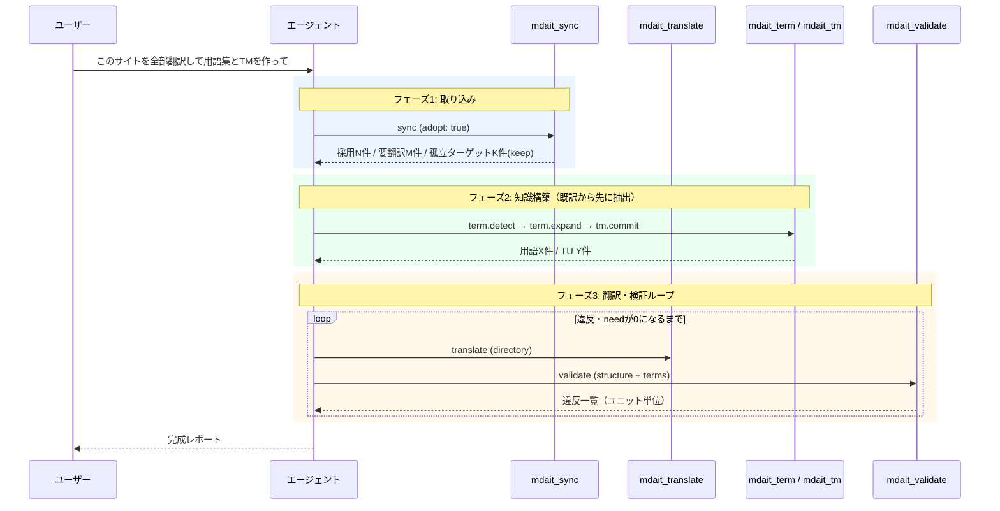

# エージェント・オーケストレーション設計とロードマップ

> [architecture](../architecture.md) > **Agent Orchestration**

## このドキュメントの責務

「このサイトを全部翻訳して、完璧な用語集と翻訳メモリを作り上げて」とAIエージェントにひとこと依頼すれば、mdait管理の完成されたサイト（全訳＋用語集＋TM）が出来上がる——この目標シナリオに対する現状のギャップ分析、設計、実装ロードマップを定義する。

各マイルストーンには**着手前チェック・考慮事項・完了ゲート**を明記し、実装担当（人間・エージェントを問わず）が本ドキュメント単体で作業を遂行できるようにする。

方針決定（2026-07）:

- **オーケストレーション主体はエージェント**。mdaitは冪等なプリミティブをLM Toolsとして公開し、判断・反復はエージェントに委ねる。一括パイプラインコマンドは作らない。
- **対象はCopilot Chat（LanguageModelTool API）**。MCP/CLI化はスコープ外（将来展望として最後に言及）。
- 既存対訳の取り込みは**adopt（採用）モード**を新設して解決する。
- 訳文側にしか存在しないセクションは**ポリシーで両対応**（保持ロック／逆方向埋め戻し）。

---

## 目標シナリオと完成状態の定義

### シナリオ

- **S1: 新規翻訳** — 日本語のみのサイトを丸ごと英語化する。
- **S2: 既存対訳の取り込み** — すでに日英ページが存在するサイトをmdait管理下に置く。原文/訳文の構造がズレているページ（英語側にしかないセクション、日本語側にしかないセクション）を含む。

### 完成状態（Definition of Done）

エージェントが以下をすべて満たしたとき「完璧なmdaitサイト」とみなす。ゴール判定はエージェント自身がツール出力から機械的に行えなければならない。

1. 全ターゲットユニットが翻訳済み（`need` フラグなし。ただし `need:isolate` と独立ユニット（`from` なし）は除外）
2. 構造検証・用語一貫性検証にパス（`mdait_validate` が違反0件を返す）
3. 用語集が対訳から抽出・全言語展開済み（`term.detect`/`term.expand` の再実行が差分0件）
4. 翻訳済みユニットがTMにコミット済み（`tm.commit` の再実行が差分0件）
5. 上記すべてが再実行しても変化しない（冪等な定常状態）

---

## ギャップ分析

調査日: 2026-07-04（対象コミット: main HEAD）。各ギャップは後述のマイルストーンに対応付けている。

| # | ギャップ | 根拠（現状コード） | 対応 |
|---|---|---|---|
| G1 | LM Toolsが3つのみ（`mdait_getStatus`/`mdait_sync`/`mdait_translate`）。term.detect/expand、tm.commit/optimize、検証はチャットから駆動不可 | `package.json` の `languageModelTools`、`src/lm-tools/`、[tools.md](tools.md)「今後の拡張可能性」 | M3, M4 |
| G2 | ツール出力が非構造化テキスト。エージェントが計画に使う情報（ファイル別need一覧、翻訳失敗の原因、次アクション）が取れない | `src/lm-tools/get-status-tool.ts` / `translate-tool.ts`（`LanguageModelTextPart` に文章を返すのみ） | M1 |
| G3 | 既存対訳の取り込みが安全でない。embedded（デフォルト）では初回syncでマーカーなし既訳に一律 `need:translate` が付き、(a) transで既訳が上書きされる、(b) tm.commitの対象（`from`あり＋`need`なし）外になる。「既訳をreviewに倒す」安全網はexternalモード再構築と非MDにのみ実装 | `src/commands/sync/marker-sync.ts`（新規ターゲット分岐）、`src/commands/sync/sync-command.ts` の `isExternalRebuild`、`src/commands/tm/commit-filter.ts` | M2 |
| G4 | 訳文側にしかないセクションは `sync.autoDelete: true`（デフォルト）で初回syncにより削除される。`false` でも `need:verify-deletion` 止まりで「意図的に保持する」状態を表現できない | `src/commands/sync/section-matcher.ts`（孤立ターゲット処理） | M2, M5 |
| G5 | 用語一貫性の事後検証がない。`TranslationChecker` はMarkdown構造カウント比較のみ。用語集はプロンプトへの「Follow the provided terminology list strictly」というソフトな指示止まりで、逸脱の検出・レポート手段がない | `src/commands/trans/translation-checker.ts`、`src/prompts/defaults.ts` | M4 |
| G6 | 翻訳方向がtransPair単位で固定（常にsource→target）。「訳文側にしかないセクションを原文側へ埋め戻す」ユニット単位の方向反転は未モデル化 | `src/commands/trans-selection/direction-picker.ts`、`assets/schemas/mdait-config.schema.json`（transPairs） | M5 |
| G7 | `mdait_translate` はファイル単位のみ＋都度確認ダイアログ。数百ファイルのサイトでは呼び出し回数・承認回数が爆発する | `src/lm-tools/translate-tool.ts` | M1 |
| G8 | エージェント向けの手順書が「ツールの個別説明」止まりで、サイト全体オーケストレーションの手順（どの状態で・どの順に・何を呼ぶか）、ゴール判定基準、失敗時のリカバリが未整備 | `docs/guide/ja/copilot-chat.md`（個別ツールの使い方と単発の推奨フローのみ） | M6 |
| G9 | （副次）termロジックがcore層でなくcommands層にありVS Code非依存化されていない（TMとの非対称）。翻訳の並列実行なし | `src/commands/term/`、[architecture.md](../architecture.md)「意図的制約」 | M4, M6 |

---

## 設計

### 全体像

エージェントは `mdait_getStatus` で状態を観測し、ツールを1つ実行し、また観測する——この観測・行動ループを定常状態（完成状態）まで回す。mdaitの全コマンドは冪等なので、エージェントが途中で失敗・中断してもループを再開するだけで復帰できる。**この性質がエージェント主導方針の根拠**であり、全マイルストーンで維持する。

S2（既存対訳の取り込み）の代表フロー:



フェーズ2を翻訳より先に行うのがS2の要点である。既訳ペアから用語集とTMを構築してから残りを翻訳することで、新規翻訳が最初から既訳の用語・文体に揃う。

### ツールAPI設計

#### 共通仕様: 構造化出力

全ツールは `LanguageModelTextPart` に**JSON文字列**を返す（Tool APIの制約上テキストだが、内容を機械可読にする）。共通エンベロープ:

```jsonc
{
  "schemaVersion": 1,        // 出力スキーマのバージョン。破壊的変更時にインクリメント
  "ok": true,                // 実行自体の成否
  "summary": "…",            // 人間向け1行サマリ（現行のテキスト出力に相当）
  "data": { … },             // ツール固有の構造化データ
  "nextActions": ["…"]       // 推奨される次アクション（ツール名＋理由）。エージェントの計画を誘導する
}
```

- `summary` を必ず含めることで、JSONを解釈しない単純なエージェント/ユーザーにも現行同等の可読性を保つ。
- `nextActions` は「気の利かないエージェント」への誘導装置。例: sync後に `need:translate` が残っていれば `mdait_translate` を、翻訳完了ユニットがあれば `mdait_tm (commit)` を提案する。判断ロジックはCommands層に置かずlm-tools層に閉じる（薄いラッパー原則の例外として明示的に許容する。ビジネスロジックではなく案内文の生成であるため）。

#### ツール一覧（目標形）

| ツール | 入力 | 主なdata | 副作用 | 確認UI |
|---|---|---|---|---|
| `mdait_getStatus` | `{ path?, detail? }` | 全体集計。`detail:true` でファイル別のneed内訳（translate/revise/review/verify-deletion/isolate件数） | なし | なし |
| `mdait_sync` | `{ path?, adopt? }` | 変更ファイル数、付与needの内訳、孤立ターゲットと適用ポリシー、adopt採用件数 | マーカー書換 | あり |
| `mdait_translate` | `{ path }`（ファイル/ディレクトリ） | ファイルごとの成功/失敗、needの遷移、チェッカー違反、失敗原因 | 訳文書換・AI使用 | あり（スコープ単位で1回、対象ユニット総数を表示） |
| `mdait_term` | `{ action: "detect"\|"expand", path? }` | 追加/更新された用語一覧、未展開残数 | terms.csv書換・AI使用 | あり |
| `mdait_tm` | `{ action: "commit"\|"optimize", path? }` | 追加/更新TU数、スキップ理由内訳（needあり等） | translations.tmx書換・AI使用 | あり |
| `mdait_validate` | `{ path?, checks?: ["structure","terms"] }` | 違反一覧（ファイル/ユニット/種別/期待値/実際値） | なし | なし（AI不使用・読取専用） |
| `mdait_aiReview` | `{ path?, dryRun? }` | need:review ペアの verdict 集計（approved/mismatch/partial等）とエスカレーション一覧 | マーカー書換（need:review 解除）・AI使用 | あり |

設計原則は [tools.md](tools.md) に従う: Commands/Core層の薄いラップ、確認UI、l10n、エラーの構造化返却（`ok:false` ＋ `error.code`/`error.message`）。

### adopt（採用）モード — G3

`mdait_sync` / syncコマンドのオプション。初回syncで「マーカーなしだが本文のある既存訳文」を翻訳済みとして採用する。

- **対応付け**: `SectionMatcher` の順序ベース対応（既存ロジック）をそのまま使う。対応が取れたペアは `from` を確立し、`need:translate` の代わりに **`need:review`** を付与する（人間/エージェントによる確認を経て `need` を外す運用。即時に翻訳済み扱いしたい場合はレビュー承認をエージェントに委任できる）。adopt 後の `need:review` の一括トリアージは `mdait_aiReview`（AI翻訳レビュー、[command_ai-review.md](command_ai-review.md)・ADR-260704-07）で行える。
- **実装位置**: `marker-sync.ts` の新規ターゲット分岐に「本文が空でなければreviewに倒す」判定を追加する。externalモード再構築（`sync-command.ts` の `isExternalRebuild`）と非MD（`plain-file-handler.ts`）に既にある同種ロジックを共通化して流用する。
- **adoptはsyncの引数であり永続設定にしない**（取り込みは一度きりの操作。定常運用のsyncが誤ってadopt動作をしない）。

### 孤立ターゲットポリシー — G4

> **更新（2026-07-11）**: `keep` / `backfill` は ADR-260711-05 で廃止された（独立ユニット・`need:isolate` の統合モデルに置換。[command_sync.md](command_sync.md) の「孤立ユニットモデル」）。本節と下記「逆方向埋め戻し（backfill）」・M2・M5 の該当記述は歴史的記録として残す。

`sync.autoDelete: boolean` を `sync.orphanTargetPolicy: "delete" | "verify" | "keep" | "backfill"` に拡張する（`autoDelete: true`→`delete`、`false`→`verify` として後方互換を維持。両方指定時は `orphanTargetPolicy` 優先）。

- **`delete`**: 現行 `autoDelete:true` と同じ。
- **`verify`**: 現行 `autoDelete:false` と同じ（`need:verify-deletion` 付与）。
- **`keep`**: `need:keep` を付与して恒久保持。sync（削除・対応付け）とtransはこのユニットに触れない。statusでは「独自ユニット」として翻訳率の分母から除外する。マーカー形式 `<!-- mdait {hash} need:keep -->` は固定不変条件（`<!-- mdait hash from:xxx need:yyy -->`）の範囲内。
- **`backfill`**: M5で実装（下記）。

`need` の語彙追加（`keep`、後述の `backfill`）は既存マーカーとの互換性を壊さないが、**実装時にADRとして記録すること**。

### 逆方向埋め戻し（backfill） — G6

訳文側にしかないセクションを原文側へ逆翻訳して対称化する。transPairの方向定義（source→target）は変えず、**ユニット単位の例外**としてモデル化する:

1. syncが（policy=backfill時）孤立ターゲットに対応する**原文側プレースホルダユニット**を生成し、`need:backfill` を付与。ペア相手（訳文ユニット）はマーカーの `from` 逆参照で辿れる形にする。
2. transが `need:backfill` ユニットを検出したら、transPairの言語を逆転（targetLang→sourceLang）して訳文ユニット本文を翻訳し、原文側に書き込む。
3. 次のsyncで通常の `from` リンク（target.from = source.hash）が確立し、以後は普通のペアとして扱われる。

`direction-picker.ts` の「方向は常にsource→target」という原則はファイル単位では維持し、逆転はtransの内部処理に閉じる。

### 用語一貫性検証（term-lint） — G5

`mdait_validate` の `checks: ["terms"]`。AIを使わない機械照合で、翻訳済みペアユニットごとに:

1. 原文ユニット本文に出現する用語集エントリを抽出（既存 `term-extractor.ts` の照合ロジックを流用: 部分一致＋variants）
2. 対応する訳文ユニット本文に、期待訳語（term＋variants）のいずれかが出現するか照合
3. 出現しなければ違反としてレポート（ファイル/ユニット/用語/期待訳語/重大度）

- **違反は警告であり自動修正しない**。エージェントが違反レポートを見て、(a) 該当ユニットをreviseする、(b) 訳語の揺れが正当なら用語集のvariantsに追加する——のどちらかを選ぶ。この判断こそエージェント主導に委ねる部分である。
- 活用形・語形変化による偽陽性は既知の限界とし、variants追加で運用回避する（ドキュメントに明記）。
- 照合ロジックは**core層に新設**する（`src/core/term/` を新設し、`TranslationChecker` 同様VS Code非依存・単体テスト可能に）。これがG9のterm core移設の起点となる。

### エージェント・プレイブック — G8

`docs/guide/` にエージェント向けワークフローページを追加し、各ツールの `modelDescription`（package.json）にも要点を埋め込む:

- S1/S2それぞれの推奨手順（上記シーケンス図の言語化）
- ゴール判定基準（完成状態の定義）
- 失敗時のリカバリ手順（すべて冪等なので「syncして観測からやり直す」が基本）
- やってはいけないこと（マーカーの手書き編集、`.mdait/` 配下の直接編集、needフラグの意味を無視した削除）

---

## ロードマップ

各マイルストーンは独立してリリース可能で、途中で止まっても既存機能を壊さない順序にしている。**M2完了時点でS2（既存対訳取り込み）が、M4完了時点で目標シナリオの品質保証が、M6完了時点で全体が成立する。**

> **実装状況（2026-07-04）**: M1〜M6 の実装タスクは完了（チケット: `.tasks/do/260704-01`〜`260704-06`、ADR-260704-01〜06）。
> 残る完了ゲートは VS Code 実環境が必要な手動検証のみ:
> Copilot Chat での各ツールの実機確認（M1/M3/M4）、取り込み手順の通し確認（M2）、
> 100ファイル規模の並列翻訳計測と debug-ipc E2E（P11/P12）の実走、
> プレイブック単体でのエージェントS2完走（M6・本ロードマップ全体の受け入れテスト）。

### 全マイルストーン共通ゲート

実装者は各マイルストーンの完了時に以下をすべて確認すること（個別ゲートに加えて適用）:

- [ ] `npm test`（compile + lint + 単体テスト）がパスする
- [ ] 固定不変条件を変更していない: マーカー形式・CRC32・markdown-it・見出し境界（[architecture.md](../architecture.md)参照）
- [ ] マーカー境界探索を追加した場合、`getCodeBlockLineSet` でコードブロック行を除外している
- [ ] ファイルパス構築を `Configuration` クラス以外で行っていない
- [ ] ユーザー向け文字列はl10n経由（`l10n/bundle.l10n.json` + `.ja.json`、`npm run l10n` 実行済み）
- [ ] 新規/変更コマンドが**冪等**であることをテストで確認（同入力で2回実行して2回目が無変更）
- [ ] 設計判断をADRに記録した（`docs/adr.md`、新しいものを上）
- [ ] 影響のある `docs/design/*.md`・`docs/guide/` を更新した
- [ ] 作業チケットを `.tasks/do/` で管理し、完了時に `done.ps1` で移動した

### M1: エージェントが読める化（構造化出力とスコープ拡張）

**目的**: 既存3ツールをエージェントの観測・計画に耐える出力にし、サイト規模の翻訳を現実的な呼び出し回数にする。以降の全マイルストーンの土台。

**スコープ**: G2, G7

**実装タスク**:

1. 共通エンベロープ（`schemaVersion`/`ok`/`summary`/`data`/`nextActions`）の型定義とシリアライザを `src/lm-tools/` に新設
2. `mdait_getStatus` に `detail` パラメータ追加。ファイル別need内訳を `data` に格納
3. `mdait_translate` の `path` をディレクトリ対応にする（内部は既存のディレクトリ翻訳ロジック `trans-command.ts` を流用）。確認UIはスコープ単位1回で対象ユニット総数を提示
4. `mdait_sync` の結果に変更ファイル・付与needの内訳を格納
5. `nextActions` 生成ロジック（状態→推奨アクションの対応表）を実装

**着手前チェック**:

- [ ] `docs/design/tools.md` と `src/lm-tools/` の現状3ツールの実装を読む
- [ ] `trans-command.ts` のディレクトリ翻訳経路（UIの▶ボタンが呼ぶ関数）を特定し、lm-toolsから再利用可能か確認する
- [ ] Copilot Chatが実際にJSON出力を扱えるか、小さな実験（既存ツールの出力にJSONを混ぜる）で確認する

**考慮事項**:

- 出力スキーマは以降のマイルストーンの契約になる。`data` の中身はツールごとに自由だが、エンベロープは変更禁止（変更時は `schemaVersion` インクリメント＋全ツール一斉更新）
- `summary` の可読性を落とさない。JSON化で現行ユーザー体験を劣化させたらリリース不可
- ディレクトリ翻訳のキャンセル対応（`CancellationToken`）を必ず配線する。数百ファイルの翻訳を止められないのは事故になる
- `nextActions` はあくまで提案。実行はエージェントの判断＋ユーザー確認UIに委ねる（勝手に連鎖実行しない）

**完了ゲート**:

- [ ] 3ツールすべてが共通エンベロープで応答する（単体テストでスキーマ検証）
- [ ] Copilot Chatから「`docs/` 以下を全部翻訳して」で `mdait_translate` がディレクトリ1回呼び出しで完走する（手動確認）
- [ ] `mdait_getStatus (detail:true)` の出力だけを見て、人間が「次に何をすべきか」を判断できる（レビューで確認）

### M2: 既存対訳の安全な取り込み（adopt＋keepポリシー）

**目的**: S2の入口を成立させる。既訳を壊さず・消さずにmdait管理下へ置けるようにする。

**スコープ**: G3, G4（keepまで。backfillはM5）

**実装タスク**:

1. syncに `adopt` オプション追加。マーカーなし・本文ありのターゲットユニットを `need:review` で採用（`marker-sync.ts` の新規ターゲット分岐を拡張、`isExternalRebuild` の安全網ロジックと共通化）
2. `sync.orphanTargetPolicy` 設定を追加（`delete`/`verify`/`keep`。スキーマ・`Configuration`・`section-matcher.ts`）。`autoDelete` からの後方互換マッピング
3. `need:keep` の全経路対応: syncが触らない・transが対象外にする・statusが「独自ユニット」として分母から除外する
4. `mdait_sync` ツールに `adopt` パラメータを公開し、採用件数・孤立ターゲット処理結果を `data` で返す
5. 取り込み手順を `docs/guide/` に記載（adoptの説明、reviewの外し方、keepの使いどころ）

**着手前チェック**:

- [ ] `section-matcher.ts` の順序ベース対応付けの精度を、構造ズレのある実サンプル（見出し順序入替・欠落・追加）で確認する。**adoptの誤対応は「誤った既訳を正とする」事故になる**ため、対応品質が低いケース（対応率が閾値未満のファイル等）はadoptを保留し `need:review` より強い警告を返す設計を検討する
- [ ] `commit-filter.ts` を読み、`need:review` ユニットがtm.commit対象外であることを確認する（adoptの出口はレビュー承認→need除去→tm.commit、という順序依存を手順書に明記するため）
- [ ] externalモード＋adoptの組み合わせ動作を仕様として先に決める（embedded前提で設計しているが、externalでも同じ意味論になるか）

**考慮事項**:

- adoptで `need:review` を付けた既訳はtransが上書きしないこと（reviseの対象にもならないこと）をテストで保証する。ここが崩れると「取り込んだら既訳が消えた」という最悪の事故になる
- `need:keep`・`need:review` の新規/既存語彙とsync/trans/status/tm各経路の相互作用を表にしてテストケースを網羅する（needの語彙 × コマンドのマトリクス）
- 初回sync前のバックアップ推奨（gitコミット確認）を確認UIメッセージに含める
- サンプルコンテンツ `src/test/unit/sample-content/` に「構造ズレのある対訳ペア」を追加する

**完了ゲート**:

- [ ] マーカーなしの日英対訳サンプルサイトに対し `sync (adopt)` → 既訳が1文字も変わらず、全対応ペアに `from`＋`need:review` が付く（結合的な単体テスト）
- [ ] adopt後に `trans` を実行しても既訳が上書きされない（テスト）
- [ ] 孤立ターゲットが `keep` ポリシーで保持され、以後のsync/transで不変（テスト）
- [ ] `need` 語彙×コマンドのマトリクステストが全組合せでパス
- [ ] 手順書どおりに人間が取り込み→レビュー→tm.commitまで到達できる（手動確認）

### M3: 用語集・TMのツール公開

**目的**: エージェントが知識構築（用語集・TM）を自律的に行えるようにする。S2ではフェーズ2（既訳からの抽出）が解禁される。

**スコープ**: G1

**実装タスク**:

1. `mdait_term` ツール新設（`action: detect|expand`、`path` スコープ）。`src/commands/term/` の既存コマンドを薄くラップ
2. `mdait_tm` ツール新設（`action: commit|optimize`、`path` スコープ）。`src/commands/tm/` を薄くラップ
3. 出力 `data`: term→追加/更新用語と未展開残数、tm→追加/更新TU数と**スキップ理由内訳**（`need` あり・対象外ファイル等。エージェントが「なぜコミットされないか」を診断できるように）
4. `package.json` のツール定義・`extension.ts` 登録・l10n・[tools.md](tools.md) 更新

**着手前チェック**:

- [ ] term.detect / term.expand / tm.commit のディレクトリ単位実行の既存経路を確認する（`command-detect.ts` / `command-expand.ts` / `command-commit.ts`）
- [ ] tm.commitのLLM文アライン（`tm.splitSentences`）が大量ユニットでどの程度の時間・コストになるか、目安を計測して確認UIに反映する
- [ ] M1のエンベロープ型を再利用できることを確認する（できなければM1に戻って直す）

**考慮事項**:

- どちらもAI使用ツール。確認UIに対象件数と概算（バッチ数）を出す
- tm.commitのスキップ理由で最多になるのは「`need` が残っている」。`nextActions` で「先にreviewを解消せよ／transせよ」を返すこと（M2の順序依存をツールが自ら案内する）
- terms.csvはユーザーが手編集する資産。ツール経由の書き込みで未知列・手編集行を壊さないこと（既存リポジトリ実装の保持ロジックに乗る）
- 冪等性ゲートの適用: detect/expand/commitを2回連続実行して2回目が差分0件になること（完成状態の判定基準そのもの）

**完了ゲート**:

- [ ] Copilot Chatから用語抽出→展開→TMコミットまでツールのみで完走する（手動確認）
- [ ] 各ツールの2回目実行が差分0件を返す（テスト）
- [ ] tm.commitのスキップ理由内訳が正しく集計される（テスト）

### M4: 検証ループ（term-lint＋mdait_validate）

**目的**: 「完璧な用語集」を指示任せから検証可能にする。エージェントの翻訳→検証→修正ループを閉じる。

**スコープ**: G5, G9（term core移設の起点）

**実装タスク**:

1. `src/core/term/` を新設し、用語照合ロジック（`term-extractor.ts` の該当部分）をVS Code非依存で移設・共通化
2. term-lint実装: 翻訳済みペアユニットに対する原文用語→期待訳語の機械照合、違反レポート生成（core層・純関数）
3. 構造チェック（既存 `TranslationChecker`）とterm-lintを束ねる `mdait_validate` ツール新設（読取専用・AI不使用・確認UIなし）
4. 違反 `data` 形式: `{ file, unitHash, check, term?, expected?, actual?, severity }` の配列
5. `nextActions`: 違反種別に応じて「reviseする」「variantsに追加する」の二択を提示

**着手前チェック**:

- [ ] `term-extractor.ts` の照合が単純部分一致（`content.includes`）であることを踏まえ、偽陽性の主要パターン（活用形・複合語・コードブロック内出現）を洗い出してテストケース化する
- [ ] コードブロック・インラインコード内の用語出現を照合対象から除外する方針を決める（`getCodeBlockLineSet` の流用可否を確認）
- [ ] 日本語の照合（分かち書きなし）で `includes` が実用精度を持つか、実際の用語集サンプルで確認する

**考慮事項**:

- **偽陽性が多い検証はエージェントに無視される**。初期実装は「原文に用語が出現し、かつ訳文に期待訳語が全く出現しない」場合のみ違反とする保守的な閾値から始める
- 自動修正はしない。違反への対処（revise/variants追加）の選択はエージェントに委ねる設計を守る
- core移設に伴い、既存のterm系単体テストを壊さない（`src/test/unit/` の該当スイートを先に把握する）
- validateは読取専用なので、エージェントがループ内で何度呼んでもコスト・副作用ゼロであること（TMのような遅延キャッシュを挟むならmtime無効化を正しく行う）

**完了ゲート**:

- [ ] 用語逸脱を含むサンプル対訳でterm-lintが違反を検出し、逸脱のないサンプルで違反0件（テスト。偽陽性テストケース含む）
- [ ] Copilot Chatで「translate→validate→違反をrevise→validateで0件」のループが完走する（手動確認）
- [ ] `mdait_validate` の応答が実用速度（数百ファイル規模で数秒以内）で返る（読取専用ループの実用性確認）

### M5: 逆方向埋め戻し（backfill）

**目的**: 訳文側にしかないコンテンツを原文側へ対称化する選択肢を提供し、S2の構造ズレ対応を完成させる。

**スコープ**: G4（残り）, G6

**実装タスク**:

1. `sync.orphanTargetPolicy: "backfill"` 追加: 孤立ターゲットに対する原文側プレースホルダユニット生成＋`need:backfill` 付与
2. transの `need:backfill` 対応: transPairの言語を逆転して訳文本文を翻訳し原文側へ書き込む（プロンプトは既存 `TRANS_TRANSLATE` を言語逆転で再利用）
3. backfill完了後のsyncで通常の `from` リンクが確立することの保証
4. `mdait_sync`/`mdait_translate` の `data`・`nextActions` にbackfillを反映

**着手前チェック**:

- [ ] M2の `need` 語彙×コマンドマトリクスに `backfill` 列を追加し、全経路（sync/trans/status/tm/validate）の期待動作を先に定義する
- [ ] プレースホルダユニットの挿入位置決定ロジック（原文ファイル内のどこに入れるか）を設計レビューする。順序ベース対応の前後関係から推定するのが基本だが、曖昧なケース（訳文側の末尾に固まっている等）の仕様を先に決める
- [ ] 逆方向翻訳の用語集注入が正しく逆引き（target言語の用語→source言語の訳語）になるか、`term-extractor.ts` の言語方向依存を確認する

**考慮事項**:

- backfillは原文（＝正のコンテンツ）への書き込みという点で他の全機能と非対称に危険。確認UIで「原文ファイルに翻訳が追記される」ことを明示し、対象ユニット一覧を出す
- 逆翻訳で生成された原文ユニットは品質が既訳原文と揃わない可能性がある。生成ユニットに `need:review` を残し、人間/エージェントの確認を挟む
- TMへの登録方向: backfillペアをtm.commitする際、primaryLang基準のtuid解決（`resolvePrimaryAncestor`）が逆生成ペアでも正しく機能するか検証する
- keepとbackfillの併用（ファイル単位・frontmatter単位でのポリシー上書き）は本マイルストーンではスコープ外とし、必要ならADRで判断する

**完了ゲート**:

- [ ] 英語側にしかないセクションを含むサンプルで、backfill→trans→syncの3手順後に対称なペア（相互 `from` リンク確立）になる（テスト）
- [ ] 生成された原文ユニットに `need:review` が付く（テスト）
- [ ] backfillペアのtm.commitが正しいtuid・言語方向で登録される（テスト）
- [ ] 既存の delete/verify/keep ポリシーの回帰テストがすべてパス

### M6: スケールと仕上げ（並列化・プレイブック・E2E）

**目的**: サイト規模（数百ファイル）で「ひとこと依頼」が実用時間・実用体験で完走することを保証し、ロードマップを完成させる。

**スコープ**: G8, G9（並列化）

**実装タスク**:

1. transの並列実行（architecture.mdの「意図的制約」を解除。セマフォ方式・同時実行数設定。プロバイダーのレート制限考慮）
2. ディレクトリ翻訳の進捗レポート（`data` に処理済み/残り/失敗件数。中断時の再開が「同じ呼び出しの再実行」で済むことの明文化）
3. エージェント・プレイブック執筆（`docs/guide/`）: S1/S2手順・ゴール判定・リカバリ・禁止事項。各ツールの `modelDescription` にも要点を反映
4. debug-ipc（`.github/skills/debug-ipc/`）でS1・S2のE2Eシナリオを構築し、「ひとこと依頼→完成状態」を通しで検証

**着手前チェック**:

- [ ] architecture.mdの並列実行制約の背景（順次実行にした理由）をADR・git履歴から確認し、解除の前提条件を洗い出す
- [ ] 各AIプロバイダー（vscode-lm/OpenAI/Ollama）のレート制限・同時実行の挙動を確認する（vscode-lmはCopilotのクォータに依存する点に注意）
- [ ] S2のE2Eに使う「構造ズレ・用語逸脱を含む対訳サンプルサイト」をM2〜M5のテスト資産から組み上げられるか確認する

**考慮事項**:

- 並列化はファイル単位に限定する（ユニット単位の並列はマーカー書換の競合リスクに対して利得が薄い）。同一ファイルへの書き込み競合がないことを設計で保証する
- 並列時のTM・用語集キャッシュ（mtimeベース）の整合性: 翻訳中にterms.csv/tmxが更新されるシナリオを避ける実行順序（知識構築→翻訳）をプレイブック側で規定する
- E2Eシナリオが完成状態の定義（本ドキュメント冒頭）をそのまま判定条件として使えることを確認する。ズレていたら定義側を直す
- プレイブックは「エージェントが読む文書」。手順は番号付き・判定条件は機械的に。曖昧な表現（「適宜」「必要に応じて」）を使わない

**完了ゲート**:

- [ ] 100ファイル規模のサンプルでディレクトリ翻訳が並列実行され、逐次比で有意に短縮（計測値をチケットに記録）
- [ ] 翻訳中の中断→同一呼び出し再実行で残りだけが処理される（テスト）
- [ ] debug-ipcのE2EでS1・S2とも「ひとこと相当の操作列→完成状態の全条件成立」が通る
- [ ] プレイブックだけを渡した状態で、実装コンテキストを持たないエージェントがS2取り込みを完走できる（手動検証。**本ロードマップ全体の受け入れテスト**）

---

## 横断的な考慮事項

- **確認UIの粒度**: 自動化を進めても「AI使用・ファイル書換の前にユーザー承認」というTools層の原則（[tools.md](tools.md)）は維持する。承認回数の削減はスコープの拡大（ディレクトリ単位1回）で実現し、承認の省略では実現しない。
- **スキーマの安定性**: M1のエンベロープと各 `data` 形式はエージェントとの契約。フィールド削除・意味変更は `schemaVersion` インクリメントを伴う。
- **将来展望（本ロードマップのスコープ外）**: core層とcommands層のVS Code非依存部分が広がるほど、MCPサーバー化・CLI化（CIでの自動sync+trans）のコストは下がる。M4のterm core移設はその布石でもある。着手する場合は本ドキュメントを起点に別途設計する。

## 関連

- [architecture.md](../architecture.md) — 層構造・設計原則・固定不変条件
- [tools.md](tools.md) — Tools層の設計原則と実装手順
- [command_sync.md](command_sync.md) / [command_trans.md](command_trans.md) / [command_term.md](command_term.md) / [command_tm.md](command_tm.md)
- [tm_theory.md](tm_theory.md) — TM retrievalの理論
