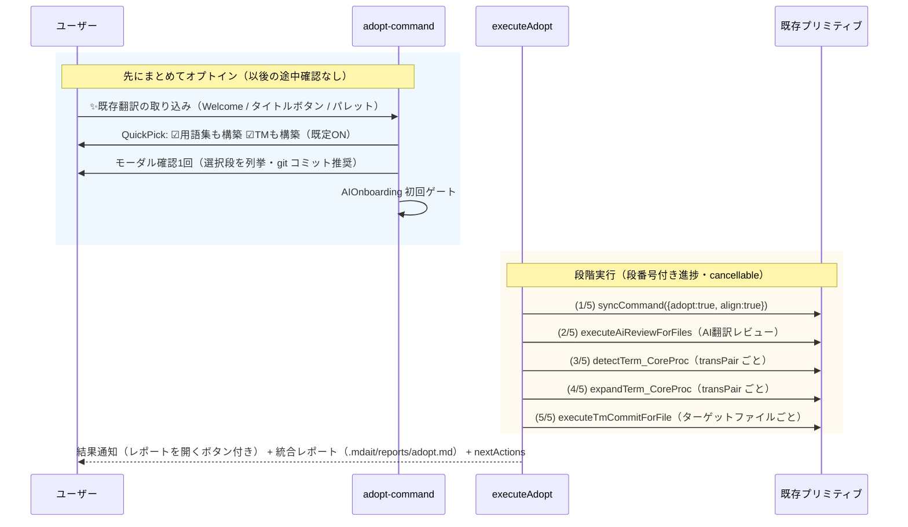

# command: adopt（既存翻訳の取り込みウィザード）

既存の対訳サイト（マーカーなしの既訳）を mdait 管理下へ載せるオンボーディングを、1操作の統合ウィザードとして提供する。`sync(adopt+align) → AI翻訳レビュー` の取り込みに加え、**用語集構築（term.detect → term.expand）と TM構築（tm.commit）をオプション段**として束ね、「使い始めに知識ストアまで整う」体験を実現する（ADR-260711-06）。

## 目的と位置づけ

- **これはオンボーディング機能である**: 実利用は「初めて既存文書を mdait 管理に載せるとき」に集中する。命名（既存翻訳の取り込み / Adopt Existing Translations）・導線（Welcome ビュー・初回同期前でも押せるタイトルボタン）・確認 UI の文言はすべてこの用途を主語にする。
- 定常運用の訳質監査は **AI翻訳レビュー**（`mdait.aiReview.*` の audit モード・[command_ai-review.md](command_ai-review.md)）が独立コマンドとして担う。役割分担: 取り込み＝adopt ウィザード、定期監査＝AI翻訳レビュー。
- 旧「AI同期（`mdait.aiSync.run`）」の後継。aiSync 語彙は廃止された（ADR-260711-06）。
- 管理済みサイトで再実行しても安全（各段冪等・adopt/align は no-op）だが、それを目的とする場合は AI翻訳レビューを直接使う方が適切。

### 設計原則（不変条件）

- **AI は明示起動時のみ**（ADR-260705-01): 確認 UI を冒頭に1回出し、実行する段（AI を使う処理）を動的に列挙する。
- **既訳の不可侵**: どの段も既存訳文の本文を変更しない。マーカー変異は sync(adopt) の `need:review` 付与とレビュー承認時の `need:review` 解除のみ。
- **薄いオーケストレーター**（ADR-260706-01): 各段のロジックは一切再実装せず、既存プリミティブへ配線するだけ。段は注入可能（`AdoptStages`）でテスト容易性を確保する。
- **review → tm の順序による TM 汚染なしの構造保証**: `isTmCommitTarget` は「from あり ∧ need なし」のみ対象（包括方式・ADR-260711-05）。レビューを通過（`need:review` 解除）したペアだけが TM に登録され、エスカレーション残りは構造的にスキップされる。

## UX フロー



- **オプトインは冒頭1回の QuickPick（canSelectMany）**: 「用語集も構築する（term.detect → term.expand）」「翻訳メモリも構築する（tm.commit）」。既定は両方 ON（推奨フロー = [guide-admin.md](../guide-admin.md) と一致）。TM 無効設定（`tm.enabled: false`）のときは TM 項目自体を出さない。
- 段ごとの逐次確認はしない（オンボーディングの敷居を上げるため。ADR-260711-06 却下案）。
- 進捗は総段数 n = 2 + (用語集?2:0) + (TM?1:0) の段番号付きメッセージ。tm 段はファイル単位（`{i}/{N} files`）で上書き報告。

### 起動導線

| 導線 | 条件 |
|------|------|
| Welcome ビュー（設定済み・初回同期前） | `mdaitConfigured && !mdaitHasStatus` — 「これから翻訳を始める → 初回同期」/「すでに翻訳済みの文書がある → 既存翻訳を取り込む」の2択 |
| StatusTree タイトルボタン `$(cloud-download)` | `mdaitConfigured && !mdaitSyncProcessing`（**mdaitHasStatus を要求しない** — 取り込みは初回同期前にこそ使う） |
| コマンドパレット | `mdait: ✨既存翻訳の取り込み` |
| Copilot Chat | `mdait_adopt`（LM tool） |

## アーキテクチャ

```
src/commands/adopt/
  adopt-core.ts             # executeAdopt / AdoptStages / AdoptOptions（薄い注入合成）
  adopt-command.ts          # VS Code コマンド（mdait.adopt.run）: QuickPick→確認→withProgress
  adopt-result.ts           # 純関数: AdoptOutcome 集計・レポート生成（ラベル注入・行リンク）・nextActions
  report-l10n.ts            # レポートラベルの l10n ファクトリ（VS Code 層）
  adopt-report-file.ts      # レポート本文の組み立て（書き出しは commands/shared/report-file.ts）
  align-core.ts             # AIアライン（sync_CoreProc へ注入。設計は command_ai-review.md）
  section-aligner.ts        # 〃
  align-result.ts           # 〃
  align-response-validator.ts # 〃
src/lm-tools/adopt-tool.ts  # mdait_adopt
```

AIアライン実装は取り込みの一部として `adopt/` に置くが、設計正典は [command_ai-review.md](command_ai-review.md)（審査プロトコル・二段トリアージ）にある。レビュー系（`src/commands/ai-review/`）とは `executeAiReviewForFiles` / `collectWorkspaceReviewTargets` / `generateReviewTableSection` を介して疎結合。

### オーケストレーター契約

```ts
interface AdoptOptions {
  dryRun?: boolean;        // レビューはレポートのみ・term/tm 段はスキップ（知識ストア非書き込み）
  buildGlossary?: boolean; // term.detect → term.expand
  buildTm?: boolean;       // tm.commit
}
interface AdoptStageError { stage: "termDetect" | "termExpand" | "tmCommit"; scope?: string; message: string; }
interface AdoptStages {
  runSync(options: SyncCommandOptions): Promise<SyncResult | undefined>;
  collectTargets(config: Configuration): Promise<string[]>;
  runReview(files, config, options: AiReviewOptions, progress, token): Promise<AiReviewFileResult[]>;
  collectSourceFiles(pair: TransPair, config: Configuration): Promise<string[]>;
  runTermDetect(pair: TransPair, sourceFiles: string[], progress, token): Promise<TermEntry[]>;
  runTermExpand(pair: TransPair, progress, token): Promise<TermExpandResult>;
  runTmCommit(targetFile: string, config: Configuration, progress, token): Promise<TmCommitResult>;
}
executeAdopt(config, options, progress, token, stages = defaultAdoptStages): Promise<AdoptOutcome>
```

`defaultAdoptStages` は既存プリミティブへの配線のみ:

| 段 | 配線先 | スコープ |
|----|--------|---------|
| (1) sync | `syncCommand({ adopt: true, align: true })` | ワークスペース全体 |
| (2) レビュー | `collectWorkspaceReviewTargets` → `executeAiReviewForFiles`（mode: pending） | 全ターゲット |
| (3) 用語検出 | `FileExplorer.getSourceFiles` → `UnitPairCollector.collectFromFiles` → `detectTerm_CoreProc` | transPair ごと |
| (4) 用語訳補完 | `expandTerm_CoreProc`（sourceFileFilter 省略 = 全ファイル） | transPair ごと |
| (5) TM 登録 | (2) の `collectTargets` 結果をループし `executeTmCommitForFile` を加算集計 | ターゲットファイルごと |

スコープはワークスペース全体で v1 固定（ADR-260706-01 の「全体の整合優先」を term/tm にも延長。SelectionState フィルタは適用しない）。

用語検出を取り込み直後に置くのは意図的である: adopt で対訳ペアが確立した直後は両言語同時抽出（`TERM_DETECT_PAIRS`）が最も効き、続く expand は確立したペアのコンテキストから訳語を推定できる。

### 実行制御

- **キャンセル**: 各段間で `token.isCancellationRequested` を確認して即 return。各 CoreProc 内部のキャンセル対応（完了分書き込み）はそのまま享受。全段冪等なので再実行で残りから再開できる（approve 済みは再列挙されない・term は重複マージ・TM は upsert）。
- **中断**: sync が undefined（設定不正等）なら `aborted: true` で全段中断（後段は一切実行しない）。
- **部分失敗**: オプション段（term/tm）の例外は `stageErrors` に記録して続行する。tm は term に依存しないため、term 失敗でも tm を実行する。レビュー段のバッチ単位エラーは従来どおり review 結果の error として扱う。
- **dryRun**: レビューはレポートのみ（マーカー不変）、term/tm 段はスキップ（用語集・TM に書き込まない）。レポートに dryRun であることを明記する。

### AdoptOutcome とレポート

```ts
interface AdoptOutcome {
  sync?: SyncResult;
  review: AiReviewFileResult[];
  term?: { detected: number; expanded: number; remaining: number };  // buildGlossary 時のみ
  tm?: { files; processedUnits; newEntries; existingEntries; warnedEntries; errorUnits };  // buildTm 時のみ（全ファイル加算集計）
  stageErrors: AdoptStageError[];
  dryRun: boolean;
  aborted: boolean;
}
```

- 結果通知: escalated / errors / stageErrors があれば warning、なければ info。adopted / align 修正 / 承認 / 用語 / TM 件数を1行で要約。
- レポート（実ファイル `.mdait/reports/adopt.md`、実行ごとに上書き）: sync サマリ → レビューサマリ＋ファイル別表（`generateReviewTableSection` を AI翻訳レビューと共有。ユニット列は該当箇所への行リンク `[title](<relpath#Lnn>)`）→ 用語集セクション → TM セクション（各オプション段は選択時のみ）→ stageErrors。見出し・定型文は `report-l10n.ts` のラベル注入で表示言語化（純関数の既定は英語）。パスは `Configuration.getReportFilePath("adopt")`。書き出しは `writeAdoptReport` →共通経路 `commands/shared/report-file.ts` の `writeReport`（人間の実行・`mdait_adopt` の双方で書く）。自動では開かず、完了通知の「レポートを開く」ボタンから Markdown プレビューで開く（`markdown.showPreview`。失敗時はテキストで開くフォールバック）。
- nextActions: escalated 残りあり → 「該当ユニットを確認し、解消後に AI翻訳レビュー / tm.commit を再実行」（**escalated 多数時に TM がほぼ空になるケースの受け皿**）。buildTm 未選択で承認あり → tm.commit を案内。全消化 → status 確認。

## LM tool 契約（mdait_adopt）

旧 `mdait_aiSync` の後継（modelDescription に "replaces mdait_aiSync" を明記）。

入力: `{ dryRun?: boolean, buildGlossary?: boolean, buildTm?: boolean }`（buildGlossary / buildTm 既定 false — エージェントは通常 `mdait_term` / `mdait_tm` を個別に計画するため。人間向け UI の既定 ON とは意図的に異なる）。マーカー・知識ストア書き込みを伴うため `prepareInvocation` で確認 UI を出し、`invoke` 内で AIオンボーディングを再確認する。

data: 旧 mdait_aiSync の `{sync, review, autoApprove, escalations, status}` に `term?: { detected, expanded, remaining }`・`tm?: { files, processedUnits, newEntries, existingEntries, warnedEntries, errorUnits }`・`stageErrors`・`reportPath`（統合レポートのワークスペース相対パス）を追加。ツール経由の実行でもレポートは実ファイルに書き出す（プレビューは開かない）。

## 設定

専用設定は持たない。各段が参照する既存設定（`aiReview.autoApprove` / `aiReview.batchSize`・`trans.maxUnitsPerRun`・`tm.enabled`・`terms.filename`）に従う。AIアラインのプロンプト上書きキーは `prompts["adopt.align"]`（[command_ai-review.md](command_ai-review.md)）。

## 取り込みパターン網羅マトリクス

「既存サイトを mdait 管理下に置く」際に起こりうるパターンと、それぞれがどの仕組みでどう扱われるかの正準一覧。**共通保証: どのパターンでも既存訳文の本文は1文字も変更されない**（唯一の例外は `from` が残った管理済み孤立ユニットへの `orphanTargetPolicy: "delete"`。マーカーなしの独自セクションは削除されず `need:review` で保護される — パターン3参照）。

| # | パターン | 現行の挙動（adopt + AI翻訳レビュー） | 完全解消する機能（状態） |
|---|---------|--------------------------------------|------------------------|
| 1 | ja/en 同一構造・内容も対応 | 全ペアが正しく `from` 確立 → レビューがほぼ全件を自動承認（低確信のみ kept で人間へ） | **実装済みで完結** |
| 2 | ja の章が en で欠落（中間） | 欠落地点以降が誤ペア化し誤った `from` が書かれる。レビューが **mismatch でエスカレーション**（検出まで。修正は[復旧手順](../guide-admin.md)で手動）。末尾で余った ja 章は `need:translate` 空ユニット生成 | AIアライン（**実装済み**） |
| 3 | ja に無い章が en に存在（訳文側の独自セクション） | マーカーなしの独自章は **`need:review` 一次受け**で保護される（削除も翻訳も決めつけず人間が「素hash化 / `need:isolate` / 削除」を選ぶ・[guide-admin.md](../guide-admin.md)）。誤ペア化は AIアラインの unmatchedTarget 識別で防止 | **実装済み**（一次受け＋AIアライン）。判断サーフェスは将来増分 |
| 4 | 章の順序入れ替え | 位置ベースのため誤ペア化 → mismatch 検出（修正は手動） | AIアライン（**実装済み**） |
| 5 | ペアは正しいが訳抜け・原文改訂に未追随 | レビューが **partial でエスカレーション**（issues に欠落箇所を列挙、hover/レポートに表示）。修正は手動 | AIレビュー拡張（修正提案化）＋判断サーフェスで孤立/漏れ 確定（将来増分） |
| 6 | en が原文コピーのまま（未翻訳） | 検証プロンプトの verdict 定義で match を禁止 — 全文未翻訳は mismatch、部分残留は partial に倒す | **実装済み** |
| 7 | en ファイル自体が無い | `syncNew` が全ユニット `need:translate` を生成 → 通常の trans フロー（adopt 不要） | **実装済みで完結** |
| 8 | ja に無いファイルが en にある | **sync はソースファイル起点のため触らない＝管理外のまま放置**（削除も検出もされない）。既知の限界 | 将来課題（未計画） |
| 9 | 見出しレベル設定の不一致 | `validateAndSyncLevel` が target の `mdait.sync.level` をソースに自動同期 | **実装済みで完結** |
| 9.5 | frontmatter に既訳がある（`title` / `description`） | 本文と同じ規則で採用し `need:review` を付ける。trans は `needsTranslation()` で弾くので人の書いたタイトルを上書きしない。原文が変われば `revise@` へ倒れる（ADR-260902-02） | **実装済みで完結**（AI翻訳レビューが本文と同じ1ペアとして判定し、承認されれば確認も外れる・ADR-260902-03） |
| 10 | 非 Markdown ファイル | PlainFileHandler の rebuild 安全網が `need:review` を付与（既訳保護）。AI翻訳レビューは対象外のため解除は手動 | AIレビュー拡張 |
| 11 | ja に原文のみの補足章がある（原文側の独自セクション・意図的） | `need:isolate` を付与すれば伝播停止（target 生成・translate/revise 付与なし。凍結）。sync/trans/TM の全経路が対象外として扱う | **実装済み**（`need:isolate`・[command_sync.md](command_sync.md) 孤立ユニットモデル）。宣言 CodeLens UI は将来増分 |

パターン2〜4 で書かれた誤った `from` リンクは、次回 sync の Phase 1（from ベースマッチング）が維持し続けるため自然には直らない。復旧手順（誤ペアのマーカー除去 → 構造修正 → 再 adopt）は [guide-admin.md](../guide-admin.md) を参照。mismatch には**誤リンク型**（カスケードズレ・復旧手順が必要）と**内容差し替え型**（位置は正しいが中身が別物・再翻訳でよい）があり、判断サーフェスでの区別は将来増分。孤立（原文/訳文/両方）の統合モデルは [command_sync.md](command_sync.md) の「孤立ユニットモデル」を参照。

## テスト戦略

- `executeAdopt` はスタブ `AdoptStages` 注入で検証: 全段オプトイン時の呼び出し順、buildGlossary/buildTm 未選択時の段スキップ、dryRun での term/tm スキップ、sync undefined → 後段なし、段間キャンセル、term 段例外 → stageErrors 記録＋tm 続行、冪等 no-op。
- `adopt-result` は純関数としてレポート生成・nextActions 分岐を検証。
- AI に触れる各段（レビュー・term・tm）は各モジュールでスタブ AIService により検証済み（再テストしない）。

## 制約・既知のリスク

- tm.commit 段にユニット数上限がない（`trans.maxUnitsPerRun` 非適用）。大規模サイトでは長時間化しうる — ファイル単位進捗＋キャンセル→冪等再開で緩和。上限適用は将来課題。
- `executeTmCommitForFile` はファイルごとに AIService を構築する既存挙動のまま（directory コマンドと同等。v1 許容）。
- QuickPick 既定 ON のため、escalated 多数のサイトでは TM がほぼ空になる。nextActions で「レビュー解消後に tm.commit 再実行」を必ず案内する。
- path スコープ（部分取り込み）・段間の細粒度進捗集約は将来課題。
