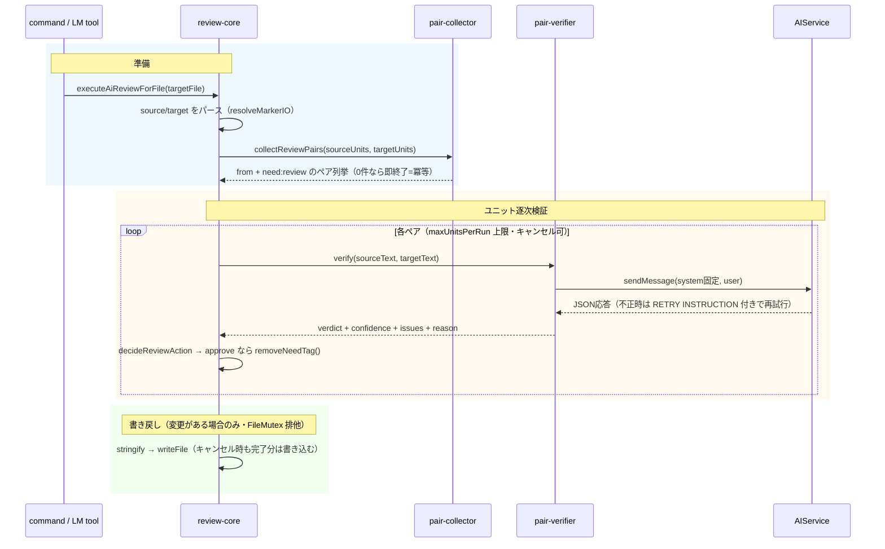

# command: ai-sync（AI支援同期）

既存対訳サイトの取り込み（adopt）を LLM で支援する機能ファミリー。位置ベースマッチングの限界（誤対応・翻訳漏れ・全件人手レビューの負荷）を、紐付け検証・内容レビュー・修正提案・エスカレーションの個別機能として段階的に解消する。

## 目的と全体像

`sync --adopt`（[command_sync.md](command_sync.md)、ADR-260704-02）の対応付けは SectionMatcher の位置ベース（Phase 2）であり、見出しタイトルも内容も見ない。そのため:

- 中間セクションの欠落・追加・順序入れ替えがあると、以降のペアが全てズレて誤った `from:` リンクが書かれる
- 内容が異なるセクション同士が紐付けられても検出されない
- 部分的な翻訳漏れ（訳抜け・原文改訂への未追随）を検出する仕組みがない
- 唯一の安全網が全ユニットの `need:review` 人手レビューで、大規模サイトでは非現実的

### 機能ロードマップ

| # | 機能 | 概要 | 状態 |
|---|------|------|------|
| ① | AIアライメント提案 | adopt 時にユニットスケルトン（見出し・ダイジェスト）から LLM がマッピング案を生成し、位置ベース Phase 2 を補強 | 未着手 |
| ② | AIペアリング検証 | adopt 済みペアごとに「target は source の忠実で完全な翻訳か」を LLM が判定し、高確信 match の `need:review` を自動クリア、それ以外をエスカレーション | **実装済み** |
| ③ | 翻訳網羅性・内容レビュー | partial 判定の issues を修正提案（revise 風パッチ）へ発展。非MD・frontmatter ユニットも対象化 | 未着手 |
| ④ | AI同期オーケストレーション | sync(adopt) → align → verify → report の一括実行（コマンド＋エージェントプレイブック） | 未着手 |

すべて既存の状態機械（マーカー・`need:` 語彙・冪等 sync）の上に乗る。新しい状態は導入しない（ADR-260704-07）。

## アーキテクチャ

CoreProc を `src/commands/ai-sync/` に置き、VS Code コマンドと LM tool の両面から呼ぶ（tm.commit と同構造、エンベロープは ADR-260704-01 準拠）。判定ロジック（verdict→action）は VS Code 非依存の純関数。

```
src/commands/ai-sync/
  review-result.ts             # 型定義 + decideReviewAction 純関数
  pair-collector.ts            # 純関数: 検証対象ペア列挙
  verify-response-validator.ts # AI応答のJSONバリデーション
  pair-verifier.ts             # AIService 呼び出し + リトライ
  review-core.ts               # executeAiReviewForFile: 1ファイル分の検証→マーカー変異→書き戻し
  review-command.ts            # VS Code コマンド（file/directory）
  review-result-provider.ts    # 仮想ドキュメントレポート
src/lm-tools/ai-review-tool.ts # mdait_aiReview
```

## ②AIペアリング検証

### データフロー



### 検証対象

`target.marker.from` があり `target.marker.need === "review"` の Markdown ユニットのみ。ソースユニットは `from` ハッシュの一致で解決し、見つからない場合は skipped（`need:review` 維持）。frontmatter ユニット・非MDファイルはスコープ外（増分③）。

### verdict 語彙と判定→アクション対応

| verdict | 意味 | 条件 | マーカー操作 | action |
|---------|------|------|--------------|--------|
| match | 忠実かつ完全な翻訳 | autoApprove ∧ issues空 ∧ confidence ≥ threshold | `removeNeedTag()` | approved |
| match | 〃 | 上記以外 | 変更なし | kept |
| partial | 対応関係はあるが不完全（訳抜け・追加・未追随） | — | 変更なし | escalated |
| mismatch | 別トピック。ペアリング自体が誤りの疑い | — | 変更なし | escalated |
| uncertain | 判定不能 | — | 変更なし | kept |
| （リトライ枯渇） | JSON不正が続いた | — | 変更なし | error |
| （source未解決） | from に対応するソースが無い | — | 変更なし | skipped |

マーカー変異は `removeNeedTag()` の1種類のみで、`hash`・`from`・本文には一切触れない。approve は CodeLens「Mark as Reviewed」手動ボタンと同じ結果状態であり、既存の trans / tm.commit / StatusTree セマンティクスにそのまま乗る。mismatch/partial の差別化はレポートと hover（`SummaryManager.reviewReasons`）で行い、新しい `need:` 値は導入しない（ADR-260704-07）。

### 冪等性・キャンセル

- approve されたユニットは `need:review` が消えるため次回実行で列挙されない（2回目実行は無変更）
- escalated/kept は `need:review` のまま残るため再実行で再検証される（判定が揺れる場合は human レビューへ）
- キャンセル時は完了分の approve のみ書き込む（冪等なので再実行で残りを処理できる）
- 1ユニットの失敗（リトライ枯渇・例外）はファイル全体を止めない（tm.commit と同方針）

### プロンプト契約（aiSync.verifyPairing）

`PromptIds.AI_SYNC_VERIFY_PAIRING = "aiSync.verifyPairing"`。system 部は変数なし（プレフィックスキャッシュ有効、[prompt.md](prompt.md) の user-section 分割）。`prompts["aiSync.verifyPairing"]` による外部ファイル上書き・`mdait-instructions.md` 注入は既存機構で自動対応。

期待レスポンス:

```json
{ "verdict": "match", "confidence": 0.95, "issues": [], "reason": "Faithful and complete translation." }
```

バリデーション: verdict が4値 enum・confidence が number（0..1 クランプ）でなければ retryable エラーとしてリトライ（system 固定・user message 末尾に RETRY INSTRUCTION 追記、`trans.retryLimit` と同じ最大2回）。リトライ枯渇時は `verdict: uncertain, confidence: 0` 相当（自動承認されない安全側）。

### 設定（aiSync.review）

```jsonc
"aiSync": {
  "review": {
    "autoApprove": true,          // false = レポートのみ（need:review を一切変更しないセーフモード）
    "autoApproveThreshold": 0.9,  // 自動承認の confidence 閾値（0..1 クランプ）
    "maxUnitsPerRun": 200         // 1実行あたりの検証ユニット上限（コスト暴走防止、1..1000 クランプ）
  }
}
```

### UI・レポート

- 進捗: `withProgress`（cancellable）。AI 初回利用は AIOnboarding ゲート
- 結果通知: escalated > 0 なら warning、それ以外は info
- レポート: `mdait-ai-review:` スキームの仮想ドキュメント（Markdown 表）。mismatch を先頭にソートし、**自動承認したユニットも必ず列挙**する（TM 登録可能状態への昇格を可視化）
- hover: `SummaryManager.reviewReasons` に `AI pairing review: {verdict} ({confidence}) — {reason}` を保存
- StatusTree: 変更なし（need:review 数の減少が自然に反映される）

### LM tool 契約（mdait_aiReview）

入力: `{ path?: string, dryRun?: boolean }`（path 省略はワークスペース全体。ファイル/ディレクトリ両対応）。マーカー書き換えを伴うため `prepareInvocation` で確認 UI を出す。

data:

```jsonc
{
  "files": { "scanned": 3, "withReviewUnits": 2 },
  "units": { "verified": 40, "approved": 31, "mismatch": 2, "partial": 4, "uncertain": 1, "keptBelowThreshold": 2, "errors": 0, "skipped": 0 },
  "autoApprove": { "enabled": true, "threshold": 0.9 },
  "escalations": [ { "file": "...", "unitHash": "...", "title": "...", "verdict": "mismatch", "confidence": 0.85, "reason": "..." } ]
}
```

nextActions: mismatch あり →「見出し対応を目視確認し、必要なら手動でユニットを並べ替えて mdait_sync 再実行」、approved あり →「mdait_tm (action:"commit") で承認済みペアを TM 登録」、全消化 →「mdait_getStatus で確認」。エージェント駆動の取り込みフローは [agent-orchestration.md](agent-orchestration.md) を参照。

## 将来増分の接続点

- **①AIアライメント提案**: `SectionMatcher.match()` Phase 2 の前に `AlignmentProposer` インターフェース（ユニットスケルトン → マッピング案 + confidence）を差し込むフックを想定。低確信マッピングは現行の位置ベースへフォールバック。②の検証がそのまま提案の品質ゲートになる
- **③翻訳網羅性・内容レビュー**: ②の partial 判定の issues を構造化し（欠落文の位置・種別）、revise 風の修正パッチ提案へ発展。非MD（PlainFileHandler の1ユニット全文）はトークン上限設計とあわせてここで対象化
- **④AI同期オーケストレーション**: `sync(adopt)` → ①align → ②verify → レポートの一括コマンド。エージェント側は既存ツール（mdait_sync → mdait_aiReview → mdait_tm）の組み合わせで先行実現できるため、プレイブック（docs/guide/ja/agent-playbook.md）の手順追記から始める

## テスト戦略

- 純関数（decideReviewAction / collectReviewPairs / validator）を単体テストの中心に置く
- pair-verifier / review-core はスタブ AIService（応答列を返す・呼び出しを記録）で検証
- 重点エッジケース: 冪等性（2回目無変更）、dryRun、途中キャンセルで完了分のみ書き込み、リトライ枯渇 → uncertain、autoApprove off、maxUnitsPerRun 上限
- 構造ズレの実サンプルは `src/test/unit/sample-content/{ja,en}/40_structure_mismatch.md` を利用

## 制約・既知のリスク

- LLM の自己申告 confidence は校正されていない。自動承認は三重条件（match ∧ issues空 ∧ 閾値以上）＋レポート必須列挙で緩和する（ADR-260704-07）
- 誤承認 → tm.commit 昇格の経路は残る。TM 品質が最重要の運用では `autoApprove: false` でレポートのみ運用にできる
- ユニット単位の並列化は v1 では見送り（書き込みはファイル末尾1回のため将来安全に追加可能）
