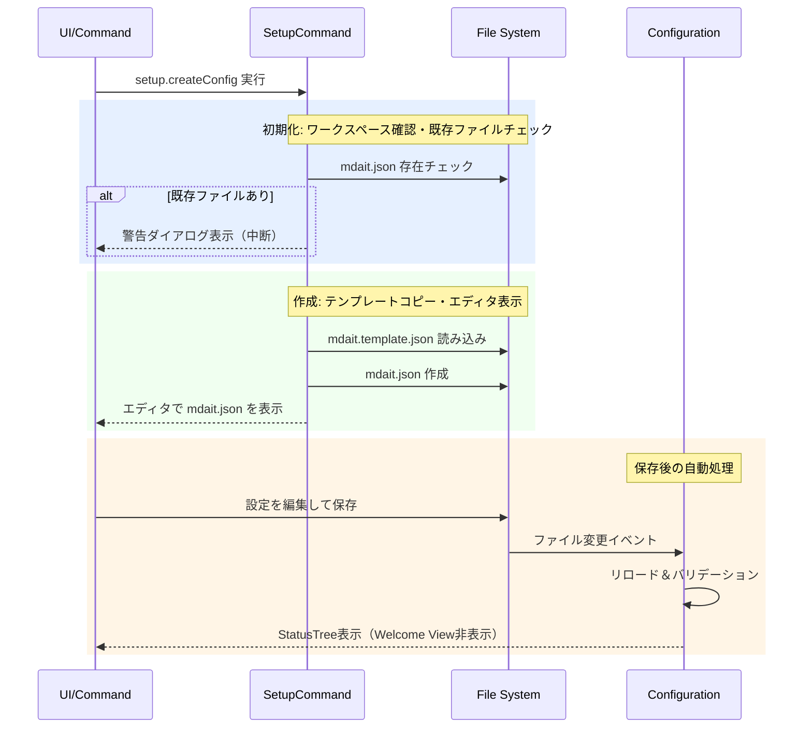

# setupコマンド

ワークスペースに`mdait.json`設定ファイルを作成し、翻訳ワークフローを開始できる状態にするコマンドです。

> **ワークフロー位置:** **setup** → [sync](command_sync.md) → [trans](command_trans.md) → [tm-commit](command_tm.md)

## 機能

### 何をするか

拡張機能にバンドルされたテンプレート（`mdait.template.json`）をワークスペースルートに`mdait.json`としてコピーし、エディタで開きます。保存・バリデーション成功後、StatusTreeが自動表示されてワークフローを開始できます。

### before/after

`mdait.json`がない状態でコマンドを実行すると、テンプレートが作成されてエディタで開かれます:

```
【実行前】ワークスペースルートに mdait.json なし → Welcome View のみ表示
【実行後】mdait.json 作成 → エディタで開く → 保存後 StatusTree 表示
```

### 前提・操作

**前提:** VS Codeでワークスペースフォルダーがオープンされていること。

| 操作 | 対象 | トリガー |
|---|---|---|
| コマンドパレット `mdait.setup.createConfig` | ワークスペースルート | ユーザー操作 |
| Welcome View の「Create Config」ボタン | ワークスペースルート | ユーザー操作 |

### 結果

| 状況 | 結果 | 意味 |
|---|---|---|
| `mdait.json`が存在しない | ファイル作成・エディタ表示 | 正常フロー |
| `mdait.json`が既に存在する | 警告ダイアログ表示 | 上書き保護 |
| 保存後バリデーション成功 | `mdaitConfigured`コンテキスト更新 | Welcome View非表示、StatusTree表示 |

### エラー処理

- **ワークスペース未オープン**: エラーメッセージを表示して処理中断
- **テンプレート不在**: 拡張機能の再インストールを促すメッセージを表示
- **設定バリデーション失敗**: 保存時に問題のある設定項目を通知

---

## 設計

### 概要

`createConfigCommand()`がバンドルの`mdait.template.json`をワークスペースルートにコピーし、`vscode.openTextDocument()`でエディタ表示します。その後`Configuration`がファイル変更イベントを検知してリロード・バリデーションし、`mdaitConfigured`コンテキスト変数を更新します。

### 処理フロー



### 設計ノート

- **テンプレート方式**: 手動作成の負担を軽減し、JSON Schema付きテンプレートから開始することでスムーズなオンボーディングを実現（[config.md](config.md) 参照）
- **既存ファイル保護**: 確認ダイアログで上書きを防止し、既存設定を保護
- **自動UI更新**: 設定ファイル保存後に`mdaitConfigured`コンテキスト変数を自動更新し、Welcome Viewを非表示にする（VS Code標準のコンテキスト機構を活用）

### 主要コンポーネント

| ファイル | 責務 |
|---|---|
| [`setup-command.ts`](../../src/commands/setup/setup-command.ts) | `createConfigCommand()` - テンプレートコピーとエディタ表示 |
| [`configuration.ts`](../../src/config/configuration.ts) | `Configuration` - 設定ファイル変更・リロード・バリデーション |
