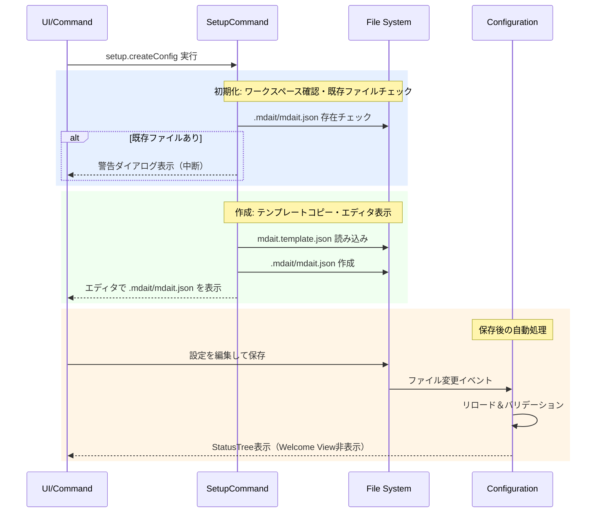
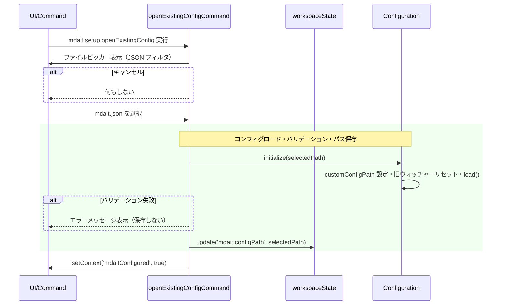

# setupコマンド

ワークスペースの`.mdait/mdait.json`設定ファイルを作成し、翻訳ワークフローを開始できる状態にするコマンドです。

> **ワークフロー位置:** **setup** → [sync](command_sync.md) → [trans](command_trans.md) → [tm-commit](command_tm.md)

## 機能

### createConfigCommand — 新規設定ファイルを作成

拡張機能にバンドルされたテンプレート（`mdait.template.json`）をワークスペースの`.mdait/mdait.json`としてコピーし（`.mdait`ディレクトリが存在しない場合は自動作成）、エディタで開きます。保存・バリデーション成功後、StatusTreeが自動表示されてワークフローを開始できます。

### openExistingConfigCommand — 既存の設定ファイルを選択

モノレポや大きなプロジェクトのサブフォルダにある既存の `mdait.json` をファイルピッカーで選択し、そのパスをカスタム設定パスとして登録します。選択後は `workspaceState` にパスを保存し、次回起動時も同じパスを使用します。

> **注意:** `transPairs` の `sourceDir`/`targetDir` は常に**ワークスペースルート相対**で記述してください（サブフォルダのコンフィグを指定した場合も同様）。

### before/after

`.mdait/mdait.json`がない状態でコマンドを実行すると、テンプレートが作成されてエディタで開かれます:

```
【実行前】.mdait/mdait.json なし → Welcome View のみ表示
【実行後】.mdait/mdait.json 作成 → エディタで開く → 保存後 StatusTree 表示
```

### 前提・操作

**前提:** VS Codeでワークスペースフォルダーがオープンされていること。

| 操作 | 対象 | トリガー |
|---|---|---|
| コマンドパレット `mdait.setup.createConfig` | ワークスペースルート | ユーザー操作 |
| Welcome View の「mdait.json を作成」ボタン | ワークスペースルート | ユーザー操作 |
| コマンドパレット `mdait.setup.openExistingConfig` | 任意のパス | ユーザー操作 |
| Welcome View の「設定ファイルを指定...」ボタン | 任意のパス | ユーザー操作 |

### 結果

| 状況 | 結果 | 意味 |
|---|---|---|
| `.mdait/mdait.json`が存在しない | ファイル作成・エディタ表示 | 正常フロー |
| `.mdait/mdait.json`が既に存在する | 警告ダイアログ表示 | 上書き保護 |
| 保存後バリデーション成功 | `mdaitConfigured`コンテキスト更新 | Welcome View非表示、StatusTree表示 |
| ファイルピッカーでキャンセル | 何もしない | — |
| 選択ファイルがバリデーション失敗 | エラーメッセージ表示・保存しない | Welcome View継続表示 |

### エラー処理

- **ワークスペース未オープン**: エラーメッセージを表示して処理中断
- **テンプレート不在**: 拡張機能の再インストールを促すメッセージを表示
- **設定バリデーション失敗**: 保存時に問題のある設定項目を通知

---

## 設計

### 概要

`createConfigCommand()`がバンドルの`mdait.template.json`をワークスペースの`.mdait/`配下にコピーし、`vscode.openTextDocument()`でエディタ表示します。その後`Configuration`がファイル変更イベントを検知してリロード・バリデーションし、`mdaitConfigured`コンテキスト変数を更新します。

### 処理フロー



### 設計ノート

- **テンプレート方式**: 手動作成の負担を軽減し、JSON Schema付きテンプレートから開始することでスムーズなオンボーディングを実現（[config.md](config.md) 参照）
- **既存ファイル保護**: 確認ダイアログで上書きを防止し、既存設定を保護
- **自動UI更新**: 設定ファイル保存後に`mdaitConfigured`コンテキスト変数を自動更新し、Welcome Viewを非表示にする（VS Code標準のコンテキスト機構を活用）

### 主要コンポーネント

| ファイル | 責務 |
|---|---|
| [`setup-command.ts`](../../src/commands/setup/setup-command.ts) | `createConfigCommand()` - テンプレートコピーとエディタ表示。`openExistingConfigCommand()` - 既存設定の選択と登録 |
| [`configuration.ts`](../../src/infra/config/configuration.ts) | `Configuration` - 設定ファイル変更・リロード・バリデーション |

---

## openExistingConfigCommand

### 何をするか

ファイルピッカーでユーザーが選択した `mdait.json` のパスを `workspaceState`（キー: `mdait.configPath`）に保存し、`Configuration.initialize(selectedPath)` でその設定をロードします。ロード成功後に `mdaitConfigured` コンテキストを更新し、StatusTree を表示します。

### 操作

| 操作 | 対象 | トリガー |
|---|---|---|
| Welcome View の「設定ファイルを指定...」ボタン | 任意パスの `mdait.json` | ユーザー操作 |

### 処理フロー



### 設計ノート

- **永続化**: `workspaceState` に保存するためリポジトリに含まれない（個人の作業環境設定）
- **起動時復元**: `extension.ts` が起動時に `workspaceState.get('mdait.configPath')` を読み出し `config.initialize(customPath)` に渡す。次回 VS Code 起動後も同じコンフィグが参照される
- **後方互換**: `customConfigPath` が未設定の場合はワークスペースルートの `.mdait/mdait.json` にフォールバック（既存動作を変えない）
