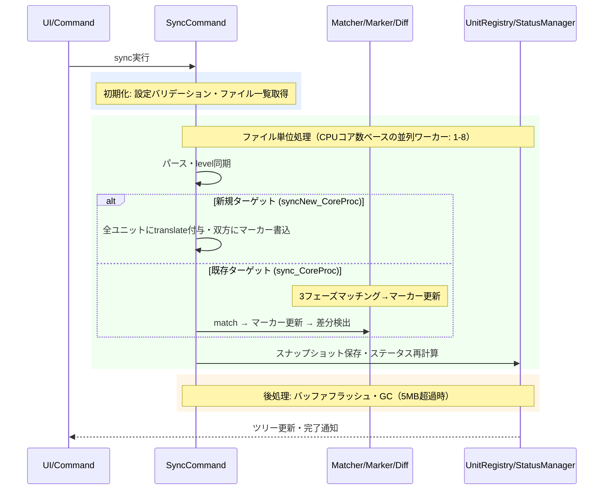

# syncコマンド

原文と訳文を同期し、翻訳が必要な箇所を自動検出するコマンドです。

> **ワークフロー位置:** [setup](command_setup.md) → **sync** → [trans](command_trans.md) → [tm-commit](command_tm.md)

## 機能

### 何をするか

syncは原文と訳文を比較して、翻訳が必要な箇所を見つけます。

原文（source）と訳文（target）のMarkdownを見出し（`##`等）単位のブロック（**ユニット**）に分割し、対応付けます。原文が変更されたユニットには**needフラグ**が自動付与され、翻訳ワークフローの起点となります。状態管理はMarkdown内のHTMLコメント（**mdaitマーカー**）で行います。

### before/after

原文の"Introduction"が変更され `hash:a1b2c3d4` → `hash:ff03a1b2` に更新された場合（`hash`=原文ハッシュ、`from`=訳文が対応する原文hash）:

```markdown
<!-- sync前のターゲット -->
<!-- mdait from:a1b2c3d4 hash:11111111 -->
## はじめに
これは古い導入文です。
```

```markdown
<!-- sync後のターゲット（fromが更新され、needフラグ付与） -->
<!-- mdait from:ff03a1b2 hash:11111111 need:revise@a1b2c3d4 -->
## はじめに
これは古い導入文です。
```

### 前提・操作

**前提:** `mdait.json`設定済み（[command_setup.md](command_setup.md)参照）。FrontMatter翻訳を行う場合は`trans.frontmatter.keys`設定が必要（[config.md](config.md)参照）。

| 操作 | 対象 | トリガー |
|---|---|---|
| コマンドパレット `mdait.sync` | 全ファイル一括 | ユーザー操作 |
| StatusTreeからのsync | 単一ファイル | ユーザー操作 |
| ファイル保存時の自動sync | 単一ファイル | `sync.autoSyncOnSave`有効（デフォルト）かつマーカーが存在する場合 |

### 結果

| 状況 | needフラグ | 意味 |
|---|---|---|
| 新規ターゲット作成 | `translate` | 未翻訳。全ユニットに付与 |
| ソース変更 | `revise@{oldhash}` | 原文が変わったので改訂が必要 |
| revise中にソース再変更 | `revise@{最初のoldhash}`維持 | 改訂基準点（変更前hash）を保持 |
| ターゲットのみ変更 | なし | hash更新のみ |
| 両方変更 | `revise` | 原文優先で改訂扱い（[design.md](../design.md) 哲学3参照） |
| ソースが `need:isolate` | 付与しない（凍結） | 伝播停止。hash/fromのみ更新し、target生成・translate/revise付与を行わない |
| 確認待ち（`need:review`）のソース変更 | `revise@{oldhash}` | 他と同じ扱い。**`from` は原文と必ずそろえて進める**（片側だけ止めると紐が切れて訳文が消える。ADR-260901-01）。移した件数は sync の結果（`totalReviewsSuperseded`）で通知する |
| レガシー `need:keep` / `need:backfill` | need除去 / `review` に変換 | `normalizeLegacyNeeds` による決定的マイグレーション |

FrontMatterも同一ルールで管理されます（`mdait.front`マーカー、ソース側にも付与）。

**孤立ターゲット**（対応する原文がないユニット）は三分岐で処理されます（詳細は後述の「[孤立ユニットモデル](#孤立ユニットモデルisolate-と独立ユニット)」節）:

| 条件 | 処理 |
|---|---|
| **独立ユニット**（永続化マーカーで `from` なし）または `need:isolate` | 無条件保持（独立ユニットは対応付け対象外。from 付き isolate は上流ペアを維持したまま凍結） |
| `from` が残っている（原文を失った管理済みユニット） | `sync.orphanTargetPolicy`: `"delete"`（デフォルト・削除）/ `"verify"`（`need:verify-deletion` 付与） |
| マーカーなしの管理外コンテンツ | `need:review` を付与して一次受け（削除も翻訳も決めつけず人間の判断へ） |

### エラー処理

- **個別ファイルエラー**: 他ファイルの処理に影響せず続行。エラーはStatusManagerに記録
- **設定エラー**: バリデーション失敗時は即時通知して処理中断
- **自動sync失敗時**: ログ記録のみ（UIを阻害しない）

---

## 設計

### 概要

2つの中核プロセスで構成されます:

- **syncNew_CoreProc**: 新規ターゲット生成。ソースをパースし全ユニットに`need:translate`を付与。ソース側にもマーカーを書き込む
- **sync_CoreProc**: 既存ターゲット同期。マッチング→マーカー更新→差分検出を順次実行

### 処理フロー



### 設計ノート

- **冪等性**: マーカーは常に現在のコンテンツから再計算される。何度実行しても同じ結果（[design.md](../design.md) P4参照）
- **ハッシュベース追跡**: VCSに依存せず任意の環境で動作。CRC32ハッシュを使用
- **SectionMatcher 3フェーズ**: ①targetの`from`とsourceの`hash`のハッシュ一致、②マッチ済みペア間の区間で順序ベース推定、③未マッチを孤立ユニットとして検出。独立ユニット（`independentTargets`）は対応付け対象外としてパススルー、`need:isolate` のsourceは①でのみマッチ可（②の対象外）
- **レガシーneedの正規化**: パース直後に `normalizeLegacyNeeds` が `keep`→need除去・`backfill`→`review` へ決定的に変換する（後述の「孤立ユニットモデル」節参照）
- **level同期**: 原文FrontMatterの`level`設定が訳文に自動同期される（[`validateAndSyncLevel()`](../../src/commands/sync/level-validator.ts)）
- **GC**: UnitRegistry合計5MB超過時のみ実行。未参照スナップショットを削除

### 孤立ユニットモデル（isolate と独立ユニット）

原文・訳文どちらにも「相手のいない章」（孤立ユニット）は往々にして意図的に存在する（片方言語だけの補足・FAQ・ローカル告知など）。「en が多い＝訳漏れ」「ja が多い＝翻訳対象」と機械的に決めつけると、意図された独自章を削除したり、翻訳すべきでない章を翻訳してしまう。本節が孤立の扱いの**正準定義**である（決定: [ADR-260711-05](../adr.md)・ADR-260706-02。TM 側の整合は [command_tm.md](command_tm.md)、AI取り込みフローとの関係は [command_adopt.md](command_adopt.md)）。

#### 中心原理: 孤立は「ユニットの属性」ではなく「ペア（方向）との関係」

あるユニットが孤立かどうかは、**どの翻訳ペア（方向）から見るか**で変わる。ピボット翻訳 `ja → en → {de, fr, ...}` では:

- 「en にはあるが ja に無い」章 → `ja→en` から見れば**訳文役割の孤立**（上流に origin なし）。だが `en→de` から見れば**正常な原文**（下流に展開すべき）
- 「本当に en だけにある」章 → **原文としても訳文としても孤立**（en ローカル専用）

したがって孤立は unit の boolean 属性ではなく、**役割（原文役割 / 訳文役割）ごとに独立**して判定される関係である。マーカー3枠への読み替え:

- **`from` の有無 = 上流起点の有無**。訳文役割の孤立は「from なし」で構造的に表現され、専用語彙は不要
- **`hash` の有無 = 下流アンカーになれるか**。hash があれば下流ペアが自動でそれを拾って `need:translate` を生成する（＝下流へ伝播する）
- 1マーカーが `hash`（下流用アンカー）と `from`（上流リンク）を**同時に持てる**ため、ピボットの「en は ja の訳文でありつつ他言語の原文」は既存構造で破綻しない（`ja→en→de` チェーンは実装・テスト済み）

必要な新語彙は「下流伝播を止めるか」の1ビット（`need:isolate`）のみ。原文側は「hash のみ」が翻訳待ちの正常状態でありそこに孤立の意味を載せられないため、**原文役割の孤立だけ**が明示語彙を必要とする。

役割の真理値表（from × isolate）:

| from | isolate | 役割 | 例 | マーカー |
|:---:|:---:|------|------|------|
| なし | OFF | 訳文としてのみ孤立（上流なし・下流あり） | グローバル版にはあるが ja に無い en 章 | `<!-- mdait {hash} -->` |
| 有/無 | **ON** | 原文としての孤立（下流に出さない） | ja 独自の補足章 | `<!-- mdait {hash} [from:x] need:isolate -->` |
| なし | ON | 両方孤立（真のローカル） | 本当に en だけの章 | `<!-- mdait {hash} need:isolate -->` |
| あり | OFF | 通常の対訳 | — | `<!-- mdait {hash} from:x -->` |

#### 独立ユニット（target 側パススルー保護）

**パース時点でファイルに永続化されたマーカー**を持つ target ユニットのうち、**from なし かつ `need !== "verify-deletion"`** のものを**独立ユニット**とする（素 hash / from なし `need:isolate` / need:review の一次受け保留 / その他の異常系も安全側で保持）。

独立ユニットは SectionMatcher の対応付け対象外・孤立処理（orphanTargetPolicy）の対象外で、無条件にパススルー保持される（`kept` として集計・不変・冪等）。

**from 付き `need:isolate` は独立ユニットにしない**: isolate は「下流に出さない」であって上流リンクの切断ではないため、上流ペアは Phase 1（from 一致）で維持され、need の凍結（後述）で伝播だけが止まる。原文消失で孤立した場合は分岐2の手前で isolate 自体が保持を保証する（policy 対象外）。

実装上の要点: `sync_CoreProc` は `ensureMdaitMarkerHash` でマーカーなしユニットにメモリ上の素 hash マーカーを合成するため、「ファイルに書かれていた素 hash（＝ユーザーの意図的な独立宣言）」と区別する必要がある。判定 Set（`independentTargets`）は `normalizeLegacyNeeds` 適用後・ensure **前**に構築し、`SectionMatcher.match` と `createSyncedTargets`（および AIアラインの locked 判定）に渡す。

#### 孤立ターゲットの三分岐

match 結果の `{source: null, target}` ペア（対応する原文が無い target）は3通りに分岐する:

| # | 条件 | 処理 | 集計 |
|---|------|------|------|
| 1 | 独立ユニット（`independentTargets` に含まれる）または `need:isolate` | パススルー保持 | `kept` |
| 2 | `from` が残っている（dangling）＝管理済みで原文を失った。from なしの `need:verify-deletion`（レガシー）も含む | `orphanTargetPolicy`: `delete`=削除 / `verify`=`need:verify-deletion` 付与 | `orphanVerified`（verify時） |
| 3 | `from` なし かつ独立ユニットでない（＝マーカーなしで書かれた管理外コンテンツ） | **穴あき一次受け**: `setNeed("review")`（from は付けない） | `orphanReviewed` |

分岐3の根拠は「**決めつけず人間へ**」: マーカーなしの訳文側コンテンツが「意図的な独自章」か「訳漏れの残骸」か「不要物」かは、ドキュメントの意図を知る人間にしか判断できない。sync は削除も翻訳も決めつけず `need:review` で保護し、人間が「素 hash 化（独自章宣言）/ `need:isolate` / 削除」を選ぶ（手順は [guide-admin.md](../guide-admin.md)）。adopt・定常 sync 共通。次回 sync では「永続化された from なし need:review」として独立ユニット（分岐1）になるため冪等。

旧モデルとの挙動差: 旧仕様ではマーカーなし孤立 target にも policy（デフォルト `delete`）が適用され黙って削除されていた。新モデルでは need:review 保護に変わる（安全側）。policy が適用されるのは分岐2（from dangling）のみ。

#### isolate の伝播停止セマンティクス（source 側）

`need:isolate` の source ユニットは「下流に翻訳需要を流さない」:

- **syncNew**: target 生成から除外される（target ファイルに出力されない）
- **match**: Phase 1（from 一致）でのみマッチ可。Phase 2（順序ベース推定）の対象外。Phase 1 でマッチしなかった isolate source は `{source, target: null}` として hash 更新のみ行う
- **空 target 非生成**: 未マッチの isolate source に対して `need:translate` の空 target ユニットを生成しない
- **ペア済みは凍結**: ペアの**どちらか一方**が isolate なら、`syncMarkerPair` は `suppressNeed` オプションで hash と from のみ更新し、`need:translate` / `need:revise` を一切付与しない（既存 need もそのまま）。target 側 isolate（ピボット中間ファイルの「下流に出さない」宣言）では、これが revise による isolate 上書きも防ぐ

**凍結ペアの注意点**: リンクは維持されるが新しい翻訳需要が流れないため、原文を改訂し続けると訳文が静かにドリフトする。isolate を解除（need を外す）すれば次回 sync が通常の revise 検出に復帰する。ドリフトした凍結ペアの TM 汚染は `sourcePending` スキップ（[command_tm.md](command_tm.md)）で防ぐ。

#### keep / backfill の廃止とマイグレーション

`need:keep` と `need:backfill` は廃止済み（ADR-260711-05）。廃止理由: 現実的な翻訳ワークフローで必要になる場面が非常に限定的だった。

- `keep`（保持＋伝播は hash 任せ）は「from なし・need なしの素 hash」＝独立ユニットと意味的に等価であり、専用語彙が不要（keep は常に from なしだった）
- `backfill`（訳文孤立を原文側へ逆翻訳で埋め戻す）は、原文ファイルへの書き込みという非対称な危険を伴う割に用途が限定的で、フローごと削除

マイグレーションは `normalizeLegacyNeeds` が担う（決定的・冪等・AI 不使用）。sync ではパース直後に source/target 両方へ、syncNew では source へ適用される（syncNew は target を新規生成するため target 側パースが存在しない）:

| レガシー need | 変換 | 意味 |
|---|---|---|
| `keep` | need 除去（素 hash 化） | 独立ユニットとして意味的に等価な形へ |
| `backfill` | `need:review` | source 側プレースホルダを人間ゲートへ。人間が「原文として整備して review 解除」か「ユニット削除」を判断（手順は [guide-admin.md](../guide-admin.md)） |

設定ファイルのレガシー値 `orphanTargetPolicy: "keep"` / `"backfill"` は警告ログを出して `"verify"` として解釈する（安全側）。型は `"delete" | "verify"` に縮小（スキーマ enum も同様）。

#### 粒度の限界と将来拡張

- **per-pair 粒度の限界**: マーカーは per-file・single-`from`。「en→de には出すが en→fr には出さない」を1マーカーで表すのは無理。v1 は「全下流に対して伝播ON/OFF」の粒度に割り切る。方向別抑制が要るなら `.mdait` の unit-state に方向キーで持つ将来拡張
- **孤立ロール宣言 UI・AIによる孤立分類提案・判断サーフェス**は将来増分（[command_ai-review.md](command_ai-review.md) の機能ロードマップ参照）

### アセットコピー

差分検出後、`sync_CoreProc` / `syncNew_CoreProc` の末尾で [`copyDiffAssets()`](../../src/commands/sync/asset-copier.ts) を呼び、**ユニット単位の原文側 diff**に基づいて相対パスのアセットを sourceDir から targetDir へコピーする。

| 条件 | コピー範囲 |
|---|---|
| ADDED（新規ユニット） | 新原文ユニット内の全相対パスアセット |
| UNCHANGED + `need:revise@{oldhash}` | unit-registry から旧原文（oldhash）を取得し、新原文パスに対して旧原文パスを差し引いた**新規追加パスのみ** |
| UNCHANGED + `need:translate`（`@` なし） | 旧原文が未知のため新原文の全パス（ADDED と同等扱い） |
| それ以外（`need` なし / `verify-deletion` / `review` / DELETED / MODIFIED） | コピーしない |

旧原文が unit-registry に無い場合は「差分不明として全コピー」の安全フォールバックを取る。

**除外フィルタ**:
- 外部URL（`http://` / `https://` / `//`）
- 絶対パス
- sourceDir 外（パストラバーサル）
- 存在しないファイル
- 翻訳対象拡張子（`.md` + `config.trans.extensions`、大文字小文字非依存）— これらは sync 自身の管理対象なので上書きしない
- `copyAssets` が拡張子ホワイトリストの場合、リスト外の拡張子

**制御設定** ([config.md](config.md) 参照):

| 値の型 | 解釈 |
|---|---|
| `true`（デフォルト） | 除外フィルタ通過後の全アセットをコピー |
| `false` / `[]` | コピーしない |
| `string[]`（例: `[".png", ".jpg"]`） | リストの拡張子だけをコピー（大文字小文字非依存） |

`transPairs[].copyAssets` が定義されていればペア単位で `sync.copyAssets` を上書き。解決ロジックは [`resolveCopyAssets()`](../../src/commands/sync/asset-copier.ts) に集約。

### 主要コンポーネント

| ファイル | 責務 |
|---|---|
| [`sync-command.ts`](../../src/commands/sync/sync-command.ts) | `syncCommand()` → `SyncResult`, `syncSingleFile()`, `sync_CoreProc()`, `syncNew_CoreProc()`。FileHandler dispatch化済み: ファイルタイプに応じて`MdFileHandler`/`PlainFileHandler`に委譲。UnitStateStoreのload/save/cleanupOrphansを管理 |
| [`file-handler-factory.ts`](../../src/commands/file-handler/file-handler-factory.ts) | `getFileHandler()` - 拡張子に基づくFileHandler振り分け（分岐の唯一の集約点） |
| [`md-file-handler.ts`](../../src/commands/file-handler/md-file-handler.ts) | `MdFileHandler` - MD用。`sync_CoreProc`/`syncNew_CoreProc`への委譲、DiffResult→FileSyncResult変換 |
| [`plain-file-handler.ts`](../../src/commands/file-handler/plain-file-handler.ts) | `PlainFileHandler` - 非MD用。UnitStateStore + UnitRegistryによるhash比較ベースの同期 |
| [`section-matcher.ts`](../../src/commands/sync/section-matcher.ts) | `match()` - 3フェーズユニット対応付け、`createSyncedTargets()` - 孤立処理 |
| [`diff-detector.ts`](../../src/commands/sync/diff-detector.ts) | `detect()` - 同期前後の差分検出 |
| [`marker-sync.ts`](../../src/commands/sync/marker-sync.ts) | `syncSourceMarker()`, `syncTargetMarker()`, `syncMarkerPair()` |
| [`level-validator.ts`](../../src/commands/sync/level-validator.ts) | `validateAndSyncLevel()` - level設定の検証と同期 |
| [`asset-copier.ts`](../../src/commands/sync/asset-copier.ts) | `AssetPathExtractor`（拡張ポイント）・`MarkdownAssetPathExtractor`・`copyDiffAssets()` - 差分に応じたアセットファイルのsourceDir→targetDirコピー |