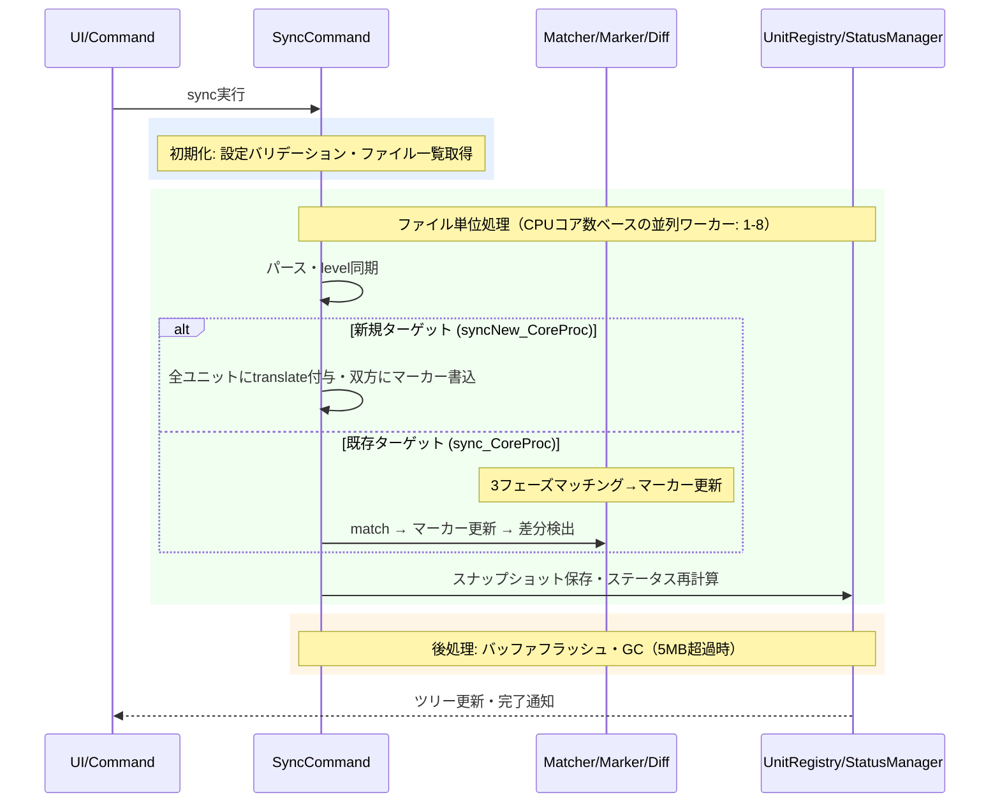

# syncコマンド

原文と訳文を同期し、翻訳が必要な箇所を自動検出するコマンドです。

> **ワークフロー位置:** [setup](command_setup.md) → **sync** → [trans](command_trans.md) → [tm-commit](command_tm.md)

## 機能

### 何をするか

syncは原文と訳文を比較して、翻訳が必要な箇所を見つけます。

原文（source）と訳文（target）のMarkdownを見出し（`##`等）単位のブロック（**ユニット**）に分割し、対応付けます。原文が変更されたユニットには**needフラグ**が自動付与され、翻訳ワークフローの起点となります。状態管理はMarkdown内のHTMLコメント（**mdaitマーカー**）で行います。

### before/after

原文の"Introduction"が変更され `hash:a1b2c3d4` → `hash:ff03a1b2` に更新された場合（`hash`=原文ハッシュ、`from`=訳文が対応する原文hash）:

```markdown
<!-- sync前のターゲット -->
<!-- mdait from:a1b2c3d4 hash:11111111 -->
## はじめに
これは古い導入文です。
```

```markdown
<!-- sync後のターゲット（fromが更新され、needフラグ付与） -->
<!-- mdait from:ff03a1b2 hash:11111111 need:revise@a1b2c3d4 -->
## はじめに
これは古い導入文です。
```

### 前提・操作

**前提:** `mdait.json`設定済み（[command_setup.md](command_setup.md)参照）。FrontMatter翻訳を行う場合は`trans.frontmatter.keys`設定が必要（[config.md](config.md)参照）。

| 操作 | 対象 | トリガー |
|---|---|---|
| コマンドパレット `mdait.sync` | 全ファイル一括 | ユーザー操作 |
| StatusTreeからのsync | 単一ファイル | ユーザー操作 |
| ファイル保存時の自動sync | 単一ファイル | `sync.autoSyncOnSave`有効（デフォルト）かつマーカーが存在する場合 |

### 結果

| 状況 | needフラグ | 意味 |
|---|---|---|
| 新規ターゲット作成 | `translate` | 未翻訳。全ユニットに付与 |
| ソース変更 | `revise@{oldhash}` | 原文が変わったので改訂が必要 |
| revise中にソース再変更 | `revise@{最初のoldhash}`維持 | 改訂基準点（変更前hash）を保持 |
| ターゲットのみ変更 | なし | hash更新のみ |
| 両方変更 | `revise` | 原文優先で改訂扱い（[architecture.md](../architecture.md) 哲学3参照） |

FrontMatterも同一ルールで管理されます（`mdait.front`マーカー、ソース側にも付与）。

**孤立ターゲット**（対応する原文がないユニット）: `sync.autoDelete`が`true`（デフォルト）なら自動削除、`false`なら`need:verify-deletion`を付与して保持。

### エラー処理

- **個別ファイルエラー**: 他ファイルの処理に影響せず続行。エラーはStatusManagerに記録
- **設定エラー**: バリデーション失敗時は即時通知して処理中断
- **自動sync失敗時**: ログ記録のみ（UIを阻害しない）

---

## 設計

### 概要

2つの中核プロセスで構成されます:

- **syncNew_CoreProc**: 新規ターゲット生成。ソースをパースし全ユニットに`need:translate`を付与。ソース側にもマーカーを書き込む
- **sync_CoreProc**: 既存ターゲット同期。マッチング→マーカー更新→差分検出を順次実行

### 処理フロー



### 設計ノート

- **冪等性**: マーカーは常に現在のコンテンツから再計算される。何度実行しても同じ結果（[architecture.md](../architecture.md) P4参照）
- **ハッシュベース追跡**: VCSに依存せず任意の環境で動作。CRC32ハッシュを使用
- **SectionMatcher 3フェーズ**: ①targetの`from`とsourceの`hash`のハッシュ一致、②マッチ済みペア間の区間で順序ベース推定、③未マッチを孤立ユニットとして検出
- **level同期**: 原文FrontMatterの`level`設定が訳文に自動同期される（[`validateAndSyncLevel()`](../../src/commands/sync/level-validator.ts)）
- **GC**: UnitRegistry合計5MB超過時のみ実行。未参照スナップショットを削除

### アセットコピー

差分検出後、`sync_CoreProc` / `syncNew_CoreProc` の末尾で [`copyDiffAssets()`](../../src/commands/sync/asset-copier.ts) を呼び、**ユニット単位の原文側 diff**に基づいて相対パスのアセットを sourceDir から targetDir へコピーする。

| 条件 | コピー範囲 |
|---|---|
| ADDED（新規ユニット） | 新原文ユニット内の全相対パスアセット |
| UNCHANGED + `need:revise@{oldhash}` | unit-registry から旧原文（oldhash）を取得し、新原文パスに対して旧原文パスを差し引いた**新規追加パスのみ** |
| UNCHANGED + `need:translate`（`@` なし） | 旧原文が未知のため新原文の全パス（ADDED と同等扱い） |
| それ以外（`need` なし / `verify-deletion` / `review` / DELETED / MODIFIED） | コピーしない |

旧原文が unit-registry に無い場合は「差分不明として全コピー」の安全フォールバックを取る。

**除外フィルタ**:
- 外部URL（`http://` / `https://` / `//`）
- 絶対パス
- sourceDir 外（パストラバーサル）
- 存在しないファイル
- 翻訳対象拡張子（`.md` + `config.trans.extensions`、大文字小文字非依存）— これらは sync 自身の管理対象なので上書きしない
- `copyAssets` が拡張子ホワイトリストの場合、リスト外の拡張子

**制御設定** ([config.md](config.md) 参照):

| 値の型 | 解釈 |
|---|---|
| `true`（デフォルト） | 除外フィルタ通過後の全アセットをコピー |
| `false` / `[]` | コピーしない |
| `string[]`（例: `[".png", ".jpg"]`） | リストの拡張子だけをコピー（大文字小文字非依存） |

`transPairs[].copyAssets` が定義されていればペア単位で `sync.copyAssets` を上書き。解決ロジックは [`resolveCopyAssets()`](../../src/commands/sync/asset-copier.ts) に集約。

### 主要コンポーネント

| ファイル | 責務 |
|---|---|
| [`sync-command.ts`](../../src/commands/sync/sync-command.ts) | `syncCommand()` → `SyncResult`, `syncSingleFile()`, `sync_CoreProc()`, `syncNew_CoreProc()`。FileHandler dispatch化済み: ファイルタイプに応じて`MdFileHandler`/`PlainFileHandler`に委譲。UnitStateStoreのload/save/cleanupOrphansを管理 |
| [`file-handler-factory.ts`](../../src/commands/file-handler/file-handler-factory.ts) | `getFileHandler()` - 拡張子に基づくFileHandler振り分け（分岐の唯一の集約点） |
| [`md-file-handler.ts`](../../src/commands/file-handler/md-file-handler.ts) | `MdFileHandler` - MD用。`sync_CoreProc`/`syncNew_CoreProc`への委譲、DiffResult→FileSyncResult変換 |
| [`plain-file-handler.ts`](../../src/commands/file-handler/plain-file-handler.ts) | `PlainFileHandler` - 非MD用。UnitStateStore + UnitRegistryによるhash比較ベースの同期 |
| [`section-matcher.ts`](../../src/commands/sync/section-matcher.ts) | `match()` - 3フェーズユニット対応付け、`createSyncedTargets()` - 孤立処理 |
| [`diff-detector.ts`](../../src/commands/sync/diff-detector.ts) | `detect()` - 同期前後の差分検出 |
| [`marker-sync.ts`](../../src/commands/sync/marker-sync.ts) | `syncSourceMarker()`, `syncTargetMarker()`, `syncMarkerPair()` |
| [`level-validator.ts`](../../src/commands/sync/level-validator.ts) | `validateAndSyncLevel()` - level設定の検証と同期 |
| [`asset-copier.ts`](../../src/commands/sync/asset-copier.ts) | `AssetPathExtractor`（拡張ポイント）・`MarkdownAssetPathExtractor`・`copyDiffAssets()` - 差分に応じたアセットファイルのsourceDir→targetDirコピー |