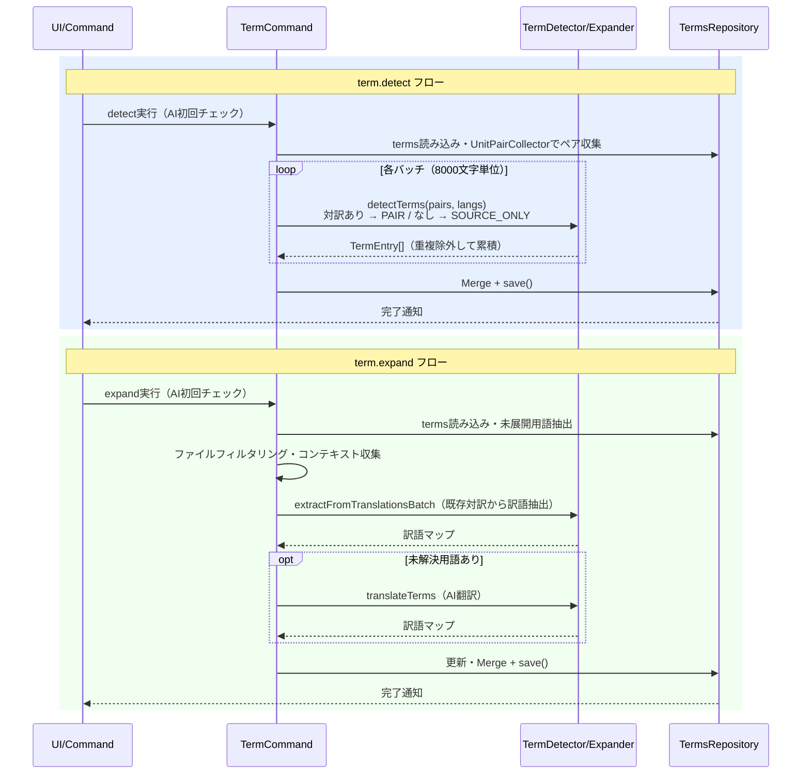

# termコマンド

用語集（`terms.csv`）を構築・管理するコマンドです。AIで原文から用語を検出（`detect`）したり、既存訳文から用語訳を推定して展開（`expand`）します。

> **ワークフロー位置:** （メインフローと独立）[trans](command_trans.md) ← 用語注入 ← **term**

## 機能

### 何をするか

`term.detect`はソースファイルをAI解析して新規用語候補を抽出し、`terms.csv`にマージします。`term.expand`は既存訳文ペアから未展開用語の訳語をAIで推定して補完します。蓄積された用語集は[trans](command_trans.md)実行時にプロンプトへ自動注入されます（`TranslationTermExtractor`）。

### before/after

`term.detect`で原文から用語を検出（`contextLang`=用語説明の言語）:

```csv
# term.detect実行前: terms.csv が空または対象用語なし
term,en,ja,context
```

```csv
# term.detect実行後: 新規用語が追加
term,en,ja,context
API endpoint,API endpoint,APIエンドポイント,An endpoint that accepts HTTP requests
```

`term.expand`で訳語が未設定の用語を補完:

```csv
# term.expand実行前: ja列が空
term,en,ja,context
Configuration,Configuration,,Setting for configuration
```

```csv
# term.expand実行後: ja列に訳語が補完
term,en,ja,context
Configuration,Configuration,設定,Setting for configuration
```

### 前提・操作

**前提:** AIプロバイダー設定済み（[config.md](config.md)参照）。`term.expand`はsync・trans実行後の翻訳済みファイルが対象。

| 操作 | 対象 | トリガー |
|---|---|---|
| `mdait.term.detect.directory` | ソースディレクトリ全ファイル | ユーザー操作 |
| `mdait.term.detect.file` | 単一ソースファイル | ユーザー操作 |
| `mdait.term.expand.directory` | ターゲットディレクトリ全ファイル | ユーザー操作 |
| `mdait.term.expand.file` | 単一ターゲットファイル | ユーザー操作 |
| `mdait.status.openTerm` | `.mdait/terms.csv` | StatusViewボタン（確認・手動編集用） |

### 結果

| 状況 | detect | expand |
|---|---|---|
| 新規用語を検出 | terms.csvに追加 | — |
| 既存用語と重複 | マージ（上書きなし） | — |
| 訳語未設定の用語あり | — | 訳語を補完 |
| 対訳ペアなし（detect時） | ソース単独プロンプトで処理 | — |

### エラー処理

- **バッチ処理エラー**: 警告ログ記録し次バッチへ続行
- **用語集保存エラー**: ユーザーに通知
- **ファイルが見つからない**: 情報メッセージ表示（まだ用語が登録されていない）

---

## 設計

### 概要

`TermDetector.detectTerms()`がユニットペアを8000文字単位でバッチ化してAI解析し、`TermsRepository`でCSVにマージします。`term.expand`は`TermExpander.expand()`が未展開用語を含むファイルのペアを収集してAIに訳語推定を依頼します。

### 処理フロー



### 設計ノート

- **プロンプト切り替え**: `term.detect`では対訳ペアがある場合は`TERM_DETECT_PAIRS`（両言語から同時抽出）、ない場合は`TERM_DETECT_SOURCE_ONLY`を使用
- **contextLang**: `primaryLang`が`sourceLang/targetLang`に含まれる場合はその値、含まれなければ`sourceLang`を使用
- **バッチサイズ**: 8000文字を上限としてバッチ分割。AI APIのトークン制限に対応
- **用語注入との連携**: `terms.csv`が存在する場合、[trans](command_trans.md)実行時に`TranslationTermExtractor`が翻訳対象ユニット内の用語を自動検出してプロンプトに注入

### 主要コンポーネント

| ファイル | 責務 |
|---|---|
| [`command-detect.ts`](../../src/commands/term/command-detect.ts) | `detectTermCommand()`, `detectTerm_CoreProc()` - 用語検出エントリーポイント |
| [`command-expand.ts`](../../src/commands/term/command-expand.ts) | `expandTermCommand()`, `expandTerm_CoreProc()` - 用語展開エントリーポイント |
| [`term-detector.ts`](../../src/commands/term/term-detector.ts) | `TermDetector.detectTerms()` - AI用語抽出 |
| [`term-expander.ts`](../../src/commands/term/term-expander.ts) | `TermExpander.expand()` - AI訳語推定 |
| [`unit-pair-collector.ts`](../../src/commands/term/unit-pair-collector.ts) | `UnitPairCollector` - ソース/ターゲットのペア収集 |
| [`command-open.ts`](../../src/commands/term/command-open.ts) | `openTermCommand()` - 用語集ファイルをエディタで開く |
