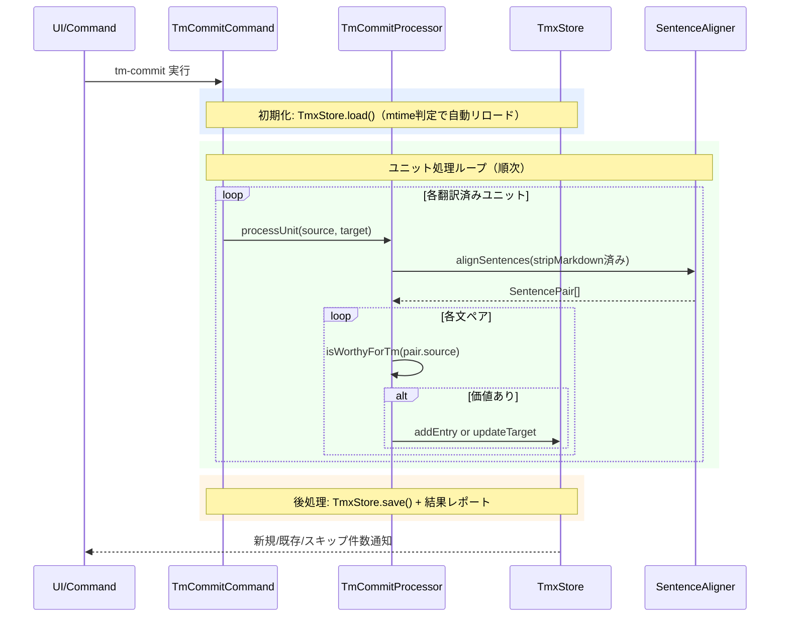

# tm-commitコマンド

翻訳済みユニットの対訳を文単位に分割してTMX翻訳メモリに登録するコマンドです。登録済みの対訳は次回trans実行時にLLMプロンプトへ参考情報として自動反映されます。

> **ワークフロー位置:** [trans](command_trans.md) → **tm-commit** → （ワークフロー終了）

## 機能

### 何をするか

翻訳済み（`from`ありかつ`need`なし）のユニットから対訳ペアをAI（SentenceAligner）で文単位に分割し、`.mdait/translations.tmx`に登録します。ユニットごとに`x-mdait-hash`で登録済みチェックを行い、既登録のユニットはスキップされます。

### before/after

`from:a1b2c3d4`（`from`=訳文が対応する原文hash）の翻訳済みユニットをtm-commit:

```markdown
<!-- tm-commit前: translations.tmx はこのユニットのエントリなし -->
<!-- mdait from:a1b2c3d4 hash:22222222 -->
## はじめに
これは導入文です。
```

```xml
<!-- tm-commit後: translations.tmx にエントリ追加 -->
<tu>
  <prop type="x-mdait-hash">a1b2c3d4</prop>
  <tuv xml:lang="en"><seg>This is an introduction.</seg></tuv>
  <tuv xml:lang="ja"><seg>これは導入文です。</seg></tuv>
</tu>
```

### 前提・操作

**前提:** 翻訳済みファイル（`from`ありかつ`need`なし）が存在すること。AIプロバイダー設定済み（[config.md](config.md)参照）。

| 操作 | 対象 | トリガー |
|---|---|---|
| StatusTreeからのtm-commit | ファイル単位 | ユーザー操作 |
| StatusTreeからのtm-commit | ディレクトリ単位 | ユーザー操作 |
| `mdait.status.openTm` | `.mdait/translations.tmx` | StatusViewボタン（確認・手動編集用） |

### 結果

| 条件 | 判定 | 理由 |
|---|---|---|
| `from`あり + `need`なし | 処理対象 | 翻訳済み |
| `from`あり + `need:review` | スキップ | 未承認（レビュー待ち） |
| `from`あり + `need:revise@*` | スキップ | 訳文が旧版 |
| `from`あり + `need:translate` | スキップ | 未翻訳 |
| `from`なし | スキップ | ソースファイルまたは未リンク |
| `x-mdait-hash`が既存TMXに一致 | スキップ | 登録済み |

**`need:review`ワークフロー:** trans実行 → 構造不一致で`need:review`付与 → 手動修正 → CodeLensの「Mark as Reviewed」でクリア → tm-commit実行可能。

### エラー処理

- **個別ユニットエラー**: ログ記録し後続ユニットの処理を継続
- **TMXファイル書き込みエラー**: ユーザーに通知して処理中断
- **キャンセル**: ユニット単位でキャンセルチェック

---

## 設計

### 概要

`TmCommitProcessor.processUnit()`がユニットごとにSentenceAlignerでLLMベースの文アライメントを実行します。登録前にstripMarkdownで正規化し、`isWorthyForTm()`で翻訳価値を判定します。trans検索時は同一のstripMarkdown処理でハッシュを計算し、TmxStoreで一括検索します。

### 処理フロー



### 設計ノート

- **明示的コミット原則**: ユーザーの明示的操作でのみ実行（プライバシー保護のため自動TM登録なし）
- **sourceHashベーススキップ**: TMXの`x-mdait-hash`でスキップ判定。原文1文字でも変わると再処理
- **stripMarkdown一貫性**: tm-commit（SentenceAligner内）とtrans検索時で同一処理を使用。Markdown記法の差異でTM参照を取りこぼさないよう設計
- **文分割非対称性**: tm-commit=LLM分割（高精度・一回のみ）、trans検索=正規表現分割（毎回実行・即時性重視）。分割差異よりも「誤参照の提示」を避けることを優先
- **LLM品質フィルター**: `tm.splitSentences`プロンプトでランダム文字列・プレースホルダー・URL等を自動除外。`isWorthyForTm()`で短文・数値のみ等をさらに除外（二段階フィルタリング）

### 主要コンポーネント

| ファイル | 責務 |
|---|---|
| [`tm-commit-command.ts`](../../src/commands/tm-commit/tm-commit-command.ts) | `TmCommitCommand` - エントリーポイント、進捗表示・キャンセル制御 |
| [`tm-commit-processor.ts`](../../src/commands/tm-commit/tm-commit-processor.ts) | `TmCommitProcessor.processUnit()` - ユニット処理コアロジック |
| [`sentence-aligner.ts`](../../src/commands/tm-commit/sentence-aligner.ts) | `SentenceAligner.alignSentences()` - LLMベース文アライメント |
| [`tmx-store.ts`](../../src/core/tm/tmx-store.ts) | `TmxStore` - TMXファイルI/O、インメモリインデックス、CRUD |
| [`sentence-splitter.ts`](../../src/core/tm/sentence-splitter.ts) | `SentenceSplitter` - 正規表現ベース文分割（trans検索用） |
