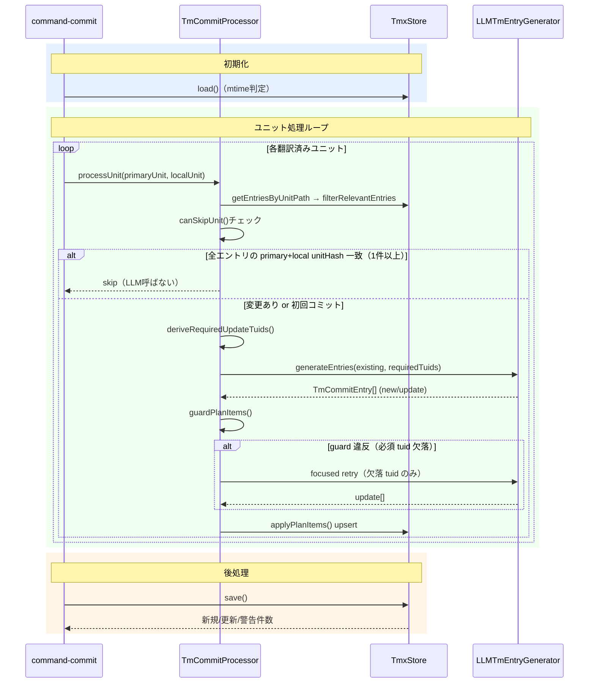

# tm-commit — 翻訳メモリへの guarded upsert

## 要約

翻訳済みユニットから primary sentence 単位の対訳ペアを抽出し、LLM が生成した登録計画を guard で検証してから `.mdait/translations.tmx`（TMX = Translation Memory eXchange。XMLベースの対訳保存フォーマット）に upsert する。次回 trans 実行時、TMX の対訳が参照情報として LLM へ自動注入され、翻訳一貫性を高める。

> **ワークフロー位置:** [trans](command_trans.md) → **tm-commit** → （ワークフロー終了）

---

## 機能仕様

### なぜやるのか

trans は毎回ゼロショットで翻訳するため、同じ原文が異なる訳文になりやすい。用語・文体の一貫性を保つには、過去の翻訳結果を蓄積して再利用できる仕組みが必要。

### 成功条件

- 翻訳済みユニットの primary sentence が TMX に正しく登録される
- 同一 primary sentence を再 commit しても冪等（重複登録なし、内容が変われば更新）
- ガード検証により不正な TU（誤った tuid・範囲外 primary・短すぎる文）が TMX に混入しない

### 非目標

- 翻訳の自動実行・自動 TM 登録（プライバシー保護のため必ず明示的操作が必要）
- TMX の手動編集 UI（`mdait.status.openTm` で直接開いて編集するのが担当範囲外）
- trans 実行時の TM 検索ロジック（→ [command_trans.md](command_trans.md) 参照）

### ユーザーから見た振る舞い

1. StatusTree でファイルまたはディレクトリを右クリック → **tm-commit** を選択
2. 進捗表示付きでユニットを順次処理（途中キャンセル可）
3. 処理完了後に「新規 N 件 / 更新 M 件 / 警告 K 件」を通知

**処理対象の条件:**

| 状態 | 判定 |
|---|---|
| `from` あり + `need` なし | **対象** |
| `need:translate` / `need:revise` / `need:review` | スキップ（未完了） |
| `from` なし | スキップ（ソースファイル） |

### 重要概念

- **tuid**: `hash(norm(primary sentence))` で一意に決まる TU の識別子。TmxStore が採番する（primary sentence = ユニット内の1文。文分割後の最小翻訳単位）
- **TmEntry / TmVariant**: TU = 1 primary sentence + 複数言語の variant（text, unitPath, unitHash）
- **ExistingTmEntries**: 処理ユニットに関連する既存 TU 一覧。LLM のコンテキストとして渡す
- **TmCommitEntry**: LLM が返す登録計画の単位 `{type, tuid, primary, local}`

```json
// 新規: tuid は LLM が "-" で返す
{ "type": "new", "tuid": "-", "primary": "This is an introduction.", "local": "これは導入文です。" }
// 更新: LLM が既存 tuid を指定
{ "type": "update", "tuid": "e1f2a3b4", "primary": "Click OK to proceed.", "local": "OK をクリックして続行します。" }
```

---

## 設計

### 構造

```
command-commit.ts   ← エントリーポイント・フィルタ・進捗制御
  └── commit-processor.ts  ← メインオーケストレーター
        ├── tmx-store.ts         ← 永続化（インメモリ Map + TMX ファイル）
        └── tm-entry-generator.ts ← LLM呼び出し・計画生成
```

`command-commit.ts` が対象ユニットを絞り込み、`commit-processor.ts` がユニットごとの処理を担う。LLM との通信は `tm-entry-generator.ts` に閉じており、永続化は `tmx-store.ts` が担う。

### TM 登録の 3 フロー

| フロー | type | tuid の扱い | 発生条件 |
|---|---|---|---|
| **新規登録** | `"new"` | LLM は `"-"` を返す → Store が `hash(norm(primary))` を採番 | TMX に該当 TU が存在しない |
| **必須更新** | `"update"` | LLM が既存 tuid を返す（必須） | `deriveRequiredUpdateTuids()` が導出 |
| **任意更新** | `"update"` | LLM が既存 tuid を返す（任意） | LLM が refine を判断、guard を通れば適用 |

**必須更新の判定条件** (`deriveRequiredUpdateTuids()`):
- その TU の `localVariant` が存在しない
- `localSentence` が現在の localUnit テキスト内に見当たらない
- `unitHash`（localUnitHash）が変わっている

必須更新は guard で「TmCommitEntry に含まれているか」を検証し、欠落があれば focused retry を行う。

### 実行時の流れ

1. `isTmCommitTarget()` で処理対象ユニットをフィルタリング
2. `TmxStore.load()`（mtime 判定で自動リロード）
3. ユニットごとに `stripMarkdown()` → primaryUnit / localUnit のテキスト確定
4. `store.getEntriesByUnitPath()` → `filterRelevantEntries()` で関連 TU を絞り込み
5. **`canSkipUnit()`** — 全エントリの primary + local `unitHash` が現在と一致する場合、LLM 呼び出しをスキップ（0件の場合はスキップ不可）
6. `deriveRequiredUpdateTuids()` で必須更新 tuid セットを導出
7. `LLMTmEntryGenerator.generateEntries()` で LLM 呼び出し → `TmCommitEntry[]` を取得
8. `guardPlanItems()` で検証（schema / subset / 粒度 / 必須更新の網羅）
9. guard 違反があれば **focused retry**（欠落 required tuid の local 補完のみ再生成）
10. `applyPlanItems()` で TmxStore に upsert → save

### 検討した代替案

- **単一 hash スキップ（廃止）**: primary `unitHash` のみ比較して全スキップ → 訳文を手動修正しても TMX に反映されない問題があり廃止
- **dual-hash スキップ（現行）**: `canSkipUnit()` が primary + local の両 `unitHash` を全エントリで照合。両方一致かつ 1 件以上ある場合のみスキップ。条件外れが 1 件でもあれば LLM を呼ぶ
- **guard なし全件登録**: LLM 出力をそのまま登録 → 誤 primary（ユニット外の文）や短文ノイズが混入するリスクが高く不採用。guard + focused retry が妥当

### リスク

- **LLM の tuid 誤り**: 存在しない tuid を `update` で返す → guard の schema 検証で弾く
- **focused retry の無限ループ**: retry 1 回で解決しない場合は guard 通過済み分だけ保存し、未解決を warning で通知して打ち切る

### シーケンス図



### コードマップ

| ファイル | 役割 |
|---|---|
| [command-commit.ts](../../src/commands/tm/command-commit.ts) | エントリーポイント。`isTmCommitTarget()` フィルタ、`withProgress` 制御 |
| [commit-filter.ts](../../src/commands/tm/commit-filter.ts) | `isTmCommitTarget()` の実装 |
| [commit-processor.ts](../../src/commands/tm/commit-processor.ts) | 核心。guard / retry / upsert のオーケストレーション |
| [tm-entry-generator.ts](../../src/commands/tm/tm-entry-generator.ts) | LLM 呼び出し。`TM_SPLIT_SENTENCES` プロンプトで計画生成 |
| [tmx-store.ts](../../src/core/tm/tmx-store.ts) | TU 永続化。tuid 採番・variant 管理 |
| [types.ts](../../src/core/tm/types.ts) | `TmEntry` / `TmVariant` / `TmCommitEntry` の型定義 |
