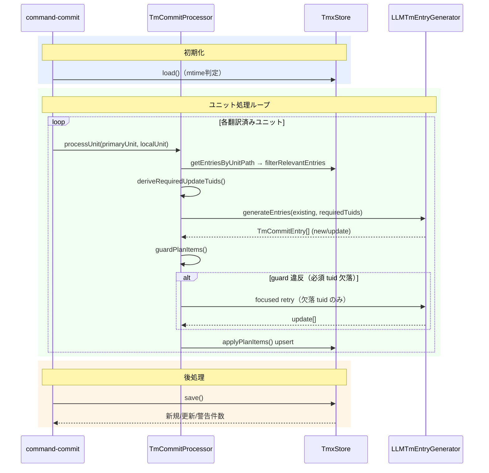

# tm-commit — 翻訳メモリへの upsert

## 要約

TMX（Translation Memory eXchange）を管理するコマンド。
`tm-commit` は翻訳済みユニットから対訳ペアを TMX へ upsert する。
trans 実行時、TMX の対訳が LLM への参照情報として自動注入され、翻訳一貫性を高める。

> **ワークフロー位置:** [trans](command_trans.md) → **tm-commit**

| コマンド | 責務 |
|---|---|
| `tm-commit` | 翻訳済みユニットから TU を upsert（登録・更新） |
| `sync` | TM の削除を呼ばない（unit 同期に限定） |

## ファイルの形

**1 TU = 1 行**で書く（ADR-260908-01）。整形して1つの TU を10行ほどに散らすと、2人が別々の文を登録しただけで行が隣り合ってぶつかる（実測: 500件へ両側20件ずつで 16/20）。1行なら `.mdait/.gitattributes` の `translations.tmx merge=union` が効き、両方の行が残る。合流で同じ tuid の行が2つ並んだら、読み込みが訳を言語ごとに拾い集めて畳む。

**検索重みは持たない**（ADR-260908-01 で廃止）。手元の原稿からしか決まらない派生値を共有資産に載せると、`tm commit` のたびに全件が書き換わり、共有していないエントリまで巻き込んで競合した。

**合流の途中の TM には触らない**（ADR-260908-02）。競合マーカーが残っていたら読まず、書き込みも拒む。読めたところまでを受け取って書き戻すと、失われたことに気づく手掛かりが残らない。

## 操作

### tm-commit

1. StatusTree でファイル／ディレクトリを右クリック → **tm-commit**
2. 進捗通知付きでユニットを順次処理（途中キャンセル可）
3. 完了後「新規 N 件 / 更新 M 件 / 警告 K 件」を通知（レポートを開くボタン付き）

**処理対象の条件**（包括方式: 「`from` あり ∧ `need` なし」のみ対象。need の列挙による除外ではないため、未知の need が素通りする穴がない）:

| 状態 | 判定（`TmSkipReason`） |
|---|---|
| `from` あり + `need` なし（source 側も need なし） | **対象** |
| `from` なし | スキップ `noFrom`（ソースファイル・独立ユニット） |
| `need:translate` / `need:revise` / `need:review` / `need:isolate` | スキップ `needTranslate` / `needRevise` / `needReview` / `needIsolate` |
| その他の `need`（`verify-deletion` 含む） | スキップ `needOther` |
| **source 側ユニットに `need` が残っている** | スキップ `sourcePending`（isolate 凍結ペアやレガシー backfill→review プレースホルダのドリフトによる TM 汚染防止。ペア解決時に commit 側で判定） |

孤立モデルとの整合（[command_sync.md](command_sync.md) の「孤立ユニットモデル」参照）:

- **包括方式の由来**: 列挙式除外では未知の need が素通しされる穴があった（ADR-260704-07 の既知の潜在バグ）。「from あり ∧ need なし」のみ対象とする包括方式で構造的に塞いだ（ADR-260711-05）
- **独立ユニット**（from なし）は `noFrom` で自然に除外される
- **`sourcePending`** はペア解決時に source 側ユニットの marker に need が付いている場合のスキップ。ドリフトした isolate 凍結ペアや、レガシー backfill→review の同一内容プレースホルダによる TM 汚染を防ぐ。`classifyTmSkipReason` 自体は target 単体の純関数のままで、sourcePending は commit 側で付与する
- **primary ancestor との接続**: TM は翻訳方向相対でなく primary origin を追う。孤立ユニットの primary は「自分自身」とみなす（上流が無いため）

## 処理フロー

### tm-commit

### 完了後プレビュー

新規/更新件数が 1 件以上あれば `.mdait/reports/tm.md` へレポートを書き出す（`tm-report-file.ts` → 共通経路 `commands/shared/report-file.ts`）。
自動では開かず、完了通知の「レポートを開く」ボタンから開く。実行ごとに上書きする。
本文生成（`tm-result-content.ts`）は VS Code 非依存の純関数のまま、見出し・定型文はプロバイダーからのラベル注入で表示言語化する（既定は英語。ADR-260719-01）。

## コードマップ

| ファイル | 役割 |
|---|---|
| [command-commit.ts](../../src/commands/tm/command-commit.ts) | tm-commit エントリーポイント。フィルタ・`withProgress` 制御・プレビュー呼び出し |
| [commit-processor.ts](../../src/commands/tm/commit-processor.ts) | 核心。guard / retry / upsert のオーケストレーション |
| [commit-filter.ts](../../src/commands/tm/commit-filter.ts) | `isTmCommitTarget()` の実装 |
| [tm-entry-generator.ts](../../src/commands/tm/tm-entry-generator.ts) | LLM 呼び出し。`TM_SPLIT_SENTENCES` プロンプトで登録計画を生成 |
| [tm-result-provider.ts](../../src/commands/tm/tm-result-provider.ts) | 完了後プレビュー（`TextDocumentContentProvider`、シングルトン） |
| [tm-query.ts](../../src/core/tm/tm-query.ts) | `buildSentenceQueries()` の実装。`Intl.Segmenter` による文分割 |
| [tmx-store.ts](../../src/core/tm/tmx-store.ts) | TU 永続化。tuid 採番・variant 管理・インメモリ Map + TMX ファイル |
| [types.ts](../../src/core/tm/types.ts) | `TmEntry` / `TmVariant` / `TmCommitEntry` の型定義 |
