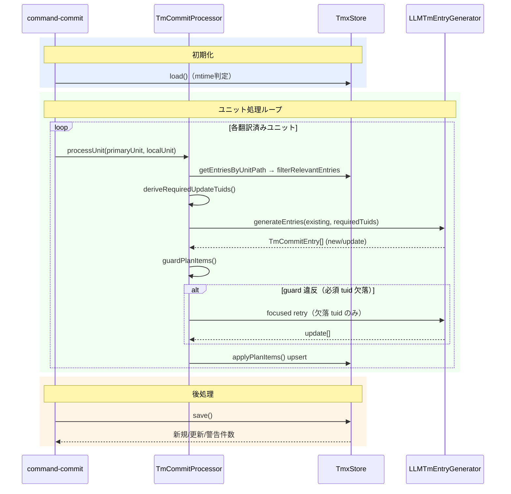
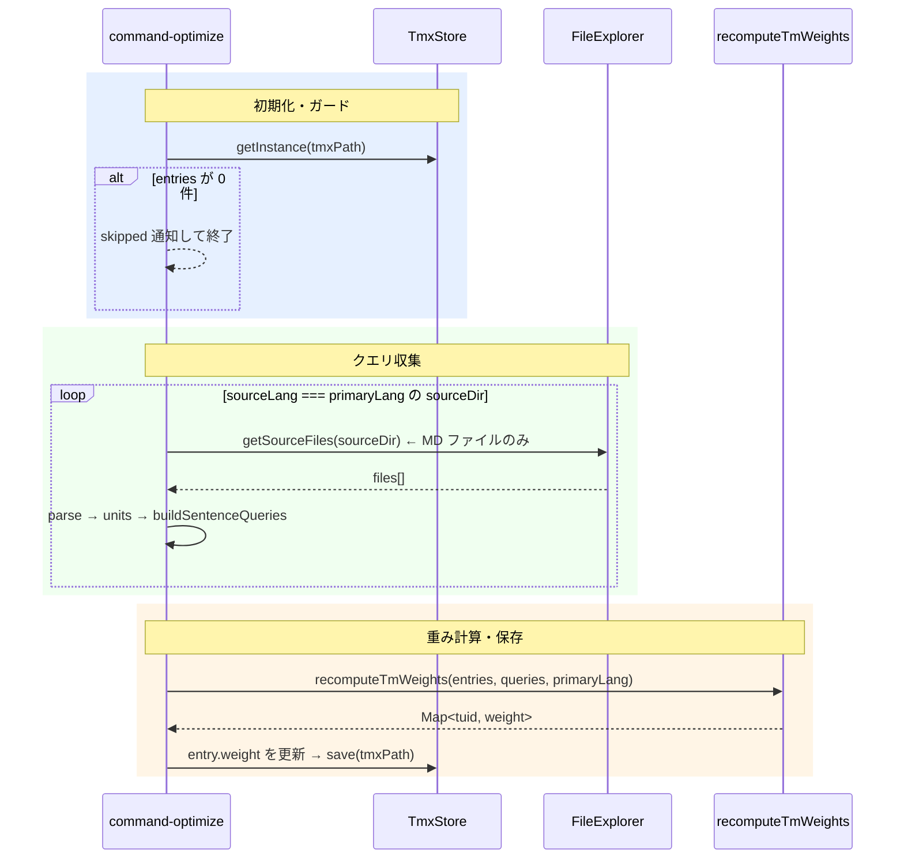

# tm-commit / tm-optimize — 翻訳メモリへの upsert と重み最適化

## 要約

TMX（Translation Memory eXchange）を管理する 2 つのコマンド。
`tm-commit` は翻訳済みユニットから対訳ペアを TMX へ upsert し、`tm-optimize` は現行コーパスを基に各 TU（Translation Unit）の検索重み（`x-wt`）を再計算する。
trans 実行時、TMX の対訳が LLM への参照情報として自動注入され、翻訳一貫性を高める。

> **ワークフロー位置:** [trans](command_trans.md) → **tm-commit** → （任意）**tm-optimize**

| コマンド | 責務 |
|---|---|
| `tm-commit` | 翻訳済みユニットから TU を upsert（登録・更新） |
| `tm-optimize` | 現行コーパスを基に `x-wt`（検索重み）を冪等再計算 |
| `sync` | TM の削除・最適化を呼ばない（unit 同期に限定） |

## 操作

### tm-commit

1. StatusTree でファイル／ディレクトリを右クリック → **tm-commit**
2. 進捗通知付きでユニットを順次処理（途中キャンセル可）
3. 完了後「新規 N 件 / 更新 M 件 / 警告 K 件」を通知、結果を仮想ドキュメントで表示

**処理対象の条件**（包括方式: 「`from` あり ∧ `need` なし」のみ対象。need の列挙による除外ではないため、未知の need が素通りする穴がない）:

| 状態 | 判定（`TmSkipReason`） |
|---|---|
| `from` あり + `need` なし（source 側も need なし） | **対象** |
| `from` なし | スキップ `noFrom`（ソースファイル・独立ユニット） |
| `need:translate` / `need:revise` / `need:review` / `need:isolate` | スキップ `needTranslate` / `needRevise` / `needReview` / `needIsolate` |
| その他の `need`（`verify-deletion` 含む） | スキップ `needOther` |
| **source 側ユニットに `need` が残っている** | スキップ `sourcePending`（isolate 凍結ペアやレガシー backfill→review プレースホルダのドリフトによる TM 汚染防止。ペア解決時に commit 側で判定） |

孤立モデルとの整合（[command_sync.md](command_sync.md) の「孤立ユニットモデル」参照）:

- **包括方式の由来**: 列挙式除外では未知の need が素通しされる穴があった（ADR-260704-07 の既知の潜在バグ）。「from あり ∧ need なし」のみ対象とする包括方式で構造的に塞いだ（ADR-260711-05）
- **独立ユニット**（from なし）は `noFrom` で自然に除外される
- **`sourcePending`** はペア解決時に source 側ユニットの marker に need が付いている場合のスキップ。ドリフトした isolate 凍結ペアや、レガシー backfill→review の同一内容プレースホルダによる TM 汚染を防ぐ。`classifyTmSkipReason` 自体は target 単体の純関数のままで、sourcePending は commit 側で付与する
- **primary ancestor との接続**: TM は翻訳方向相対でなく primary origin を追う。孤立ユニットの primary は「自分自身」とみなす（上流が無いため）

### tm-optimize

- StatusTree タイトルバー or コマンドパレット → **✨TM Optimize**
- 完了通知: 「TM optimize completed: N entries reweighted.」
- TM エントリが 0 件の場合は「TM optimize skipped」で即終了

## 処理フロー

### tm-commit



### tm-optimize



- `buildSentenceQueries` は MD ユニットのテキストを `Intl.Segmenter` で文分割してクエリ化する
- 非 MD ファイル（.txt 等）はユニット概念がないためクエリを構築できず、**意図的に除外**している
- クエリ収集は重複を `Set<string>` で排除

## 設計ノート

### 重要概念

- **tuid**: `hash(norm(primary sentence))` で一意に決まる TU 識別子。TmxStore が採番する
- **TmEntry / TmVariant**: TU = 1 primary sentence + 複数言語の variant（text のみ）
- **TmCommitEntry**: LLM が返す登録計画の単位 `{type, tuid, primary, local}`

```json
{ "type": "new",    "tuid": "-",        "primary": "This is an introduction.", "local": "これは導入文です。" }
{ "type": "update", "tuid": "e1f2a3b4", "primary": "Click OK to proceed.",     "local": "OK をクリックして続行します。" }
```

| フロー | type | tuid の扱い | 発生条件 |
|---|---|---|---|
| **新規登録** | `"new"` | LLM は `"-"` を返す → Store が採番 | TMX に該当 TU が存在しない |
| **必須更新** | `"update"` | LLM が既存 tuid を返す（必須） | `deriveRequiredUpdateTuids()` が導出 |
| **任意更新** | `"update"` | LLM が既存 tuid を返す（任意） | LLM が refine を判断、guard を通れば適用 |

**必須更新の判定条件** (`deriveRequiredUpdateTuids()`):
- その TU の `localVariant` が存在しない
- `localSentence` が現在の localUnit テキスト内に見当たらない

### LLM応答の検証について

LLM の応答をそのまま全件登録すると、ユニット範囲外の文や短すぎるノイズ文が TM に混入することがある。
これを防ぐため、`guardPlanItems()` で応答内容を以下の4点で検証する。

| 検証項目 | 内容 |
|---|---|
| schema | 応答の JSON 形式が正しいか |
| subset | 応答 tuid が既知の tuid の範囲内か（未知 tuid の混入を防ぐ） |
| 粒度 | 文の長さが適切か（短文ノイズの排除） |
| 必須更新の網羅 | `deriveRequiredUpdateTuids()` が要求した必須 tuid がすべて含まれているか |

検証に違反した場合は、**欠落している必須 tuid だけを対象に**再度 LLM を呼び出す（focused retry）。
これにより全件を再生成せず、最小コストで補完できる。retry は1回のみ。

retry 後も違反が残る場合は、guard を通過した分だけ保存し、違反分は warning として通知して処理を打ち切る。

### 完了後プレビュー

新規/更新件数が 1 件以上あれば `TmResultContentProvider`（シングルトン）が仮想ドキュメントで結果を表示する。
URI 固定（`mdait-tm-result:tm-commit-result`） + `onDidChange` で既存タブを上書き更新。

### 重み計算ロジック（`recomputeTmWeights`）

```
weight = clamp01(0.7 × corpusPresence + 0.3 × retrievalUsefulness)
```

| 成分 | 意味 | 計算方法 |
|---|---|---|
| `corpusPresence` | 現行コーパスに primary 文が存在するか | クエリ集合に含まれれば 1、なければ 0 |
| `retrievalUsefulness` | 検索で実際に上位にランクされるか | 各クエリの TOP_K ランキングへの登場スコアを正規化 |

ランキングポイントは `TOP_K = 5`、`RANK_POINTS = [1.0, 0.7, 0.5, 0.2, 0.1]`。
`corpusPresence = 0`（原文がコーパスから消えた TU）は weight が最大でも 0.3 になり、検索で下位に落ちる。

## コードマップ

| ファイル | 役割 |
|---|---|
| [command-commit.ts](../../src/commands/tm/command-commit.ts) | tm-commit エントリーポイント。フィルタ・`withProgress` 制御・プレビュー呼び出し |
| [commit-processor.ts](../../src/commands/tm/commit-processor.ts) | 核心。guard / retry / upsert のオーケストレーション |
| [commit-filter.ts](../../src/commands/tm/commit-filter.ts) | `isTmCommitTarget()` の実装 |
| [tm-entry-generator.ts](../../src/commands/tm/tm-entry-generator.ts) | LLM 呼び出し。`TM_SPLIT_SENTENCES` プロンプトで登録計画を生成 |
| [tm-result-provider.ts](../../src/commands/tm/tm-result-provider.ts) | 完了後プレビュー（`TextDocumentContentProvider`、シングルトン） |
| [command-optimize.ts](../../src/commands/tm/command-optimize.ts) | tm-optimize エントリーポイント。クエリ収集・重み更新・保存のオーケストレーション |
| [tm-optimize.ts](../../src/core/tm/tm-optimize.ts) | `recomputeTmWeights()` の実装。corpusPresence + retrievalUsefulness を計算 |
| [tm-query.ts](../../src/core/tm/tm-query.ts) | `buildSentenceQueries()` の実装。`Intl.Segmenter` による文分割 |
| [tmx-store.ts](../../src/core/tm/tmx-store.ts) | TU 永続化。tuid 採番・variant 管理・インメモリ Map + TMX ファイル |
| [types.ts](../../src/core/tm/types.ts) | `TmEntry` / `TmVariant` / `TmCommitEntry` の型定義 |
