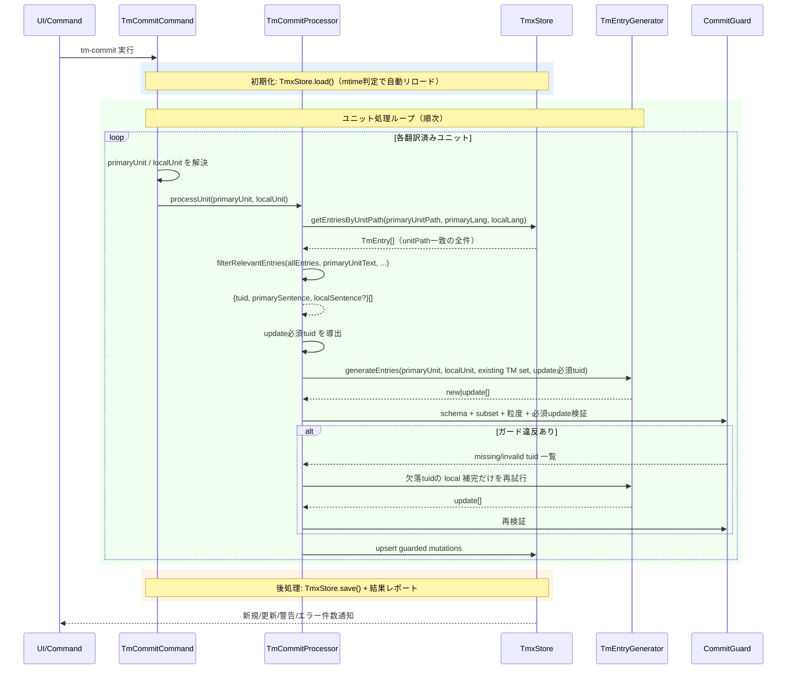

# tm-commitコマンド

翻訳済みユニットから primary sentence 単位の TU を確定し、TMX翻訳メモリへ guarded upsert するコマンドです。登録済みの対訳は次回trans実行時にLLMプロンプトへ参考情報として自動反映されます。

> **ワークフロー位置:** [trans](command_trans.md) → **tm-commit** → （ワークフロー終了）

## 機能

### 何をするか

翻訳済み（`from`ありかつ`need`なし）のユニットから `primaryUnit` と `localUnit` を確定し、primary sentence を正準キーとして `.mdait/translations.tmx` に guarded upsert します。ユニットごとの `x-source-hash` スキップは再処理最適化として維持しますが、TM の同一性判定は `tuid = hash(norm(primary sentence))` に統一します。

### before/after

`from:a1b2c3d4`（`from`=訳文が対応する原文hash）の翻訳済みユニットをtm-commit:

```markdown
<!-- tm-commit前: translations.tmx はこのユニットのエントリなし -->
<!-- mdait from:a1b2c3d4 hash:22222222 -->
## はじめに
これは導入文です。
```

```xml
<!-- tm-commit後: primary sentence 正規化ハッシュを tuid として登録 -->
<tu tuid="e1f2g3h4">
  <tuv xml:lang="en"><seg>This is an introduction.</seg></tuv>
  <tuv xml:lang="ja"><seg>これは導入文です。</seg></tuv>
</tu>
```

### 前提・操作

**前提:** 翻訳済みファイル（`from`ありかつ`need`なし）が存在すること。AIプロバイダー設定済み（[config.md](config.md)参照）。

| 操作 | 対象 | トリガー |
|---|---|---|
| StatusTreeからのtm-commit | ファイル単位 | ユーザー操作 |
| StatusTreeからのtm-commit | ディレクトリ単位 | ユーザー操作 |
| `mdait.status.openTm` | `.mdait/translations.tmx` | StatusViewボタン（確認・手動編集用） |

### 結果

| 条件 | 判定 | 理由 |
|---|---|---|
| `from`あり + `need`なし | 処理対象 | 翻訳済み |
| `from`あり + `need:review` | スキップ | 未承認（レビュー待ち） |
| `from`あり + `need:revise@*` | スキップ | 訳文が旧版 |
| `from`あり + `need:translate` | スキップ | 未翻訳 |
| `from`なし | スキップ | ソースファイルまたは未リンク |
**`need:review`ワークフロー:** trans実行 → 構造不一致で`need:review`付与 → 手動修正 → CodeLensの「Mark as Reviewed」でクリア → tm-commit実行可能。

### エラー処理

- **個別ユニットエラー**: ログ記録し後続ユニットの処理を継続
- **TMXファイル書き込みエラー**: ユーザーに通知して処理中断
- **キャンセル**: ユニット単位でキャンセルチェック

---

## 設計

### 概要

`TmCommitProcessor.processUnit()` はユニットごとに `primaryUnit` / `localUnit` を前提として、`existing TM set` の取得、`update必須tuid` の導出、LLM 呼び出し、guard、focused retry、upsert を順にオーケストレーションします。登録前の正規化は引き続き `stripMarkdown` と `isWorthyForTm()` を用いますが、LLM の責務は 1:1 対訳の列挙ではなく「既存 TU 更新と新規 TU 追加の計画生成」です。

### 処理フロー



### 設計ノート

- **明示的コミット原則**: ユーザーの明示的操作でのみ実行（プライバシー保護のため自動TM登録なし）
- **primaryLang正本**: source/target の相対関係ではなく `primaryLang` を正準軸にし、non-primary pair でも `marker.from` チェーンから primary を解決する
- **tuid正準化**: TU の識別は `hash(norm(primary sentence))` に統一し、既存 TU 更新と新規 TU 追加を同じキーで扱う
- **guarded upsert一本化**: 同一ユニットの再処理も事前スキップせず、`existing TM set` と guard で既存TU更新・no-op吸収を判断する
- **stripMarkdown一貫性**: tm-commit（TmEntryGenerator内）とtrans検索時で同一処理を使用。Markdown記法の差異でTM参照を取りこぼさないよう設計
- **guarded commit**: `update必須tuid` の欠落、subset 違反、文粒度違反を no-op で吸収せず、focused retry に回す
- **focused retry**: 再試行は「欠落した required update の local 補完」に限定し、guard 通過済みの結果は再生成させない
- **文分割非対称性**: tm-commit は LLM に sentence 粒度の抽出を委ねるが、retrieval 側は `SentenceSplitter` による高速 candidate generation を優先する
- **LLM品質フィルター**: `tm.splitSentences`プロンプトでランダム文字列・プレースホルダー・URL等を自動除外。`isWorthyForTm()`で短文・数値のみ等をさらに除外（二段階フィルタリング）
- **warning付き継続**: retry 上限到達後に更新不能な `tuid` が残っても、guard 通過済み分は保存し、未解決分だけ warning に留める

### 主要コンポーネント

| ファイル | 責務 |
|---|---|
| [`command-commit.ts`](../../src/commands/tm/command-commit.ts) | エントリーポイント、設定検証、`primaryUnit` / `localUnit` 解決、進捗表示・キャンセル制御 |
| [`commit-processor.ts`](../../src/commands/tm/commit-processor.ts) | `existing TM set` 取得、`update必須tuid` 導出、guard / retry / upsert のオーケストレーション |
| [`commit-filter.ts`](../../src/commands/tm/commit-filter.ts) | `isTmCommitTarget()` - TM登録対象フィルタリング |
| [`tm-entry-generator.ts`](../../src/commands/tm/tm-entry-generator.ts) | `TmEntryGenerator.generateEntries()` - LLMベースの primary/local 登録計画生成 |
| [`tmx-store.ts`](../../src/core/tm/tmx-store.ts) | `TmxStore` - TU/tuv の永続化、primary anchor lookup、variant provenance 管理 |
| [`sentence-splitter.ts`](../../src/core/tm/sentence-splitter.ts) | `SentenceSplitter` - `Intl.Segmenter` ベース文分割（trans検索用） |
