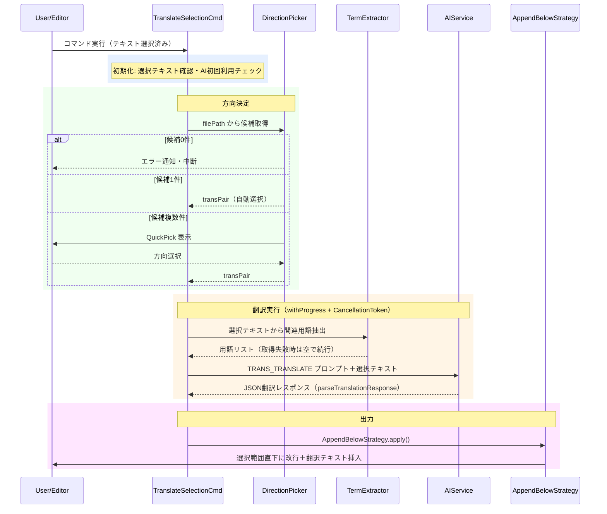

# translate-selectionコマンド

エディタで選択したテキストをmdait管理外でオンデマンド翻訳し、選択範囲の直下に追記するコマンドです。

> **ワークフロー位置:** （メインフローと独立）[trans](command_trans.md) ← 用語注入 ← **translate-selection**

## 機能

### 何をするか

エディタで選択した任意テキストを翻訳します。mdaitの**マーカー**（HTMLコメントによる状態管理タグ）もステータスも変更しないため、Slack投稿・コードコメント・下書き確認など正式な文書管理外の用途に使えます。

翻訳方向は現在のファイルパスを設定の`transPair`（翻訳ペア：sourceDir⇔targetDirの組み合わせ）と照合して自動推定します。`trans`コマンドと同じ用語注入プロンプトを再利用するため、用語集と一貫した翻訳品質を維持します。

### before/after

`sourceDir: en/`、`targetDir: ja/` の`transPair`設定済みで、`en/`配下のファイルで以下を選択して実行した場合:

**実行前（選択テキスト）:**

```
This feature is currently under development.
```

**実行後（選択範囲の直下に追記）:**

```
This feature is currently under development.

この機能は現在開発中です。
```

選択テキスト自体は変更されません。翻訳結果は選択範囲の最終行の次行に空白行1行を挟んで追記されます。

### 前提・操作

**前提:** `mdait.json`設定済み（[command_setup.md](command_setup.md)参照）。テキストが選択されていること。

| 操作 | 対象 | トリガー |
|---|---|---|
| コマンドパレット `mdait.translateSelection` | 選択テキスト | ユーザー操作 |
| エディタ右クリックメニュー（選択時のみ表示） | 選択テキスト | ユーザー操作（`mdaitConfigured`かつ`editorHasSelection`時） |

### 結果

**transPair 候補数による動作:**

| 候補数 | 動作 | 翻訳方向 |
|---|---|---|
| 0件 | エラー通知・中断 | — |
| 1件 | transPairを自動選択 | 常に source → target |
| 複数件 | QuickPick で選択UI表示 | 選択した transPair の source → target |

**実行結果:**

| 状況 | 結果 |
|---|---|
| 翻訳完了 | 選択範囲直下に空白行＋翻訳テキスト挿入・完了通知 |
| キャンセル | サイレント終了。エディタに変更なし |
| 翻訳失敗 | エラーメッセージ通知。エディタに変更なし |

### エラー処理

- **テキスト未選択**: 即時エラー通知・処理中断
- **候補ディレクトリなし（0件）**: 「mdait管理外ディレクトリ」エラー通知・中断（`mdait.json`の`transPair`設定を確認）
- **用語集読み込みエラー**: 警告ログのみ。用語なしで翻訳続行（処理を阻害しない）
- **AIレスポンスパースエラー**: 「Invalid translation response」エラー通知・中断
- **AI通信エラー等（翻訳失敗）**: エラーメッセージ通知

---

## 設計

### 概要

`translateSelectionCommand()`がエントリーポイントです。`DirectionPicker`→`TermExtractor`→`AIService`→`OutputStrategy`の4段パイプラインで処理します。`trans`コマンドの`TRANS_TRANSLATE`プロンプトを再利用することで用語注入品質を共有します。`OutputStrategy`インターフェースが出力先を抽象化し、将来の拡張（クリップボード・新規タブ等）に対応します。

### 処理フロー



### 設計ノート

- **翻訳方向自動推定**: ファイルパスを`transPair`の`sourceDir`/`targetDir`と前方一致で照合する。方向は常に`source→target`（逆方向不可）。マーカー等ファイル内容を参照しない
- **用語集連携**: `TermsCacheManager`でキャッシュ済み用語を取得し、`extractRelevantTerms()`で選択テキストに関連する用語のみ抽出。`trans`コマンドと同一プロンプトで品質基準を統一
- **OutputStrategy（Phase 1/2）**: Phase 1は`AppendBelowStrategy`（選択末行の次行に`\n{translatedText}\n`を挿入）。`OutputStrategy`インターフェースにより Phase 2以降（クリップボードコピー・新規タブ・サイドバイサイド比較）を追加可能
- **プロンプト再利用**: `PromptIds.TRANS_TRANSLATE`を使用（`trans`コマンドと同一）。`surroundingText`/`previousTranslation`/`sourceDiff`は省略（オンデマンド翻訳では文脈不要）
- **ステートレス設計**: mdaitマーカー・UnitRegistry・StatusManagerに一切触れない。翻訳ワークフローのステータスを汚染しない

### 主要コンポーネント

| ファイル | 責務 |
|---|---|
| [`trans-selection-command.ts`](../../src/commands/trans-selection/trans-selection-command.ts) | `translateSelectionCommand()` - エントリーポイント。パイプライン全体の制御と`parseTranslationResponse()` |
| [`direction-picker.ts`](../../src/commands/trans-selection/direction-picker.ts) | `pickTranslationDirection()` - transPair候補取得とQuickPick選択UI |
| [`output-strategy.ts`](../../src/commands/trans-selection/output-strategy.ts) | `OutputStrategy`インターフェース・`TranslationOutput`型定義 |
| [`append-below-strategy.ts`](../../src/commands/trans-selection/strategies/append-below-strategy.ts) | `AppendBelowStrategy` - 選択範囲直下への翻訳テキスト追記（Phase 1実装） |
