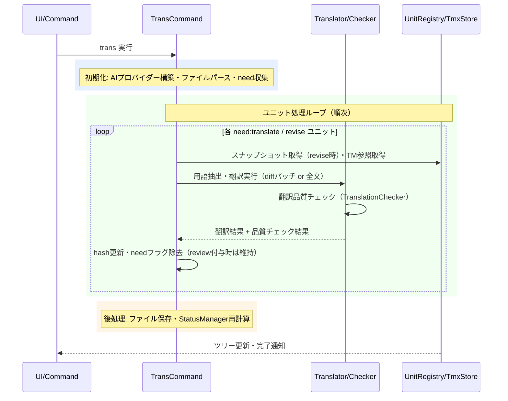

# transコマンド

`need:translate`/`need:revise`フラグのユニットをAIで翻訳し、ハッシュ更新とフラグ除去を行うコマンドです。

> **ワークフロー位置:** [sync](command_sync.md) → **trans** → [tm-commit](command_tm.md)

## 機能

### 何をするか

AIプロバイダーを使用してユニットを翻訳します。改訂時（`need:revise`）は前回訳文との差分パッチのみをLLMに生成させる**diff-aware revise**により、変更箇所以外の既存訳文を保持します。翻訳後は構造整合性チェックを行い、問題がある場合は`need:review`を付与します。

### before/after

`need:translate`（`need`=翻訳要求フラグ、`from`=訳文が対応する原文hash）のユニットを翻訳:

```markdown
<!-- 翻訳前 -->
<!-- mdait from:a1b2c3d4 hash:11111111 need:translate -->
## Introduction
（未翻訳のまま）
```

```markdown
<!-- 翻訳後（needフラグ除去・hashは訳文内容のハッシュに更新） -->
<!-- mdait from:a1b2c3d4 hash:22222222 -->
## はじめに
これは導入文です。
```

### 前提・操作

**前提:** `mdait.json`設定済み・AIプロバイダー設定済み（[config.md](config.md)参照）。翻訳対象ファイルに`need:translate`または`need:revise`ユニットが存在する。

| 操作 | 対象 | トリガー |
|---|---|---|
| StatusTree ディレクトリ行の ▶ ボタン | ディレクトリ内全ファイル | ユーザー操作 |
| StatusTree ファイル行の ▶ ボタン | 単一ファイル | ユーザー操作 |
| CodeLensのTranslate Unit | 単一ユニット | ユーザー操作 |

### 結果

| 状況 | 結果 | 意味 |
|---|---|---|
| 翻訳成功 | `need`除去・`hash`更新 | 翻訳完了 |
| 構造不一致を検出 | `need:review`設定 | 手動レビュー推奨（CodeLensでクリア可能） |
| FrontMatter対象キー存在 | FrontMatter個別翻訳 | 本文翻訳と独立して実行。TranslationCheckerは不適用 |
| AI応答にJSON混入 | 最大2回リトライ → 除去して継続 | 5層防御機構で対処 |

FrontMatterも同一のneedフラグで管理されます（`mdait.front`マーカー使用）。

### エラー処理

- **ユニット翻訳エラー**: `Status.Error`として記録し、そのファイルの処理を打ち切る。打ち切っても**そこまでの翻訳は保存される**
- **リトライ失敗**: JSON部分を除去した訳文で警告付き継続
- **キャンセル**: ユニット単位でチェック。中断済みユニットは未翻訳状態を維持し、中断までに訳し終えた分は保存する。中断は失敗ではないためエラー通知を出さず、`Status.Error`も刻まない
- **多重起動**: 同じ対象（重なる範囲）への2回目の起動は`OperationRegistry`が断り、「いま翻訳中です」と伝えて即座に終わる
- **結果の通知**: 呼び出し口ごとに通知を書かず、`reportTransOutcome()`が終わり方（完了／対象なし／中断／ペア無し／実行中）に応じて1回だけ出す

---

## 設計

### 概要

`transFile_CoreProc()`が各ユニットを順次処理します。`need:revise@{oldhash}`形式ではUnitRegistryのスナップショットから旧版を取得してUnified Diff生成し、差分パッチのみをLLMに生成させます（差分適用失敗時は全文翻訳にフォールバック）。

### 処理フロー



### 設計ノート

- **diff-aware revise**: `need:revise@{oldhash}`時はLLMに`=`/`-`/`+`プレフィックス形式のパッチのみ生成させる → 適用（[design.md](../design.md) P4参照）。失敗時の挙動はファイルタイプで異なる:
  - **MD**: 訳文を据え置いて手修正を保つ。理由（`PatchApplyResult.reason`）を持ち帰り、**排他区間の外**で件数と理由をまとめて1回通知し、「全文で訳し直す」導線を添える
  - **非MD**: 理由をログに残して全文再翻訳へフォールバック（ユニット分割が無く、据え置くと訳文が古いまま残るため）
- **排他区間の不変条件**: `FileMutex.runExclusive` の中では**人に問わない・他コマンドを起こさない**。判断が要る事象（パッチ失敗・書き戻し失敗・翻訳ペア無し）は結果に載せて返し、呼び出し側が区間の外で扱う。`FileMutex`は再入非対応なので、区間の中で`executeCommand("mdait.sync")`を待つとロックが解放されなくなる（ADR-260803-01）
- **後始末の単一経路**: 中断・失敗を含むどの経路で抜けても`finally`で「そこまでの翻訳を保存」→「対象ファイルの状態をディスクから作り直す」を通す。進行中の旗を個別に下ろす処理は持たない（`StatusItem.isTranslating`は廃止し、表示は`OperationRegistry`に問う）
- **進行中の表示の粒度**: ツリーの回転アイコンは「台帳に登録された行と、その祖先だけが回る」。登録から配下を推測しない。実際に処理する区間が自分自身を`OperationRegistry.track()`で登録する — `transFile_CoreProc`が1ファイル、`runUnitLoop`の`beginUnit`が1ユニット、frontmatter翻訳がその行。推測に頼ると、着手前のユニットや訳し終えたユニットまで同時に回り、何件目を処理中かが読めなくなる（ADR-260803-02）
- **中断の単一表現**: プロバイダ・リトライ層・translator は中断を`OperationCancelledError`で投げ、判定は`isOperationCancelled()`だけが行う。メッセージ文字列での判定はしない
- **パッチ補完**: LLMが`@@`ハンク行なしのパッチを返すケースに対応し、`applyUnifiedPatch`内で自動補完する
- **5層AIレスポンス防御**: プロンプト強化 → ResponseValidator検出 → リトライ（最大2回）→ JSON除去継続 → OutputSanitizerで最終検出
- **用語集注入**: `terms.csv`が存在する場合、翻訳対象ユニットに含まれる用語を抽出してプロンプトに注入。キャッシュはmtime比較で管理（[command_term.md](command_term.md) 参照）
- **TM参照**: tm-commit済みエントリをTmxStoreから検索し、`tm.maxReferences`件をプロンプトに注入（[command_tm.md](command_tm.md) 参照）
- **順次処理**: AI APIレート制限対策とキャンセル即応性のため、ファイル内ユニットは順次処理

### 主要コンポーネント

| ファイル | 責務 |
|---|---|
| [`trans-command.ts`](../../src/commands/trans/trans-command.ts) | `transCommand()` → `TransCommandResult`, `transFile_CoreProc()`, `transUnit_CoreProc()`, `translateFrontmatter_CoreProc()`。FileHandler dispatch化済み: ファイルタイプに応じて`MdFileHandler`/`PlainFileHandler`に委譲 |
| [`file-handler-factory.ts`](../../src/commands/file-handler/file-handler-factory.ts) | `getFileHandler()` - 拡張子に基づくFileHandler振り分け（分岐の唯一の集約点） |
| [`plain-file-handler.ts`](../../src/commands/file-handler/plain-file-handler.ts) | `PlainFileHandler` - 非MDファイルの翻訳処理。UnitStateStore + UnitRegistryベース。revise時はパッチモード（`translateRevisionPatch` + `applySimplePatch`）を使用し、失敗時は理由をログに残して全文翻訳へフォールバック |
| [`translation-run.ts`](../../src/commands/trans/translation-run.ts) | `runUnitLoop()` - 進行制御（処理順・中断・失敗・パッチ据え置き・保存の判断）のみを持つVS Code非依存の関数。例外は投げず結果に載せて返し、呼び出し側が保存してから報告できるようにする |
| [`operation-registry.ts`](../../src/commands/shared/operation-registry.ts) | `OperationRegistry` - 「いま何を処理中か」の唯一の台帳。`acquire()`が多重起動を断る排他の登録、`track()`が「いま手が動いている行」の表示専用の登録。粒度が違うため登録を分ける |
| [`operation-cancelled.ts`](../../src/infra/errors/operation-cancelled.ts) | `OperationCancelledError` / `isOperationCancelled()` - 中断の単一表現と判定 |
| [`translator.ts`](../../src/commands/trans/translator.ts) | `Translator` - 翻訳サービスインターフェース。`TranslatorPromptConfig`でMD/非MD用プロンプトIDを切り替え |
| [`translator-builder.ts`](../../src/commands/trans/translator-builder.ts) | `TranslatorBuilder` - `build()`でMD用、`buildPlain()`で非MD用Translatorを構築 |
| [`translation-context.ts`](../../src/commands/trans/translation-context.ts) | `TranslationContext` - 翻訳コンテキスト（用語集・TM参照・`fileExtension`等） |
| [`translation-checker.ts`](../../src/commands/trans/translation-checker.ts) | `TranslationChecker.checkTranslationQuality()` - 構造整合性チェック |
| [`term-extractor.ts`](../../src/commands/trans/term-extractor.ts) | `extractRelevantTerms()` - 用語集から該当用語を抽出 |
| [`response-validator.ts`](../../src/commands/trans/response-validator.ts) | `validateTranslationResponse()`, `extractJsonFromResponse()` - AIレスポンスのJSON混入検出・除去 |
