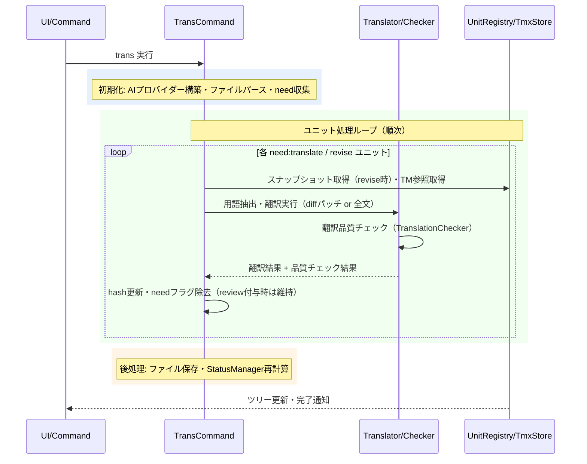

# transコマンド

`need:translate`/`need:revise`フラグのユニットをAIで翻訳し、ハッシュ更新とフラグ除去を行うコマンドです。

> **ワークフロー位置:** [sync](command_sync.md) → **trans** → [tm-commit](command_tm.md)

## 機能

### 何をするか

AIプロバイダーを使用してユニットを翻訳します。改訂時（`need:revise`）は前回訳文との差分パッチのみをLLMに生成させる**diff-aware revise**により、変更箇所以外の既存訳文を保持します。翻訳後は構造整合性チェックを行い、問題がある場合は`need:review`を付与します。

### before/after

`need:translate`（`need`=翻訳要求フラグ、`from`=訳文が対応する原文hash）のユニットを翻訳:

```markdown
<!-- 翻訳前 -->
<!-- mdait from:a1b2c3d4 hash:11111111 need:translate -->
## Introduction
（未翻訳のまま）
```

```markdown
<!-- 翻訳後（needフラグ除去・hashは訳文内容のハッシュに更新） -->
<!-- mdait from:a1b2c3d4 hash:22222222 -->
## はじめに
これは導入文です。
```

### 前提・操作

**前提:** `mdait.json`設定済み・AIプロバイダー設定済み（[config.md](config.md)参照）。翻訳対象ファイルに`need:translate`または`need:revise`ユニットが存在する。

| 操作 | 対象 | トリガー |
|---|---|---|
| コマンドパレット `mdait.trans` | ディレクトリ内全ファイル | ユーザー操作 |
| StatusTreeからのtrans | 単一ファイル / ディレクトリ | ユーザー操作 |
| CodeLensのTranslate Unit | 単一ユニット | ユーザー操作 |

### 結果

| 状況 | 結果 | 意味 |
|---|---|---|
| 翻訳成功 | `need`除去・`hash`更新 | 翻訳完了 |
| 構造不一致を検出 | `need:review`設定 | 手動レビュー推奨（CodeLensでクリア可能） |
| FrontMatter対象キー存在 | FrontMatter個別翻訳 | 本文翻訳と独立して実行。TranslationCheckerは不適用 |
| AI応答にJSON混入 | 最大2回リトライ → 除去して継続 | 5層防御機構で対処 |

FrontMatterも同一のneedフラグで管理されます（`mdait.front`マーカー使用）。

### エラー処理

- **ユニット翻訳エラー**: `Status.Error`として記録し、後続ユニットの処理を継続
- **リトライ失敗**: JSON部分を除去した訳文で警告付き継続
- **キャンセル**: ユニット単位でチェック。中断済みユニットは未翻訳状態を維持

---

## 設計

### 概要

`transFile_CoreProc()`が各ユニットを順次処理します。`need:revise@{oldhash}`形式ではUnitRegistryのスナップショットから旧版を取得してUnified Diff生成し、差分パッチのみをLLMに生成させます（差分適用失敗時は全文翻訳にフォールバック）。

### 処理フロー



### 設計ノート

- **diff-aware revise**: `need:revise@{oldhash}`時はUnified Diff → LLMにパッチのみ生成させる → 適用。失敗時は全文翻訳にフォールバック（[architecture.md](../architecture.md) P4参照）
- **5層AIレスポンス防御**: プロンプト強化 → ResponseValidator検出 → リトライ（最大2回）→ JSON除去継続 → OutputSanitizerで最終検出
- **用語集注入**: `terms.csv`が存在する場合、翻訳対象ユニットに含まれる用語を抽出してプロンプトに注入。キャッシュはmtime比較で管理（[command_term.md](command_term.md) 参照）
- **TM参照**: tm-commit済みエントリをTmxStoreから検索し、`tm.maxReferences`件をプロンプトに注入（[command_tm.md](command_tm.md) 参照）
- **順次処理**: AI APIレート制限対策とキャンセル即応性のため、ファイル内ユニットは順次処理

### 主要コンポーネント

| ファイル | 責務 |
|---|---|
| [`trans-command.ts`](../../src/commands/trans/trans-command.ts) | `transFile_CoreProc()`, `transUnit_CoreProc()`, `translateFrontmatter_CoreProc()` |
| [`translator.ts`](../../src/commands/trans/translator.ts) | `Translator` - 翻訳サービスインターフェース |
| [`translation-checker.ts`](../../src/commands/trans/translation-checker.ts) | `TranslationChecker.checkTranslationQuality()` - 構造整合性チェック |
| [`term-extractor.ts`](../../src/commands/trans/term-extractor.ts) | `TranslationTermExtractor.extract()` - 用語集から該当用語を抽出 |
| [`response-validator.ts`](../../src/commands/trans/response-validator.ts) | `ResponseValidator` - AIレスポンスのJSON混入検出 |
