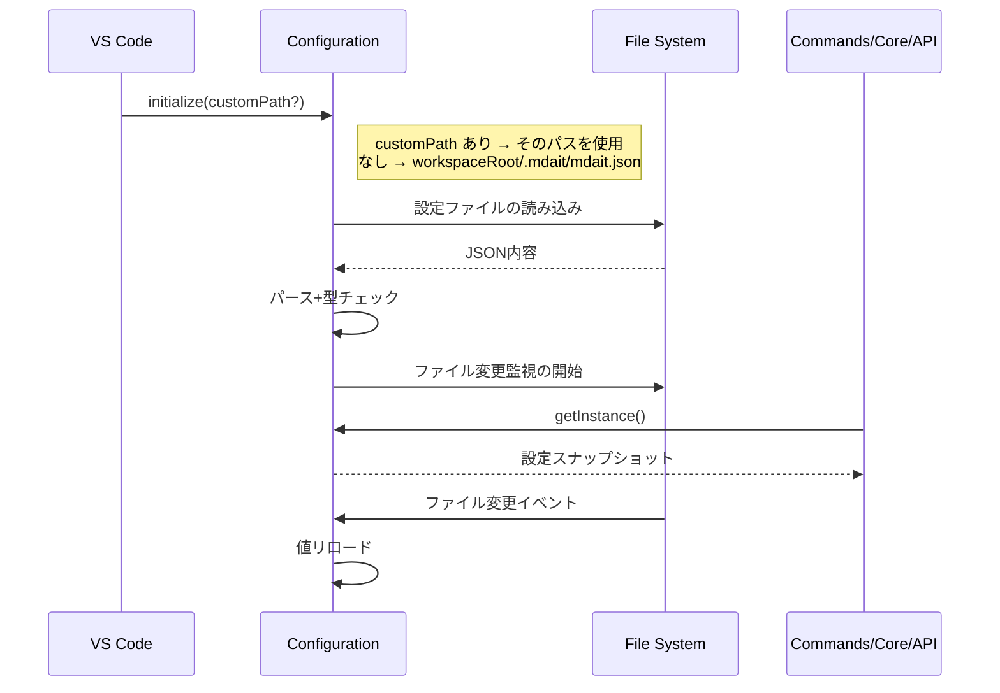

# Config

[architecture](../architecture.md) > **Config**

## このドキュメントの責務

Config層は、`.mdait/mdait.json`の読み込み、バリデーション、ファイル変更監視を担当します。また、Frontmatterによるドキュメント単位の設定オーバーライドを定義します。

---

## Configurationクラス

### 基本設計

- **シングルトン**: `initialize(customPath?)`でロード、`getInstance()`で提供
- **ソース**: `workspaceState` に `mdait.configPath` が保存されている場合はそのパスを優先、なければワークスペースルートの `.mdait/mdait.json`
- **スキーマ**: `schemas/mdait-config.schema.json`による補完と検証

**実装**: [`src/infra/config/configuration.ts`](../../src/infra/config/configuration.ts)

### オンボーディングサポート

初回セットアップを支援する仕組みを提供します：

1. `isConfigured()`メソッドで設定ファイルの存在と`validate()`結果をチェック
2. 初期セットアップ時は`mdait.setup.createConfig`コマンドで`mdait.template.json`から設定ファイルを生成
3. 既存設定がサブフォルダ等にある場合は`mdait.setup.openExistingConfig`コマンドでパスを選択（`workspaceState` に保存）
4. `mdaitConfigured`コンテキスト変数でUI表示を制御し、未設定時はWelcome Viewを表示
5. `package.json`の`jsonValidation`でJSON Schemaを関連付け、IDE上でIntelliSenseと検証が機能

**設計意図**: ユーザーが設定ファイルを手動で作成する負担を軽減し、テンプレートから開始することでスムーズなセットアップを実現します。詳細な必須項目チェックは`validate()`が担います。

---

## ロードシーケンス



**設計意図**: ファイル変更監視により、ユーザーが`.mdait/mdait.json`を編集中でも、保存時に即座に設定が反映されます。

---

## `.mdait/mdait.json` フォーマット

[`schemas/mdait-config.schema.json`](../../schemas/mdait-config.schema.json)で定義された形式に従います。

### 主要フィールド

```json
{
  "$schema": "../../schemas/mdait-config.schema.json",
  "transPairs": [
    {
      "sourceDir": "docs/ja",
      "targetDir": "docs/en",
      "sourceLang": "ja",
      "targetLang": "en"
    }
  ],
  "ignoredPatterns": ["**/node_modules/**"],
  "sync": {
    "level": 2,
    "autoDelete": true,
    "autoSyncOnSave": true
  },
  "ai": {
    "provider": "openai",
    "model": "gpt-4o-mini",
    "openai": {
      "apiKey": "${env:OPENAI_API_KEY}",
      "baseURL": "https://api.openai.com/v1"
    }
  },
  "trans": {
    "markdown": {
      "skipCodeBlocks": true
    },
    "frontmatter": {
      "keys": ["title", "description"]
    },
    "contextSize": 1,
    "retryLimit": 1
  },
  "tm": {
    "retryLimit": 1
  },
  "primaryLang": "en",
  "terms": {
    "filename": "terms.csv"
  }
}
```

### 重要な設定項目

| フィールド | デフォルト | 説明 |
|-----------|-----------|------|
| `transPairs`（必須） | — | ソース・ターゲットのディレクトリペアと言語。複数指定で多言語展開に対応。`sourceDir`/`targetDir` は **`mdait.json` の親ディレクトリ（`.mdait` フォルダの親）相対**で記述する。例: `/project/sub/.mdait/mdait.json` なら `/project/sub/` が基準。ルートに配置した場合はワークスペースルート相対と同一 |
| `trans.extensions` | `[]` | 追加の翻訳対象拡張子（例: `[".txt", ".csv"]`）。`.md`は常に含まれる。全翻訳ペアに共通適用 |
| `primaryLang` | — | 用語集と TM で共有する基準言語。設定上の正準言語として扱う |
| `sync.level` | `2` | ユニット境界の見出しレベル（`##`=2、`###`=3） |
| `sync.autoSyncOnSave` | `true` | 保存時に自動同期。原文編集直後に差分を即座に可視化 |
| `sync.copyAssets` | `true` | sync時に差分ユニット内の相対パスアセットをsourceDirからtargetDirへコピー。`true`=全コピー / `false`=コピーしない / `string[]`=拡張子ホワイトリスト（例: `[".png", ".jpg"]`、空配列は `false` と等価）。翻訳対象拡張子（`.md` および `trans.extensions`）は常に除外。詳細: [command_sync.md](command_sync.md) 「アセットコピー」節 |
| `transPairs[].copyAssets` | `sync.copyAssets`を継承 | ペア単位の上書き。型は `sync.copyAssets` と同じ（`boolean \| string[]`） |
| `trans.frontmatter.keys` | — | 翻訳対象とするfrontmatterキー。指定キーのみが管理対象 |
| `trans.retryLimit` | `1` | trans の再試行上限 |
| `trans.maxFileSize` | `51200` | 非MDファイルの翻訳時ファイルサイズ上限（バイト）。超過時はスキップ＋警告 |
| `trans.maxUnitsPerRun` | `300` | 1ファイルの処理で扱うユニット数の上限（全般コストガード）。**ファイル単位で適用**され、trans・aiSync.review・aiSync.align が共通で参照する（ディレクトリ実行ではファイル数ぶん積み上がる）。超過時の挙動は経路ごとに異なる: trans / review は超過ユニットの need フラグ（`need:translate` / `need:review`）を保持し次回実行で処理、align は該当ファイルの AI align をスキップして位置ベース対応付けを維持。`0` で上限なし |
| `ai.ollama.keepAlive` | （未送信） | Ollamaモデルをメモリに保持する時間（例: `"10m"`、秒数指定も可）。未指定時はOllamaサーバー既定（5分）。連続翻訳時のモデル再ロード防止用 |

`primaryLang` は必須設定であり、未設定時は設定不備として扱う。

---

### tm（翻訳メモリ）

| 設定 | デフォルト | 動作 |
|------|-----------|------|
| `tm.enabled` | `true` | `false`でtm-commitとTM参照を両方無効化 |
| `tm.maxReferences` | `5` | プロンプトに含めるTM参照の最大数 |
| `tm.retryLimit` | `1` | tm-commit の focused retry 上限 |
| `tm.minQueryLength` | `10` | 行単位TM検索時、normalize後の行がこの文字数未満の場合は検索対象から除外（範囲: 1–100） |

**設計意図**: プロンプトの肥大化を防ぎつつ、一貫性に寄与する十分な参照を提供します。

---

### aiSync.review（AIペアリング検証）

| 設定 | デフォルト | 動作 |
|------|-----------|------|
| `aiSync.review.autoApprove` | `true` | 高確信 match の `need:review` を自動解除。`false` でレポートのみ（マーカー無変更）のセーフモード |
| `aiSync.review.batchSize` | `3` | 1回のLLMコールで検証するペア数（1..10 クランプ）。`1` で従来の単ペアプロンプト（`aiSync.verifyPairing`）、`2` 以上でバッチプロンプト（`aiSync.verifyPairingBatch`） |

検証ユニット数の上限は全般設定 `trans.maxUnitsPerRun`（既定300・`0`で上限なし・**1ファイル単位で適用**）で制御する。

**設計意図**: 自動承認は「match ∧ issues空 ∧ 閾値（固定値 0.9）以上」の三重条件でのみ発動する（ADR-260704-07）。自動承認閾値・アライン詳細（minConfidence=0.6 / maxNeedBodies=8 / maxRounds=2）は調整困難なためコード内定数で最適値固定・設定廃止（ADR-260711-03）。バッチ検証と用語集・TM注入（訳揺れ検知）は ADR-260709-01。詳細: [command_ai-review.md](command_ai-review.md)

---

## バリデーション

### validate()メソッド
設定ファイルロード後に以下をチェックします：
- 必須フィールド(`transPairs`)の有無
- 必須フィールド(`primaryLang`)の有無
- ディレクトリパスの妥当性

**UIへの影響**:
- `StatusTreeProvider`が空配列を返しリソース消費を抑制
- `mdaitConfigured`コンテキスト変数を更新し、ツールバーボタンとWelcome Viewの表示を切り替え

---

## Frontmatter設定

Markdown文書の先頭にあるfrontmatterセクションで、YAML形式でメタデータを記述します。

### mdait名前空間

mdaitの内部設定は`mdait`名前空間の下に階層的に配置します。

```yaml
mdait:
  sync:
    level: 2
  front: abc123de from:def456gh need:translate
```

**設計意図**: 他のツールのfrontmatterと衝突を避けるため、mdait専用の名前空間を使用します。

---

### mdait.sync.level - ドキュメント単位のユニット粒度

**用途**: ユニット境界として検知する見出しレベルの指定

**設定形式**:
```yaml
mdait:
  sync:
    level: 3
```

**動作**:
- `.mdait/mdait.json`の`sync.level`設定をドキュメント単位で上書き
- sync実行時、原文と訳文でlevel設定が異なる場合、**原文の設定を優先して訳文を自動修正**

**設計意図**: 大きなドキュメントでは粗い粒度（level 2）、詳細なドキュメントでは細かい粒度（level 3）など、ドキュメントの性質に応じて柔軟に調整できます。

---

### mdait.front - Frontmatterの翻訳状態管理

**用途**: Frontmatterの翻訳状態管理（本体の`<!-- mdait ... -->`マーカーに相当）

**設定形式**:
```yaml
mdait:
  front: "abc123de from:def456gh need:translate"
```

**動作**:
- Frontmatter全体のハッシュ値、翻訳元ハッシュ、必要アクションを追跡
- 本体のMarkdown内のmarkerとは異なり、frontmatter独自のメタデータとして使用
- syncコマンド実行時にハッシュが更新され、transコマンドで翻訳対象判定に利用

**設計意図**: frontmatterは構造的にHTMLコメントを挿入できないため、専用フィールドで状態を管理します。本文ユニットと分離した専用フローで処理することで、frontmatter翻訳を柔軟に制御できます。

---

## 関連

- [core.md](core.md) FrontMatter翻訳セクション参照
- [architecture.md](../architecture.md) 「Config層」参照
