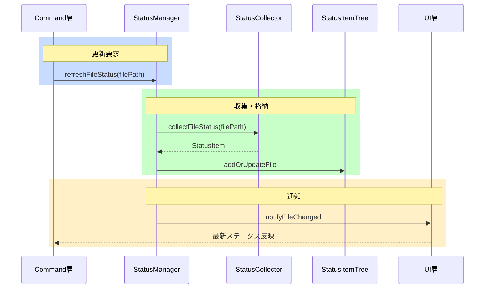
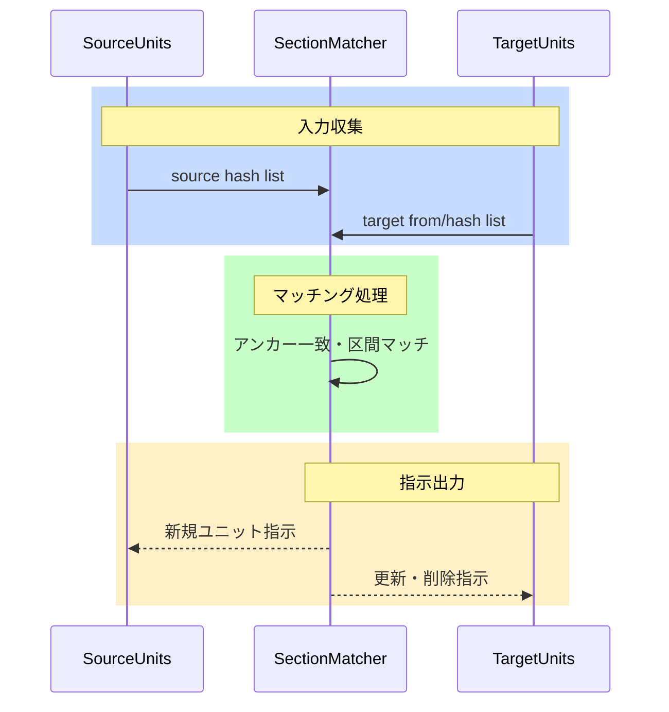

# Core

[architecture](../architecture.md) > **Core**

Core層は翻訳ドメインの純粋なロジック（ユニット解析・ハッシュ・ステータス・TM）をVS Code API非依存のモジュールとして提供します。

## mdaitUnit

mdaitUnitとはMarkdown文書を翻訳管理単位（ユニット）に分割したものです。見出しまたはmdaitマーカーを境界とし、本文・マーカー・位置情報の3要素を持ちます（[architecture.md](../architecture.md) P1参照）。

### 構造

mdaitUnitは以下の要素で構成されます：

- **content**: ユニット本文（Markdownテキスト）
- **marker**: `<!-- mdait {hash} [from:{hash}] [need:{flag}] -->`
- **range**: ドキュメント内の開始・終了位置

| フィールド | 意味 |
|---|---|
| `{hash}` | ユニット本文のCRC32ハッシュ（8文字）（巡回冗長検査による高速ハッシュ関数） |
| `from:{hash}` | 訳文の翻訳元ユニットのハッシュ（訳文ファイルのみ） |
| `need:{flag}` | 翻訳が必要な場合の要求フラグ（`translate`/`review`） |

**例**（before/after）:

before（マーカーなし）:
```markdown
## 概要
This is the introduction section.
```

after（sync後）:
```markdown
<!-- mdait 3f7c8a1b need:translate -->
## 概要
This is the introduction section.
```

### ユニット境界の決定

1. **見出しレベル**: `mdait.json`の`sync.level`で指定されたレベル以下の見出し
2. **mdaitマーカー**: `<!-- mdait -->` または `<!-- mdait {hash} ... -->`

**ルール**: マーカーの直後（空行なし）に見出しがある場合、その見出しがユニットのタイトル。ハッシュ省略マーカー `<!-- mdait -->` も境界として認識され、sync時に自動計算される。

### level設定のドキュメント単位オーバーライド

Frontmatterで`mdait.sync.level`を指定することでファイル単位でユニット粒度を変更できます。sync実行時、原文と訳文でlevel設定が異なる場合は**原文の設定を優先して訳文を自動修正**し、マーカー対応付けの破綻を防止します。

```typescript
// 使用例: MarkdownテキストをmdaitUnit配列に変換
const units = parseMarkdown(markdownText, config);
// units[0].content, units[0].marker, units[0].range で各要素にアクセス
```

**実装**: [`src/core/markdown/parser.ts`](../../src/core/markdown/parser.ts)

## Hash & Normalizer

行末空白・連続空行・コードフェンス言語指定・リンク参照順序の差異を吸収し、本質的な内容変更のみを検出します（[architecture.md](../architecture.md) P2参照）。


**CRC32の選択理由**: SHA-256と比べてハッシュが短くマーカーが肥大化しない。同一内容から必ず同じハッシュを生成する決定的計算で、数千ユニット規模での衝突リスクは極めて低い。

**実装**: [`src/core/hash/`](../../src/core/hash/)

## Status管理

ディレクトリ/ファイル/ユニット階層をMap構造で保持し、O(1)（定数時間）検索を実現します（[architecture.md](../architecture.md) P3参照）。ファイルごとに再計算することで、個別ファイルの変更時に全体を走査する必要がありません。

### StatusItemTree

```typescript
interface StatusItemTree {
  dirs: Map<string, DirectoryStatus>;
  files: Map<string, FileStatus>;
  units: Map<string, UnitStatus>;
}
```

### StatusManager

StatusCollector（Commands層）とUIの橋渡しとして全体構築・部分更新を担います。StatusCollectorはCommands層に配置されているため、`StatusCollectorPort`インターフェース（Core層定義）を介したDI注入で接続します。

**主要メソッド**: `refreshFileStatus(filePath)` / `getFileStatus(filePath)` / `clear()` / `setCollector(collector)`

```typescript
// 使用例: activate時にCollectorをDI注入
const manager = StatusManager.getInstance();
manager.setCollector(new StatusCollector());
// ファイル変更時のステータス更新
await manager.refreshFileStatus(filePath);
```

### StatusCollectorPort

Core層に定義されたポートインターフェース。StatusManager（Core層）がCommands層のStatusCollectorに直接依存しないよう、DI境界を提供します（[architecture.md](../architecture.md) P5参照）。

```typescript
export interface StatusCollectorPort {
  collectFileStatus(filePath: string): Promise<FileStatusItem>;
  buildStatusItemTree(): Promise<StatusItemTree>;
}
```

Commands層の`StatusCollector`がこのインターフェースを実装し、`extension.ts`のactivate時に`StatusManager.setCollector()`で注入します。collector未設定時はwarnログを出力してスキップします。

**実装**: [`src/core/status/status-collector-port.ts`](../../src/core/status/status-collector-port.ts)、注入先: [`src/core/status/status-manager.ts`](../../src/core/status/status-manager.ts)

**実装（StatusManager）**: [`src/core/status/`](../../src/core/status/)

## UnitRegistry管理

ユニット内容を`.mdait/unit-registry`ファイルで永続化します。原文変更時、旧コンテンツとの差分生成に使用します。

**保存形式**: gzip圧縮 + base64エンコード。CRC32先頭3桁でバケット化（ハッシュ先頭3桁ごとに分割管理）し、バケット昇順でgit競合を軽減。

```
3f7
3f7c8a1b <encoded_content>
a2b
a2b5c7d8 <encoded_content>
```

**GC処理**: sync完了後、ファイルサイズが5MB超過時に使用中のhash以外のレジストリを削除します。

**実装**: [`src/core/unit-registry/`](../../src/core/unit-registry/)

## FileState管理

非Markdownファイル（.txt, .csv等）の翻訳状態を `.mdait/file-state` で管理します。MDファイルのようにファイル内にHTMLコメントマーカーを埋め込めないため、外部ストアで状態を永続化します。

**保存形式**: TSV（タブ区切り）。ターゲットファイルのパス・hash・翻訳元hash・needフラグの4カラム。パスで昇順ソートしgit diffを読みやすくします。

```
# mdait file-state
# path	hash	from	need
docs/en/data.csv	11223344	55667788	translate
docs/en/readme.txt	a1b2c3d4	ff03a1b2	
```

**UnitRegistryとの関係**: FileStateStoreはパスベースのメタデータ管理（path→hash/from/need）、UnitRegistryはコンテンツアドレスストア（hash→content）。非MDファイルでもrevise時に旧コンテンツが必要なため、sync時にUnitRegistryに保存します。

**実装**: [`src/core/file-state/file-state-store.ts`](../../src/core/file-state/file-state-store.ts)

## Diff生成

trans実行時、旧レジストリと現在のコンテンツから差分を生成します。LLMには`=`/`-`/`+`プレフィックス形式のパッチを入出力フォーマットとして用い、機械的に適用可能な変更指示をやり取りすることで、変更箇所以外の既存訳文を維持します（[architecture.md](../architecture.md) P4参照）。一方で、ユーザーが確認するための差分ビュー（例: VS Code上のdiff表示やログ・レビュー用のdiff）にはunified diff形式を用い、その生成には`diff`パッケージを使用します。

**実装**: [`src/core/diff/`](../../src/core/diff/)

## FrontMatter翻訳

frontmatter（MarkdownファイルのYAML前付き情報）内の`mdait.front`フィールドで翻訳状態を管理します。`trans.frontmatter.keys`で指定されたキーの値をkeys順に連結してハッシュ化し、`FrontMatter`クラスのドット記法（例: `"mdait.sync.level"`）による階層アクセスをサポートします。mdait管理外のフィールドは元のYAMLフォーマットを維持します。

```yaml
mdait:
  front: "abc12345"                              # 初回翻訳前（fromなし）
  # または
  front: "abc12345 from:def67890 need:translate"  # 更新時
```

**実装**: [`src/core/markdown/frontmatter-translation.ts`](../../src/core/markdown/frontmatter-translation.ts)

## マーカー正規化

mdaitマーカー直前の空行を保証し、markdown-itが段落区切りを正しく認識できるようにします。

**実装**: [`src/core/markdown/parser.ts`](../../src/core/markdown/parser.ts) (`normalizeMarkerSpacing`)

## 翻訳メモリ（TM）

翻訳メモリ（TM）は過去の翻訳事例をデータベース化し、類似文の再翻訳を支援する仕組みです。TMXはTM交換標準フォーマット（XML）で、mdaitでは`.mdait/translations.tmx`に保存します。

### TmxStore

TMXファイル（`.mdait/translations.tmx`）のI/Oとインメモリインデックスを担当します。

- TMX XMLパース/シリアライズ（`fast-xml-parser`）・`Map<tuid, TmEntry>` による高速検索（O(1)）
- CRUD: primary anchor lookup、`existing TM set` 取得、variant upsert、retrieval 用 batch lookup
- **trigram 転置インデックス** `Map<lang, Map<trigram, Set<tuid>>>`: variant テキストを `normalizeForTm` した trigram を lang 別に事前構築。`findCandidatesByTrigram(rawText, lang, limit)` でクエリの正規化・粗絞り込みを内部完結
- **trigramCache** `Map<"${tuid}:${lang}", Set<string>>`: `indexEntry` 時に variant trigram を保存するフォワードキャッシュ。`getTrigramCache()` で読み取り専用ビューを返し、ランカーが再計算を回避する
- グローバル遅延シングルトン（`getInstance(tmxFilePath)`、ファイル更新時刻（mtime）ベースの自動リロード）

**データモデル**: `tuid = hash(norm(primary sentence))` をキーとし、primary 文面と各言語 variant、その provenance を保持する TU 単位の TmEntry。`x-source-hash` はユニット再処理抑止のための補助インデックスであり、TU 同一性のキーではありません。

```typescript
interface TmEntry {
    tuid: string;
    primary: string;
    variants: Map<string, {
        text: string;
    }>;
}
```

```typescript
// 使用例: Command層からの典型的な呼び出し
const store = TmxStore.getInstance(tmxPath);
// primaryLang を持つ全TUを取得（フィルタリングはCommands層の責務）
const allEntries = store.getEntriesByUnitPath(primaryUnitPath, primaryLang, localLang);
const matches = store.lookupBatch(sentenceHashes, sourceLang, targetLang);
store.save(tmxPath);
```

**実装**: [`src/core/tm/tmx-store.ts`](../../src/core/tm/tmx-store.ts)

### SentenceSplitter

`Intl.Segmenter`ベースの文分割。コードブロック/インラインコード保護、段落・リスト項目の独立分割に対応し、言語ごとにSegmenterをキャッシュして日英中の文境界を検出します。

**実装**: [`src/core/tm/sentence-splitter.ts`](../../src/core/tm/sentence-splitter.ts)

### TmTextNormalizer

TM登録・検索時にMarkdown要素を除去し、翻訳価値のない短文・断片をフィルタリングします。

**主要関数**:
- `stripMarkdown(text)`: markdown-itでパースし、先頭のYAML frontmatterとコードブロック、リンク装飾・太字・強調・HTMLタグ等を除去して純粋テキストに変換。インラインコードはバッククォート付きで保持する。**構造保持**としてトップレベルの見出し・段落・引用・リスト・表の境界を`\n\n`、リスト項目・表セルの区切りを`\n`で保持し、LLMが要素間の文脈を正しく理解できるよう分離します（markdown-itトークンツリー走査で正規表現独自実装を回避）。
    before: ``---\ntitle: 重要\n---\n**重要**: [詳細はこちら](url) と `0.1.0` を参照。`` → after: ``重要: 詳細はこちら と `0.1.0` を参照。``
- `isWorthyForTm(text, lang)`: 日本語8文字未満・英語12文字未満・数値のみ・URL/パスのみ・英語2単語以下を除外。
- `computeTrigrams(text)`: Unicode文字単位の3-gramを生成して`Set<string>`を返す。3文字未満は空集合。`[...text]`でサロゲートペア対応。`TmxStore`（インデックス構築）と`rankTmEntries`（スコアリング）が同一ロジックを保証するため、本モジュールで一元管理。

**実装**: [`src/core/tm/tm-text-normalizer.ts`](../../src/core/tm/tm-text-normalizer.ts) ／ **詳細**: [command_tm.md](command_tm.md)

### formatTmReferences

TM検索結果（`TmMatch[]`）をプロンプト用文字列に変換。VS Code非依存のためCore層配置。

**実装**: [`src/core/tm/tm-reference-formatter.ts`](../../src/core/tm/tm-reference-formatter.ts)

### rankTmEntries

`TmxStore.findCandidatesByTrigram()` で絞り込んだ候補を精密スコアリングし、MMR (Maximal Marginal Relevance) で多様性を確保した top-k を返す純粋関数。

- **trigram Jaccard 類似度**: `options.lang` の variant テキストとクエリの trigram 集合を比較（`|A∩B|/|A∪B|`）
- **MMR 選択**: `λ × querySim(c) − (1−λ) × max_{s∈selected}(sim(s,c))` の greedy 選択。`λ=1.0` のとき純粋な類似度順と一致
- **trigramCache**: `RankOptions.trigramCache`（`TmxStore.getTrigramCache()` から渡す）が指定されると候補 variant の trigram 再計算をスキップしキャッシュから取得。省略時は `computeTrigrams(normalizeForTm(text))` にフォールバック
- 返却型 `ScoredTmEntry = TmEntry & { score: number }`

**実装**: [`src/core/tm/tm-ranker.ts`](../../src/core/tm/tm-ranker.ts)

## シーケンス図

### ステータス更新



### ユニット同期ロジック



## 主要コンポーネント一覧

| コンポーネント | ファイル | 責務 |
|---|---|---|
| Parser | [`src/core/markdown/parser.ts`](../../src/core/markdown/parser.ts) | Markdownをmdaitユニット配列に分割 |
| FrontMatter | [`src/core/markdown/frontmatter-translation.ts`](../../src/core/markdown/frontmatter-translation.ts) | frontmatter翻訳状態の読み書き |
| HashCalculator | [`src/core/hash/`](../../src/core/hash/) | テキスト正規化＋CRC32ハッシュ生成 |
| StatusManager | [`src/core/status/`](../../src/core/status/) | ユニット/ファイル/ディレクトリのステータス集約 |
| StatusCollectorPort | [`src/core/status/status-collector-port.ts`](../../src/core/status/status-collector-port.ts) | ステータス収集のDI境界インターフェース |
| FileStateStore | [`src/core/file-state/file-state-store.ts`](../../src/core/file-state/file-state-store.ts) | 非MDファイルの翻訳状態管理（path→hash/from/need） |
| UnitRegistry | [`src/core/unit-registry/`](../../src/core/unit-registry/) | ユニット内容の永続化・GC |
| DiffGenerator | [`src/core/diff/`](../../src/core/diff/) | `=`/`-`/`+`パッチ適用・unified diff生成 |
| TmxStore | [`src/core/tm/tmx-store.ts`](../../src/core/tm/tmx-store.ts) | TMX I/O・インメモリTMインデックス・trigram転置インデックス |
| SentenceSplitter | [`src/core/tm/sentence-splitter.ts`](../../src/core/tm/sentence-splitter.ts) | Intl.SegmenterによるTM文分割 |
| TmTextNormalizer | [`src/core/tm/tm-text-normalizer.ts`](../../src/core/tm/tm-text-normalizer.ts) | Markdown除去・TM価値フィルタリング |
| formatTmReferences | [`src/core/tm/tm-reference-formatter.ts`](../../src/core/tm/tm-reference-formatter.ts) | TM検索結果のプロンプト文字列変換 |
| rankTmEntries | [`src/core/tm/tm-ranker.ts`](../../src/core/tm/tm-ranker.ts) | trigram Jaccard + MMR による TM スコアリング |