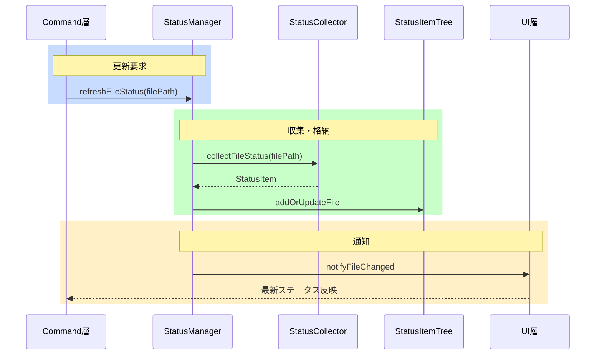
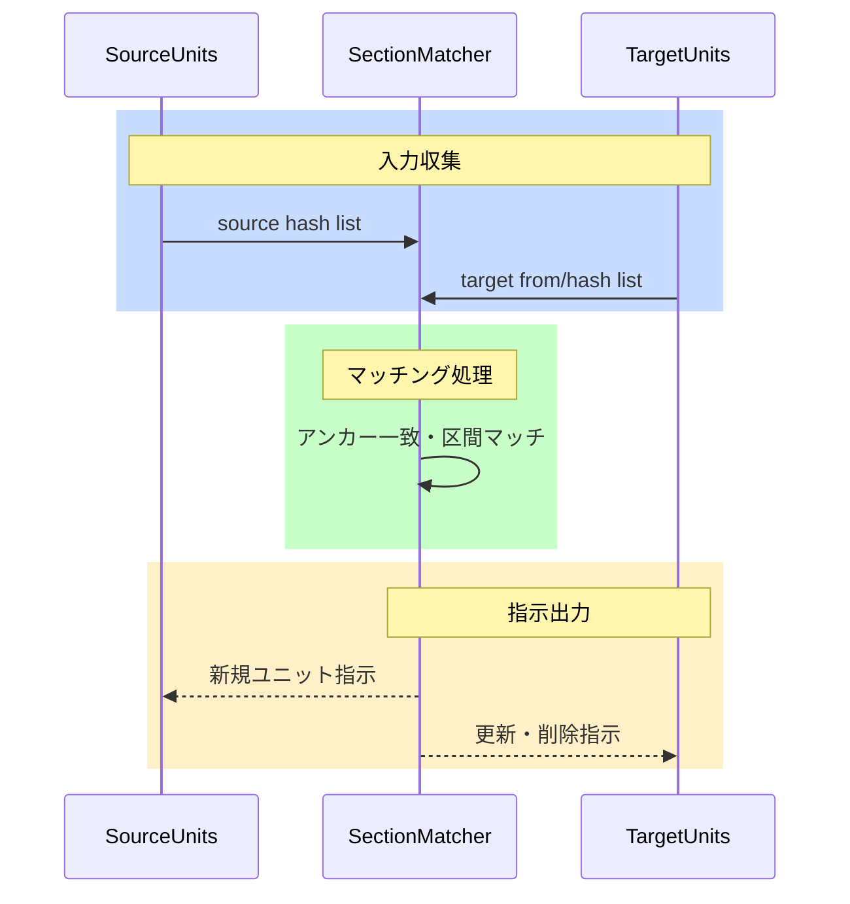

# Core

[architecture](../architecture.md) > **Core**

Core層は翻訳ドメインの純粋なロジック（ユニット解析・ハッシュ・ステータス・TM）をVS Code API非依存のモジュールとして提供します。

## mdaitUnit

mdaitUnitとはMarkdown文書を翻訳管理単位（ユニット）に分割したものです。見出しまたはmdaitマーカーを境界とし、本文・マーカー・位置情報の3要素を持ちます（[architecture.md](../architecture.md) P1参照）。

### 構造

mdaitUnitは以下の要素で構成されます：

- **content**: ユニット本文（Markdownテキスト）
- **marker**: `<!-- mdait {hash} [from:{hash}] [need:{flag}] -->`
- **range**: ドキュメント内の開始・終了位置

| フィールド | 意味 |
|---|---|
| `{hash}` | ユニット本文のCRC32ハッシュ（8文字）（巡回冗長検査による高速ハッシュ関数） |
| `from:{hash}` | 訳文の翻訳元ユニットのハッシュ（訳文ファイルのみ） |
| `need:{flag}` | 翻訳が必要な場合の要求フラグ（`translate`/`review`） |

**例**（before/after）:

before（マーカーなし）:
```markdown
## 概要
This is the introduction section.
```

after（sync後）:
```markdown
<!-- mdait 3f7c8a1b need:translate -->
## 概要
This is the introduction section.
```

### ユニット境界の決定

1. **見出しレベル**: `mdait.json`の`sync.level`で指定されたレベル以下の見出し
2. **mdaitマーカー**: `<!-- mdait -->` または `<!-- mdait {hash} ... -->`

**ルール**: マーカーの直後（空行なし）に見出しがある場合、その見出しがユニットのタイトル。ハッシュ省略マーカー `<!-- mdait -->` も境界として認識され、sync時に自動計算される。

### level設定のドキュメント単位オーバーライド

Frontmatterで`mdait.sync.level`を指定することでファイル単位でユニット粒度を変更できます。sync実行時、原文と訳文でlevel設定が異なる場合は**原文の設定を優先して訳文を自動修正**し、マーカー対応付けの破綻を防止します。

```typescript
// 使用例: MarkdownテキストをmdaitUnit配列に変換
const units = parseMarkdown(markdownText, config);
// units[0].content, units[0].marker, units[0].range で各要素にアクセス
```

**実装**: [`src/core/markdown/parser.ts`](../../src/core/markdown/parser.ts)

## Hash & Normalizer

行末空白・連続空行・コードフェンス言語指定・リンク参照順序の差異を吸収し、本質的な内容変更のみを検出します（[architecture.md](../architecture.md) P2参照）。


**CRC32の選択理由**: SHA-256と比べてハッシュが短くマーカーが肥大化しない。同一内容から必ず同じハッシュを生成する決定的計算で、数千ユニット規模での衝突リスクは極めて低い。

**実装**: [`src/core/hash/`](../../src/core/hash/)

## Status管理

ディレクトリ/ファイル/ユニット階層をMap構造で保持し、O(1)（定数時間）検索を実現します（[architecture.md](../architecture.md) P3参照）。ファイルごとに再計算することで、個別ファイルの変更時に全体を走査する必要がありません。

### StatusItemTree

```typescript
interface StatusItemTree {
  dirs: Map<string, DirectoryStatus>;
  files: Map<string, FileStatus>;
  units: Map<string, UnitStatus>;
}
```

### StatusManager

StatusCollectorとUIの橋渡しとして全体構築・部分更新を担います。

**主要メソッド**: `refreshFileStatus(filePath)` / `getFileStatus(filePath)` / `clear()`

```typescript
// 使用例: ファイル変更時のステータス更新
const manager = new StatusManager(workspaceRoot);
await manager.refreshFileStatus(filePath);
```

**実装**: [`src/core/status/`](../../src/core/status/)

## UnitRegistry管理

ユニット内容を`.mdait/unit-registry`ファイルで永続化します。原文変更時、旧コンテンツとの差分（unified diff: 変更前後を+/-で示す標準差分フォーマット）生成に使用します。

**保存形式**: gzip圧縮 + base64エンコード。CRC32先頭3桁でバケット化（ハッシュ先頭3桁ごとに分割管理）し、バケット昇順でgit競合を軽減。

```
3f7
3f7c8a1b <encoded_content>
a2b
a2b5c7d8 <encoded_content>
```

**GC処理**: sync完了後、ファイルサイズが5MB超過時に使用中のhash以外のレジストリを削除します。

**実装**: [`src/core/unit-registry/`](../../src/core/unit-registry/)

## Diff生成

trans実行時、旧レジストリと現在のコンテンツからunified diff形式で差分を生成します（`diff`パッケージ）。LLMにdiffを提示することで差分パッチのみを生成させ、変更箇所以外の既存訳文を維持します（[architecture.md](../architecture.md) P4参照）。

**実装**: [`src/core/diff/`](../../src/core/diff/)

## FrontMatter翻訳

frontmatter（MarkdownファイルのYAML前付き情報）内の`mdait.front`フィールドで翻訳状態を管理します。`trans.frontmatter.keys`で指定されたキーの値をkeys順に連結してハッシュ化し、`FrontMatter`クラスのドット記法（例: `"mdait.sync.level"`）による階層アクセスをサポートします。mdait管理外のフィールドは元のYAMLフォーマットを維持します。

```yaml
mdait:
  front: "abc12345"                              # 初回翻訳前（fromなし）
  # または
  front: "abc12345 from:def67890 need:translate"  # 更新時
```

**実装**: [`src/core/markdown/frontmatter-translation.ts`](../../src/core/markdown/frontmatter-translation.ts)

## マーカー正規化

mdaitマーカー直前の空行を保証し、markdown-itが段落区切りを正しく認識できるようにします。

**実装**: [`src/core/markdown/parser.ts`](../../src/core/markdown/parser.ts) (`normalizeMarkerSpacing`)

## 翻訳メモリ（TM）

翻訳メモリ（TM）は過去の翻訳事例をデータベース化し、類似文の再翻訳を支援する仕組みです。TMXはTM交換標準フォーマット（XML）で、mdaitでは`.mdait/translations.tmx`に保存します。

### TmxStore

TMXファイル（`.mdait/translations.tmx`）のI/Oとインメモリインデックスを担当します。

- TMX XMLパース/シリアライズ（`fast-xml-parser`）・`Map<sentenceHash, TmEntry>`による高速検索（O(1)）
- CRUD: `addEntry` / `setUnitPath` / `updateTarget` / `lookupByHash` / `lookupBatch`
- グローバル遅延シングルトン（`getInstance(tmxFilePath)`、ファイル更新時刻（mtime）ベースの自動リロード）

**データモデル**: sentenceHash（ソース文の正規化後CRC32）をキーとし、複数言語の訳文（segments）・出典パス（unitPath）・sourceHashを保持する文単位のTmEntry。

```typescript
interface TmEntry {
  segments: Map<string, string>; // lang → 訳文テキスト
  unitPath?: string;             // 最初の出典パス
  sourceHash?: string;           // 登録元ユニットのコンテンツハッシュ
}
```

```typescript
// 使用例: Command層からの典型的な呼び出し
const store = TmxStore.getInstance(tmxPath);
const matches = await store.lookupBatch(sentenceHashes);
await store.save();
```

**sourceHashスキップ**: `hasSourceHash(hash)` により、tm-commitバッチ処理で処理済みユニットをスキップ。

**実装**: [`src/core/tm/tmx-store.ts`](../../src/core/tm/tmx-store.ts)

### SentenceSplitter

`Intl.Segmenter`ベースの文分割。コードブロック/インラインコード保護、段落・リスト項目の独立分割に対応し、言語ごとにSegmenterをキャッシュして日英中の文境界を検出します。

**実装**: [`src/core/tm/sentence-splitter.ts`](../../src/core/tm/sentence-splitter.ts)

### TmTextNormalizer

TM登録・検索時にMarkdown要素を除去し、翻訳価値のない短文・断片をフィルタリングします。

**主要関数**:
- `stripMarkdown(text)`: markdown-itでパースし、リンク・太字・強調・コード・HTMLタグ等を除去して純粋テキストに変換。**構造保持**として見出し後に`\n\n`、リスト項目・表セル後に`\n`を挿入し、LLMが要素間の文脈を正しく理解できるよう分離します（markdown-itトークンツリー走査で正規表現独自実装を回避）。
  before: `**重要**: [詳細はこちら](url)を参照。` → after: `重要: 詳細はこちらを参照。`
- `isWorthyForTm(text, lang)`: 日本語8文字未満・英語12文字未満・数値のみ・URL/パスのみ・英語2単語以下を除外。

**実装**: [`src/core/tm/tm-text-normalizer.ts`](../../src/core/tm/tm-text-normalizer.ts) ／ **詳細**: [command_tm.md](command_tm.md)

### formatTmReferences

TM検索結果（`TmMatch[]`）をプロンプト用文字列に変換。VS Code非依存のためCore層配置。

**実装**: [`src/core/tm/tm-reference-formatter.ts`](../../src/core/tm/tm-reference-formatter.ts)

## シーケンス図

### ステータス更新



### ユニット同期ロジック



## 主要コンポーネント一覧

| コンポーネント | ファイル | 責務 |
|---|---|---|
| Parser | [`src/core/markdown/parser.ts`](../../src/core/markdown/parser.ts) | Markdownをmdaitユニット配列に分割 |
| FrontMatter | [`src/core/markdown/frontmatter-translation.ts`](../../src/core/markdown/frontmatter-translation.ts) | frontmatter翻訳状態の読み書き |
| HashCalculator | [`src/core/hash/`](../../src/core/hash/) | テキスト正規化＋CRC32ハッシュ生成 |
| StatusManager | [`src/core/status/`](../../src/core/status/) | ユニット/ファイル/ディレクトリのステータス集約 |
| UnitRegistry | [`src/core/unit-registry/`](../../src/core/unit-registry/) | ユニット内容の永続化・GC |
| DiffGenerator | [`src/core/diff/`](../../src/core/diff/) | unified diff形式の差分生成 |
| TmxStore | [`src/core/tm/tmx-store.ts`](../../src/core/tm/tmx-store.ts) | TMX I/O・インメモリTMインデックス |
| SentenceSplitter | [`src/core/tm/sentence-splitter.ts`](../../src/core/tm/sentence-splitter.ts) | Intl.SegmenterによるTM文分割 |
| TmTextNormalizer | [`src/core/tm/tm-text-normalizer.ts`](../../src/core/tm/tm-text-normalizer.ts) | Markdown除去・TM価値フィルタリング |
| formatTmReferences | [`src/core/tm/tm-reference-formatter.ts`](../../src/core/tm/tm-reference-formatter.ts) | TM検索結果のプロンプト文字列変換 |